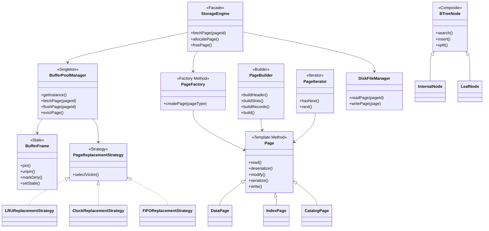

```mermaid
classDiagram
    direction TD

%% =====================================================
%% 1. STORAGE ENGINE (Facade)
%% =====================================================

class StorageEngine{
<<Facade>>
+fetchPage(pageId)
+allocatePage()
+freePage()
}

%% =====================================================
%% 2. BUFFER POOL MANAGEMENT
%% =====================================================

class BufferPoolManager{
<<Singleton>>
+getInstance()
+fetchPage(pageId)
+flushPage(pageId)
+evictPage()
}

%% =====================================================
%% 3. PAGE REPLACEMENT
%% =====================================================

class PageReplacementStrategy{
<<Strategy>>
+selectVictim()
}

class LRUReplacementStrategy
class ClockReplacementStrategy
class FIFOReplacementStrategy

%% =====================================================
%% 4. PAGE CREATION
%% =====================================================

class PageFactory{
<<Factory Method>>
+createPage(pageType)
}

%% =====================================================
%% 5. PAGE WORKFLOW
%% =====================================================

class Page{
<<Template Method>>
+read()
+deserialize()
+modify()
+serialize()
+write()
}

class DataPage
class IndexPage
class CatalogPage

%% =====================================================
%% 6. BUFFER FRAME
%% =====================================================

class BufferFrame{
<<State>>
+pin()
+unpin()
+markDirty()
+setState()
}

%% =====================================================
%% 7. PAGE CONSTRUCTION
%% =====================================================

class PageBuilder{
<<Builder>>
+buildHeader()
+buildSlots()
+buildRecords()
+build()
}

%% =====================================================
%% 8. RECORD TRAVERSAL
%% =====================================================

class PageIterator{
<<Iterator>>
+hasNext()
+next()
}

%% =====================================================
%% 9. B+TREE INDEX
%% =====================================================

class BTreeNode{
<<Composite>>
+search()
+insert()
+split()
}

class InternalNode
class LeafNode

%% =====================================================
%% 10. DISK ACCESS
%% =====================================================

class DiskFileManager{
+readPage(pageId)
+writePage(page)
}

%% =====================================================
%% RELATIONSHIPS
%% =====================================================

StorageEngine --> BufferPoolManager
StorageEngine --> PageFactory
StorageEngine --> DiskFileManager

BufferPoolManager --> BufferFrame
BufferPoolManager --> PageReplacementStrategy

PageFactory --> Page

PageBuilder --> Page

PageIterator --> Page

Page <|-- DataPage
Page <|-- IndexPage
Page <|-- CatalogPage

PageReplacementStrategy <|.. LRUReplacementStrategy
PageReplacementStrategy <|.. ClockReplacementStrategy
PageReplacementStrategy <|.. FIFOReplacementStrategy

BTreeNode <|-- InternalNode
BTreeNode <|-- LeafNode
```
