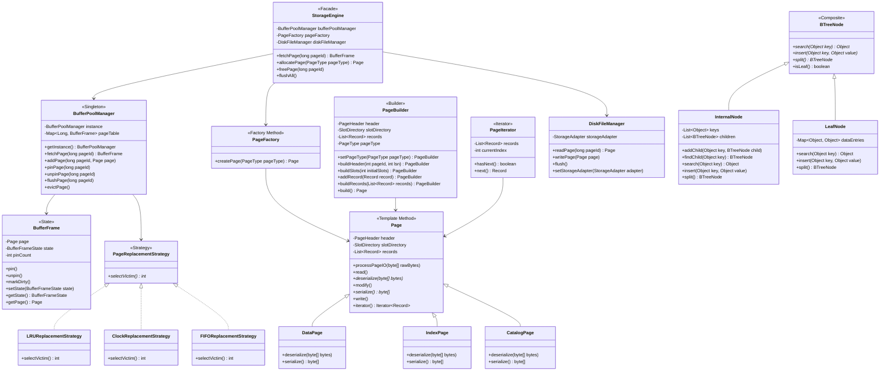

```mermaid
classDiagram
    direction TD

%% =====================================================
%% 1. STORAGE ENGINE (Facade)
%% =====================================================

class StorageEngine{
    <<Facade>>
    -BufferPoolManager bufferPoolManager
    -PageFactory pageFactory
    -DiskFileManager diskFileManager
    +fetchPage(long pageId) BufferFrame
    +allocatePage(PageType pageType) Page
    +freePage(long pageId)
    +flushAll()
}

%% =====================================================
%% 2. BUFFER POOL MANAGEMENT
%% =====================================================

class BufferPoolManager{
    <<Singleton>>
    -BufferPoolManager instance
    -Map~Long, BufferFrame~ pageTable
    +getInstance() BufferPoolManager
    +fetchPage(long pageId) BufferFrame
    +addPage(long pageId, Page page)
    +pinPage(long pageId)
    +unpinPage(long pageId)
    +flushPage(long pageId)
    +evictPage()
}

%% =====================================================
%% 3. PAGE REPLACEMENT
%% =====================================================

class PageReplacementStrategy{
    <<Strategy>>
    +selectVictim()* int
}

class LRUReplacementStrategy{
    +selectVictim() int
}
class ClockReplacementStrategy{
    +selectVictim() int
}
class FIFOReplacementStrategy{
    +selectVictim() int
}

%% =====================================================
%% 4. PAGE CREATION
%% =====================================================

class PageFactory{
    <<Factory Method>>
    +createPage(PageType pageType) Page
}

%% =====================================================
%% 5. PAGE WORKFLOW
%% =====================================================

class Page{
    <<Template Method>>
    -PageHeader header
    -SlotDirectory slotDirectory
    -List~Record~ records
    +processPageIO(byte[] rawBytes)
    +read()
    +deserialize(byte[] bytes)*
    +modify()
    +serialize()* byte[]
    +write()
    +iterator() Iterator~Record~
}

class DataPage{
    +deserialize(byte[] bytes)
    +serialize() byte[]
}
class IndexPage{
    +deserialize(byte[] bytes)
    +serialize() byte[]
}
class CatalogPage{
    +deserialize(byte[] bytes)
    +serialize() byte[]
}

%% =====================================================
%% 6. BUFFER FRAME
%% =====================================================

class BufferFrame{
    <<State>>
    -Page page
    -BufferFrameState state
    -int pinCount
    +pin()
    +unpin()
    +markDirty()
    +setState(BufferFrameState state)
    +getState() BufferFrameState
    +getPage() Page
}

%% =====================================================
%% 7. PAGE CONSTRUCTION
%% =====================================================

class PageBuilder{
    <<Builder>>
    -PageHeader header
    -SlotDirectory slotDirectory
    -List~Record~ records
    -PageType pageType
    +setPageType(PageType pageType) PageBuilder
    +buildHeader(int pageId, int lsn) PageBuilder
    +buildSlots(int initialSlots) PageBuilder
    +addRecord(Record record) PageBuilder
    +buildRecords(List~Record~ records) PageBuilder
    +build() Page
}

%% =====================================================
%% 8. RECORD TRAVERSAL
%% =====================================================

class PageIterator{
    <<Iterator>>
    -List~Record~ records
    -int currentIndex
    +hasNext() boolean
    +next() Record
}

%% =====================================================
%% 9. B+TREE INDEX
%% =====================================================

class BTreeNode{
    <<Composite>>
    +search(Object key)* Object
    +insert(Object key, Object value)*
    +split()* BTreeNode
    +isLeaf() boolean
}

class InternalNode{
    -List~Object~ keys
    -List~BTreeNode~ children
    +addChild(Object key, BTreeNode child)
    +findChild(Object key) BTreeNode
    +search(Object key) Object
    +insert(Object key, Object value)
    +split() BTreeNode
}

class LeafNode{
    -Map~Object, Object~ dataEntries
    +search(Object key) Object
    +insert(Object key, Object value)
    +split() BTreeNode
}

%% =====================================================
%% 10. DISK ACCESS
%% =====================================================

class DiskFileManager{
    -StorageAdapter storageAdapter
    +readPage(long pageId) Page
    +writePage(Page page)
    +flush()
    +setStorageAdapter(StorageAdapter adapter)
}

%% =====================================================
%% RELATIONSHIPS
%% =====================================================

StorageEngine --> BufferPoolManager
StorageEngine --> PageFactory
StorageEngine --> DiskFileManager

BufferPoolManager --> BufferFrame
BufferPoolManager --> PageReplacementStrategy

PageFactory --> Page

PageBuilder --> Page

PageIterator --> Page

Page <|-- DataPage
Page <|-- IndexPage
Page <|-- CatalogPage

PageReplacementStrategy <|.. LRUReplacementStrategy
PageReplacementStrategy <|.. ClockReplacementStrategy
PageReplacementStrategy <|.. FIFOReplacementStrategy

BTreeNode <|-- InternalNode
BTreeNode <|-- LeafNode
```
