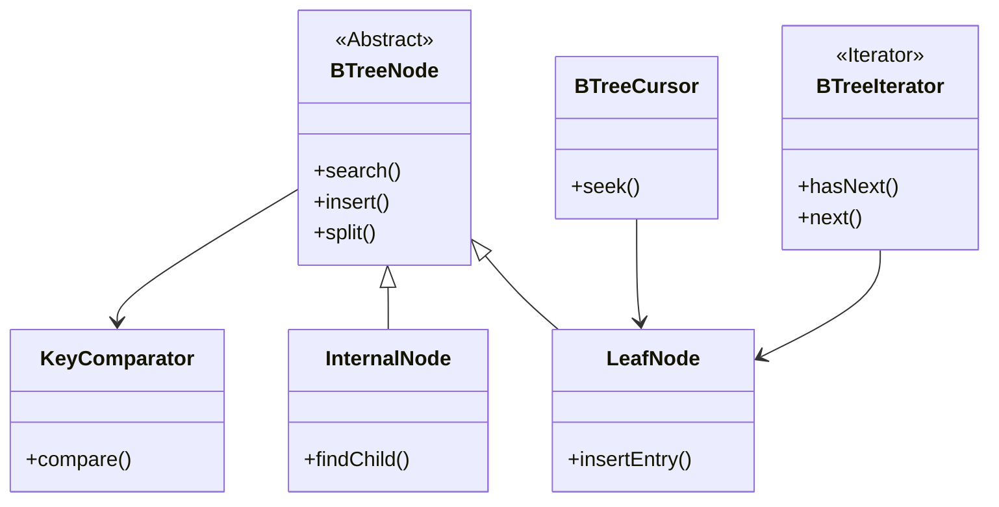

```mermaid
classDiagram
    direction TD

%% =====================================================
%% B+TREE INDEX (Composite & Iterator Pattern)
%% =====================================================

class BTreeNode{
<<Abstract>>
<<Composite>>
+search()
+insert()
+split()
}

class InternalNode{
+findChild()
}

class LeafNode{
+insertEntry()
}

class KeyComparator{
+compare()
}

class BTreeCursor{
+seek()
}

class BTreeIterator{
<<Iterator>>
+hasNext()
+next()
}

%% =====================================================
%% RELATIONSHIPS
%% =====================================================

BTreeNode <|-- InternalNode
BTreeNode <|-- LeafNode

BTreeCursor --> LeafNode
BTreeIterator --> LeafNode

BTreeNode --> KeyComparator
```
