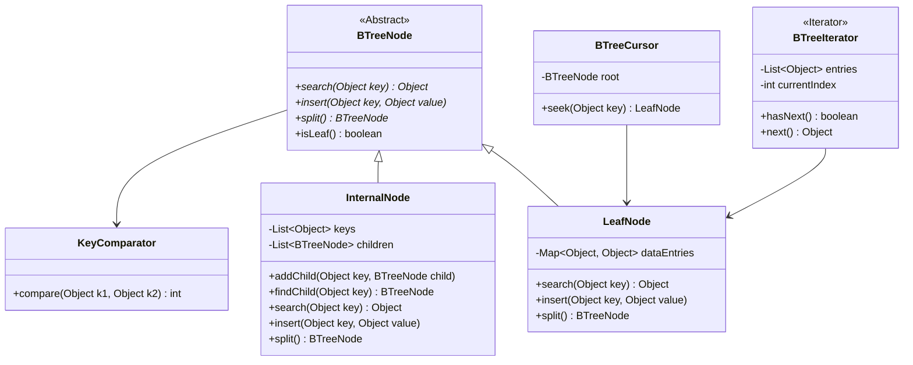

```mermaid
classDiagram
    direction TD

%% =====================================================
%% B+TREE INDEX (Composite & Iterator Pattern)
%% =====================================================

class BTreeNode{
    <<Abstract>>
    <<Composite>>
    +search(Object key)* Object
    +insert(Object key, Object value)*
    +split()* BTreeNode
    +isLeaf() boolean
}

class InternalNode{
    -List~Object~ keys
    -List~BTreeNode~ children
    +addChild(Object key, BTreeNode child)
    +findChild(Object key) BTreeNode
    +search(Object key) Object
    +insert(Object key, Object value)
    +split() BTreeNode
}

class LeafNode{
    -Map~Object, Object~ dataEntries
    +search(Object key) Object
    +insert(Object key, Object value)
    +split() BTreeNode
}

class KeyComparator{
    +compare(Object k1, Object k2) int
}

class BTreeCursor{
    -BTreeNode root
    +seek(Object key) LeafNode
}

class BTreeIterator{
    <<Iterator>>
    -List~Object~ entries
    -int currentIndex
    +hasNext() boolean
    +next() Object
}

%% =====================================================
%% RELATIONSHIPS
%% =====================================================

BTreeNode <|-- InternalNode
BTreeNode <|-- LeafNode

BTreeCursor --> LeafNode
BTreeIterator --> LeafNode

BTreeNode --> KeyComparator
```
