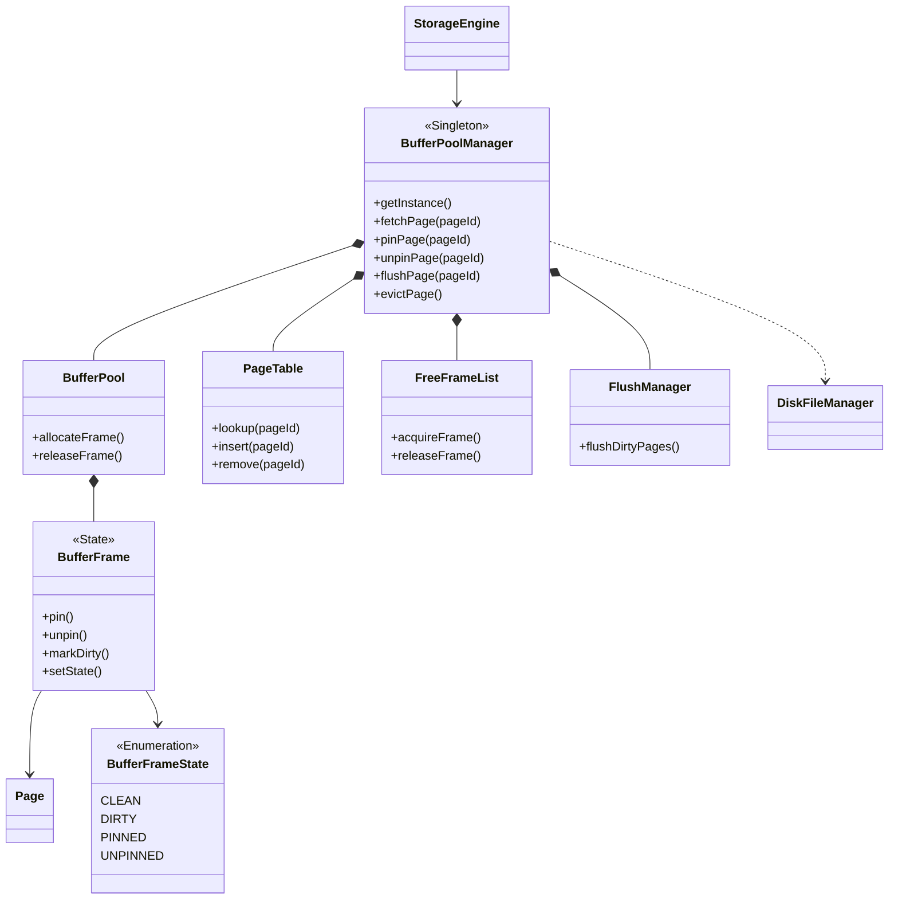

```mermaid
classDiagram
    direction TD

%% =====================================================
%% BUFFER POOL MANAGEMENT (Singleton & State Pattern)
%% =====================================================

class StorageEngine

class BufferPoolManager{
<<Singleton>>
+getInstance()
+fetchPage(pageId)
+pinPage(pageId)
+unpinPage(pageId)
+flushPage(pageId)
+evictPage()
}

class BufferPool{
+allocateFrame()
+releaseFrame()
}

class BufferFrame{
<<State>>
+pin()
+unpin()
+markDirty()
+setState()
}

class BufferFrameState{
<<Enumeration>>
CLEAN
DIRTY
PINNED
UNPINNED
}

class PageTable{
+lookup(pageId)
+insert(pageId)
+remove(pageId)
}

class FreeFrameList{
+acquireFrame()
+releaseFrame()
}

class FlushManager{
+flushDirtyPages()
}

class Page

class DiskFileManager

%% =====================================================
%% RELATIONSHIPS
%% =====================================================

StorageEngine --> BufferPoolManager

BufferPoolManager *-- BufferPool
BufferPoolManager *-- PageTable
BufferPoolManager *-- FreeFrameList
BufferPoolManager *-- FlushManager

BufferPool *-- BufferFrame

BufferFrame --> Page
BufferFrame --> BufferFrameState

BufferPoolManager ..> DiskFileManager
```
