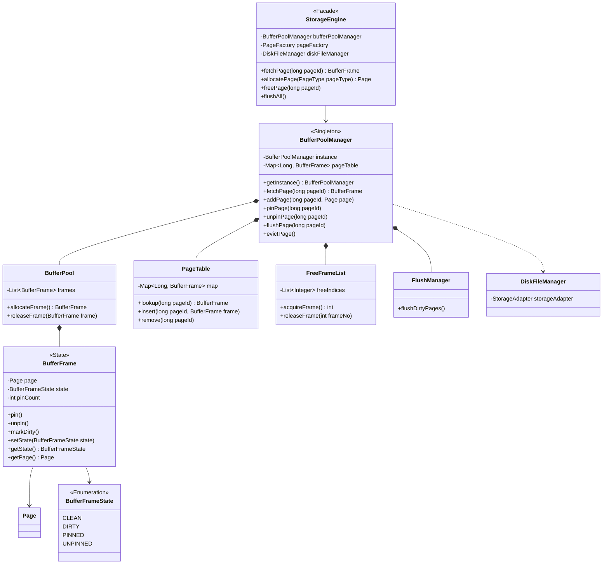

```mermaid
classDiagram
    direction TD

%% =====================================================
%% BUFFER POOL MANAGEMENT (Singleton & State Pattern)
%% =====================================================

class StorageEngine{
    <<Facade>>
    -BufferPoolManager bufferPoolManager
    -PageFactory pageFactory
    -DiskFileManager diskFileManager
    +fetchPage(long pageId) BufferFrame
    +allocatePage(PageType pageType) Page
    +freePage(long pageId)
    +flushAll()
}

class BufferPoolManager{
    <<Singleton>>
    -BufferPoolManager instance
    -Map~Long, BufferFrame~ pageTable
    +getInstance() BufferPoolManager
    +fetchPage(long pageId) BufferFrame
    +addPage(long pageId, Page page)
    +pinPage(long pageId)
    +unpinPage(long pageId)
    +flushPage(long pageId)
    +evictPage()
}

class BufferPool{
    -List~BufferFrame~ frames
    +allocateFrame() BufferFrame
    +releaseFrame(BufferFrame frame)
}

class BufferFrame{
    <<State>>
    -Page page
    -BufferFrameState state
    -int pinCount
    +pin()
    +unpin()
    +markDirty()
    +setState(BufferFrameState state)
    +getState() BufferFrameState
    +getPage() Page
}

class BufferFrameState{
    <<Enumeration>>
    CLEAN
    DIRTY
    PINNED
    UNPINNED
}

class PageTable{
    -Map~Long, BufferFrame~ map
    +lookup(long pageId) BufferFrame
    +insert(long pageId, BufferFrame frame)
    +remove(long pageId)
}

class FreeFrameList{
    -List~Integer~ freeIndices
    +acquireFrame() int
    +releaseFrame(int frameNo)
}

class FlushManager{
    +flushDirtyPages()
}

class Page

class DiskFileManager{
    -StorageAdapter storageAdapter
}

%% =====================================================
%% RELATIONSHIPS
%% =====================================================

StorageEngine --> BufferPoolManager

BufferPoolManager *-- BufferPool
BufferPoolManager *-- PageTable
BufferPoolManager *-- FreeFrameList
BufferPoolManager *-- FlushManager

BufferPool *-- BufferFrame

BufferFrame --> Page
BufferFrame --> BufferFrameState

BufferPoolManager ..> DiskFileManager
```
