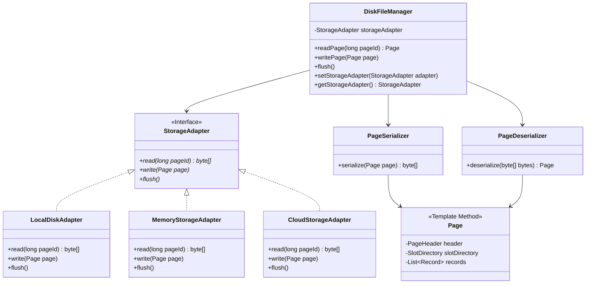

```mermaid
classDiagram
    direction TD

%% =====================================================
%% DISK FILE MANAGEMENT (Adapter & Template Method Pattern)
%% =====================================================

class DiskFileManager{
    -StorageAdapter storageAdapter
    +readPage(long pageId) Page
    +writePage(Page page)
    +flush()
    +setStorageAdapter(StorageAdapter adapter)
    +getStorageAdapter() StorageAdapter
}

class StorageAdapter{
    <<Interface>>
    <<Adapter>>
    +read(long pageId)* byte[]
    +write(Page page)*
    +flush()*
}

class LocalDiskAdapter{
    +read(long pageId) byte[]
    +write(Page page)
    +flush()
}

class MemoryStorageAdapter{
    +read(long pageId) byte[]
    +write(Page page)
    +flush()
}

class CloudStorageAdapter{
    +read(long pageId) byte[]
    +write(Page page)
    +flush()
}

class PageSerializer{
    +serialize(Page page) byte[]
}

class PageDeserializer{
    +deserialize(byte[] bytes) Page
}

class Page{
    <<Template Method>>
    -PageHeader header
    -SlotDirectory slotDirectory
    -List~Record~ records
}

%% =====================================================
%% RELATIONSHIPS
%% =====================================================

StorageAdapter <|.. LocalDiskAdapter
StorageAdapter <|.. MemoryStorageAdapter
StorageAdapter <|.. CloudStorageAdapter

DiskFileManager --> StorageAdapter
DiskFileManager --> PageSerializer
DiskFileManager --> PageDeserializer

PageSerializer --> Page
PageDeserializer --> Page
```
