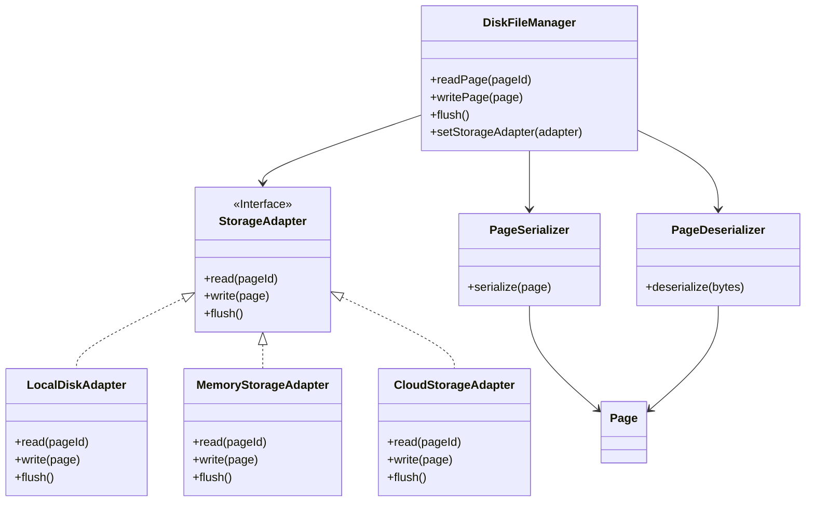

```mermaid
classDiagram
    direction TD

%% =====================================================
%% DISK FILE MANAGEMENT (Adapter & Template Method Pattern)
%% =====================================================

class DiskFileManager{
+readPage(pageId)
+writePage(page)
+flush()
+setStorageAdapter(adapter)
}

class StorageAdapter{
<<Interface>>
<<Adapter>>
+read(pageId)
+write(page)
+flush()
}

class LocalDiskAdapter{
+read(pageId)
+write(page)
+flush()
}

class MemoryStorageAdapter{
+read(pageId)
+write(page)
+flush()
}

class CloudStorageAdapter{
+read(pageId)
+write(page)
+flush()
}

class PageSerializer{
+serialize(page)
}

class PageDeserializer{
+deserialize(bytes)
}

class Page

%% =====================================================
%% RELATIONSHIPS
%% =====================================================

StorageAdapter <|.. LocalDiskAdapter
StorageAdapter <|.. MemoryStorageAdapter
StorageAdapter <|.. CloudStorageAdapter

DiskFileManager --> StorageAdapter
DiskFileManager --> PageSerializer
DiskFileManager --> PageDeserializer

PageSerializer --> Page
PageDeserializer --> Page
```
