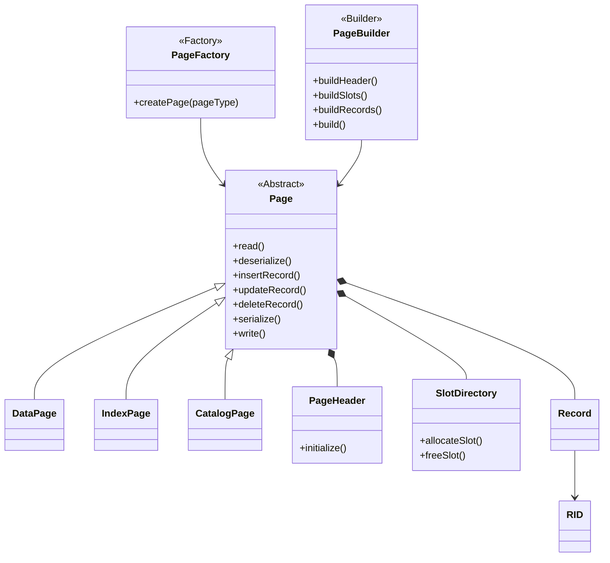

```mermaid
classDiagram
    direction TD

%% =====================================================
%% PAGE MANAGEMENT (Template Method, Factory Method, Builder)
%% =====================================================

class Page{
<<Abstract>>
<<Template Method>>
+read()
+deserialize()
+insertRecord()
+updateRecord()
+deleteRecord()
+serialize()
+write()
}

class DataPage
class IndexPage
class CatalogPage

class PageFactory{
<<Factory>>
+createPage(pageType)
}

class PageBuilder{
<<Builder>>
+buildHeader()
+buildSlots()
+buildRecords()
+build()
}

class PageHeader{
+initialize()
}

class SlotDirectory{
+allocateSlot()
+freeSlot()
}

class Record

class RID

%% =====================================================
%% RELATIONSHIPS
%% =====================================================

Page <|-- DataPage
Page <|-- IndexPage
Page <|-- CatalogPage

PageFactory --> Page

PageBuilder --> Page

Page *-- PageHeader
Page *-- SlotDirectory
Page *-- Record

Record --> RID
```
