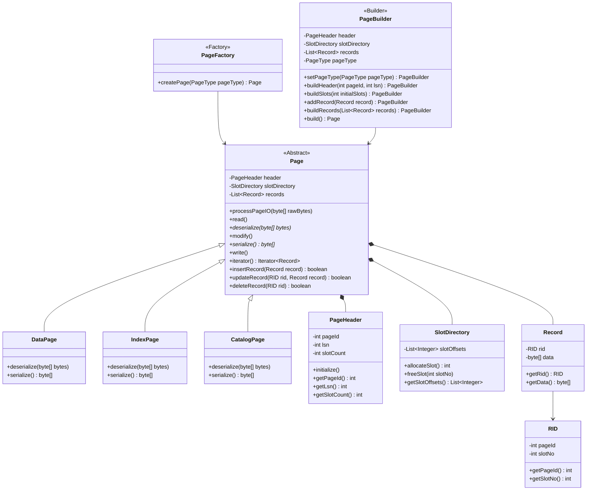

```mermaid
classDiagram
    direction TD

%% =====================================================
%% PAGE MANAGEMENT (Template Method, Factory Method, Builder)
%% =====================================================

class Page{
    <<Abstract>>
    <<Template Method>>
    -PageHeader header
    -SlotDirectory slotDirectory
    -List~Record~ records
    +processPageIO(byte[] rawBytes)
    +read()
    +deserialize(byte[] bytes)*
    +modify()
    +serialize()* byte[]
    +write()
    +iterator() Iterator~Record~
    +insertRecord(Record record) boolean
    +updateRecord(RID rid, Record record) boolean
    +deleteRecord(RID rid) boolean
}

class DataPage{
    +deserialize(byte[] bytes)
    +serialize() byte[]
}

class IndexPage{
    +deserialize(byte[] bytes)
    +serialize() byte[]
}

class CatalogPage{
    +deserialize(byte[] bytes)
    +serialize() byte[]
}

class PageFactory{
    <<Factory>>
    +createPage(PageType pageType) Page
}

class PageBuilder{
    <<Builder>>
    -PageHeader header
    -SlotDirectory slotDirectory
    -List~Record~ records
    -PageType pageType
    +setPageType(PageType pageType) PageBuilder
    +buildHeader(int pageId, int lsn) PageBuilder
    +buildSlots(int initialSlots) PageBuilder
    +addRecord(Record record) PageBuilder
    +buildRecords(List~Record~ records) PageBuilder
    +build() Page
}

class PageHeader{
    -int pageId
    -int lsn
    -int slotCount
    +initialize()
    +getPageId() int
    +getLsn() int
    +getSlotCount() int
}

class SlotDirectory{
    -List~Integer~ slotOffsets
    +allocateSlot() int
    +freeSlot(int slotNo)
    +getSlotOffsets() List~Integer~
}

class Record{
    -RID rid
    -byte[] data
    +getRid() RID
    +getData() byte[]
}

class RID{
    -int pageId
    -int slotNo
    +getPageId() int
    +getSlotNo() int
}

%% =====================================================
%% RELATIONSHIPS
%% =====================================================

Page <|-- DataPage
Page <|-- IndexPage
Page <|-- CatalogPage

PageFactory --> Page

PageBuilder --> Page

Page *-- PageHeader
Page *-- SlotDirectory
Page *-- Record

Record --> RID
```
