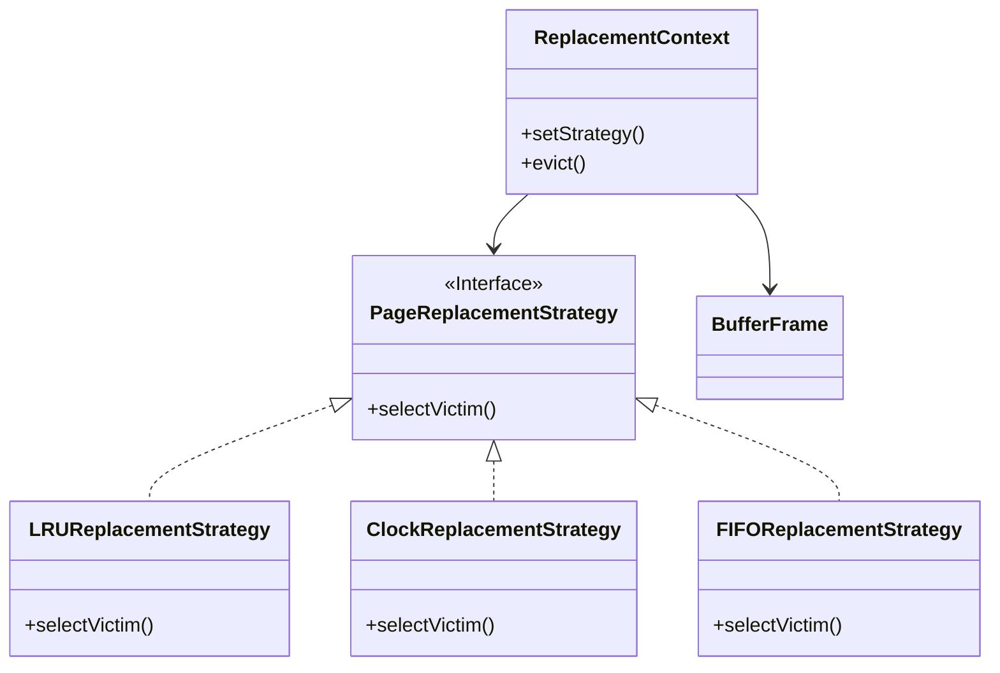

```mermaid
classDiagram
    direction TD

%% =====================================================
%% PAGE REPLACEMENT (Strategy Pattern)
%% =====================================================

class PageReplacementStrategy{
<<Interface>>
<<Strategy>>
+selectVictim()
}

class LRUReplacementStrategy{
+selectVictim()
}

class ClockReplacementStrategy{
+selectVictim()
}

class FIFOReplacementStrategy{
+selectVictim()
}

class ReplacementContext{
+setStrategy()
+evict()
}

class BufferFrame

%% =====================================================
%% RELATIONSHIPS
%% =====================================================

PageReplacementStrategy <|.. LRUReplacementStrategy
PageReplacementStrategy <|.. ClockReplacementStrategy
PageReplacementStrategy <|.. FIFOReplacementStrategy

ReplacementContext --> PageReplacementStrategy
ReplacementContext --> BufferFrame
```
