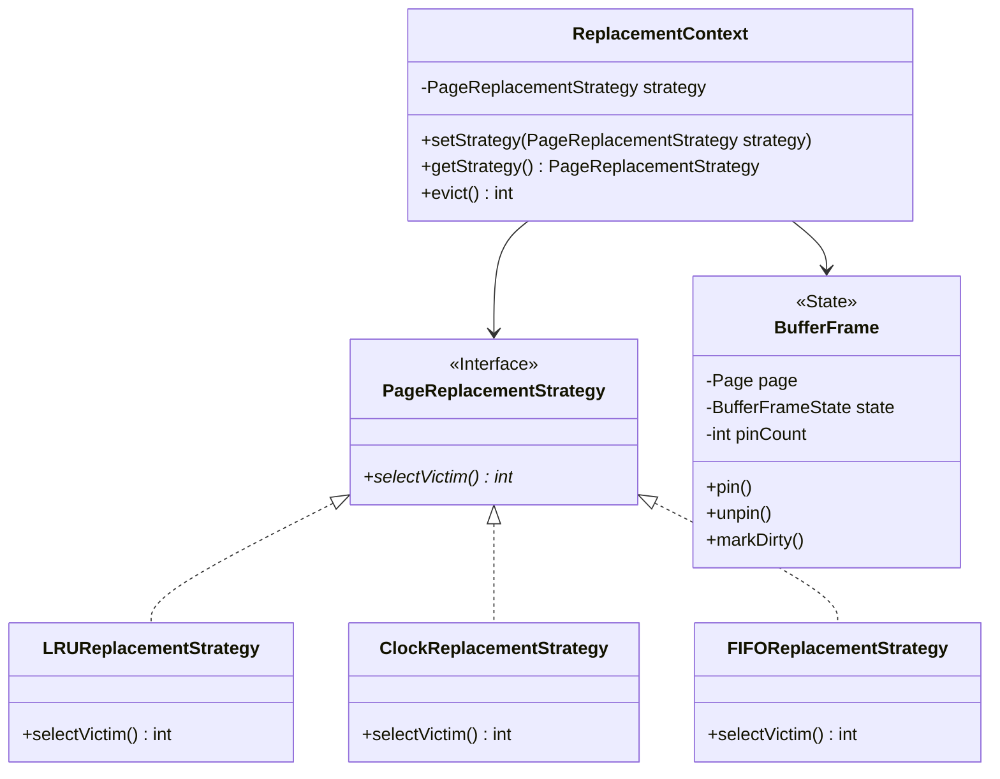

```mermaid
classDiagram
    direction TD

%% =====================================================
%% PAGE REPLACEMENT (Strategy Pattern)
%% =====================================================

class PageReplacementStrategy{
    <<Interface>>
    <<Strategy>>
    +selectVictim()* int
}

class LRUReplacementStrategy{
    +selectVictim() int
}

class ClockReplacementStrategy{
    +selectVictim() int
}

class FIFOReplacementStrategy{
    +selectVictim() int
}

class ReplacementContext{
    -PageReplacementStrategy strategy
    +setStrategy(PageReplacementStrategy strategy)
    +getStrategy() PageReplacementStrategy
    +evict() int
}

class BufferFrame{
    <<State>>
    -Page page
    -BufferFrameState state
    -int pinCount
    +pin()
    +unpin()
    +markDirty()
}

%% =====================================================
%% RELATIONSHIPS
%% =====================================================

PageReplacementStrategy <|.. LRUReplacementStrategy
PageReplacementStrategy <|.. ClockReplacementStrategy
PageReplacementStrategy <|.. FIFOReplacementStrategy

ReplacementContext --> PageReplacementStrategy
ReplacementContext --> BufferFrame
```
