# Metadata Module - Design Patterns & Sequence Diagrams

Tài liệu này tổng hợp toàn bộ các **Design Pattern** được áp dụng trong module `metadata`, bao gồm **Bảng tổng hợp kèm Ví dụ mã Java** cho từng Pattern và các **Sơ đồ Sequence Diagram** mô tả luồng tương tác giữa các đối tượng.

---

## 1. Implemented Design Patterns Matrix (Dạng Bảng & Ví Dụ Mã Java)

### 1.1. Bảng Tổng Quan Design Patterns

| # | Design Pattern | Class / Interface | Method | Công dụng (Purpose) |
|:---:|:---|:---|:---|:---|
| 1 | **Singleton** | `CatalogManager`<br>`MetadataModule` | `getInstance()` | Đảm bảo duy nhất 1 Quản lý Catalog và 1 điểm truy cập Facade chính cho toàn bộ hệ thống DBMS trong RAM. |
| 2 | **Facade** | `MetadataModule` | `getTable(...)`<br>`executeDDL(...)` | Cung cấp giao diện API cấp cao đơn giản hóa việc tương tác phức tạp giữa CatalogManager, Database, Schema và Table. |
| 3 | **Composite** | `MetadataElement` (Interface)<br>`CatalogManager`, `Database`, `Schema`, `Table`, `Column` | `getElementName()` | Xây dựng cấu trúc cây phân cấp quản lý đồng nhất cho các thành phần Metadata trong hệ thống. |
| 4 | **State** | `Database`<br>`DatabaseStatus` | `setStatus(...)`<br>`createSchema(...)` | Quản lý và chặn thao tác thay đổi cấu trúc khi Database ở trạng thái `OFFLINE` hoặc `READ_ONLY`. |
| 5 | **Factory Method** | `Schema`<br>`ConstraintFactory` | `createTable(...)`<br>`createConstraint(...)` | Đóng gói logic khởi tạo các đối tượng con (`Table`, `Constraint`) một cách linh hoạt. |
| 6 | **Command** | `DDLCommand` (Interface)<br>`CreateTableCommand`, `CreateSchemaCommand`, v.v. | `execute()`<br>`undo()` | Đóng gói các thao tác DDL thành các đối tượng lệnh có khả năng Thực thi (`execute`) và Hoàn tác (`undo` / Rollback). |
| 7 | **Prototype** | `Table`<br>`Column` | `clone()` | Nhân bản nhanh cấu trúc bảng hoặc cột hiện tại thành đối tượng độc lập mà không cần khởi tạo lại từ đầu. |
| 8 | **Memento** | `TableMemento`<br>`Table` | `createMemento()`<br>`restore(...)` | Chụp ảnh trạng thái (Snapshot) danh sách các cột của Table và hỗ trợ khôi phục về trạng thái trước đó. |
| 9 | **Observer** | `MetadataChangeListener` (Interface)<br>`Table`<br>`TableEventPublisher` | `registerListener(...)`<br>`notifyListeners(...)`<br>`onMetadataChanged(...)` | `Table` phát thông báo sự kiện thay đổi cấu trúc cho các Observer lắng nghe tự động cập nhật. |
| 10 | **Builder** | `ColumnBuilder` | `setType(...)`<br>`setNullable(...)`<br>`setDefaultValue(...)`<br>`build()` | Khởi tạo đối tượng `Column` có nhiều tham số tùy chọn bằng giao diện Fluent API. |
| 11 | **Template Method** | `Constraint` (Abstract Class) | `validate()` | Định nghĩa thuật toán khung kiểm tra trạng thái `enabled` trước khi tiến hành thẩm định chi tiết. |
| 12 | **Chain of Responsibility** | `ConstraintValidationChain` | `addConstraint(...)`<br>`validateAll()` | Quản lý chuỗi thẩm định ràng buộc dữ liệu nối tiếp (Fail-Fast: PK ➔ FK ➔ Check). |
| 13 | **Strategy** | `IndexRebuildStrategy` (Interface)<br>`Index` | `setRebuildStrategy(...)`<br>`rebuild()` | Cho phép gán và thực thi linh hoạt chiến lược rebuild thuật toán cho đối tượng `Index`. |

---

### 1.2. Chi Tiết Từng Pattern & Ví Dụ Mã Java Code

#### 1. Singleton Pattern
* **Class / Interface**: `CatalogManager`, `MetadataModule`
* **Method**: `getInstance()`
* **Công dụng**: Đảm bảo duy nhất 1 Quản lý Catalog và 1 điểm truy cập Facade chính cho toàn bộ hệ thống DBMS trong RAM.

**Ví dụ Java Code:**
```java
public class CatalogManager implements MetadataElement {
    private static volatile CatalogManager instance;
    private final DatabaseManager databaseManager;

    private CatalogManager() {
        this.databaseManager = new DatabaseManager();
    }

    // Pattern: Singleton (Double-Checked Locking)
    public static CatalogManager getInstance() {
        if (instance == null) {
            synchronized (CatalogManager.class) {
                if (instance == null) {
                    instance = new CatalogManager();
                }
            }
        }
        return instance;
    }
}
```

---

#### 2. Facade Pattern
* **Class / Interface**: `MetadataModule`
* **Method**: `getTable(databaseName, schemaName, tableName)`, `executeDDL(command)`
* **Công dụng**: Cung cấp giao diện API cấp cao đơn giản hóa việc tương tác phức tạp giữa CatalogManager, Database, Schema và Table.

**Ví dụ Java Code:**
```java
public class MetadataModule {
    private CatalogManager catalogManager;

    public MetadataModule() {
        this.catalogManager = CatalogManager.getInstance();
    }

    // Pattern: Facade
    public Table getTable(String databaseName, String schemaName, String tableName) {
        if (catalogManager == null) return null;
        Database db = catalogManager.getDatabase(databaseName);
        if (db == null) return null;
        Schema schema = db.getSchema(schemaName);
        if (schema == null) return null;
        return schema.getTable(tableName);
    }

    // Pattern: Facade
    public void executeDDL(DDLCommand command) {
        if (command != null) {
            command.execute();
        }
    }
}
```

---

#### 3. Composite Pattern
* **Class / Interface**: `MetadataElement` (Interface), `CatalogManager`, `Database`, `Schema`, `Table`, `Column`
* **Method**: `getElementName()`
* **Công dụng**: Xây dựng cấu trúc cây phân cấp quản lý đồng nhất cho các thành phần Metadata trong hệ thống.

**Ví dụ Java Code:**
```java
public interface MetadataElement {
    String getElementName();
}

public class Table implements MetadataElement, Cloneable {
    private String tableName;

    @Override
    public String getElementName() {
        return tableName;
    }
}

public class Column implements MetadataElement, Cloneable {
    private String columnName;

    @Override
    public String getElementName() {
        return columnName;
    }
}
```

---

#### 4. State Pattern
* **Class / Interface**: `Database`, `DatabaseStatus`
* **Method**: `setStatus(status)`, `createSchema(schemaName)`
* **Công dụng**: Quản lý và chặn thao tác thay đổi cấu trúc khi Database ở trạng thái `OFFLINE` hoặc `READ_ONLY`.

**Ví dụ Java Code:**
```java
public enum DatabaseStatus {
    ONLINE, OFFLINE, READ_ONLY
}

public class Database implements MetadataElement {
    private DatabaseStatus status;

    private void ensureNotLocked() {
        if (status == DatabaseStatus.OFFLINE) {
            throw new IllegalStateException("Database is offline");
        }
    }

    public Schema createSchema(String schemaName) {
        ensureNotLocked();
        SecurityValidator.validatePermission(schemaName);
        CatalogValidator.validateIdentifier(schemaName, "Schema");
        return schemaManager.add(schemaName);
    }

    public void setStatus(DatabaseStatus status) {
        this.status = status;
    }
}
```

---

#### 5. Factory Method Pattern
* **Class / Interface**: `Schema`, `ConstraintFactory`
* **Method**: `createTable(tableName)`, `createConstraint(type, name, args)`
* **Công dụng**: Đóng gói logic khởi tạo các đối tượng con (`Table`, `Constraint`) một cách linh hoạt.

**Ví dụ Java Code:**
```java
public class Schema implements MetadataElement {
    // Pattern: Factory Method
    public Table createTable(String tableName) {
        ensureNotReadOnly();
        SecurityValidator.validatePermission(tableName);
        CatalogValidator.validateIdentifier(tableName, "Table");
        return tableManager.add(tableName);
    }
}

public class ConstraintFactory {
    // Pattern: Factory Method
    public static Constraint createConstraint(String type, String name, Object... args) {
        if (type == null) return null;
        switch (type.toUpperCase()) {
            case "PRIMARY_KEY":
                return new PrimaryKeyConstraint(name);
            case "FOREIGN_KEY":
                return new ForeignKeyConstraint(name);
            case "UNIQUE":
                return new UniqueConstraint(name);
            case "CHECK":
                return new CheckConstraint(name);
            default:
                throw new IllegalArgumentException("Unknown constraint type: " + type);
        }
    }
}
```

---

#### 6. Command Pattern
* **Class / Interface**: `DDLCommand` (Interface), `CreateTableCommand`, `DropTableCommand`, `CreateSchemaCommand`, v.v.
* **Method**: `execute()`, `undo()`
* **Công dụng**: Đóng gói các thao tác DDL thành các đối tượng lệnh có khả năng Thực thi (`execute`) và Hoàn tác (`undo` / Rollback).

**Ví dụ Java Code:**
```java
public interface DDLCommand {
    void execute();
    void undo();
}

public class CreateTableCommand implements DDLCommand {
    private Schema schema;
    private String tableName;

    public CreateTableCommand(Schema schema, String tableName) {
        this.schema = schema;
        this.tableName = tableName;
    }

    @Override
    public void execute() {
        if (schema != null) {
            schema.createTable(tableName);
        }
    }

    @Override
    public void undo() {
        if (schema != null) {
            schema.dropTable(tableName);
        }
    }
}
```

---

#### 7. Prototype Pattern
* **Class / Interface**: `Table`, `Column`
* **Method**: `clone()`
* **Công dụng**: Nhân bản nhanh cấu trúc bảng hoặc cột hiện tại thành đối tượng độc lập mà không cần khởi tạo lại từ đầu.

**Ví dụ Java Code:**
```java
public class Table implements MetadataElement, Cloneable {
    // Pattern: Prototype
    @Override
    public Table clone() {
        try {
            Table cloned = (Table) super.clone();
            return cloned;
        } catch (CloneNotSupportedException e) {
            throw new RuntimeException("Clone failed", e);
        }
    }
}

public class Column implements MetadataElement, Cloneable {
    // Pattern: Prototype
    @Override
    public Column clone() {
        try {
            Column cloned = (Column) super.clone();
            return cloned;
        } catch (CloneNotSupportedException e) {
            throw new RuntimeException("Clone failed", e);
        }
    }
}
```

---

#### 8. Memento Pattern
* **Class / Interface**: `TableMemento`, `Table`
* **Method**: `createMemento()`, `restore(memento)`
* **Công dụng**: Chụp ảnh trạng thái (Snapshot) danh sách các cột của Table và hỗ trợ khôi phục về trạng thái trước đó.

**Ví dụ Java Code:**
```java
public class TableMemento {
    private String tableName;
    private List<Column> columnsSnapshot;

    public TableMemento(String tableName, List<Column> columns) {
        this.tableName = tableName;
        this.columnsSnapshot = columns != null ? new ArrayList<>(columns) : new ArrayList<>();
    }

    public String getTableName() {
        return tableName;
    }

    public List<Column> getColumnsSnapshot() {
        return new ArrayList<>(columnsSnapshot);
    }
}

// Trong Table.java:
public TableMemento createMemento() {
    return new TableMemento(tableName, columnManager.listAll());
}

public void restore(TableMemento memento) {
    if (memento != null) {
        this.tableName = memento.getTableName();
        columnManager.restoreColumns(memento.getColumnsSnapshot());
    }
}
```

---

#### 9. Observer Pattern
* **Class / Interface**: `MetadataChangeListener` (Interface), `Table`, `TableEventPublisher`
* **Method**: `registerListener(...)`, `notifyListeners(...)`, `onMetadataChanged(...)`
* **Công dụng**: `Table` phát thông báo sự kiện thay đổi cấu trúc cho các Observer lắng nghe tự động cập nhật.

**Ví dụ Java Code:**
```java
public interface MetadataChangeListener {
    void onMetadataChanged(String eventType, String targetName);
}

public class TableEventPublisher {
    private final List<MetadataChangeListener> listeners = new CopyOnWriteArrayList<>();

    public void registerListener(MetadataChangeListener listener) {
        if (listener != null) listeners.add(listener);
    }

    public void notifyListeners(String eventType, String targetName) {
        for (MetadataChangeListener listener : listeners) {
            if (listener != null) {
                listener.onMetadataChanged(eventType, targetName);
            }
        }
    }
}

// Trong Table.java:
public void addColumn(Column column) {
    ensureNotLocked();
    columnManager.add(column);
    eventPublisher.notifyListeners("COLUMN_ADDED", column.getColumnName());
}
```

---

#### 10. Builder Pattern
* **Class / Interface**: `ColumnBuilder`
* **Method**: `setType(...)`, `setNullable(...)`, `setDefaultValue(...)`, `build()`
* **Công dụng**: Khởi tạo đối tượng `Column` có nhiều tham số tùy chọn bằng giao diện Fluent API.

**Ví dụ Java Code:**
```java
public class ColumnBuilder {
    private String columnName;
    private DataType dataType;
    private boolean nullable = true;
    private String defaultValue;

    public ColumnBuilder(String columnName) {
        this.columnName = columnName;
    }

    public ColumnBuilder setType(DataType dataType) {
        this.dataType = dataType;
        return this;
    }

    public ColumnBuilder setNullable(boolean nullable) {
        this.nullable = nullable;
        return this;
    }

    public ColumnBuilder setDefaultValue(String defaultValue) {
        this.defaultValue = defaultValue;
        return this;
    }

    public Column build() {
        Column column = new Column(columnName, dataType);
        column.setNullable(nullable);
        if (defaultValue != null) {
            column.setDefaultValue(defaultValue);
        }
        return column;
    }
}

// Cách sử dụng:
Column ageCol = new ColumnBuilder("age")
        .setType(DataType.INT)
        .setNullable(false)
        .setDefaultValue("18")
        .build();
```

---

#### 11. Template Method Pattern
* **Class / Interface**: `Constraint` (Abstract Class)
* **Method**: `validate()`, `preValidate()`, `doValidate()`, `postValidate()`
* **Công dụng**: Định nghĩa thuật toán khung kiểm tra trạng thái `enabled` trước khi tiến hành thẩm định chi tiết.

**Ví dụ Java Code:**
```java
public abstract class Constraint {
    private String constraintName;
    private boolean enabled;

    public Constraint(String constraintName) {
        this.constraintName = constraintName;
        this.enabled = true;
    }

    // Pattern: Template Method
    public boolean validate() {
        if (!preValidate()) {
            return false;
        }
        boolean result = doValidate();
        postValidate(result);
        return result;
    }

    protected boolean preValidate() {
        return enabled;
    }

    protected boolean doValidate() {
        return true;
    }

    protected void postValidate(boolean validationResult) {
        // Hook kế thừa tùy chọn
    }
}
```

---

#### 12. Chain of Responsibility Pattern
* **Class / Interface**: `ConstraintValidationChain`
* **Method**: `addConstraint(...)`, `validateAll()`
* **Công dụng**: Quản lý chuỗi thẩm định ràng buộc dữ liệu nối tiếp (Fail-Fast: PK ➔ FK ➔ Check).

**Ví dụ Java Code:**
```java
public class ConstraintValidationChain {
    private List<Constraint> constraintChain = new ArrayList<>();

    // Pattern: Chain of Responsibility
    public void addConstraint(Constraint constraint) {
        if (constraint != null) {
            constraintChain.add(constraint);
        }
    }

    // Pattern: Chain of Responsibility (Fail Fast)
    public boolean validateAll() {
        for (Constraint constraint : constraintChain) {
            if (constraint != null && !constraint.validate()) {
                return false;
            }
        }
        return true;
    }
}
```

---

#### 13. Strategy Pattern
* **Class / Interface**: `IndexRebuildStrategy` (Interface), `Index`
* **Method**: `setRebuildStrategy(...)`, `rebuild()`
* **Công dụng**: Cho phép gán và thực thi linh hoạt chiến lược rebuild thuật toán cho đối tượng `Index`.

**Ví dụ Java Code:**
```java
public interface IndexRebuildStrategy {
    void rebuildIndex(Index index);
}

public class Index {
    private IndexRebuildStrategy rebuildStrategy;
    private boolean enabled;
    private boolean corrupted;

    // Pattern: Strategy
    public void setRebuildStrategy(IndexRebuildStrategy strategy) {
        this.rebuildStrategy = strategy;
    }

    public void rebuild() {
        if (corrupted) {
            throw new IllegalStateException("Index is corrupted");
        }
        if (rebuildStrategy != null) {
            rebuildStrategy.rebuildIndex(this);
        }
        this.enabled = true;
    }
}
```

---

## 2. Sequence Diagrams for Key Design Patterns in Metadata Module

Tài liệu này bao gồm **13 sơ đồ Mermaid Sequence Diagram** minh họa luồng tương tác của các **Design Pattern** trong module `metadata`, sắp xếp theo thứ tự phân cấp đối tượng từ **Root Catalog** ➔ **Database & Schema** ➔ **Table** ➔ **Column, Constraint, & Index**.

---

### 2.1. CatalogManager & MetadataModule Level (Root Catalog Level)

#### 2.1.1. Singleton Pattern
* **Pattern**: Singleton Pattern
* **Class/Interface Applied**: `CatalogManager`
* **Method**: `getInstance()`

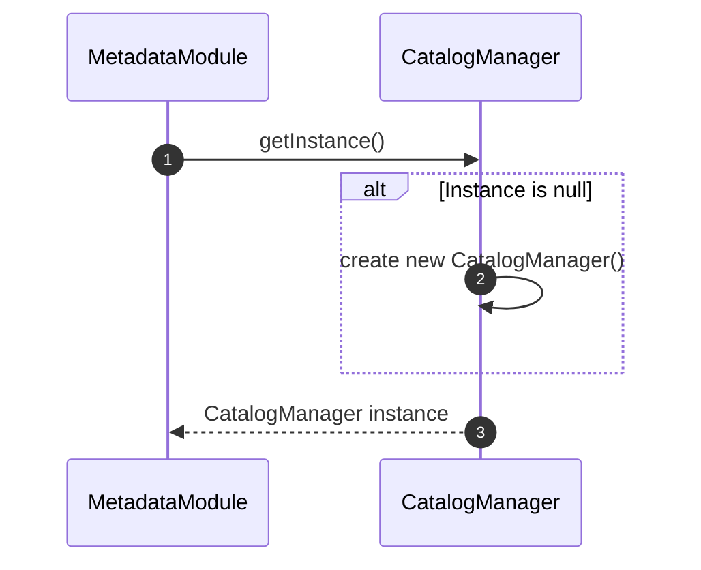

---

#### 2.1.2. Facade Pattern
* **Pattern**: Facade Pattern
* **Class/Interface Applied**: `MetadataModule`
* **Method**: `getTable(databaseName, schemaName, tableName)`, `getDatabase(databaseName)`, `getCatalogManager()`, `executeDDL(command)`

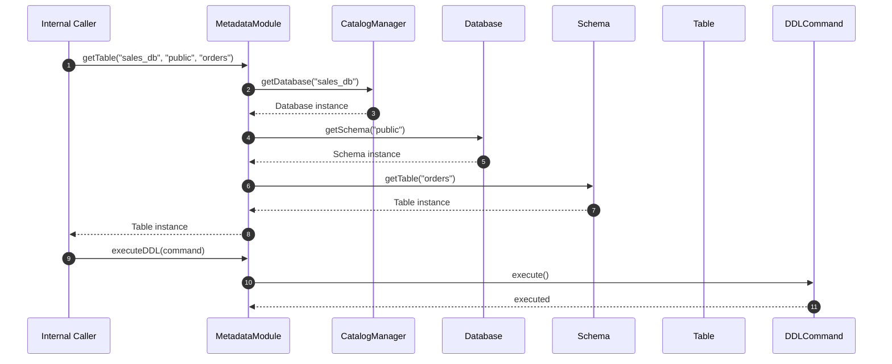

---

#### 2.1.3. Composite Pattern
* **Pattern**: Composite Pattern
* **Class/Interface Applied**: `MetadataElement` (implemented by CatalogManager, Database, Schema, Table, Column)
* **Method**: `getElementName()`

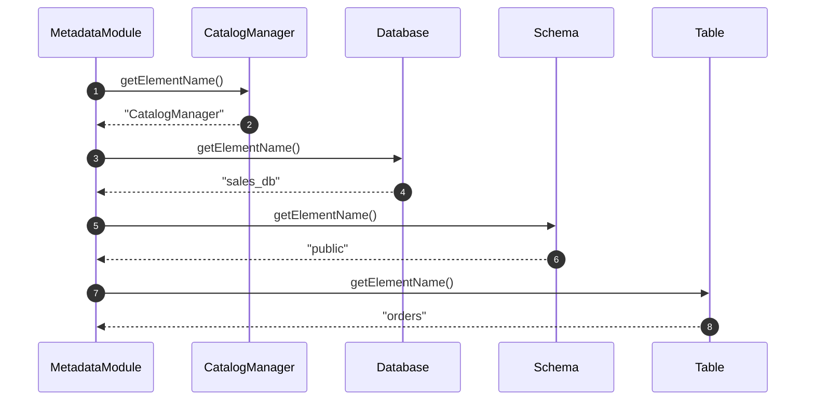

---

### 2.2. Database Level

#### 2.2.1. State Pattern
* **Pattern**: State Pattern
* **Class/Interface Applied**: `DatabaseStatus`, `Database`
* **Method**: `setStatus(status)`, `createSchema(schemaName)`

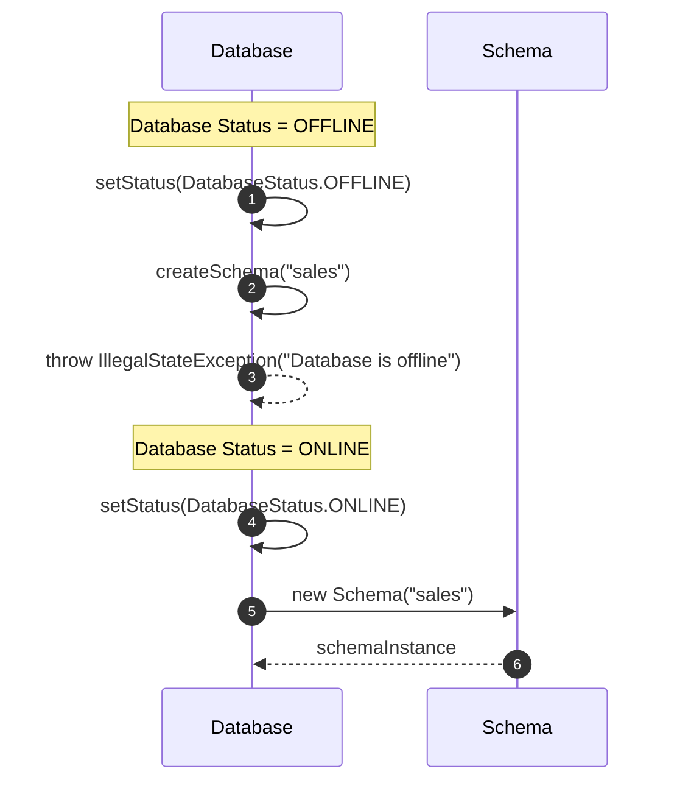

---

### 2.3. Schema Level

#### 2.3.1. Factory Method Pattern
* **Pattern**: Factory Method Pattern
* **Class/Interface Applied**: `Schema`
* **Method**: `createTable(tableName)`

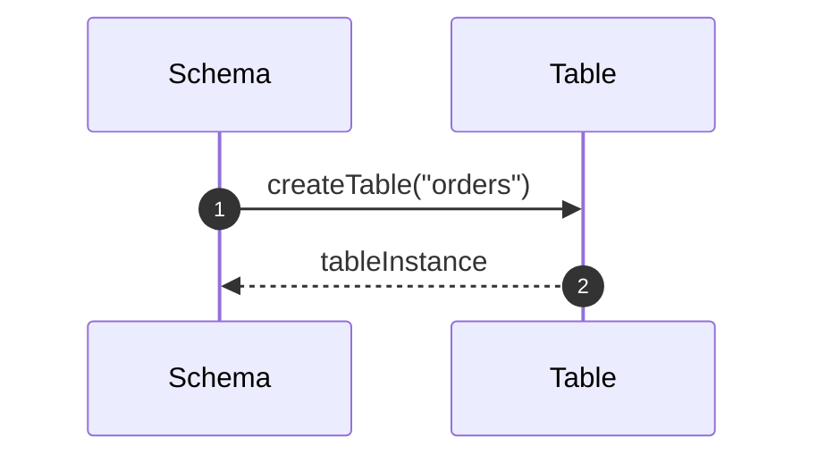

---

#### 2.3.2. Command Pattern
* **Pattern**: Command Pattern
* **Class/Interface Applied**: `DDLCommand` (CreateTableCommand, DropTableCommand, CreateSchemaCommand, DropSchemaCommand, RenameSchemaCommand)
* **Method**: `execute()`, `undo()`

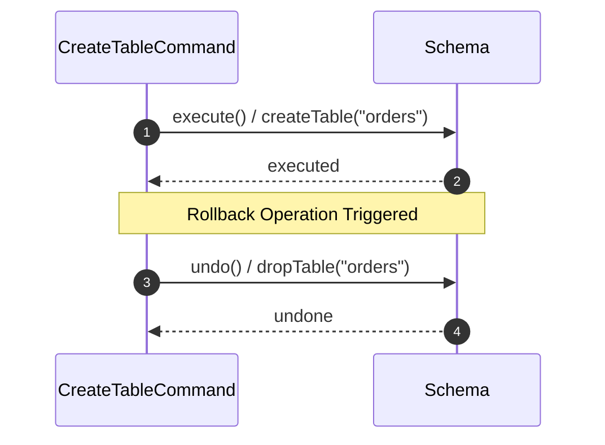

---

### 2.4. Table Level

#### 2.4.1. Prototype Pattern
* **Pattern**: Prototype Pattern
* **Class/Interface Applied**: `Table`, `Column`
* **Method**: `clone()`

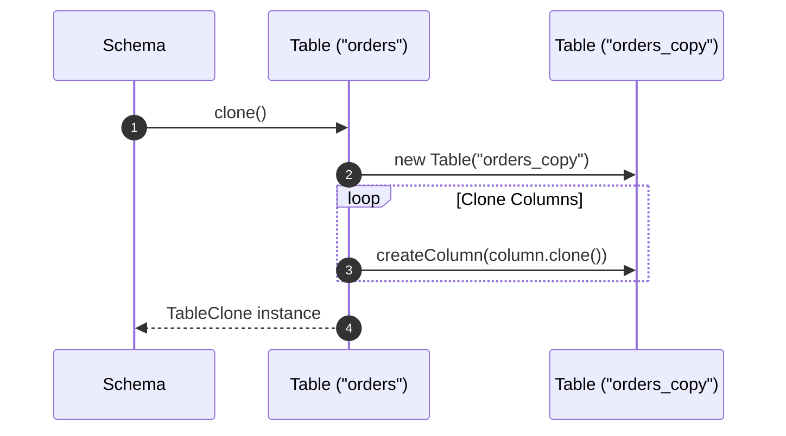

---

#### 2.4.2. Memento Pattern
* **Pattern**: Memento Pattern
* **Class/Interface Applied**: `TableMemento`, `Table`
* **Method**: `createMemento()`, `restore(memento)`

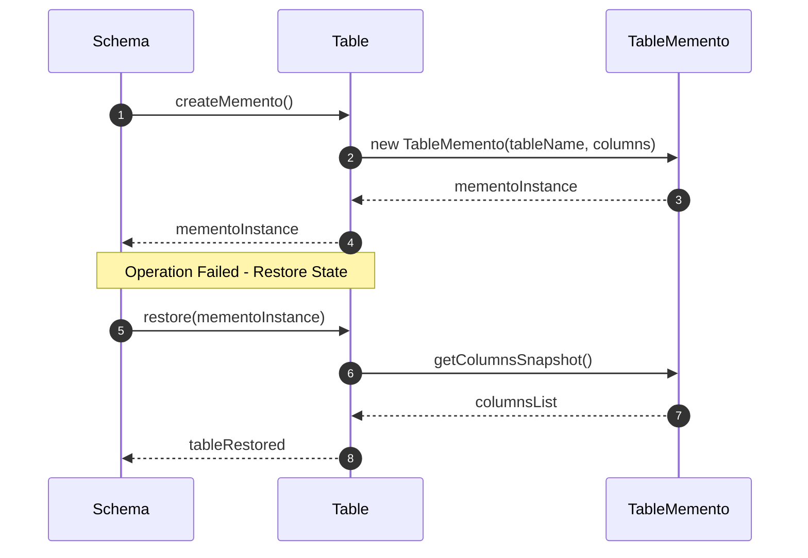

---

#### 2.4.3. Observer Pattern (Subject)
* **Pattern**: Observer Pattern (Subject)
* **Class/Interface Applied**: `Table`, `MetadataChangeListener`
* **Method**: `registerListener(listener)`, `removeListener(listener)`, `notifyListeners(eventType, targetName)`

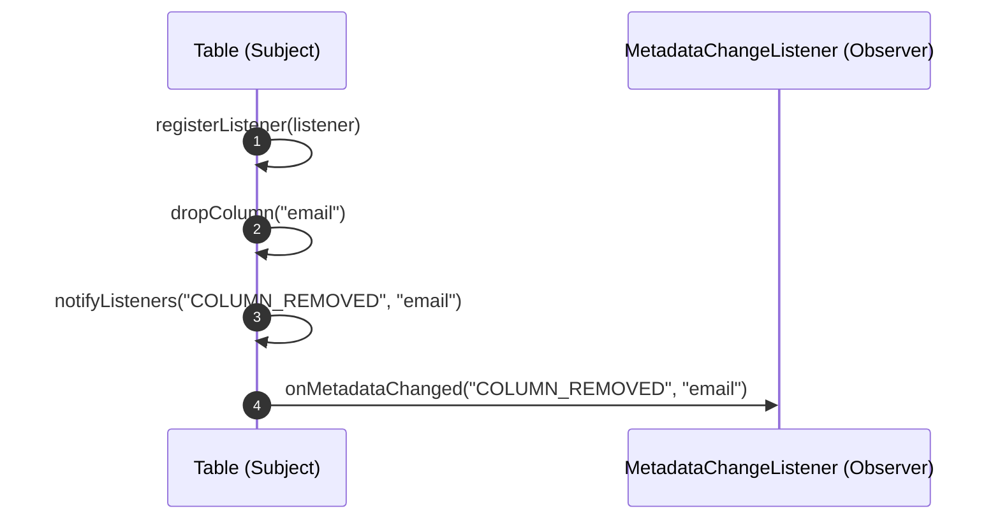

---

### 2.5. Column Level

#### 2.5.1. Builder Pattern
* **Pattern**: Builder Pattern
* **Class/Interface Applied**: `ColumnBuilder`
* **Method**: `setType(dataType)`, `setNullable(nullable)`, `setDefaultValue(value)`, `build()`

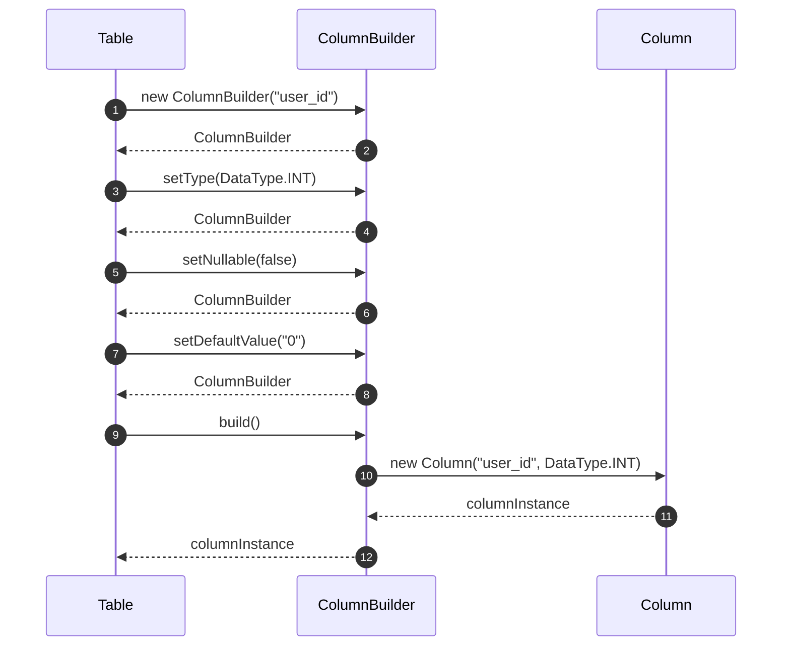

---

### 2.6. Constraint Level

#### 2.6.1. Factory Method Pattern (Constraint)
* **Pattern**: Factory Method Pattern
* **Class/Interface Applied**: `ConstraintFactory`
* **Method**: `createConstraint(type, name, args)`

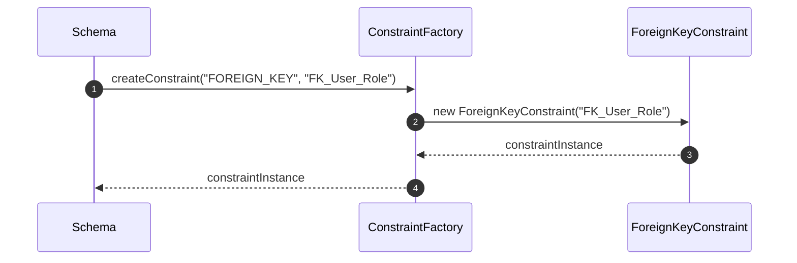

---

#### 2.6.2. Template Method Pattern
* **Pattern**: Template Method Pattern
* **Class/Interface Applied**: `Constraint`
* **Method**: `validate()`, `preValidate()`, `doValidate()`, `postValidate()`

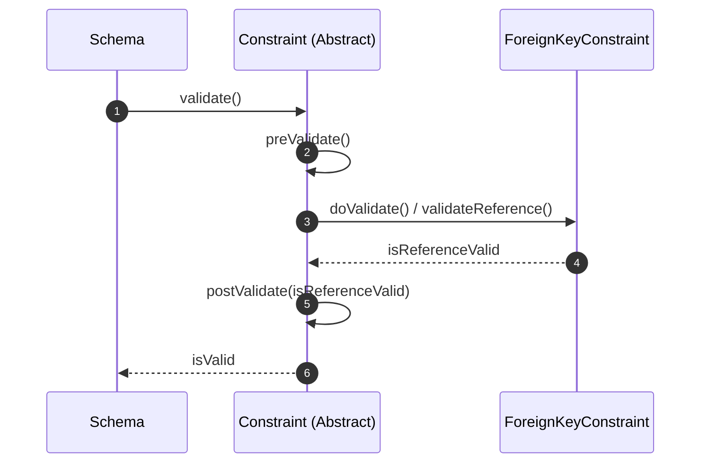

---

#### 2.6.3. Chain of Responsibility Pattern
* **Pattern**: Chain of Responsibility Pattern
* **Class/Interface Applied**: `ConstraintValidationChain`
* **Method**: `addConstraint(constraint)`, `validateAll()`

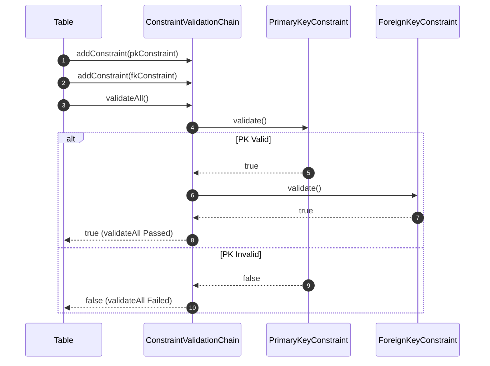

---

### 2.7. Index Level

#### 2.7.1. Strategy Pattern
* **Pattern**: Strategy Pattern
* **Class/Interface Applied**: `Index`, `IndexRebuildStrategy`
* **Method**: `setRebuildStrategy(strategy)`, `rebuild()`

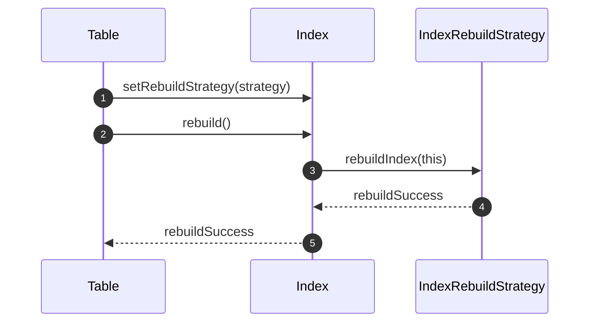
