# Database Management System - Design Patterns & Sequence Diagrams

This document summarizes all **Design Patterns** applied across the DBMS system (including the **Metadata** subsystem and **Query Processor** subsystem). It includes **Summary Matrix Tables with Java Code Skeletons (Class/Interface & Method signature)** for each pattern and **Sequence Diagrams** detailing object interaction flows. All example code 100% matches the codebase structure in the `DBMS/src/main/java` directory.

---

# PART I: METADATA MODULE

## 1. Implemented Design Patterns Matrix (Summary Table & Java Code Skeleton)

### 1.1. Design Patterns Summary Table

#### Creational Patterns
| # | Design Pattern | Class / Interface | Method | Purpose |
|:---:|:---|:---|:---|:---|
| 1 | **Singleton** | `CatalogManager`<br>`MetadataModule` | `getInstance()` | Ensures a single CatalogManager and a single main Facade entry point for the entire DBMS system in RAM. |
| 2 | **Factory Method** | `Schema`<br>`ConstraintFactory` | `createTable(...)`<br>`createConstraint(...)` | Encapsulates the instantiation logic for child objects (`Table`, `Constraint`) flexibly. |
| 3 | **Prototype** | `Table`<br>`Column` | `clone()` | Quickly clones the current table or column structure into an independent object without re-initialization. |
| 4 | **Builder** | `ColumnBuilder` | `setType(...)`<br>`setNullable(...)`<br>`setDefaultValue(...)`<br>`build()` | Instantiates `Column` objects with multiple optional parameters using a Fluent API. |

#### Structural Patterns
| # | Design Pattern | Class / Interface | Method | Purpose |
|:---:|:---|:---|:---|:---|
| 5 | **Facade** | `MetadataModule` | `getTable(...)`<br>`executeDDL(...)` | Provides a high-level API simplifying complex interactions between CatalogManager, Database, Schema, and Table. |
| 6 | **Composite** | `MetadataElement` (Interface)<br>`CatalogManager`, `Database`, `Schema`, `Table`, `Column` | `getElementName()` | Builds a uniform hierarchical tree structure to manage Metadata components in the system. |

#### Behavioral Patterns
| # | Design Pattern | Class / Interface | Method | Purpose |
|:---:|:---|:---|:---|:---|
| 7 | **State** | `Database`<br>`DatabaseStatus` | `setStatus(...)`<br>`createSchema(...)` | Manages and blocks structural modification operations when the Database is in `OFFLINE` or `READ_ONLY` state. |
| 8 | **Command** | `DDLCommand` (Interface)<br>`CreateTableCommand`, `CreateSchemaCommand`, etc. | `execute()`<br>`undo()` | Encapsulates DDL operations into command objects capable of Execution (`execute`) and Rollback (`undo`). |
| 9 | **Memento** | `TableMemento`<br>`Table` | `createMemento()`<br>`restore(...)` | Captures state snapshots of Table column lists and supports restoring to a previous state. |
| 10 | **Observer** | `MetadataChangeListener` (Interface)<br>`Table`<br>`TableEventPublisher` | `registerListener(...)`<br>`notifyListeners(...)`<br>`onMetadataChanged(...)` | `Table` emits structural change event notifications to listening Observers for automatic updates. |
| 11 | **Template Method** | `Constraint` (Abstract Class) | `validate()` | Defines the skeleton algorithm checking the `enabled` state before executing detailed validation. |
| 12 | **Chain of Responsibility** | `ConstraintValidationChain` | `addConstraint(...)`<br>`validateAll()` | Manages sequential data constraint validation chains (Fail-Fast: PK ➔ FK ➔ Check). |
| 13 | **Strategy** | `IndexRebuildStrategy` (Interface)<br>`Index` | `setRebuildStrategy(...)`<br>`rebuild()` | Allows flexible assignment and execution of algorithm rebuild strategies for `Index` objects. |

---

### 1.2. Detailed Pattern Breakdown & Java Code Skeleton (Class/Interface & Method Signature)

#### Creational Patterns

##### 1. Singleton Pattern
* **Class / Interface**: `CatalogManager`, `MetadataModule`
* **Method**: `getInstance()`
* **Purpose**: Ensures a single CatalogManager and a single main Facade entry point for the entire DBMS system in RAM.

**Java Code Skeleton:**
```java
package metadata.domain;

public class CatalogManager implements MetadataElement {
    private static volatile CatalogManager instance;

    private CatalogManager() { }

    // Pattern: Singleton (Double-Checked Locking)
    public static CatalogManager getInstance() {
        // ...
        return instance;
    }
}
```

---

##### 2. Factory Method Pattern
* **Class / Interface**: `Schema`, `ConstraintFactory`
* **Method**: `createTable(tableName)`, `createConstraint(type, name, args)`
* **Purpose**: Encapsulates the instantiation logic for child objects (`Table`, `Constraint`) flexibly.

**Java Code Skeleton:**
```java
package metadata.domain;

public class Schema implements MetadataElement {
    // Pattern: Factory Method
    public Table createTable(String tableName) {
        // ...
        return null;
    }
}

package metadata.constraints;

public class ConstraintFactory {
    // Pattern: Factory Method
    public static Constraint createConstraint(String type, String name, Object... args) {
        // ...
        return null;
    }
}
```

---

##### 3. Prototype Pattern
* **Class / Interface**: `Table`, `Column`
* **Method**: `clone()`
* **Purpose**: Quickly clones the current table or column structure into an independent object without re-initialization.

**Java Code Skeleton:**
```java
package metadata.domain;

public class Table implements MetadataElement, Cloneable {
    // Pattern: Prototype
    @Override
    public Table clone() {
        // ...
        return null;
    }
}

public class Column implements MetadataElement, Cloneable {
    // Pattern: Prototype
    @Override
    public Column clone() {
        // ...
        return null;
    }
}
```

---

##### 4. Builder Pattern
* **Class / Interface**: `ColumnBuilder`
* **Method**: `setType(...)`, `setNullable(...)`, `setDefaultValue(...)`, `build()`
* **Purpose**: Instantiates `Column` objects with multiple optional parameters using a Fluent API.

**Java Code Skeleton:**
```java
package metadata.builders;

public class ColumnBuilder {
    public ColumnBuilder(String columnName) { }
    public ColumnBuilder setType(DataType dataType) { return this; }
    public ColumnBuilder setNullable(boolean nullable) { return this; }
    public ColumnBuilder setDefaultValue(String defaultValue) { return this; }
    public Column build() { return null; }
}
```

---

#### Structural Patterns

##### 5. Facade Pattern
* **Class / Interface**: `MetadataModule`
* **Method**: `getTable(databaseName, schemaName, tableName)`, `executeDDL(command)`
* **Purpose**: Provides a high-level API simplifying complex interactions between CatalogManager, Database, Schema, and Table.

**Java Code Skeleton:**
```java
package metadata.facade;

public class MetadataModule {
    private CatalogManager catalogManager;

    // Pattern: Facade
    public Table getTable(String databaseName, String schemaName, String tableName) {
        // ...
        return null;
    }

    // Pattern: Facade
    public void executeDDL(DDLCommand command) {
        // ...
    }
}
```

---

##### 6. Composite Pattern
* **Class / Interface**: `MetadataElement` (Interface), `CatalogManager`, `Database`, `Schema`, `Table`, `Column`
* **Method**: `getElementName()`, `getElementType()`
* **Purpose**: Builds a uniform hierarchical tree structure to manage Metadata components in the system.

**Java Code Skeleton:**
```java
package metadata.interfaces;

public interface MetadataElement {
    String getElementName();
    String getElementType();
}

package metadata.domain;

public class Table implements MetadataElement, Cloneable {
    @Override
    public String getElementName() {
        // ...
        return null;
    }

    @Override
    public String getElementType() {
        return "Table";
    }
}

public class Column implements MetadataElement, Cloneable {
    @Override
    public String getElementName() {
        // ...
        return null;
    }

    @Override
    public String getElementType() {
        return "Column";
    }
}
```

---

#### Behavioral Patterns

##### 7. State Pattern
* **Class / Interface**: `Database`, `DatabaseStatus`
* **Method**: `setStatus(status)`, `createSchema(schemaName)`
* **Purpose**: Manages and blocks structural modification operations when the Database is in `OFFLINE` or `READ_ONLY` state.

**Java Code Skeleton:**
```java
package metadata.enums;

public enum DatabaseStatus {
    ONLINE, OFFLINE, READ_ONLY
}

package metadata.domain;

public class Database implements MetadataElement {
    private DatabaseStatus status;

    public Schema createSchema(String schemaName) {
        // ...
        return null;
    }

    public void setStatus(DatabaseStatus status) {
        // ...
    }
}
```

---

##### 8. Command Pattern
* **Class / Interface**: `DDLCommand` (Interface), `CreateTableCommand`, `DropTableCommand`, `CreateSchemaCommand`, etc.
* **Method**: `execute()`, `undo()`
* **Purpose**: Encapsulates DDL operations into command objects capable of Execution (`execute`) and Rollback (`undo`).

**Java Code Skeleton:**
```java
package metadata.commands;

public interface DDLCommand {
    void execute();
    void undo();
}

public class CreateTableCommand implements DDLCommand {
    @Override
    public void execute() {
        // ...
    }

    @Override
    public void undo() {
        // ...
    }
}
```

---

##### 9. Memento Pattern
* **Class / Interface**: `TableMemento`, `Table`
* **Method**: `createMemento()`, `restore(memento)`
* **Purpose**: Captures state snapshots of Table column lists and supports restoring to a previous state.

**Java Code Skeleton:**
```java
package metadata.domain;

public class TableMemento {
    public String getTableName() { return null; }
    public List<Column> getColumnsSnapshot() { return null; }
}

public class Table implements MetadataElement, Cloneable {
    public TableMemento createMemento() {
        // ...
        return null;
    }

    public void restore(TableMemento memento) {
        // ...
    }
}
```

---

##### 10. Observer Pattern
* **Class / Interface**: `MetadataChangeListener` (Interface), `Table`, `TableEventPublisher`
* **Method**: `registerListener(...)`, `notifyListeners(...)`, `onMetadataChanged(...)`
* **Purpose**: `Table` emits structural change event notifications to listening Observers for automatic updates.

**Java Code Skeleton:**
```java
package metadata.interfaces;

public interface MetadataChangeListener {
    void onMetadataChanged(String eventType, String targetName);
}

package metadata.events;

public class TableEventPublisher {
    public void registerListener(MetadataChangeListener listener) { }
    public void notifyListeners(String eventType, String targetName) { }
}

package metadata.domain;

public class Table implements MetadataElement, Cloneable {
    public void addColumn(Column column) {
        // ...
    }
}
```

---

##### 11. Template Method Pattern
* **Class / Interface**: `Constraint` (Abstract Class)
* **Method**: `validate()`, `preValidate()`, `doValidate()`, `postValidate()`
* **Purpose**: Defines the skeleton algorithm checking the `enabled` state before executing detailed validation.

**Java Code Skeleton:**
```java
package metadata.abstracts;

public abstract class Constraint {
    // Pattern: Template Method
    public boolean validate() {
        // ...
        return false;
    }
    protected boolean preValidate() { return true; }
    protected boolean doValidate() { return true; }
    protected void postValidate(boolean validationResult) { }
}
```

---

##### 12. Chain of Responsibility Pattern
* **Class / Interface**: `ConstraintValidationChain`
* **Method**: `addConstraint(...)`, `validateAll()`
* **Purpose**: Manages sequential data constraint validation chains (Fail-Fast: PK ➔ FK ➔ Check).

**Java Code Skeleton:**
```java
package metadata.constraints;

public class ConstraintValidationChain {
    public void addConstraint(Constraint constraint) { }
    public boolean validateAll() {
        // ...
        return true;
    }
}
```

---

##### 13. Strategy Pattern
* **Class / Interface**: `IndexRebuildStrategy` (Interface), `Index`
* **Method**: `setRebuildStrategy(...)`, `rebuild()`
* **Purpose**: Allows flexible assignment and execution of algorithm rebuild strategies for `Index` objects.

**Java Code Skeleton:**
```java
package metadata.interfaces;

public interface IndexRebuildStrategy {
    void rebuildIndex(Index index);
}

package metadata.domain;

public class Index {
    public void setRebuildStrategy(IndexRebuildStrategy strategy) { }
    public void rebuild() {
        // ...
    }
}
```

---

## 2. Sequence Diagrams for Key Design Patterns in Metadata Module

---

### 2.1. CatalogManager & MetadataModule Level (Root Catalog Level)

#### 2.1.1. Singleton Pattern (Creational)
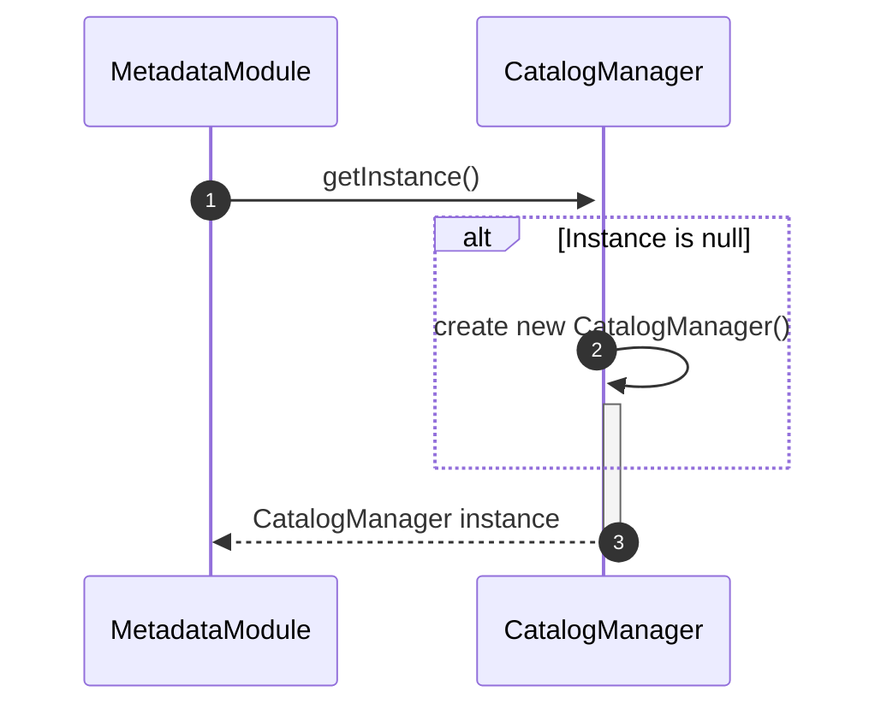
```mermaid
sequenceDiagram
    autonumber
    participant Module as MetadataModule
    participant CM as CatalogManager
    
    Module->>+CM: getInstance()
    alt Instance is null
        CM->>+CM: create new CatalogManager()
    end
    CM-->>-Module: CatalogManager instance
```

---

#### 2.1.2. Facade Pattern (Structural)
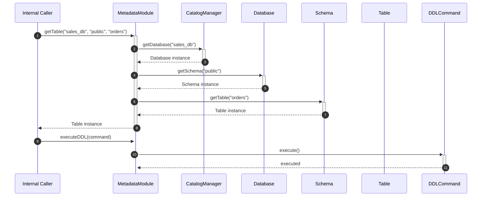
```mermaid
sequenceDiagram
    autonumber
    participant Caller as Internal Caller
    participant Facade as MetadataModule
    participant CM as CatalogManager
    participant DB as Database
    participant Schema as Schema
    participant Table as Table
    participant Cmd as DDLCommand

    Caller->>+Facade: getTable("sales_db", "public", "orders")
    Facade->>+CM: getDatabase("sales_db")
    CM-->>-Facade: Database instance
    Facade->>+DB: getSchema("public")
    DB-->>-Facade: Schema instance
    Facade->>+Schema: getTable("orders")
    Schema-->>-Facade: Table instance
    Facade-->>-Caller: Table instance

    Caller->>+Facade: executeDDL(command)
    Facade->>+Cmd: execute()
    Cmd-->>-Facade: executed
```

---

#### 2.1.3. Composite Pattern (Structural)
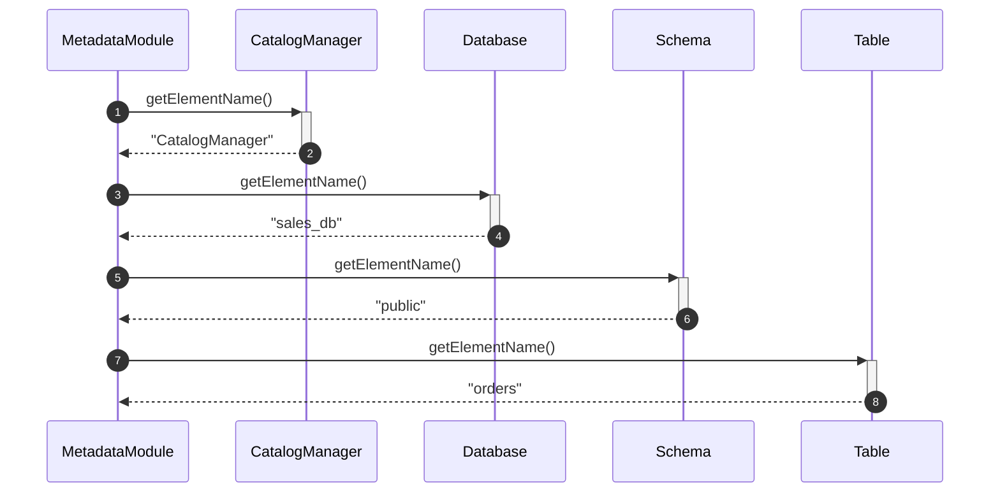
```mermaid
sequenceDiagram
    autonumber
    participant Module as MetadataModule
    participant CM as CatalogManager
    participant DB as Database
    participant Schema as Schema
    participant Table as Table

    Module->>+CM: getElementName()
    CM-->>-Module: "CatalogManager"
    Module->>+DB: getElementName()
    DB-->>-Module: "sales_db"
    Module->>+Schema: getElementName()
    Schema-->>-Module: "public"
    Module->>+Table: getElementName()
    Table-->>-Module: "orders"
```

---

### 2.2. Database Level

#### 2.2.1. State Pattern (Behavioral)
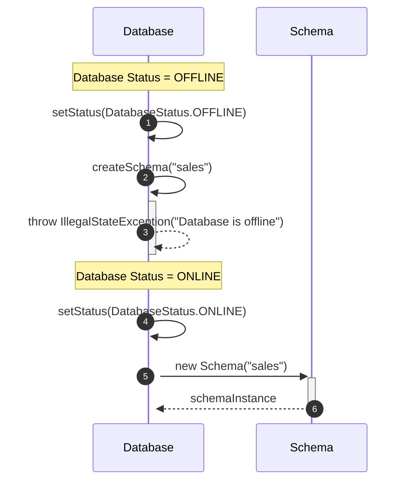
```mermaid
sequenceDiagram
    autonumber
    participant DB as Database
    participant Schema as Schema

    note over DB: Database Status = OFFLINE
    DB->>+DB: setStatus(DatabaseStatus.OFFLINE)
    DB->>+DB: createSchema("sales")
    DB-->>-DB: throw IllegalStateException("Database is offline")

    note over DB: Database Status = ONLINE
    DB->>+DB: setStatus(DatabaseStatus.ONLINE)
    DB->>+Schema: new Schema("sales")
    Schema-->>-DB: schemaInstance
```

---

### 2.3. Schema Level

#### 2.3.1. Factory Method Pattern (Creational)
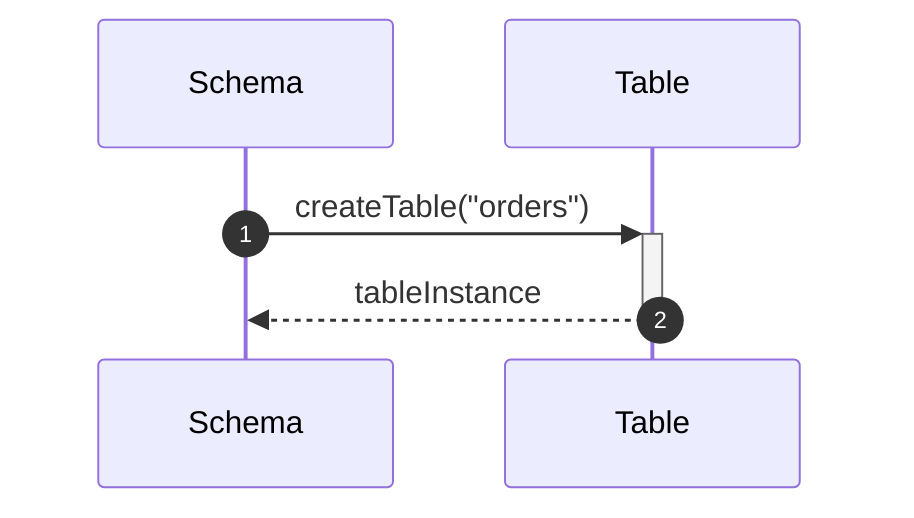
```mermaid
sequenceDiagram
    autonumber
    participant Schema as Schema
    participant Table as Table

    Schema->>+Table: createTable("orders")
    Table-->>-Schema: tableInstance
```

---

#### 2.3.2. Command Pattern (Behavioral)
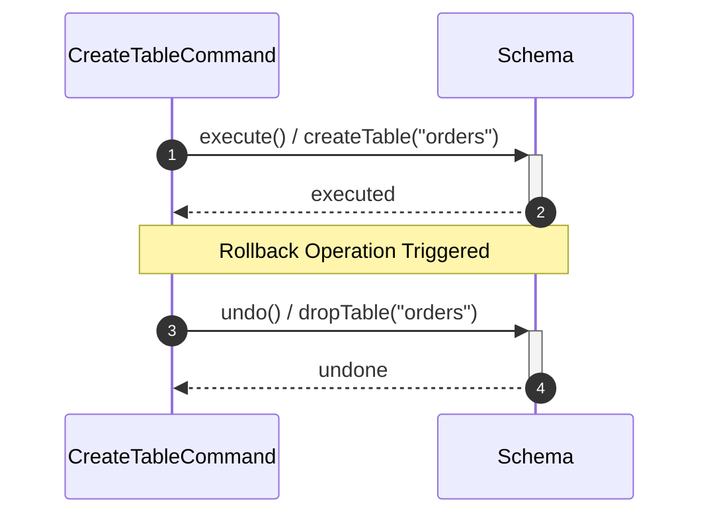
```mermaid
sequenceDiagram
    autonumber
    participant Cmd as CreateTableCommand
    participant Schema as Schema

    Cmd->>+Schema: execute() / createTable("orders")
    Schema-->>-Cmd: executed

    note over Cmd, Schema: Rollback Operation Triggered
    Cmd->>+Schema: undo() / dropTable("orders")
    Schema-->>-Cmd: undone
```

---

### 2.4. Table Level

#### 2.4.1. Prototype Pattern (Creational)
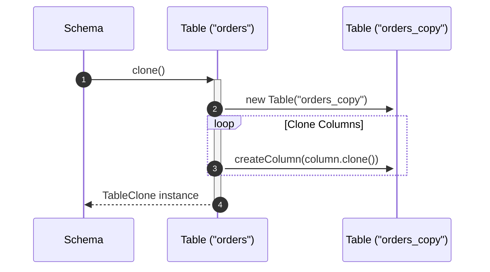
```mermaid
sequenceDiagram
    autonumber
    participant Schema as Schema
    participant TableOrig as Table ("orders")
    participant TableClone as Table ("orders_copy")

    Schema->>+TableOrig: clone()
    TableOrig->>+TableClone: new Table("orders_copy")
    loop Clone Columns
        TableOrig->>+TableClone: createColumn(column.clone())
    end
    TableOrig-->>-Schema: TableClone instance
```

---

#### 2.4.2. Memento Pattern (Behavioral)
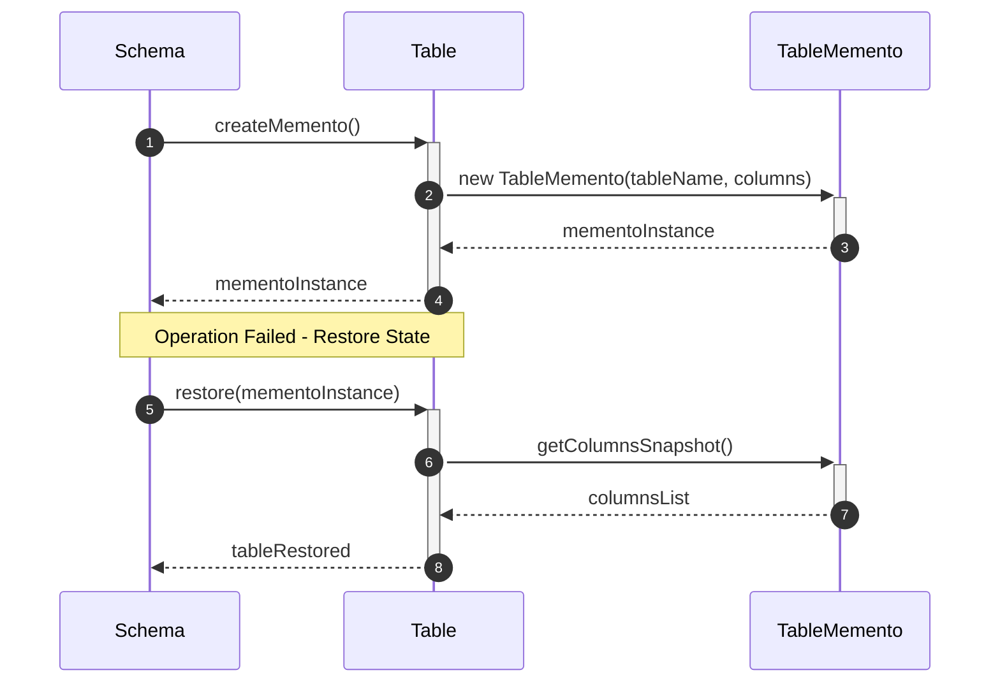
```mermaid
sequenceDiagram
    autonumber
    participant Schema as Schema
    participant Table as Table
    participant Memento as TableMemento

    Schema->>+Table: createMemento()
    Table->>+Memento: new TableMemento(tableName, columns)
    Memento-->>-Table: mementoInstance
    Table-->>-Schema: mementoInstance

    note over Schema, Table: Operation Failed - Restore State
    Schema->>+Table: restore(mementoInstance)
    Table->>+Memento: getColumnsSnapshot()
    Memento-->>-Table: columnsList
    Table-->>-Schema: tableRestored
```

---

#### 2.4.3. Observer Pattern (Behavioral)
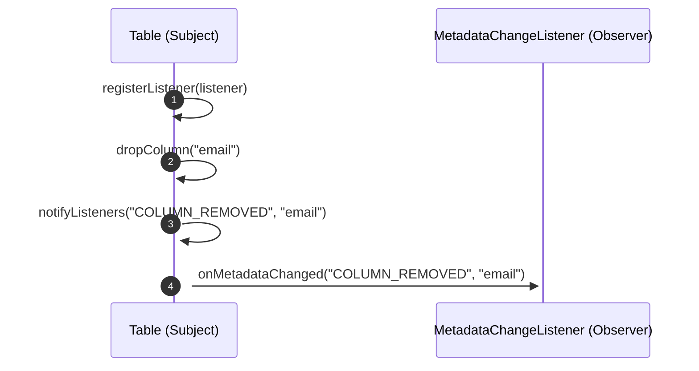
```mermaid
sequenceDiagram
    autonumber
    participant Table as Table (Subject)
    participant Listener as MetadataChangeListener (Observer)

    Table->>+Table: registerListener(listener)
    Table->>+Table: dropColumn("email")
    Table->>+Table: notifyListeners("COLUMN_REMOVED", "email")
    Table->>+Listener: onMetadataChanged("COLUMN_REMOVED", "email")
```

---

### 2.5. Column Level

#### 2.5.1. Builder Pattern (Creational)
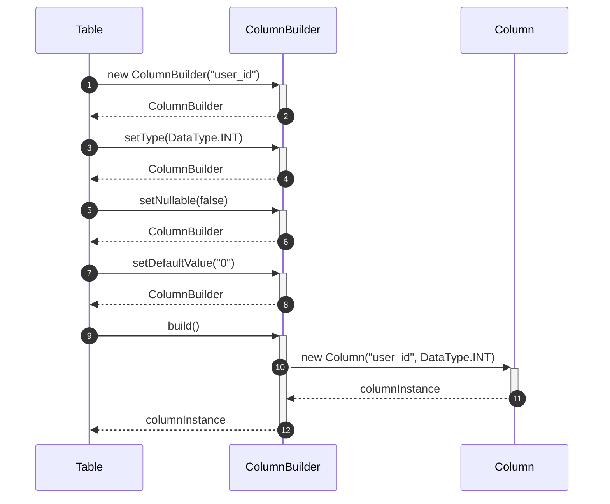
```mermaid
sequenceDiagram
    autonumber
    participant Table as Table
    participant CB as ColumnBuilder
    participant Col as Column

    Table->>+CB: new ColumnBuilder("user_id")
    CB-->>-Table: ColumnBuilder
    Table->>+CB: setType(DataType.INT)
    CB-->>-Table: ColumnBuilder
    Table->>+CB: setNullable(false)
    CB-->>-Table: ColumnBuilder
    Table->>+CB: setDefaultValue("0")
    CB-->>-Table: ColumnBuilder
    Table->>+CB: build()
    CB->>+Col: new Column("user_id", DataType.INT)
    Col-->>-CB: columnInstance
    CB-->>-Table: columnInstance
```

---

### 2.6. Constraint Level

#### 2.6.1. Factory Method Pattern (Creational)
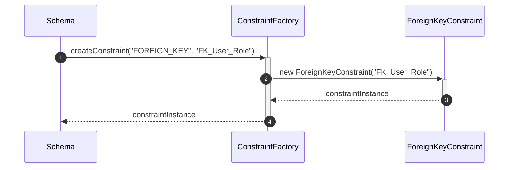
```mermaid
sequenceDiagram
    autonumber
    participant Schema as Schema
    participant CF as ConstraintFactory
    participant FK as ForeignKeyConstraint

    Schema->>+CF: createConstraint("FOREIGN_KEY", "FK_User_Role")
    CF->>+FK: new ForeignKeyConstraint("FK_User_Role")
    FK-->>-CF: constraintInstance
    CF-->>-Schema: constraintInstance
```

---

#### 2.6.2. Template Method Pattern (Behavioral)
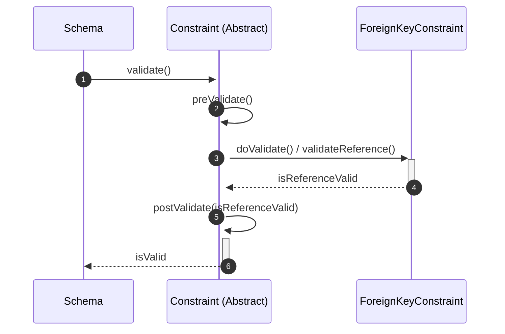
```mermaid
sequenceDiagram
    autonumber
    participant Schema as Schema
    participant Base as Constraint (Abstract)
    participant Sub as ForeignKeyConstraint

    Schema->>+Base: validate()
    Base->>+Base: preValidate()
    Base->>+Sub: doValidate() / validateReference()
    Sub-->>-Base: isReferenceValid
    Base->>+Base: postValidate(isReferenceValid)
    Base-->>-Schema: isValid
```

---

#### 2.6.3. Chain of Responsibility Pattern (Behavioral)
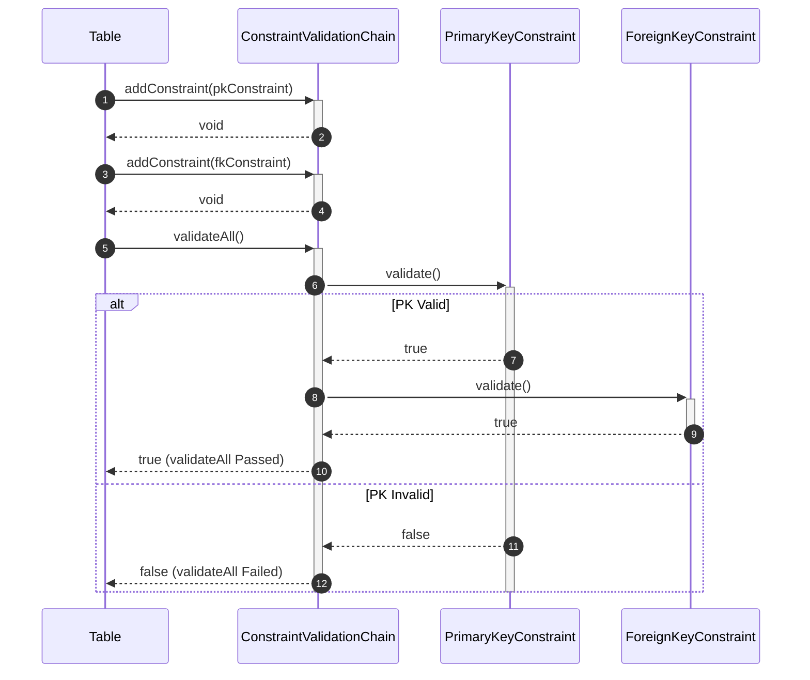
```mermaid
sequenceDiagram
    autonumber
    participant Table as Table
    participant Chain as ConstraintValidationChain
    participant PK as PrimaryKeyConstraint
    participant FK as ForeignKeyConstraint

    Table->>+Chain: addConstraint(pkConstraint)
    Chain-->>-Table: void
    Table->>+Chain: addConstraint(fkConstraint)
    Chain-->>-Table: void
    Table->>+Chain: validateAll()
    Chain->>+PK: validate()
    alt PK Valid
        PK-->>Chain: true
        Chain->>+FK: validate()
        FK-->>-Chain: true
        Chain-->>Table: true (validateAll Passed)
    else PK Invalid
        PK-->>Chain: false
        Chain-->>Table: false (validateAll Failed)
    end
    deactivate PK
    deactivate Chain
```

---

### 2.7. Index Level

#### 2.7.1. Strategy Pattern (Behavioral)
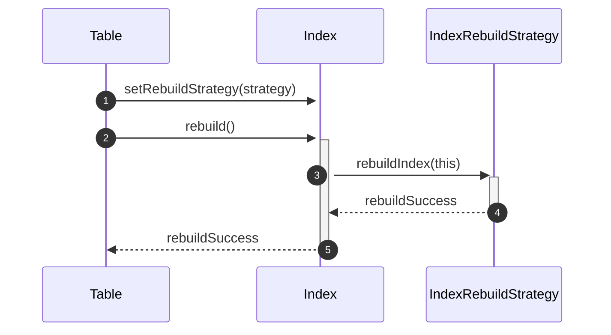
```mermaid
sequenceDiagram
    autonumber
    participant Table as Table
    participant Index as Index
    participant Strategy as IndexRebuildStrategy

    Table->>+Index: setRebuildStrategy(strategy)
    Table->>+Index: rebuild()
    Index->>+Strategy: rebuildIndex(this)
    Strategy-->>-Index: rebuildSuccess
    Index-->>-Table: rebuildSuccess
```

---

# PART II: QUERY PROCESSOR MODULE

## 3. Implemented Design Patterns Matrix (Summary Table & Java Code Skeleton)

### 3.1. Design Patterns Summary Table

#### Creational Patterns
| # | Design Pattern | Class / Interface | Method | Purpose |
|:---:|:---|:---|:---|:---|
| 1 | **Builder** | `LogicalPlanBuilder`<br>`PhysicalPlanBuilder` | `build(ast)`<br>`build(logicalPlan)` | Builds step-by-step the logical plan tree (`LogicalPlan`) and physical plan tree (`PhysicalPlan`) from the AST tree and optimized plan. |
| 2 | **Factory Method** | `LogicalOperatorFactory`<br>`PhysicalOperatorFactory` | `createOperator(...)` | Encapsulates the instantiation logic for specialized logical/physical operator objects (`Operator Nodes`). |

#### Structural Patterns
| # | Design Pattern | Class / Interface | Method | Purpose |
|:---:|:---|:---|:---|:---|
| 3 | **Facade** | `QueryProcessor` | `compile(sqlText)` | Provides a single centralized interface for the entire SQL compilation and optimization pipeline (Lexer ➔ Parser ➔ AST ➔ Semantic ➔ Optimizer ➔ PlanGenerator). |
| 4 | **Composite** | `AST`<br>`ASTNode` (Composite Node) | `accept(visitor)` | Uniformly represents the Abstract Syntax Tree (AST) hierarchical structure. |

#### Behavioral Patterns
| # | Design Pattern | Class / Interface | Method | Purpose |
|:---:|:---|:---|:---|:---|
| 5 | **Chain of Responsibility** | `CompilerStage` (Interface)<br>`Lexer`<br>`SQLParser`<br>`ASTBuilder`<br>`SemanticAnalyzer`<br>`QueryRewriter`<br>`QueryOptimizer` | `process(...)` | Chains independent sequential SQL processing stages (Tokenize ➔ Parse Tree ➔ AST ➔ Semantic Check ➔ Query Rewrite ➔ Optimization). |
| 6 | **Visitor** | `ASTVisitor` (Interface)<br>`SemanticAnalyzer`<br>`QueryRewriter` | `visit(node)`<br>`analyze(ast)`<br>`rewrite(ast)` | Traverses the AST tree for semantic checks and logic optimizations without modifying the `ASTNode` tree node structure. |
| 7 | **Strategy** | `QueryOptimizer` (Strategy Context)<br>`OptimizationRule` (Interface)<br>`CostEstimator`<br>`PredicatePushdownOptimizer`<br>`ProjectionPushdownOptimizer`<br>`ConstantFoldingOptimizer` | `optimize(plan)`<br>`setOptimizationRule(rule)`<br>`estimate(plan)` | Encapsulates flexible Cost-Based Optimization (CBO) algorithms and independent query plan transformation rules. |

---

### 3.2. Detailed Subsystem Class Breakdown

#### Semantic Analysis & Name Resolution
| # | Pattern / Role | Class / Interface | Method | Purpose |
|:---:|:---|:---|:---|:---|
| 1 | **Visitor** | `SemanticAnalyzer` | `analyze(ast)`, `visit(node)` | Orchestrates the AST traversal process for comprehensive semantic analysis. |
| 2 | **Visitor Interface** | `ASTVisitor` | `visit(node)` | Defines the standard visitor interface for all AST tree nodes. |
| 3 | **SRP Helper** | `NameResolver` | `resolve(ast)` | Resolves identifier objects in SQL (Database, Schema, Table, Column, Alias). |
| 4 | **SRP Helper** | `TableResolver` | `resolveTable(node)` | Checks table existence in Catalog Metadata. |
| 5 | **SRP Helper** | `ColumnResolver` | `resolveColumn(node)` | Resolves column details and detects name ambiguity/conflicts. |
| 6 | **SRP Helper** | `AliasResolver` | `resolveAlias(node)` | Resolves and identifies alias names (Table Alias, Column Alias). |
| 7 | **SRP Helper** | `TypeChecker` | `validate(ast)` | Validates system-wide data type correctness and compatibility. |
| 8 | **SRP Helper** | `ExpressionTypeChecker` | `checkExpression(node)` | Validates data types in algebraic, comparison, and logical expressions. |
| 9 | **SRP Helper** | `FunctionTypeChecker` | `checkFunction(node)` | Validates input parameters and return types of SQL functions. |
| 10 | **SRP Helper** | `AggregateValidator` | `validate(ast)` | Validates aggregate functions (SUM, COUNT, AVG, MIN, MAX). |
| 11 | **SRP Helper** | `GroupByValidator` | `validate(ast)` | Checks semantic rules and constraint conditions of `GROUP BY` clauses. |
| 12 | **SRP Helper** | `OrderByValidator` | `validate(ast)` | Checks sorting column lists and expressions in `ORDER BY` clauses. |

---

#### Query Optimization Engine
| # | Pattern / Role | Class / Interface | Method | Purpose |
|:---:|:---|:---|:---|:---|
| 1 | **Strategy Context** | `QueryOptimizer` | `optimize(plan)`, `setOptimizationRule(rule)` | Orchestrates CBO cost-based plan optimization. |
| 2 | **Strategy Interface** | `OptimizationRule` | `optimize(plan)` | Defines a common interface for optimization algorithms and rules. |
| 3 | **Strategy Impl** | `PredicatePushdownOptimizer` | `optimize(plan)` | Pushes filter predicates closer to data sources (Scan) to reduce intermediate data. |
| 4 | **Strategy Impl** | `ProjectionPushdownOptimizer` | `optimize(plan)` | Eliminates unused columns at the earliest retrieval layer. |
| 5 | **Strategy Impl** | `ConstantFoldingOptimizer` | `optimize(plan)` | Pre-calculates constant expressions at compile time. |
| 6 | **SRP Helper** | `QueryRewriter` | `rewrite(plan)` | Encapsulates query transformation and rewriting while preserving SQL semantics. |
| 7 | **SRP Helper** | `JoinOptimizer` | `optimize(plan)` | Manages and orchestrates Join optimization algorithms. |
| 8 | **SRP Helper** | `JoinOrderOptimizer` | `optimize(plan)` | Calculates and selects the cost-optimal Join execution order. |
| 9 | **SRP Helper** | `JoinMethodSelector` | `selectJoinMethod(plan)` | Selects appropriate Join algorithms (Nested Loop Join, Hash Join, Merge Join). |
| 10 | **Strategy / Cost** | `CostEstimator` | `estimate(plan)` | Evaluates total resource costs (CPU & I/O) for execution plan candidates. |
| 11 | **SRP Helper** | `CardinalityEstimator` | `estimate(plan)` | Estimates data size and intermediate result row counts. |
| 12 | **SRP Helper** | `StatisticsManager` | `estimateCardinality()`, `estimateSelectivity()` | Looks up data statistics (Cardinality, Selectivity) from Storage Engine. |
| 13 | **SRP Helper** | `PlanEnumerator` | `enumerate(plan)` | Enumerates and explores feasible candidate execution plan spaces. |
| 14 | **SRP Helper** | `AccessPathSelector` | `select(plan)` | Selects optimal data access paths (Table Scan, Index Scan, Index Only Scan). |

---

#### Plan Generation & Building
| # | Pattern / Role | Class / Interface | Method | Purpose |
|:---:|:---|:---|:---|:---|
| 1 | **Pipeline Helper** | `PlanGenerator` | `createLogicalPlan(ast)`, `createPhysicalPlan(logicalPlan)` | Orchestrates logical and physical plan generation via Builder & Factory. |
| 2 | **Builder** | `LogicalPlanBuilder` | `build(ast)` | Builds step-by-step the logical plan tree from the AST structure. |
| 3 | **Builder** | `PhysicalPlanBuilder` | `build(logicalPlan)` | Converts and builds physical execution plans from logical plans. |
| 4 | **Factory Method** | `LogicalOperatorFactory` | `createOperator(node)` | Instantiates logical operators (LogicalScan, LogicalFilter, LogicalJoin, LogicalAggregate, LogicalSort). |
| 5 | **Factory Method** | `PhysicalOperatorFactory` | `createOperator(node)` | Instantiates physical execution operators corresponding to chosen strategies. |
| 6 | **SRP Helper** | `PlanValidator` | `validate(logicalPlan)` | Validates plan correctness and integrity before execution handoff. |
| 7 | **SRP Helper** | `PlanNormalizer` | `normalize(logicalPlan)` | Normalizes plan tree forms into standard shapes before physical plan creation. |

---

### 3.3. Detailed Pattern Breakdown & Java Code Skeleton (Class/Interface & Method Signature)

#### Creational Patterns

##### 1. Builder Pattern
* **Class / Interface**: `LogicalPlanBuilder`, `PhysicalPlanBuilder`
* **Method**: `build(ast)`, `build(logicalPlan)`
* **Purpose**: Builds step-by-step the logical plan tree (`LogicalPlan`) and physical plan tree (`PhysicalPlan`) from the AST tree and optimized plan.

**Java Code Skeleton:**
```java
package query_processor.planner;

public class LogicalPlanBuilder {
    // Pattern: Builder
    public LogicalPlan build(AST ast) {
        // ...
        return null;
    }
}

public class PhysicalPlanBuilder {
    // Pattern: Builder
    public PhysicalPlan build(LogicalPlan logicalPlan) {
        // ...
        return null;
    }
}
```

---

##### 2. Factory Method Pattern
* **Class / Interface**: `LogicalOperatorFactory`, `PhysicalOperatorFactory`
* **Method**: `createOperator(node)`
* **Purpose**: Encapsulates the instantiation logic for specialized logical/physical operator objects.

**Java Code Skeleton:**
```java
package query_processor.planner;

public class LogicalOperatorFactory {
    // Pattern: Factory Method
    public static LogicalPlanNode createOperator(ASTNode node) {
        // ...
        return null;
    }
}

public class PhysicalOperatorFactory {
    // Pattern: Factory Method
    public static PhysicalPlanNode createOperator(LogicalPlanNode logicalNode) {
        // ...
        return null;
    }
}
```

---

#### Structural Patterns

##### 3. Facade Pattern
* **Class / Interface**: `QueryProcessor`
* **Method**: `compile(sqlText)`
* **Purpose**: Provides a single centralized interface for the entire SQL compilation and optimization pipeline.

**Java Code Skeleton:**
```java
package query_processor.facade;

public class QueryProcessor {
    public QueryProcessor(Lexer lexer,
                           SQLParser parser,
                           ASTBuilder astBuilder,
                           SemanticAnalyzer semanticAnalyzer,
                           QueryRewriter queryRewriter,
                           QueryOptimizer queryOptimizer,
                           PlanGenerator planGenerator) { }

    // Pattern: Facade
    public PhysicalPlan compile(String sqlText) {
        // ...
        return null;
    }
}
```

---

##### 4. Composite Pattern
* **Class / Interface**: `ASTNode` (Abstract Class), `SelectASTNode`
* **Method**: `accept(visitor)`
* **Purpose**: Uniformly represents the Abstract Syntax Tree (AST) hierarchical structure.

**Java Code Skeleton:**
```java
package query_processor.abstracts;

public abstract class ASTNode {
    public abstract void accept(ASTVisitor visitor);
}

package query_processor.ast;

public class SelectASTNode extends ASTNode {
    @Override
    public void accept(ASTVisitor visitor) {
        // ...
    }
}
```

---

#### Behavioral Patterns

##### 5. Chain of Responsibility Pattern
* **Class / Interface**: `CompilerStage` (Interface), `AbstractCompilerStage`
* **Method**: `process(input)`, `setNextStage(nextStage)`
* **Purpose**: Chains independent sequential SQL processing stages (Tokenize ➔ Parse Tree ➔ AST ➔ Semantic Check ➔ Query Rewrite ➔ Optimization).

**Java Code Skeleton:**
```java
package query_processor.interfaces;

public interface CompilerStage {
    Object process(Object input);
}

package query_processor.abstracts;

public abstract class AbstractCompilerStage implements CompilerStage {
    public void setNextStage(CompilerStage nextStage) { }
    protected Object delegateNext(Object input) {
        // ...
        return null;
    }
}
```

---

##### 6. Visitor Pattern
* **Class / Interface**: `ASTVisitor` (Interface), `SemanticAnalyzer`, `QueryRewriter`
* **Method**: `visit(node)`, `analyze(ast)`, `rewrite(ast)`
* **Purpose**: Traverses the AST tree for semantic checks and logic optimizations without modifying the `ASTNode` tree node structure.

**Java Code Skeleton:**
```java
package query_processor.interfaces;

public interface ASTVisitor {
    void visit(ASTNode node);
}

package query_processor.semantic;

public class SemanticAnalyzer implements ASTVisitor {
    public void analyze(AST ast) {
        // ...
    }

    @Override
    public void visit(ASTNode node) {
        // ...
    }
}
```

---

##### 7. Strategy Pattern
* **Class / Interface**: `QueryOptimizer` (Strategy Context), `OptimizationRule` (Interface), `PredicatePushdownOptimizer`
* **Method**: `optimize(plan)`, `setOptimizationRule(rule)`
* **Purpose**: Encapsulates flexible Cost-Based Optimization (CBO) algorithms and independent query plan transformation rules.

**Java Code Skeleton:**
```java
package query_processor.interfaces;

public interface OptimizationRule {
    LogicalPlan optimize(LogicalPlan plan);
}

package query_processor.optimizer;

public class PredicatePushdownOptimizer implements OptimizationRule {
    @Override
    public LogicalPlan optimize(LogicalPlan plan) {
        // ...
        return null;
    }
}

public class QueryOptimizer implements CompilerStage {
    public void setOptimizationRule(OptimizationRule rule) { }

    public PhysicalPlan process(AST ast) {
        // ...
        return null;
    }
}
```

---

## 4. Sequence Diagrams for Key Design Patterns & Features in Query Processor Module

---

### 4.1. Sequence Diagrams by Design Pattern

#### Creational Patterns

##### 4.1.1. Builder Pattern
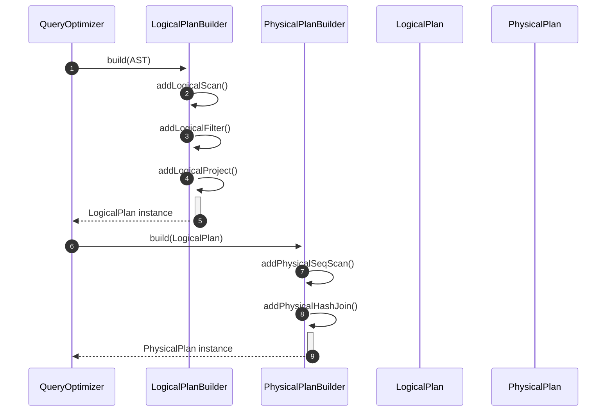
```mermaid
sequenceDiagram
    autonumber
    participant Optimizer as QueryOptimizer
    participant LPB as LogicalPlanBuilder
    participant PPB as PhysicalPlanBuilder
    participant LP as LogicalPlan
    participant PP as PhysicalPlan

    Optimizer->>+LPB: build(AST)
    LPB->>+LPB: addLogicalScan()
    LPB->>+LPB: addLogicalFilter()
    LPB->>+LPB: addLogicalProject()
    LPB-->>-Optimizer: LogicalPlan instance

    Optimizer->>+PPB: build(LogicalPlan)
    PPB->>+PPB: addPhysicalSeqScan()
    PPB->>+PPB: addPhysicalHashJoin()
    PPB-->>-Optimizer: PhysicalPlan instance
```

---

##### 4.1.2. Factory Method Pattern
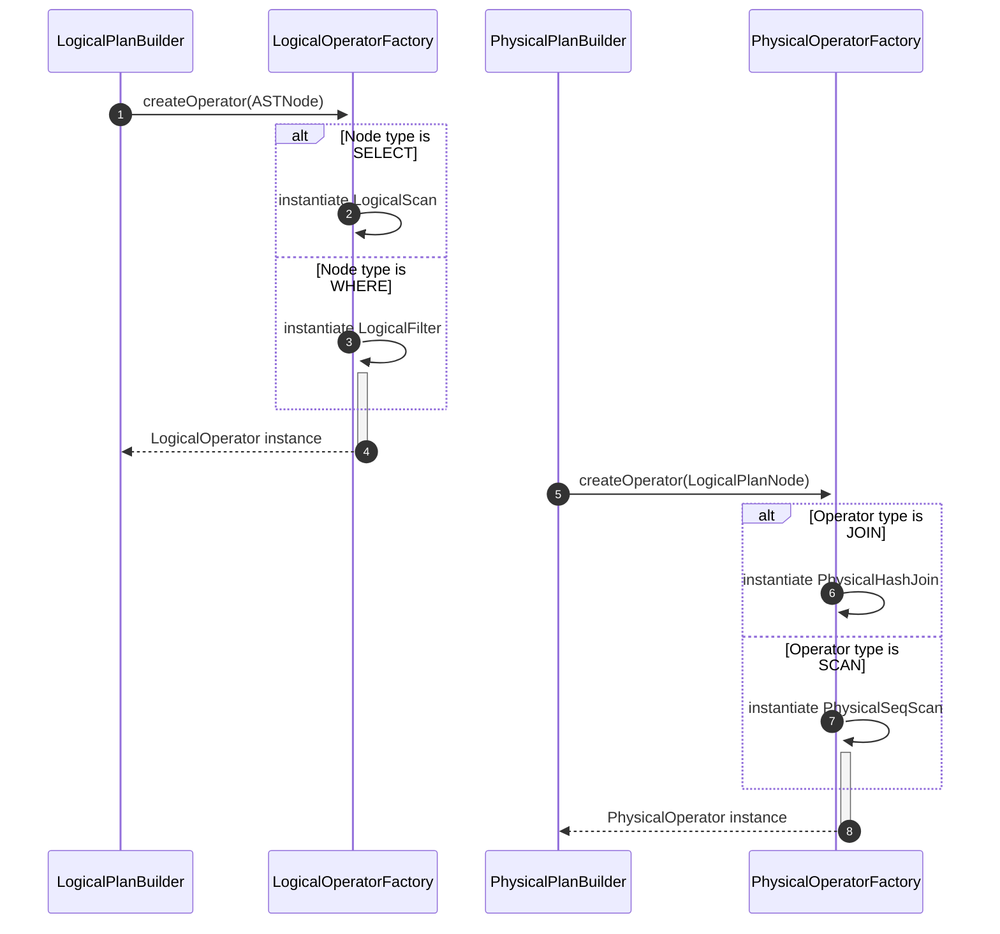
```mermaid
sequenceDiagram
    autonumber
    participant LPB as LogicalPlanBuilder
    participant LOF as LogicalOperatorFactory
    participant PPB as PhysicalPlanBuilder
    participant POF as PhysicalOperatorFactory

    LPB->>+LOF: createOperator(ASTNode)
    alt Node type is SELECT
        LOF->>+LOF: instantiate LogicalScan
    else Node type is WHERE
        LOF->>+LOF: instantiate LogicalFilter
    end
    LOF-->>-LPB: LogicalOperator instance

    PPB->>+POF: createOperator(LogicalPlanNode)
    alt Operator type is JOIN
        POF->>+POF: instantiate PhysicalHashJoin
    else Operator type is SCAN
        POF->>+POF: instantiate PhysicalSeqScan
    end
    POF-->>-PPB: PhysicalOperator instance
```

---

#### Structural Patterns

##### 4.1.3. Facade Pattern
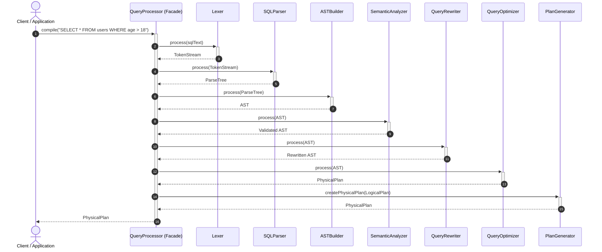
```mermaid
sequenceDiagram
    autonumber
    actor Client as Client / Application
    participant QP as QueryProcessor (Facade)
    participant Lexer as Lexer
    participant Parser as SQLParser
    participant ASTB as ASTBuilder
    participant SA as SemanticAnalyzer
    participant QR as QueryRewriter
    participant Optimizer as QueryOptimizer
    participant PG as PlanGenerator

    Client->>+QP: compile("SELECT * FROM users WHERE age > 18")
    QP->>+Lexer: process(sqlText)
    Lexer-->>-QP: TokenStream
    QP->>+Parser: process(TokenStream)
    Parser-->>-QP: ParseTree
    QP->>+ASTB: process(ParseTree)
    ASTB-->>-QP: AST
    QP->>+SA: process(AST)
    SA-->>-QP: Validated AST
    QP->>+QR: process(AST)
    QR-->>-QP: Rewritten AST
    QP->>+Optimizer: process(AST)
    Optimizer-->>-QP: PhysicalPlan
    QP->>+PG: createPhysicalPlan(LogicalPlan)
    PG-->>-QP: PhysicalPlan
    QP-->>-Client: PhysicalPlan
```

---

##### 4.1.4. Composite Pattern
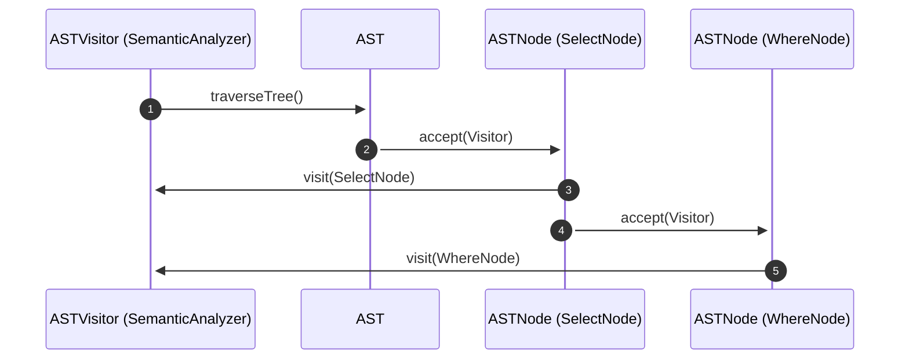
```mermaid
sequenceDiagram
    autonumber
    participant Visitor as ASTVisitor (SemanticAnalyzer)
    participant Tree as AST
    participant RootNode as ASTNode (SelectNode)
    participant ChildNode as ASTNode (WhereNode)

    Visitor->>+Tree: traverseTree()
    Tree->>+RootNode: accept(Visitor)
    RootNode->>+Visitor: visit(SelectNode)
    RootNode->>+ChildNode: accept(Visitor)
    ChildNode->>+Visitor: visit(WhereNode)
```

---

#### Behavioral Patterns

##### 4.1.5. Chain of Responsibility Pattern
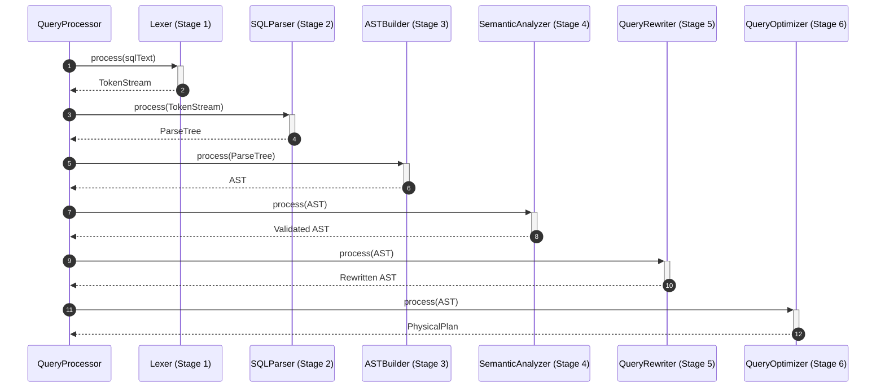
```mermaid
sequenceDiagram
    autonumber
    participant QP as QueryProcessor
    participant Lexer as Lexer (Stage 1)
    participant Parser as SQLParser (Stage 2)
    participant ASTB as ASTBuilder (Stage 3)
    participant SA as SemanticAnalyzer (Stage 4)
    participant QR as QueryRewriter (Stage 5)
    participant Optimizer as QueryOptimizer (Stage 6)

    QP->>+Lexer: process(sqlText)
    Lexer-->>-QP: TokenStream
    QP->>+Parser: process(TokenStream)
    Parser-->>-QP: ParseTree
    QP->>+ASTB: process(ParseTree)
    ASTB-->>-QP: AST
    QP->>+SA: process(AST)
    SA-->>-QP: Validated AST
    QP->>+QR: process(AST)
    QR-->>-QP: Rewritten AST
    QP->>+Optimizer: process(AST)
    Optimizer-->>-QP: PhysicalPlan
```

---

##### 4.1.6. Visitor Pattern
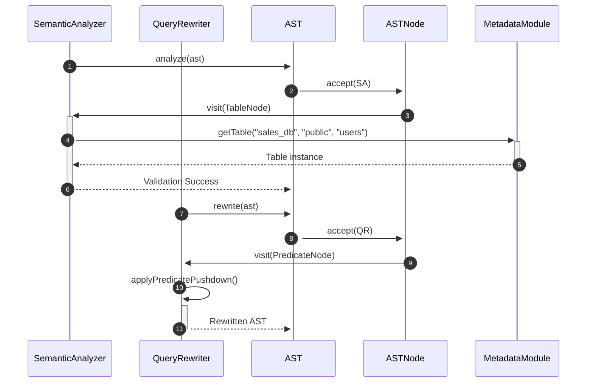
```mermaid
sequenceDiagram
    autonumber
    participant SA as SemanticAnalyzer
    participant QR as QueryRewriter
    participant AST as AST
    participant Node as ASTNode
    participant Meta as MetadataModule

    SA->>+AST: analyze(ast)
    AST->>+Node: accept(SA)
    Node->>+SA: visit(TableNode)
    SA->>+Meta: getTable("sales_db", "public", "users")
    Meta-->>-SA: Table instance
    SA-->>-AST: Validation Success

    QR->>+AST: rewrite(ast)
    AST->>+Node: accept(QR)
    Node->>+QR: visit(PredicateNode)
    QR->>+QR: applyPredicatePushdown()
    QR-->>-AST: Rewritten AST
```

---

##### 4.1.7. Strategy Pattern
```mermaid
sequenceDiagram
    autonumber
    participant QP as QueryProcessor
    participant Optimizer as QueryOptimizer
    participant Rule as OptimizationRule (PredicatePushdown)
    participant Cost as CostEstimator
    participant Meta as MetadataModule

    QP->>+Optimizer: process(AST)
    Optimizer->>+Optimizer: setOptimizationRule(PredicatePushdownOptimizer)
    Optimizer->>+Rule: optimize(LogicalPlan)
    Rule->>+Meta: estimateSelectivity()
    Meta-->>-Rule: Selectivity metrics
    Rule-->>-Optimizer: Optimized LogicalPlan
    Optimizer->>+Cost: estimate(LogicalPlan)
    Cost-->>-Optimizer: Estimated CPU & I/O Cost
```

---

### 4.2. Sequence Diagrams by Core Feature

#### 4.2.1. Feature: Compile SQL Statement
```mermaid
sequenceDiagram
    autonumber
    actor Client as Client / Application
    participant QP as QueryProcessor
    participant Lexer as Lexer
    participant Parser as SQLParser
    participant ASTB as ASTBuilder
    participant SA as SemanticAnalyzer
    participant QR as QueryRewriter
    participant Optimizer as QueryOptimizer
    participant PG as PlanGenerator

    Client->>+QP: compile(sqlText)
    QP->>+Lexer: tokenize(sqlText)
    Lexer-->>-QP: TokenStream
    QP->>+Parser: parse(TokenStream)
    Parser-->>-QP: ParseTree
    QP->>+ASTB: build(ParseTree)
    ASTB-->>-QP: AST
    QP->>+SA: analyze(AST)
    SA-->>-QP: Validated AST
    QP->>+QR: rewrite(AST)
    QR-->>-QP: Rewritten AST
    QP->>+Optimizer: optimize(AST)
    Optimizer-->>-QP: LogicalPlan
    QP->>+PG: build(LogicalPlan)
    PG-->>-QP: PhysicalPlan
    QP-->>-Client: PhysicalPlan
```

---

#### 4.2.2. Feature: Resolve Table Reference
```mermaid
sequenceDiagram
    autonumber
    participant SA as SemanticAnalyzer
    participant Resolver as TableResolver
    participant Meta as MetadataModule
    participant Catalog as CatalogManager
    participant DB as Database
    participant Schema as Schema
    participant Table as Table

    SA->>+Resolver: resolveTable(tableName)
    Resolver->>+Meta: getTable("sales_db", "public", tableName)
    Meta->>+Catalog: getDatabase("sales_db")
    Catalog->>+DB: getSchema("public")
    DB->>+Schema: getTable(tableName)
    Schema-->>-Resolver: Table instance
    Resolver-->>-SA: Table Metadata Success
```

---

#### 4.2.3. Feature: Rewrite Query
```mermaid
sequenceDiagram
    autonumber
    participant SA as SemanticAnalyzer
    participant QR as QueryRewriter
    participant AST as AST
    participant Node as ASTNode

    SA->>+QR: rewrite(AST)
    QR->>+AST: accept(QR)
    AST->>+Node: visit(ASTNode)
    QR->>+QR: applyPredicatePushdown()
    QR->>+QR: applyConstantFolding()
    QR-->>-SA: Rewritten AST
```

---

#### 4.2.4. Feature: Optimize Query
```mermaid
sequenceDiagram
    autonumber
    participant QP as QueryProcessor
    participant Optimizer as QueryOptimizer
    participant Rule as OptimizationRule
    participant Cost as CostEstimator
    participant Stats as StatisticsManager

    QP->>+Optimizer: optimize(LogicalPlan)
    Optimizer->>+Rule: optimize(LogicalPlan)
    Rule-->>-Optimizer: Optimized LogicalPlan
    Optimizer->>+Cost: estimate(LogicalPlan)
    Cost->>+Stats: estimateCardinality()
    Stats-->>-Cost: Cardinality & Selectivity Metrics
    Cost-->>-Optimizer: Cost Metrics
```

---

#### 4.2.5. Feature: Build Logical Plan
```mermaid
sequenceDiagram
    autonumber
    participant Optimizer as QueryOptimizer
    participant Builder as LogicalPlanBuilder
    participant Factory as LogicalOperatorFactory
    participant LP as LogicalPlan

    Optimizer->>+Builder: build(AST)
    Builder->>+Factory: createOperator(ASTNode)
    Factory-->>-Builder: LogicalOperator
    Builder->>+Builder: assembleLogicalTree()
    Builder-->>-Optimizer: LogicalPlan instance
```

---

#### 4.2.6. Feature: Build Physical Plan
```mermaid
sequenceDiagram
    autonumber
    participant Optimizer as QueryOptimizer
    participant Builder as PhysicalPlanBuilder
    participant Factory as PhysicalOperatorFactory
    participant PP as PhysicalPlan

    Optimizer->>+Builder: build(LogicalPlan)
    Builder->>+Factory: createOperator(LogicalPlanNode)
    Factory-->>-Builder: PhysicalOperator
    Builder->>+Builder: assembleOperatorTree()
    Builder-->>-Optimizer: PhysicalPlan instance
```
