# Database Management System - Design Patterns & Sequence Diagrams

Tài liệu này tổng hợp toàn bộ các **Design Pattern** được áp dụng trong hệ thống DBMS (bao gồm phân hệ **Metadata** và phân hệ **Query Processor**), chứa **Bảng tổng hợp ma trận kèm Khung mã Java (Class/Interface & Method signature)** cho từng Pattern và các **Sơ đồ Sequence Diagram** mô tả chi tiết luồng tương tác giữa các đối tượng. Tất cả mã ví dụ đều tương đồng 100% với cấu trúc mã nguồn trong thư mục `DBMS/src/main/java`.

---

# PHẦN I: METADATA MODULE

## 1. Implemented Design Patterns Matrix (Dạng Bảng & Khung Mã Java)

### 1.1. Bảng Tổng Quan Design Patterns

| # | Design Pattern | Class / Interface | Method | Công dụng (Purpose) |
|:---:|:---|:---|:---|:---|
| 1 | **Singleton** | `CatalogManager`<br>`MetadataModule` | `getInstance()` | Đảm bảo duy nhất 1 Quản lý Catalog và 1 điểm truy cập Facade chính cho toàn bộ hệ thống DBMS trong RAM. |
| 2 | **Facade** | `MetadataModule` | `getTable(...)`<br>`executeDDL(...)` | Cung cấp giao diện API cấp cao đơn giản hóa việc tương tác phức tạp giữa CatalogManager, Database, Schema và Table. |
| 3 | **Composite** | `MetadataElement` (Interface)<br>`CatalogManager`, `Database`, `Schema`, `Table`, `Column` | `getElementName()` | Xây dựng cấu trúc cây phân cấp quản lý đồng nhất cho các thành phần Metadata trong hệ thống. |
| 4 | **State** | `Database`<br>`DatabaseStatus` | `setStatus(...)`<br>`createSchema(...)` | Quản lý và chặn thao tác thay đổi cấu trúc khi Database ở trạng thái `OFFLINE` hoặc `READ_ONLY`. |
| 5 | **Factory Method** | `Schema`<br>`ConstraintFactory` | `createTable(...)`<br>`createConstraint(...)` | Đóng gói logic khởi tạo các đối tượng con (`Table`, `Constraint`) một cách linh hoạt. |
| 6 | **Command** | `DDLCommand` (Interface)<br>`CreateTableCommand`, `CreateSchemaCommand`, v.v. | `execute()`<br>`undo()` | Đóng gói các thao tác DDL thành các đối tượng lệnh có khả năng Thực thi (`execute`) và Hoàn tác (`undo` / Rollback). |
| 7 | **Prototype** | `Table`<br>`Column` | `clone()` | Nhân bản nhanh cấu trúc bảng hoặc cột hiện tại thành đối tượng độc lập mà không cần khởi tạo lại từ đầu. |
| 8 | **Memento** | `TableMemento`<br>`Table` | `createMemento()`<br>`restore(...)` | Chụp ảnh trạng thái (Snapshot) danh sách các cột của Table và hỗ trợ khôi phục về trạng thái trước đó. |
| 9 | **Observer** | `MetadataChangeListener` (Interface)<br>`Table`<br>`TableEventPublisher` | `registerListener(...)`<br>`notifyListeners(...)`<br>`onMetadataChanged(...)` | `Table` phát thông báo sự kiện thay đổi cấu trúc cho các Observer lắng nghe tự động cập nhật. |
| 10 | **Builder** | `ColumnBuilder` | `setType(...)`<br>`setNullable(...)`<br>`setDefaultValue(...)`<br>`build()` | Khởi tạo đối tượng `Column` có nhiều tham số tùy chọn bằng giao diện Fluent API. |
| 11 | **Template Method** | `Constraint` (Abstract Class) | `validate()` | Định nghĩa thuật toán khung kiểm tra trạng thái `enabled` trước khi tiến hành thẩm định chi tiết. |
| 12 | **Chain of Responsibility** | `ConstraintValidationChain` | `addConstraint(...)`<br>`validateAll()` | Quản lý chuỗi thẩm định ràng buộc dữ liệu nối tiếp (Fail-Fast: PK ➔ FK ➔ Check). |
| 13 | **Strategy** | `IndexRebuildStrategy` (Interface)<br>`Index` | `setRebuildStrategy(...)`<br>`rebuild()` | Cho phép gán và thực thi linh hoạt chiến lược rebuild thuật toán cho đối tượng `Index`. |

---

### 1.2. Chi Tiết Từng Pattern & Khung Mã Java Code (Class/Interface & Method Signature)

#### 1. Singleton Pattern
* **Class / Interface**: `CatalogManager`, `MetadataModule`
* **Method**: `getInstance()`
* **Công dụng**: Đảm bảo duy nhất 1 Quản lý Catalog và 1 điểm truy cập Facade chính cho toàn bộ hệ thống DBMS trong RAM.

**Khung Mã Java:**
```java
package metadata.domain;

public class CatalogManager implements MetadataElement {
    private static volatile CatalogManager instance;

    private CatalogManager() { }

    // Pattern: Singleton (Double-Checked Locking)
    public static CatalogManager getInstance() {
        // ...
        return instance;
    }
}
```

---

#### 2. Facade Pattern
* **Class / Interface**: `MetadataModule`
* **Method**: `getTable(databaseName, schemaName, tableName)`, `executeDDL(command)`
* **Công dụng**: Cung cấp giao diện API cấp cao đơn giản hóa việc tương tác phức tạp giữa CatalogManager, Database, Schema và Table.

**Khung Mã Java:**
```java
package metadata.facade;

public class MetadataModule {
    private CatalogManager catalogManager;

    // Pattern: Facade
    public Table getTable(String databaseName, String schemaName, String tableName) {
        // ...
        return null;
    }

    // Pattern: Facade
    public void executeDDL(DDLCommand command) {
        // ...
    }
}
```

---

#### 3. Composite Pattern
* **Class / Interface**: `MetadataElement` (Interface), `CatalogManager`, `Database`, `Schema`, `Table`, `Column`
* **Method**: `getElementName()`
* **Công dụng**: Xây dựng cấu trúc cây phân cấp quản lý đồng nhất cho các thành phần Metadata trong hệ thống.

**Khung Mã Java:**
```java
package metadata.interfaces;

public interface MetadataElement {
    String getElementName();
}

package metadata.domain;

public class Table implements MetadataElement, Cloneable {
    @Override
    public String getElementName() {
        // ...
        return null;
    }
}

public class Column implements MetadataElement, Cloneable {
    @Override
    public String getElementName() {
        // ...
        return null;
    }
}
```

---

#### 4. State Pattern
* **Class / Interface**: `Database`, `DatabaseStatus`
* **Method**: `setStatus(status)`, `createSchema(schemaName)`
* **Công dụng**: Quản lý và chặn thao tác thay đổi cấu trúc khi Database ở trạng thái `OFFLINE` hoặc `READ_ONLY`.

**Khung Mã Java:**
```java
package metadata.enums;

public enum DatabaseStatus {
    ONLINE, OFFLINE, READ_ONLY
}

package metadata.domain;

public class Database implements MetadataElement {
    private DatabaseStatus status;

    public Schema createSchema(String schemaName) {
        // ...
        return null;
    }

    public void setStatus(DatabaseStatus status) {
        // ...
    }
}
```

---

#### 5. Factory Method Pattern
* **Class / Interface**: `Schema`, `ConstraintFactory`
* **Method**: `createTable(tableName)`, `createConstraint(type, name, args)`
* **Công dụng**: Đóng gói logic khởi tạo các đối tượng con (`Table`, `Constraint`) một cách linh hoạt.

**Khung Mã Java:**
```java
package metadata.domain;

public class Schema implements MetadataElement {
    // Pattern: Factory Method
    public Table createTable(String tableName) {
        // ...
        return null;
    }
}

package metadata.constraints;

public class ConstraintFactory {
    // Pattern: Factory Method
    public static Constraint createConstraint(String type, String name, Object... args) {
        // ...
        return null;
    }
}
```

---

#### 6. Command Pattern
* **Class / Interface**: `DDLCommand` (Interface), `CreateTableCommand`, `DropTableCommand`, `CreateSchemaCommand`, v.v.
* **Method**: `execute()`, `undo()`
* **Công dụng**: Đóng gói các thao tác DDL thành các đối tượng lệnh có khả năng Thực thi (`execute`) và Hoàn tác (`undo` / Rollback).

**Khung Mã Java:**
```java
package metadata.commands;

public interface DDLCommand {
    void execute();
    void undo();
}

public class CreateTableCommand implements DDLCommand {
    @Override
    public void execute() {
        // ...
    }

    @Override
    public void undo() {
        // ...
    }
}
```

---

#### 7. Prototype Pattern
* **Class / Interface**: `Table`, `Column`
* **Method**: `clone()`
* **Công dụng**: Nhân bản nhanh cấu trúc bảng hoặc cột hiện tại thành đối tượng độc lập mà không cần khởi tạo lại từ đầu.

**Khung Mã Java:**
```java
package metadata.domain;

public class Table implements MetadataElement, Cloneable {
    // Pattern: Prototype
    @Override
    public Table clone() {
        // ...
        return null;
    }
}

public class Column implements MetadataElement, Cloneable {
    // Pattern: Prototype
    @Override
    public Column clone() {
        // ...
        return null;
    }
}
```

---

#### 8. Memento Pattern
* **Class / Interface**: `TableMemento`, `Table`
* **Method**: `createMemento()`, `restore(memento)`
* **Công dụng**: Chụp ảnh trạng thái (Snapshot) danh sách các cột của Table và hỗ trợ khôi phục về trạng thái trước đó.

**Khung Mã Java:**
```java
package metadata.domain;

public class TableMemento {
    public String getTableName() { return null; }
    public List<Column> getColumnsSnapshot() { return null; }
}

public class Table implements MetadataElement, Cloneable {
    public TableMemento createMemento() {
        // ...
        return null;
    }

    public void restore(TableMemento memento) {
        // ...
    }
}
```

---

#### 9. Observer Pattern
* **Class / Interface**: `MetadataChangeListener` (Interface), `Table`, `TableEventPublisher`
* **Method**: `registerListener(...)`, `notifyListeners(...)`, `onMetadataChanged(...)`
* **Công dụng**: `Table` phát thông báo sự kiện thay đổi cấu trúc cho các Observer lắng nghe tự động cập nhật.

**Khung Mã Java:**
```java
package metadata.interfaces;

public interface MetadataChangeListener {
    void onMetadataChanged(String eventType, String targetName);
}

package metadata.events;

public class TableEventPublisher {
    public void registerListener(MetadataChangeListener listener) { }
    public void notifyListeners(String eventType, String targetName) { }
}

package metadata.domain;

public class Table implements MetadataElement, Cloneable {
    public void addColumn(Column column) {
        // ...
    }
}
```

---

#### 10. Builder Pattern
* **Class / Interface**: `ColumnBuilder`
* **Method**: `setType(...)`, `setNullable(...)`, `setDefaultValue(...)`, `build()`
* **Công dụng**: Khởi tạo đối tượng `Column` có nhiều tham số tùy chọn bằng giao diện Fluent API.

**Khung Mã Java:**
```java
package metadata.builders;

public class ColumnBuilder {
    public ColumnBuilder(String columnName) { }
    public ColumnBuilder setType(DataType dataType) { return this; }
    public ColumnBuilder setNullable(boolean nullable) { return this; }
    public ColumnBuilder setDefaultValue(String defaultValue) { return this; }
    public Column build() { return null; }
}
```

---

#### 11. Template Method Pattern
* **Class / Interface**: `Constraint` (Abstract Class)
* **Method**: `validate()`, `preValidate()`, `doValidate()`, `postValidate()`
* **Công dụng**: Định nghĩa thuật toán khung kiểm tra trạng thái `enabled` trước khi tiến hành thẩm định chi tiết.

**Khung Mã Java:**
```java
package metadata.abstracts;

public abstract class Constraint {
    // Pattern: Template Method
    public boolean validate() {
        // ...
        return false;
    }
    protected boolean preValidate() { return true; }
    protected boolean doValidate() { return true; }
    protected void postValidate(boolean validationResult) { }
}
```

---

#### 12. Chain of Responsibility Pattern
* **Class / Interface**: `ConstraintValidationChain`
* **Method**: `addConstraint(...)`, `validateAll()`
* **Công dụng**: Quản lý chuỗi thẩm định ràng buộc dữ liệu nối tiếp (Fail-Fast: PK ➔ FK ➔ Check).

**Khung Mã Java:**
```java
package metadata.constraints;

public class ConstraintValidationChain {
    public void addConstraint(Constraint constraint) { }
    public boolean validateAll() {
        // ...
        return true;
    }
}
```

---

#### 13. Strategy Pattern
* **Class / Interface**: `IndexRebuildStrategy` (Interface), `Index`
* **Method**: `setRebuildStrategy(...)`, `rebuild()`
* **Công dụng**: Cho phép gán và thực thi linh hoạt chiến lược rebuild thuật toán cho đối tượng `Index`.

**Khung Mã Java:**
```java
package metadata.interfaces;

public interface IndexRebuildStrategy {
    void rebuildIndex(Index index);
}

package metadata.domain;

public class Index {
    public void setRebuildStrategy(IndexRebuildStrategy strategy) { }
    public void rebuild() {
        // ...
    }
}
```

---

## 2. Sequence Diagrams for Key Design Patterns in Metadata Module

---

### 2.1. CatalogManager & MetadataModule Level (Root Catalog Level)

#### 2.1.1. Singleton Pattern
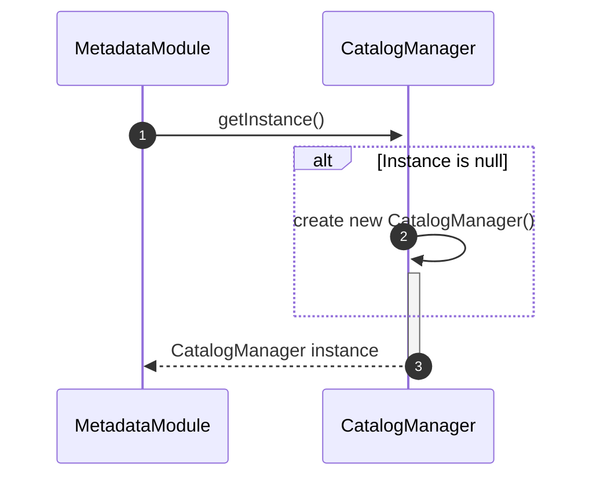
```mermaid
sequenceDiagram
    autonumber
    participant Module as MetadataModule
    participant CM as CatalogManager
    
    Module->>+CM: getInstance()
    alt Instance is null
        CM->>+CM: create new CatalogManager()
    end
    CM-->>-Module: CatalogManager instance
```

---

#### 2.1.2. Facade Pattern
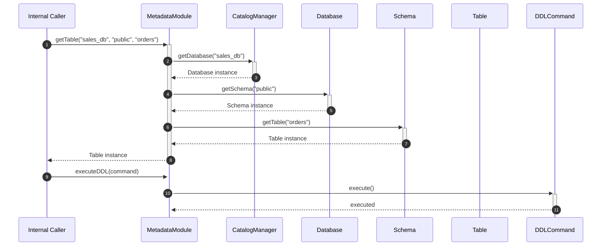
```mermaid
sequenceDiagram
    autonumber
    participant Caller as Internal Caller
    participant Facade as MetadataModule
    participant CM as CatalogManager
    participant DB as Database
    participant Schema as Schema
    participant Table as Table
    participant Cmd as DDLCommand

    Caller->>+Facade: getTable("sales_db", "public", "orders")
    Facade->>+CM: getDatabase("sales_db")
    CM-->>-Facade: Database instance
    Facade->>+DB: getSchema("public")
    DB-->>-Facade: Schema instance
    Facade->>+Schema: getTable("orders")
    Schema-->>-Facade: Table instance
    Facade-->>-Caller: Table instance

    Caller->>+Facade: executeDDL(command)
    Facade->>+Cmd: execute()
    Cmd-->>-Facade: executed
```

---

#### 2.1.3. Composite Pattern
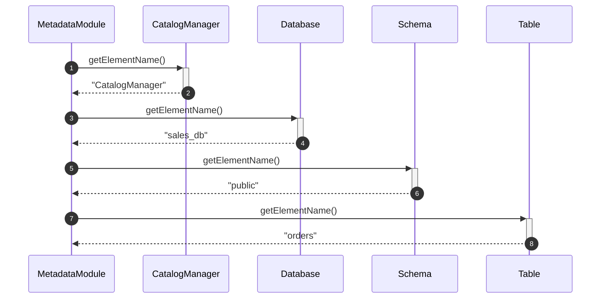
```mermaid
sequenceDiagram
    autonumber
    participant Module as MetadataModule
    participant CM as CatalogManager
    participant DB as Database
    participant Schema as Schema
    participant Table as Table

    Module->>+CM: getElementName()
    CM-->>-Module: "CatalogManager"
    Module->>+DB: getElementName()
    DB-->>-Module: "sales_db"
    Module->>+Schema: getElementName()
    Schema-->>-Module: "public"
    Module->>+Table: getElementName()
    Table-->>-Module: "orders"
```

---

### 2.2. Database Level

#### 2.2.1. State Pattern
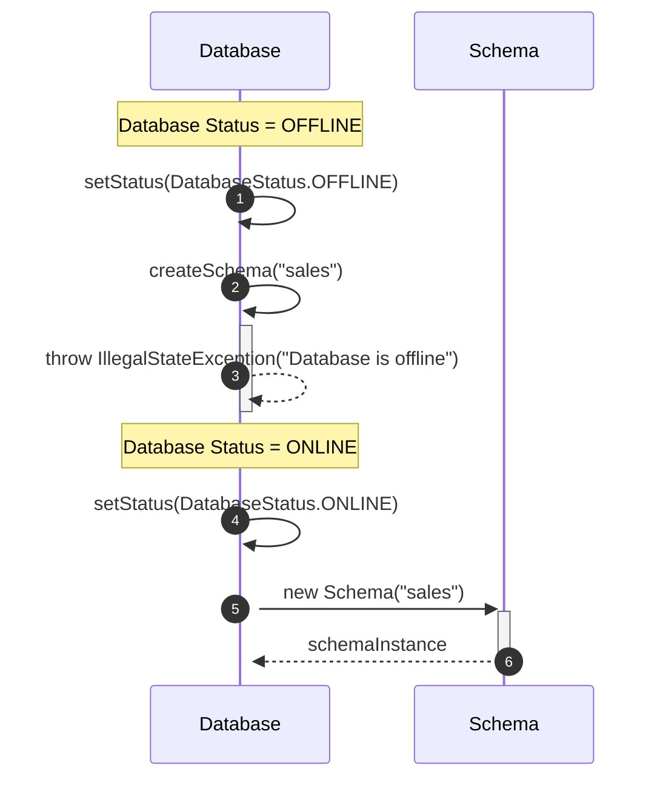
```mermaid
sequenceDiagram
    autonumber
    participant DB as Database
    participant Schema as Schema

    note over DB: Database Status = OFFLINE
    DB->>+DB: setStatus(DatabaseStatus.OFFLINE)
    DB->>+DB: createSchema("sales")
    DB-->>-DB: throw IllegalStateException("Database is offline")

    note over DB: Database Status = ONLINE
    DB->>+DB: setStatus(DatabaseStatus.ONLINE)
    DB->>+Schema: new Schema("sales")
    Schema-->>-DB: schemaInstance
```

---

### 2.3. Schema Level

#### 2.3.1. Factory Method Pattern
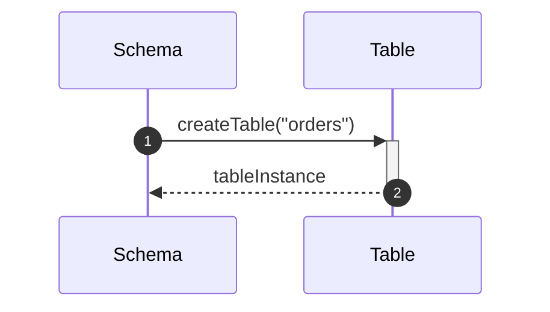
```mermaid
sequenceDiagram
    autonumber
    participant Schema as Schema
    participant Table as Table

    Schema->>+Table: createTable("orders")
    Table-->>-Schema: tableInstance
```

---

#### 2.3.2. Command Pattern
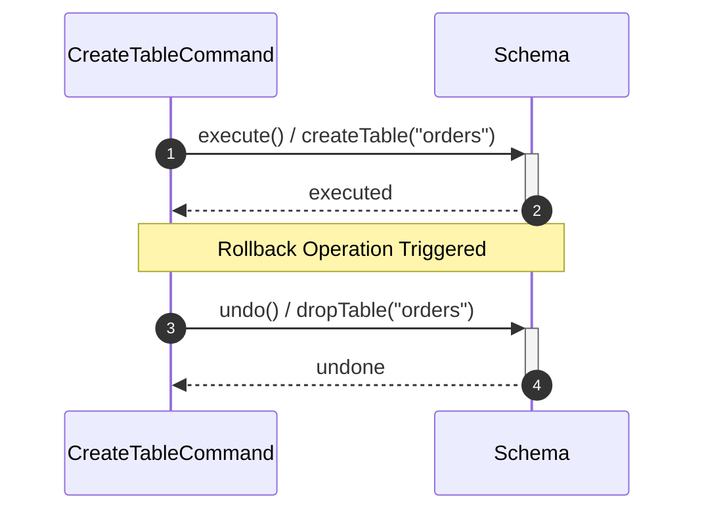
```mermaid
sequenceDiagram
    autonumber
    participant Cmd as CreateTableCommand
    participant Schema as Schema

    Cmd->>+Schema: execute() / createTable("orders")
    Schema-->>-Cmd: executed

    note over Cmd, Schema: Rollback Operation Triggered
    Cmd->>+Schema: undo() / dropTable("orders")
    Schema-->>-Cmd: undone
```

---

### 2.4. Table Level

#### 2.4.1. Prototype Pattern
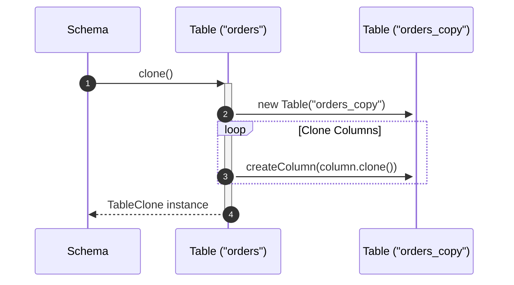
```mermaid
sequenceDiagram
    autonumber
    participant Schema as Schema
    participant TableOrig as Table ("orders")
    participant TableClone as Table ("orders_copy")

    Schema->>+TableOrig: clone()
    TableOrig->>+TableClone: new Table("orders_copy")
    loop Clone Columns
        TableOrig->>+TableClone: createColumn(column.clone())
    end
    TableOrig-->>-Schema: TableClone instance
```

---

#### 2.4.2. Memento Pattern
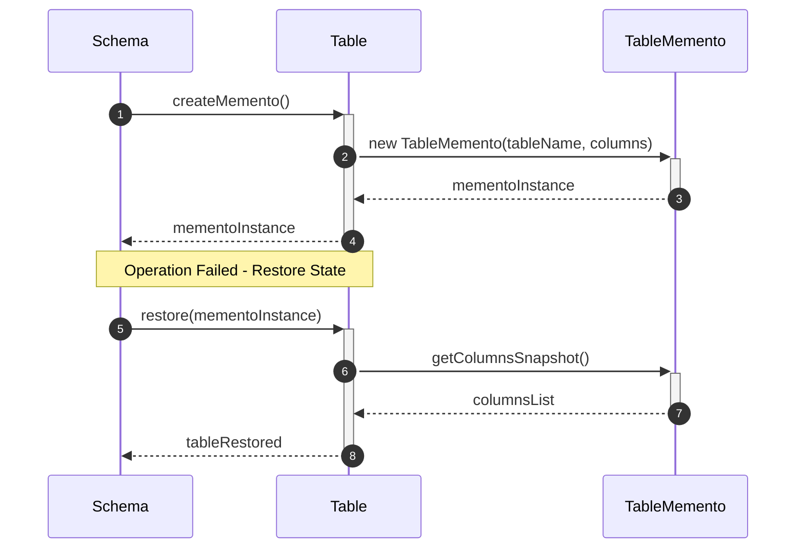
```mermaid
sequenceDiagram
    autonumber
    participant Schema as Schema
    participant Table as Table
    participant Memento as TableMemento

    Schema->>+Table: createMemento()
    Table->>+Memento: new TableMemento(tableName, columns)
    Memento-->>-Table: mementoInstance
    Table-->>-Schema: mementoInstance

    note over Schema, Table: Operation Failed - Restore State
    Schema->>+Table: restore(mementoInstance)
    Table->>+Memento: getColumnsSnapshot()
    Memento-->>-Table: columnsList
    Table-->>-Schema: tableRestored
```

---

#### 2.4.3. Observer Pattern (Subject)
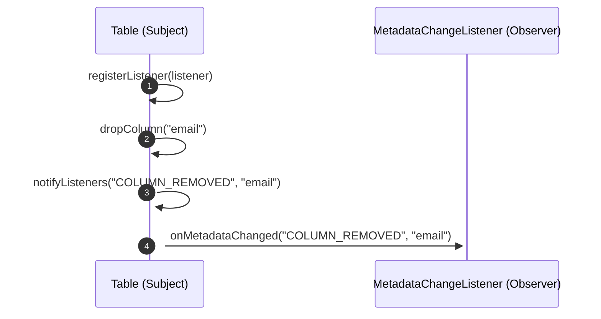
```mermaid
sequenceDiagram
    autonumber
    participant Table as Table (Subject)
    participant Listener as MetadataChangeListener (Observer)

    Table->>+Table: registerListener(listener)
    Table->>+Table: dropColumn("email")
    Table->>+Table: notifyListeners("COLUMN_REMOVED", "email")
    Table->>+Listener: onMetadataChanged("COLUMN_REMOVED", "email")
```

---

### 2.5. Column Level

#### 2.5.1. Builder Pattern
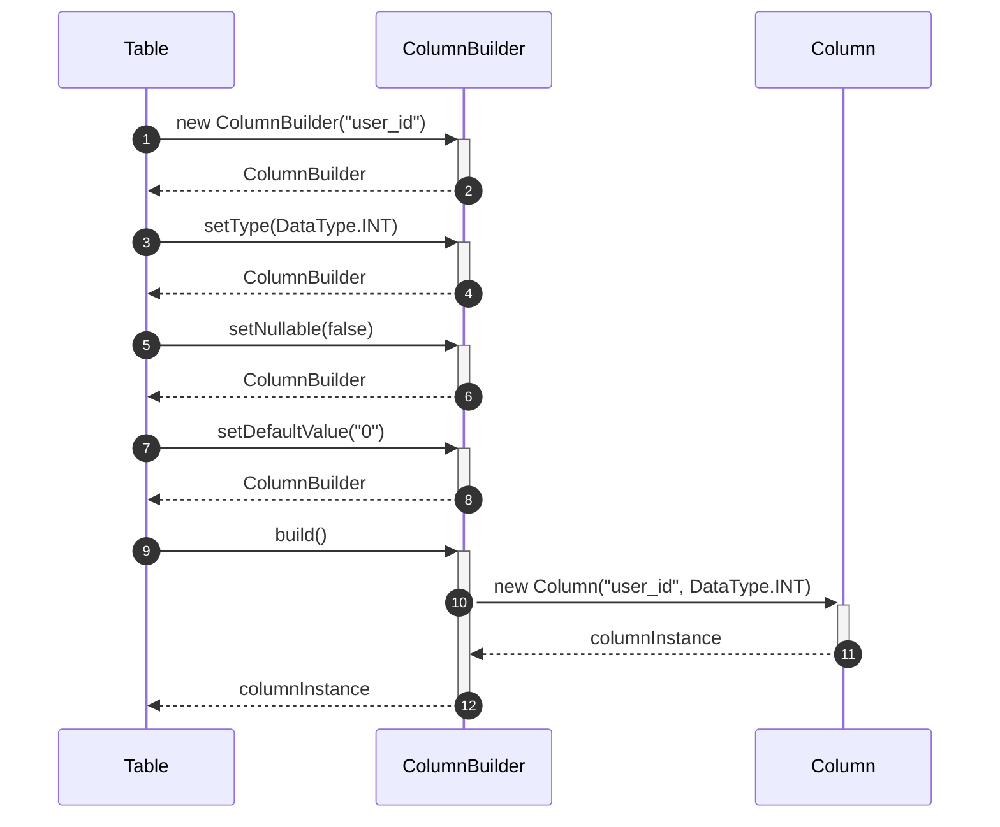
```mermaid
sequenceDiagram
    autonumber
    participant Table as Table
    participant CB as ColumnBuilder
    participant Col as Column

    Table->>+CB: new ColumnBuilder("user_id")
    CB-->>-Table: ColumnBuilder
    Table->>+CB: setType(DataType.INT)
    CB-->>-Table: ColumnBuilder
    Table->>+CB: setNullable(false)
    CB-->>-Table: ColumnBuilder
    Table->>+CB: setDefaultValue("0")
    CB-->>-Table: ColumnBuilder
    Table->>+CB: build()
    CB->>+Col: new Column("user_id", DataType.INT)
    Col-->>-CB: columnInstance
    CB-->>-Table: columnInstance
```

---

### 2.6. Constraint Level

#### 2.6.1. Factory Method Pattern (Constraint)
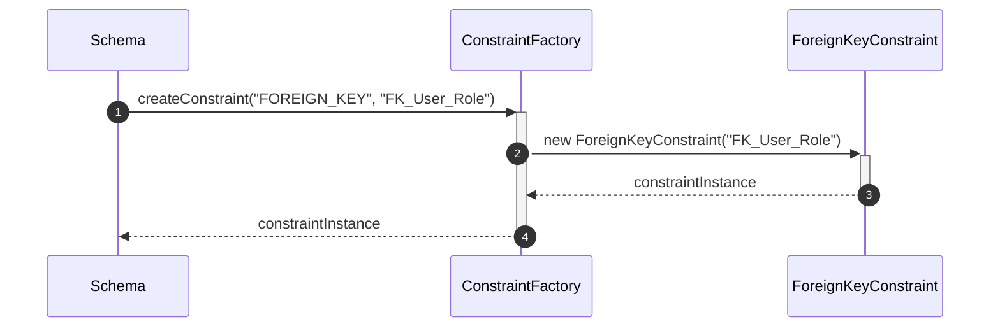
```mermaid
sequenceDiagram
    autonumber
    participant Schema as Schema
    participant CF as ConstraintFactory
    participant FK as ForeignKeyConstraint

    Schema->>+CF: createConstraint("FOREIGN_KEY", "FK_User_Role")
    CF->>+FK: new ForeignKeyConstraint("FK_User_Role")
    FK-->>-CF: constraintInstance
    CF-->>-Schema: constraintInstance
```

---

#### 2.6.2. Template Method Pattern
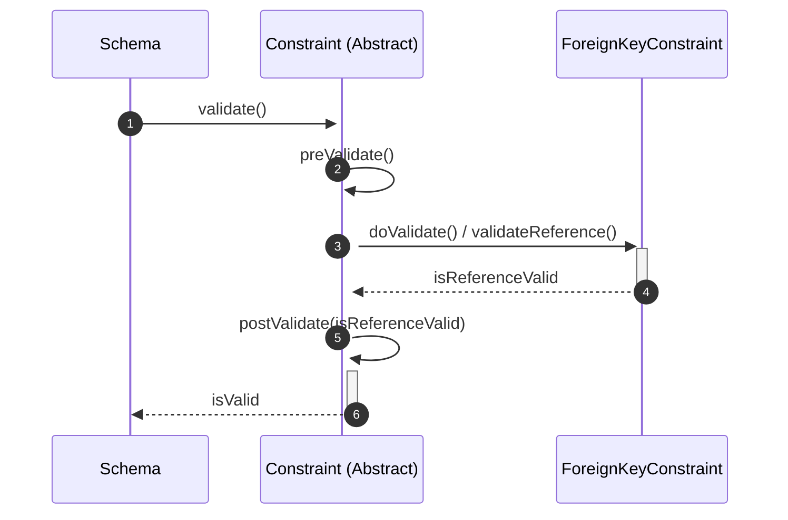
```mermaid
sequenceDiagram
    autonumber
    participant Schema as Schema
    participant Base as Constraint (Abstract)
    participant Sub as ForeignKeyConstraint

    Schema->>+Base: validate()
    Base->>+Base: preValidate()
    Base->>+Sub: doValidate() / validateReference()
    Sub-->>-Base: isReferenceValid
    Base->>+Base: postValidate(isReferenceValid)
    Base-->>-Schema: isValid
```

---

#### 2.6.3. Chain of Responsibility Pattern
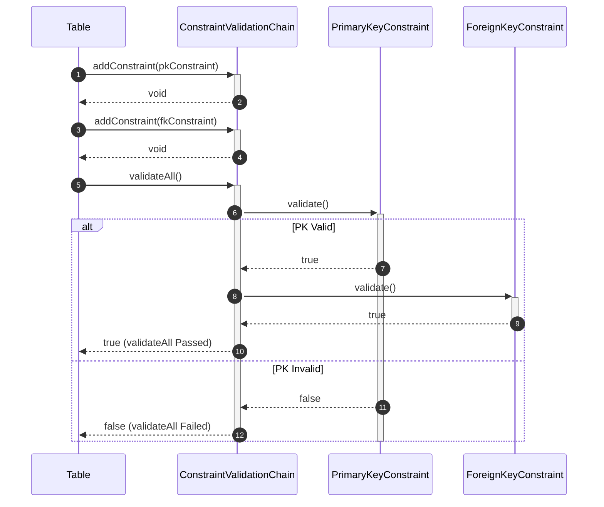
```mermaid
sequenceDiagram
    autonumber
    participant Table as Table
    participant Chain as ConstraintValidationChain
    participant PK as PrimaryKeyConstraint
    participant FK as ForeignKeyConstraint

    Table->>+Chain: addConstraint(pkConstraint)
    Chain-->>-Table: void
    Table->>+Chain: addConstraint(fkConstraint)
    Chain-->>-Table: void
    Table->>+Chain: validateAll()
    Chain->>+PK: validate()
    alt PK Valid
        PK-->>Chain: true
        Chain->>+FK: validate()
        FK-->>-Chain: true
        Chain-->>Table: true (validateAll Passed)
    else PK Invalid
        PK-->>Chain: false
        Chain-->>Table: false (validateAll Failed)
    end
    deactivate PK
    deactivate Chain
```


---

### 2.7. Index Level

#### 2.7.1. Strategy Pattern
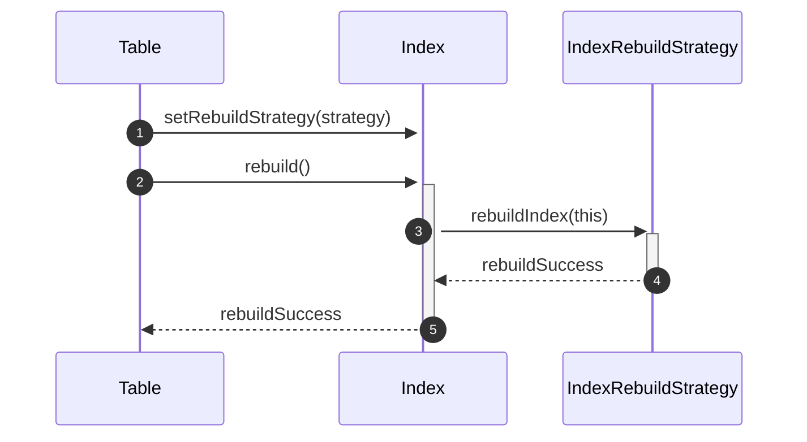
```mermaid
sequenceDiagram
    autonumber
    participant Table as Table
    participant Index as Index
    participant Strategy as IndexRebuildStrategy

    Table->>+Index: setRebuildStrategy(strategy)
    Table->>+Index: rebuild()
    Index->>+Strategy: rebuildIndex(this)
    Strategy-->>-Index: rebuildSuccess
    Index-->>-Table: rebuildSuccess
```

---

# PHẦN II: QUERY PROCESSOR MODULE

## 3. Implemented Design Patterns Matrix (Dạng Bảng & Khung Mã Java)

### 3.1. Bảng Tổng Quan Design Patterns

| # | Design Pattern | Class / Interface | Method | Công dụng (Purpose) |
|:---:|:---|:---|:---|:---|
| 1 | **Facade** | `QueryProcessor` | `compile(sqlText)` | Cung cấp giao diện tập trung duy nhất cho toàn bộ chuỗi biên dịch và tối ưu hóa câu lệnh SQL (Lexer ➔ Parser ➔ AST ➔ Semantic ➔ Optimizer ➔ PlanGenerator). |
| 2 | **Chain of Responsibility** | `CompilerStage` (Interface)<br>`Lexer`<br>`SQLParser`<br>`ASTBuilder`<br>`SemanticAnalyzer`<br>`QueryRewriter`<br>`QueryOptimizer` | `process(...)` | Nối chuỗi các công đoạn xử lý SQL tuần tự độc lập (Tokenize ➔ Parse Tree ➔ AST ➔ Semantic Check ➔ Query Rewrite ➔ Optimization). |
| 3 | **Composite** | `AST`<br>`ASTNode` (Composite Node) | `accept(visitor)` | Biểu diễn cấu trúc phân cấp cây cú pháp trừu tượng AST đồng nhất. |
| 4 | **Visitor** | `ASTVisitor` (Interface)<br>`SemanticAnalyzer`<br>`QueryRewriter` | `visit(node)`<br>`analyze(ast)`<br>`rewrite(ast)` | Thao tác duyệt cây AST để kiểm tra ngữ nghĩa và tối ưu hóa logic mà không làm thay đổi cấu trúc nút cây `ASTNode`. |
| 5 | **Strategy** | `QueryOptimizer` (Strategy Context)<br>`OptimizationRule` (Interface)<br>`CostEstimator`<br>`PredicatePushdownOptimizer`<br>`ProjectionPushdownOptimizer`<br>`ConstantFoldingOptimizer` | `optimize(plan)`<br>`setOptimizationRule(rule)`<br>`estimate(plan)` | Đóng gói linh hoạt các thuật toán tối ưu hóa dựa trên chi phí (CBO) và các quy tắc biến đổi kế hoạch truy vấn độc lập. |
| 6 | **Builder** | `LogicalPlanBuilder`<br>`PhysicalPlanBuilder` | `build(ast)`<br>`build(logicalPlan)` | Xây dựng từng bước cây kế hoạch logic (`LogicalPlan`) và kế hoạch vật lý (`PhysicalPlan`) từ cây AST và kế hoạch tối ưu. |
| 7 | **Factory Method** | `LogicalOperatorFactory`<br>`PhysicalOperatorFactory` | `createOperator(...)` | Đóng gói logic khởi tạo các đối tượng toán tử logic/vật lý chuyên biệt (`Operator Nodes`). |

---

### 3.2. Subsystem Class Breakdown (Phân Hệ Chi Tiết)

#### Semantic Analysis & Name Resolution
| # | Pattern / Role | Class / Interface | Method | Công dụng (Purpose) |
|:---:|:---|:---|:---|:---|
| 1 | **Visitor** | `SemanticAnalyzer` | `analyze(ast)`, `visit(node)` | Điều phối quy trình duyệt cây AST thẩm định ngữ nghĩa toàn diện. |
| 2 | **Visitor Interface** | `ASTVisitor` | `visit(node)` | Định nghĩa giao diện duyệt chuẩn cho tất cả các nút cây AST. |
| 3 | **SRP Helper** | `NameResolver` | `resolve(ast)` | Phân giải các đối tượng định danh trong SQL (Database, Schema, Table, Column, Alias). |
| 4 | **SRP Helper** | `TableResolver` | `resolveTable(node)` | Kiểm tra sự tồn tại của bảng dữ liệu trong Catalog Metadata. |
| 5 | **SRP Helper** | `ColumnResolver` | `resolveColumn(node)` | Phân giải thông tin cột và phát hiện xung đột/mơ hồ tên cột. |
| 6 | **SRP Helper** | `AliasResolver` | `resolveAlias(node)` | Phân giải và định danh các tên bí danh (Table Alias, Column Alias). |
| 7 | **SRP Helper** | `TypeChecker` | `validate(ast)` | Thẩm định tính hợp lệ và sự tương thích kiểu dữ liệu toàn hệ thống. |
| 8 | **SRP Helper** | `ExpressionTypeChecker` | `checkExpression(node)` | Kiểm tra kiểu dữ liệu trong các biểu thức đại số, so sánh và logic. |
| 9 | **SRP Helper** | `FunctionTypeChecker` | `checkFunction(node)` | Thẩm định tham số đầu vào và kiểu trả về của các hàm SQL. |
| 10 | **SRP Helper** | `AggregateValidator` | `validate(ast)` | Thẩm định tính hợp lệ của các hàm gom nhóm (SUM, COUNT, AVG, MIN, MAX). |
| 11 | **SRP Helper** | `GroupByValidator` | `validate(ast)` | Kiểm tra quy tắc ngữ nghĩa và điều kiện ràng buộc của mệnh đề `GROUP BY`. |
| 12 | **SRP Helper** | `OrderByValidator` | `validate(ast)` | Kiểm tra danh sách cột và biểu thức sắp xếp trong mệnh đề `ORDER BY`. |

---

#### Query Optimization Engine
| # | Pattern / Role | Class / Interface | Method | Công dụng (Purpose) |
|:---:|:---|:---|:---|:---|
| 1 | **Strategy Context** | `QueryOptimizer` | `optimize(plan)`, `setOptimizationRule(rule)` | Điều phối quy trình tối ưu hóa kế hoạch dựa trên chi phí CBO. |
| 2 | **Strategy Interface** | `OptimizationRule` | `optimize(plan)` | Định nghĩa giao diện chung cho các thuật toán và quy tắc tối ưu hóa. |
| 3 | **Strategy Impl** | `PredicatePushdownOptimizer` | `optimize(plan)` | Chiến lược đẩy điều kiện lọc xuống gần nguồn dữ liệu (Scan) để giảm dữ liệu trung gian. |
| 4 | **Strategy Impl** | `ProjectionPushdownOptimizer` | `optimize(plan)` | Chiến lược loại bỏ các cột không sử dụng ngay từ tầng truy xuất đầu tiên. |
| 5 | **Strategy Impl** | `ConstantFoldingOptimizer` | `optimize(plan)` | Chiến lược tính toán trước các biểu thức hằng số trong thời gian biên dịch. |
| 6 | **SRP Helper** | `QueryRewriter` | `rewrite(plan)` | Đóng gói quy trình biến đổi và viết lại truy vấn bảo toàn ngữ nghĩa SQL. |
| 7 | **SRP Helper** | `JoinOptimizer` | `optimize(plan)` | Quản lý và điều phối các thuật toán tối ưu hóa phép nối Join. |
| 8 | **SRP Helper** | `JoinOrderOptimizer` | `optimize(plan)` | Tính toán và lựa chọn thứ tự thực hiện phép nối Join tối ưu chi phí. |
| 9 | **SRP Helper** | `JoinMethodSelector` | `selectJoinMethod(plan)` | Lựa chọn thuật toán Join phù hợp (Nested Loop Join, Hash Join, Merge Join). |
| 10 | **Strategy / Cost** | `CostEstimator` | `estimate(plan)` | Đánh giá tổng chi phí tài nguyên (CPU & I/O) cho ứng viên kế hoạch thực thi. |
| 11 | **SRP Helper** | `CardinalityEstimator` | `estimate(plan)` | Ước lượng kích thước dữ liệu và số lượng dòng kết quả trung gian. |
| 12 | **SRP Helper** | `StatisticsManager` | `estimateCardinality()`, `estimateSelectivity()` | Tra cứu số liệu thống kê dữ liệu (Cardinality, Selectivity) từ Storage Engine. |
| 13 | **SRP Helper** | `PlanEnumerator` | `enumerate(plan)` | Duyệt và tìm kiếm không gian các ứng viên kế hoạch thực thi khả thi. |
| 14 | **SRP Helper** | `AccessPathSelector` | `select(plan)` | Lựa chọn đường dẫn truy xuất dữ liệu tối ưu (Table Scan, Index Scan, Index Only Scan). |

---

#### Plan Generation & Building
| # | Pattern / Role | Class / Interface | Method | Công dụng (Purpose) |
|:---:|:---|:---|:---|:---|
| 1 | **Pipeline Helper** | `PlanGenerator` | `createLogicalPlan(ast)`, `createPhysicalPlan(logicalPlan)` | Điều phối quy trình sinh kế hoạch logic và vật lý qua Builder & Factory. |
| 2 | **Builder** | `LogicalPlanBuilder` | `build(ast)` | Xây dựng từng bước cây kế hoạch logic từ cây cấu trúc AST. |
| 3 | **Builder** | `PhysicalPlanBuilder` | `build(logicalPlan)` | Chuyển đổi và xây dựng kế hoạch thực thi vật lý từ kế hoạch logic. |
| 4 | **Factory Method** | `LogicalOperatorFactory` | `createOperator(node)` | Khởi tạo các toán tử logic (LogicalScan, LogicalFilter, LogicalJoin, LogicalAggregate, LogicalSort). |
| 5 | **Factory Method** | `PhysicalOperatorFactory` | `createOperator(node)` | Khởi tạo các toán tử thực thi vật lý tương ứng chiến lược đã chọn. |
| 6 | **SRP Helper** | `PlanValidator` | `validate(logicalPlan)` | Thẩm định tính hợp lệ và toàn vẹn của kế hoạch trước khi chuyển giao thực thi. |
| 7 | **SRP Helper** | `PlanNormalizer` | `normalize(logicalPlan)` | Chuẩn hóa dạng cây kế hoạch về dạng chuẩn trước khi tạo kế hoạch vật lý. |

---

### 3.3. Chi Tiết Từng Pattern & Khung Mã Java Code (Class/Interface & Method Signature)

#### 1. Facade Pattern
* **Class / Interface**: `QueryProcessor`
* **Method**: `compile(sqlText)`
* **Công dụng**: Cung cấp giao diện tập trung duy nhất cho toàn bộ chuỗi biên dịch và tối ưu hóa câu lệnh SQL.

**Khung Mã Java:**
```java
package query_processor.facade;

public class QueryProcessor {
    public QueryProcessor(Lexer lexer,
                          SQLParser parser,
                          ASTBuilder astBuilder,
                          SemanticAnalyzer semanticAnalyzer,
                          QueryRewriter queryRewriter,
                          QueryOptimizer queryOptimizer,
                          PlanGenerator planGenerator) { }

    // Pattern: Facade
    public PhysicalPlan compile(String sqlText) {
        // ...
        return null;
    }
}
```

---

#### 2. Chain of Responsibility Pattern
* **Class / Interface**: `CompilerStage` (Interface), `AbstractCompilerStage`
* **Method**: `process(input)`, `setNextStage(nextStage)`
* **Công dụng**: Nối chuỗi các công đoạn xử lý SQL tuần tự độc lập (Tokenize ➔ Parse Tree ➔ AST ➔ Semantic Check ➔ Query Rewrite ➔ Optimization).

**Khung Mã Java:**
```java
package query_processor.interfaces;

public interface CompilerStage {
    Object process(Object input);
}

package query_processor.abstracts;

public abstract class AbstractCompilerStage implements CompilerStage {
    public void setNextStage(CompilerStage nextStage) { }
    protected Object delegateNext(Object input) {
        // ...
        return null;
    }
}
```

---

#### 3. Composite Pattern
* **Class / Interface**: `ASTNode` (Abstract Class), `SelectASTNode`
* **Method**: `accept(visitor)`
* **Công dụng**: Biểu diễn cấu trúc phân cấp cây cú pháp trừu tượng AST đồng nhất.

**Khung Mã Java:**
```java
package query_processor.abstracts;

public abstract class ASTNode {
    public abstract void accept(ASTVisitor visitor);
}

package query_processor.ast;

public class SelectASTNode extends ASTNode {
    @Override
    public void accept(ASTVisitor visitor) {
        // ...
    }
}
```

---

#### 4. Visitor Pattern
* **Class / Interface**: `ASTVisitor` (Interface), `SemanticAnalyzer`, `QueryRewriter`
* **Method**: `visit(node)`, `analyze(ast)`, `rewrite(ast)`
* **Công dụng**: Thao tác duyệt cây AST để kiểm tra ngữ nghĩa và tối ưu hóa logic mà không làm thay đổi cấu trúc nút cây `ASTNode`.

**Khung Mã Java:**
```java
package query_processor.interfaces;

public interface ASTVisitor {
    void visit(ASTNode node);
}

package query_processor.semantic;

public class SemanticAnalyzer implements ASTVisitor {
    public void analyze(AST ast) {
        // ...
    }

    @Override
    public void visit(ASTNode node) {
        // ...
    }
}
```

---

#### 5. Strategy Pattern
* **Class / Interface**: `QueryOptimizer` (Strategy Context), `OptimizationRule` (Interface), `PredicatePushdownOptimizer`
* **Method**: `optimize(plan)`, `setOptimizationRule(rule)`
* **Công dụng**: Đóng gói linh hoạt các thuật toán tối ưu hóa dựa trên chi phí (CBO) và các quy tắc biến đổi kế hoạch truy vấn độc lập.

**Khung Mã Java:**
```java
package query_processor.interfaces;

public interface OptimizationRule {
    LogicalPlan optimize(LogicalPlan plan);
}

package query_processor.optimizer;

public class PredicatePushdownOptimizer implements OptimizationRule {
    @Override
    public LogicalPlan optimize(LogicalPlan plan) {
        // ...
        return null;
    }
}

public class QueryOptimizer implements CompilerStage {
    public void setOptimizationRule(OptimizationRule rule) { }

    public PhysicalPlan process(AST ast) {
        // ...
        return null;
    }
}
```

---

#### 6. Builder Pattern
* **Class / Interface**: `LogicalPlanBuilder`, `PhysicalPlanBuilder`
* **Method**: `build(ast)`, `build(logicalPlan)`
* **Công dụng**: Xây dựng từng bước cây kế hoạch logic (`LogicalPlan`) và kế hoạch vật lý (`PhysicalPlan`) từ cây AST và kế hoạch tối ưu.

**Khung Mã Java:**
```java
package query_processor.planner;

public class LogicalPlanBuilder {
    // Pattern: Builder
    public LogicalPlan build(AST ast) {
        // ...
        return null;
    }
}

public class PhysicalPlanBuilder {
    // Pattern: Builder
    public PhysicalPlan build(LogicalPlan logicalPlan) {
        // ...
        return null;
    }
}
```

---

#### 7. Factory Method Pattern
* **Class / Interface**: `LogicalOperatorFactory`, `PhysicalOperatorFactory`
* **Method**: `createOperator(node)`
* **Công dụng**: Đóng gói logic khởi tạo các đối tượng toán tử logic/vật lý chuyên biệt.

**Khung Mã Java:**
```java
package query_processor.planner;

public class LogicalOperatorFactory {
    // Pattern: Factory Method
    public static LogicalPlanNode createOperator(ASTNode node) {
        // ...
        return null;
    }
}

public class PhysicalOperatorFactory {
    // Pattern: Factory Method
    public static PhysicalPlanNode createOperator(LogicalPlanNode logicalNode) {
        // ...
        return null;
    }
}
```

---

## 4. Sequence Diagrams for Key Design Patterns & Features in Query Processor Module

---

### 4.1. Sequence Diagrams by Design Pattern

#### 4.1.1. Facade Pattern
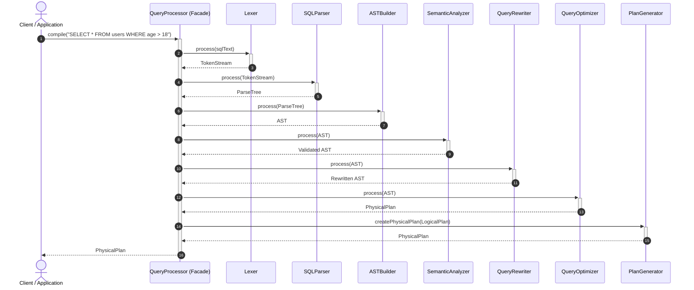
```mermaid
sequenceDiagram
    autonumber
    actor Client as Client / Application
    participant QP as QueryProcessor (Facade)
    participant Lexer as Lexer
    participant Parser as SQLParser
    participant ASTB as ASTBuilder
    participant SA as SemanticAnalyzer
    participant QR as QueryRewriter
    participant Optimizer as QueryOptimizer
    participant PG as PlanGenerator

    Client->>+QP: compile("SELECT * FROM users WHERE age > 18")
    QP->>+Lexer: process(sqlText)
    Lexer-->>-QP: TokenStream
    QP->>+Parser: process(TokenStream)
    Parser-->>-QP: ParseTree
    QP->>+ASTB: process(ParseTree)
    ASTB-->>-QP: AST
    QP->>+SA: process(AST)
    SA-->>-QP: Validated AST
    QP->>+QR: process(AST)
    QR-->>-QP: Rewritten AST
    QP->>+Optimizer: process(AST)
    Optimizer-->>-QP: PhysicalPlan
    QP->>+PG: createPhysicalPlan(LogicalPlan)
    PG-->>-QP: PhysicalPlan
    QP-->>-Client: PhysicalPlan
```

---

#### 4.1.2. Chain of Responsibility Pattern
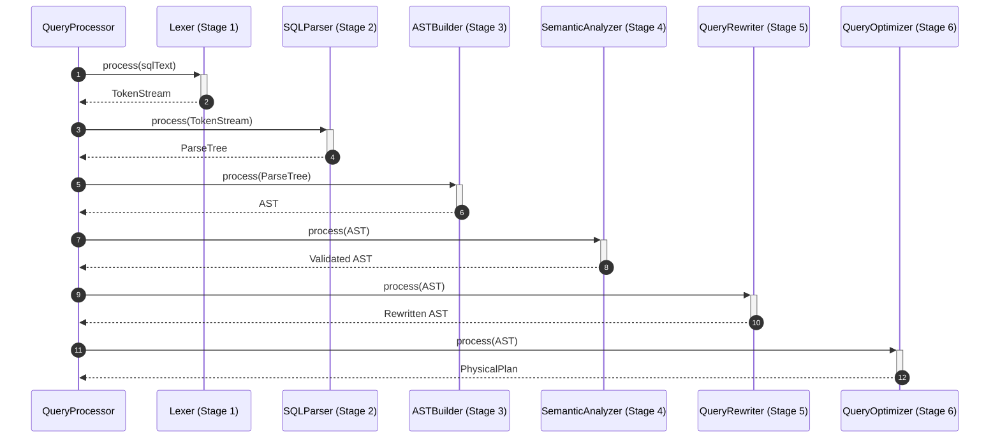
```mermaid
sequenceDiagram
    autonumber
    participant QP as QueryProcessor
    participant Lexer as Lexer (Stage 1)
    participant Parser as SQLParser (Stage 2)
    participant ASTB as ASTBuilder (Stage 3)
    participant SA as SemanticAnalyzer (Stage 4)
    participant QR as QueryRewriter (Stage 5)
    participant Optimizer as QueryOptimizer (Stage 6)

    QP->>+Lexer: process(sqlText)
    Lexer-->>-QP: TokenStream
    QP->>+Parser: process(TokenStream)
    Parser-->>-QP: ParseTree
    QP->>+ASTB: process(ParseTree)
    ASTB-->>-QP: AST
    QP->>+SA: process(AST)
    SA-->>-QP: Validated AST
    QP->>+QR: process(AST)
    QR-->>-QP: Rewritten AST
    QP->>+Optimizer: process(AST)
    Optimizer-->>-QP: PhysicalPlan
```

---

#### 4.1.3. Composite Pattern
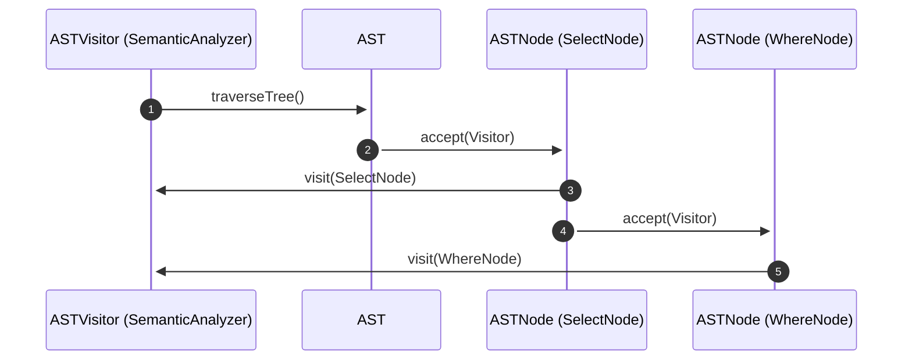
```mermaid
sequenceDiagram
    autonumber
    participant Visitor as ASTVisitor (SemanticAnalyzer)
    participant Tree as AST
    participant RootNode as ASTNode (SelectNode)
    participant ChildNode as ASTNode (WhereNode)

    Visitor->>+Tree: traverseTree()
    Tree->>+RootNode: accept(Visitor)
    RootNode->>+Visitor: visit(SelectNode)
    RootNode->>+ChildNode: accept(Visitor)
    ChildNode->>+Visitor: visit(WhereNode)
```

---

#### 4.1.4. Visitor Pattern
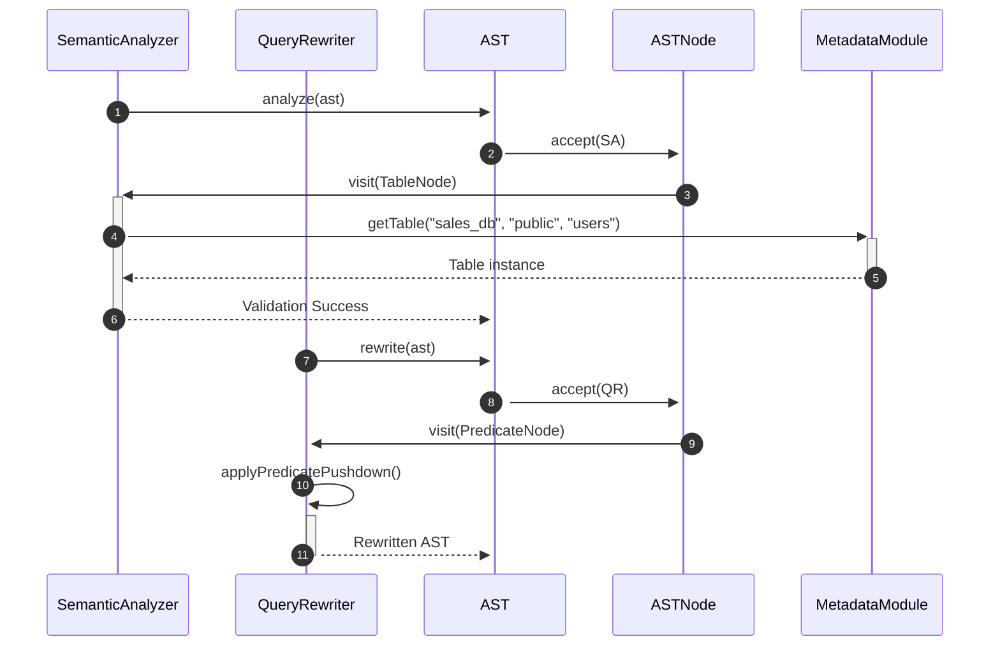
```mermaid
sequenceDiagram
    autonumber
    participant SA as SemanticAnalyzer
    participant QR as QueryRewriter
    participant AST as AST
    participant Node as ASTNode
    participant Meta as MetadataModule

    SA->>+AST: analyze(ast)
    AST->>+Node: accept(SA)
    Node->>+SA: visit(TableNode)
    SA->>+Meta: getTable("sales_db", "public", "users")
    Meta-->>-SA: Table instance
    SA-->>-AST: Validation Success

    QR->>+AST: rewrite(ast)
    AST->>+Node: accept(QR)
    Node->>+QR: visit(PredicateNode)
    QR->>+QR: applyPredicatePushdown()
    QR-->>-AST: Rewritten AST
```

---

#### 4.1.5. Strategy Pattern
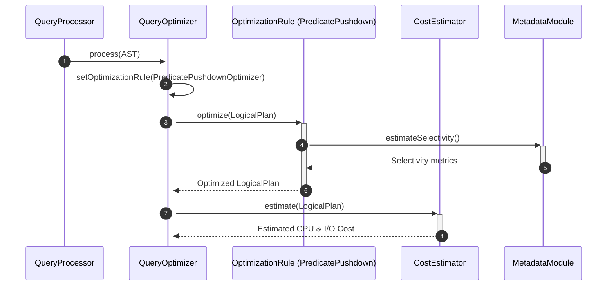
```mermaid
sequenceDiagram
    autonumber
    participant QP as QueryProcessor
    participant Optimizer as QueryOptimizer
    participant Rule as OptimizationRule (PredicatePushdown)
    participant Cost as CostEstimator
    participant Meta as MetadataModule

    QP->>+Optimizer: process(AST)
    Optimizer->>+Optimizer: setOptimizationRule(PredicatePushdownOptimizer)
    Optimizer->>+Rule: optimize(LogicalPlan)
    Rule->>+Meta: estimateSelectivity()
    Meta-->>-Rule: Selectivity metrics
    Rule-->>-Optimizer: Optimized LogicalPlan
    Optimizer->>+Cost: estimate(LogicalPlan)
    Cost-->>-Optimizer: Estimated CPU & I/O Cost
```

---

#### 4.1.6. Builder Pattern
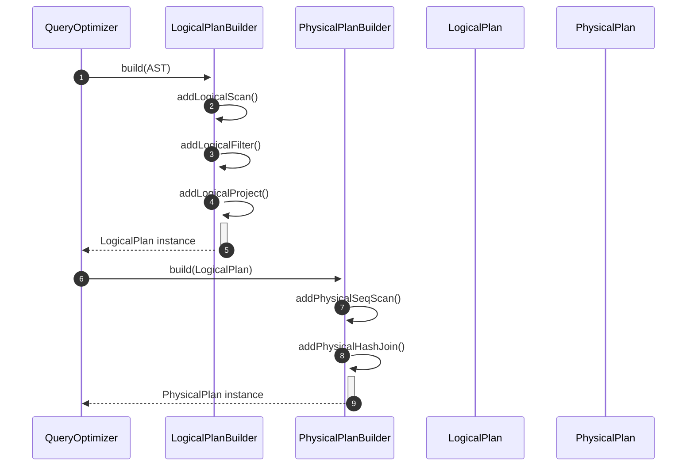
```mermaid
sequenceDiagram
    autonumber
    participant Optimizer as QueryOptimizer
    participant LPB as LogicalPlanBuilder
    participant PPB as PhysicalPlanBuilder
    participant LP as LogicalPlan
    participant PP as PhysicalPlan

    Optimizer->>+LPB: build(AST)
    LPB->>+LPB: addLogicalScan()
    LPB->>+LPB: addLogicalFilter()
    LPB->>+LPB: addLogicalProject()
    LPB-->>-Optimizer: LogicalPlan instance

    Optimizer->>+PPB: build(LogicalPlan)
    PPB->>+PPB: addPhysicalSeqScan()
    PPB->>+PPB: addPhysicalHashJoin()
    PPB-->>-Optimizer: PhysicalPlan instance
```

---

#### 4.1.7. Factory Method Pattern
```mermaid
sequenceDiagram
    autonumber
    participant LPB as LogicalPlanBuilder
    participant LOF as LogicalOperatorFactory
    participant PPB as PhysicalPlanBuilder
    participant POF as PhysicalOperatorFactory

    LPB->>+LOF: createOperator(ASTNode)
    alt Node type is SELECT
        LOF->>+LOF: instantiate LogicalScan
    else Node type is WHERE
        LOF->>+LOF: instantiate LogicalFilter
    end
    LOF-->>-LPB: LogicalOperator instance

    PPB->>+POF: createOperator(LogicalPlanNode)
    alt Operator type is JOIN
        POF->>+POF: instantiate PhysicalHashJoin
    else Operator type is SCAN
        POF->>+POF: instantiate PhysicalSeqScan
    end
    POF-->>-PPB: PhysicalOperator instance
```

---

### 4.2. Sequence Diagrams by Core Feature

#### 4.2.1. Feature: Compile SQL Statement
```mermaid
sequenceDiagram
    autonumber
    actor Client as Client / Application
    participant QP as QueryProcessor
    participant Lexer as Lexer
    participant Parser as SQLParser
    participant ASTB as ASTBuilder
    participant SA as SemanticAnalyzer
    participant QR as QueryRewriter
    participant Optimizer as QueryOptimizer
    participant PG as PlanGenerator

    Client->>+QP: compile(sqlText)
    QP->>+Lexer: tokenize(sqlText)
    Lexer-->>-QP: TokenStream
    QP->>+Parser: parse(TokenStream)
    Parser-->>-QP: ParseTree
    QP->>+ASTB: build(ParseTree)
    ASTB-->>-QP: AST
    QP->>+SA: analyze(AST)
    SA-->>-QP: Validated AST
    QP->>+QR: rewrite(AST)
    QR-->>-QP: Rewritten AST
    QP->>+Optimizer: optimize(AST)
    Optimizer-->>-QP: LogicalPlan
    QP->>+PG: build(LogicalPlan)
    PG-->>-QP: PhysicalPlan
    QP-->>-Client: PhysicalPlan
```

---

#### 4.2.2. Feature: Resolve Table Reference
```mermaid
sequenceDiagram
    autonumber
    participant SA as SemanticAnalyzer
    participant Resolver as TableResolver
    participant Meta as MetadataModule
    participant Catalog as CatalogManager
    participant DB as Database
    participant Schema as Schema
    participant Table as Table

    SA->>+Resolver: resolveTable(tableName)
    Resolver->>+Meta: getTable("sales_db", "public", tableName)
    Meta->>+Catalog: getDatabase("sales_db")
    Catalog->>+DB: getSchema("public")
    DB->>+Schema: getTable(tableName)
    Schema-->>-Resolver: Table instance
    Resolver-->>-SA: Table Metadata Success
```

---

#### 4.2.3. Feature: Rewrite Query
```mermaid
sequenceDiagram
    autonumber
    participant SA as SemanticAnalyzer
    participant QR as QueryRewriter
    participant AST as AST
    participant Node as ASTNode

    SA->>+QR: rewrite(AST)
    QR->>+AST: accept(QR)
    AST->>+Node: visit(ASTNode)
    QR->>+QR: applyPredicatePushdown()
    QR->>+QR: applyConstantFolding()
    QR-->>-SA: Rewritten AST
```

---

#### 4.2.4. Feature: Optimize Query
```mermaid
sequenceDiagram
    autonumber
    participant QP as QueryProcessor
    participant Optimizer as QueryOptimizer
    participant Rule as OptimizationRule
    participant Cost as CostEstimator
    participant Stats as StatisticsManager

    QP->>+Optimizer: optimize(LogicalPlan)
    Optimizer->>+Rule: optimize(LogicalPlan)
    Rule-->>-Optimizer: Optimized LogicalPlan
    Optimizer->>+Cost: estimate(LogicalPlan)
    Cost->>+Stats: estimateCardinality()
    Stats-->>-Cost: Cardinality & Selectivity Metrics
    Cost-->>-Optimizer: Cost Metrics
```

---

#### 4.2.5. Feature: Build Logical Plan
```mermaid
sequenceDiagram
    autonumber
    participant Optimizer as QueryOptimizer
    participant Builder as LogicalPlanBuilder
    participant Factory as LogicalOperatorFactory
    participant LP as LogicalPlan

    Optimizer->>+Builder: build(AST)
    Builder->>+Factory: createOperator(ASTNode)
    Factory-->>-Builder: LogicalOperator
    Builder->>+Builder: assembleLogicalTree()
    Builder-->>-Optimizer: LogicalPlan instance
```

---

#### 4.2.6. Feature: Build Physical Plan
```mermaid
sequenceDiagram
    autonumber
    participant Optimizer as QueryOptimizer
    participant Builder as PhysicalPlanBuilder
    participant Factory as PhysicalOperatorFactory
    participant PP as PhysicalPlan

    Optimizer->>+Builder: build(LogicalPlan)
    Builder->>+Factory: createOperator(LogicalPlanNode)
    Factory-->>-Builder: PhysicalOperator
    Builder->>+Builder: assembleOperatorTree()
    Builder-->>-Optimizer: PhysicalPlan instance
```
