# Sequence Diagrams for Execution Engine Module (By Pattern & By Feature)

Tài liệu thể hiện các sơ đồ trình tự (Sequence Diagrams) cho module **Execution Engine**, bao gồm 2 phần chính:
- **Phần I: Sơ Đồ Trình Tự Theo Design Pattern** (Theo thứ tự: Creational ➔ Structural ➔ Behavioral).
- **Phần II: Sơ Đồ Trình Tự Theo Feature Cốt Lõi** (Chuỗi tương tác tính năng thực tế).

---

# PHẦN I: SƠ ĐỒ TRÌNH TỰ THEO DESIGN PATTERN

## 1. Creational Patterns (Create)

### 1.1. Factory Method Pattern
* **Pattern**: Factory Method Pattern
* **Class/Interface Applied**: `OperatorFactory`
* **Method**: `createOperator(PhysicalPlanNode node)`

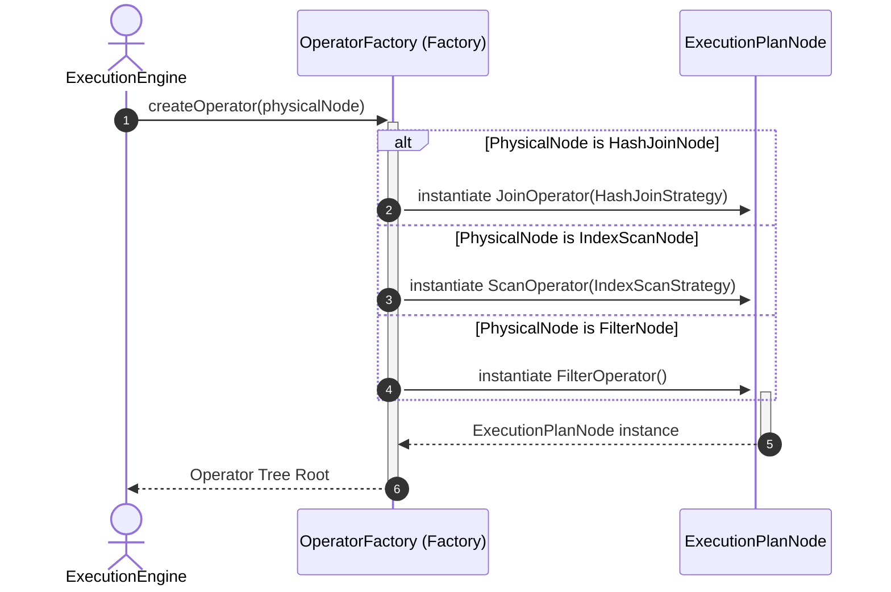

---

## 2. Structural Patterns (Structure)

### 2.1. Facade Pattern
* **Pattern**: Facade Pattern
* **Class/Interface Applied**: `ExecutionEngine`
* **Method**: `execute(PhysicalPlan physicalPlan)`

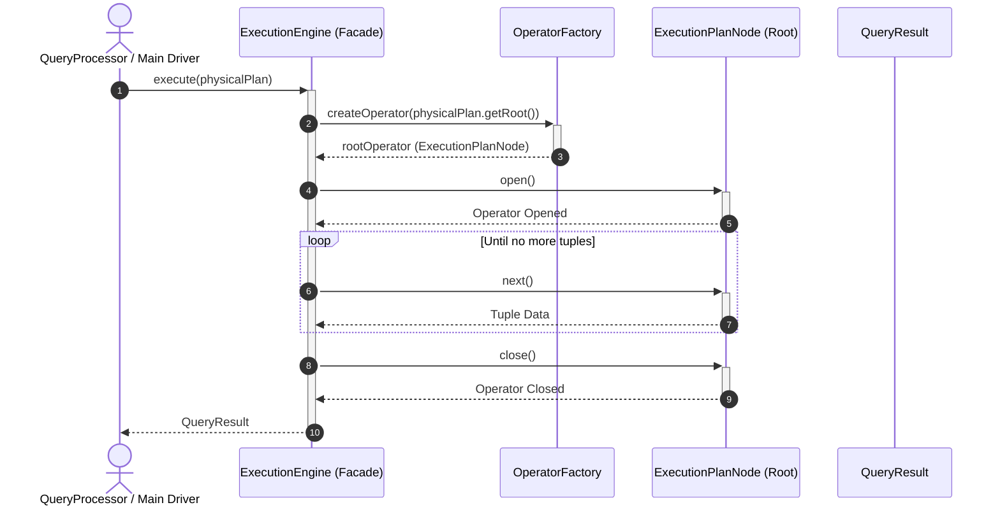

---

### 2.2. Composite Pattern
* **Pattern**: Composite Pattern
* **Class/Interface Applied**: `ExecutionPlanNode` (implemented by `ScanOperator`, `FilterOperator`, `JoinOperator`, etc.)
* **Method**: `open()`, `next()`, `close()`

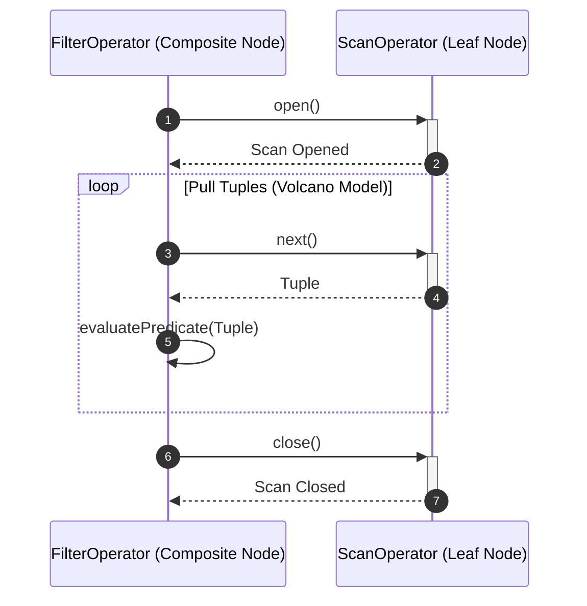

---

### 2.3. Decorator Pattern
* **Pattern**: Decorator Pattern
* **Class/Interface Applied**: `ExecutionOperatorDecorator` (implemented by `LoggingOperatorDecorator`, `ProfilingOperatorDecorator`)
* **Method**: `open()`, `next()`, `close()`

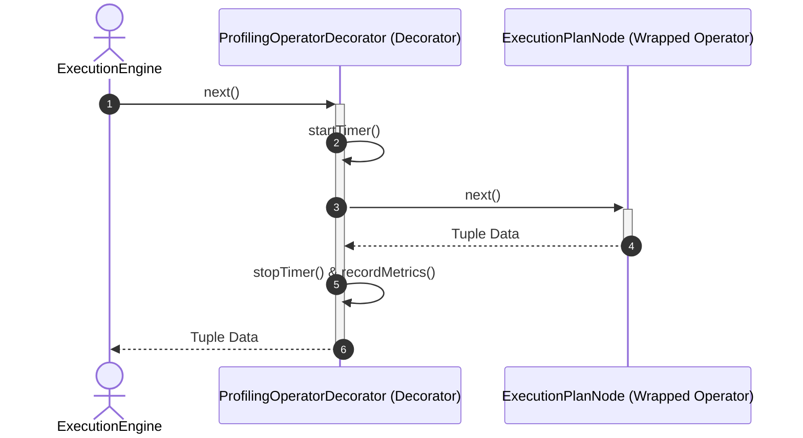

---

## 3. Behavioral Patterns (Behavior)

### 3.1. Strategy Pattern
* **Pattern**: Strategy Pattern
* **Class/Interface Applied**: `JoinStrategy` (`NestedLoopJoinStrategy`, `HashJoinStrategy`, `MergeJoinStrategy`), `ScanStrategy` (`SequentialScanStrategy`, `IndexScanStrategy`)
* **Method**: `execute()`, `scan()`

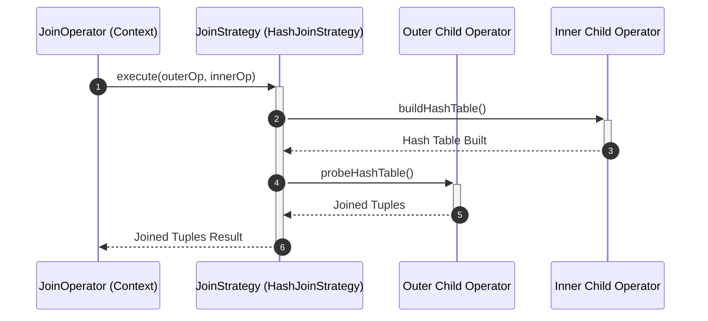

---

### 3.2. Iterator Pattern (Volcano Model)
* **Pattern**: Iterator Pattern
* **Class/Interface Applied**: `TupleIterator`
* **Method**: `hasNext()`, `next()`

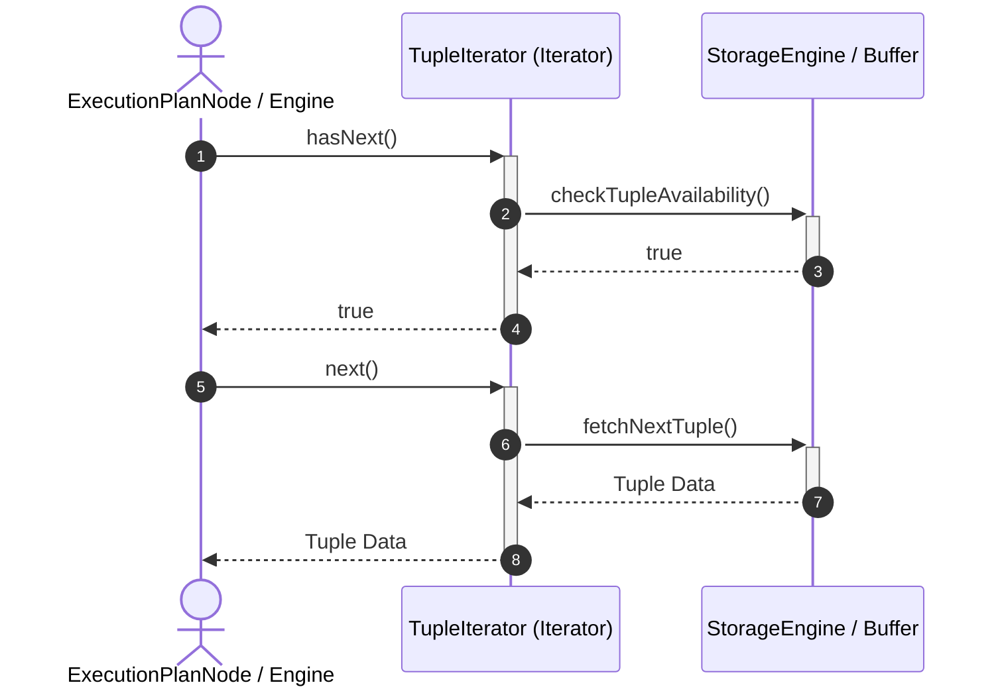

---

### 3.3. Template Method Pattern
* **Pattern**: Template Method Pattern
* **Class/Interface Applied**: `ScanOperator`
* **Method**: `open()`, `next()`, `close()`, `fetchTuple()`

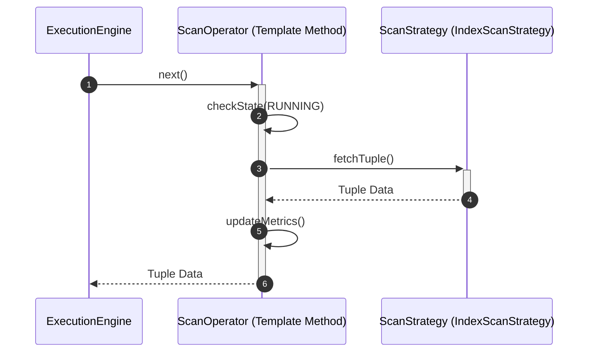

---

### 3.4. State Pattern
* **Pattern**: State Pattern
* **Class/Interface Applied**: `ExecutionState` (Enum: `CREATED`, `OPEN`, `RUNNING`, `FINISHED`, `CLOSED`)
* **Method**: `setState()`, `getState()`

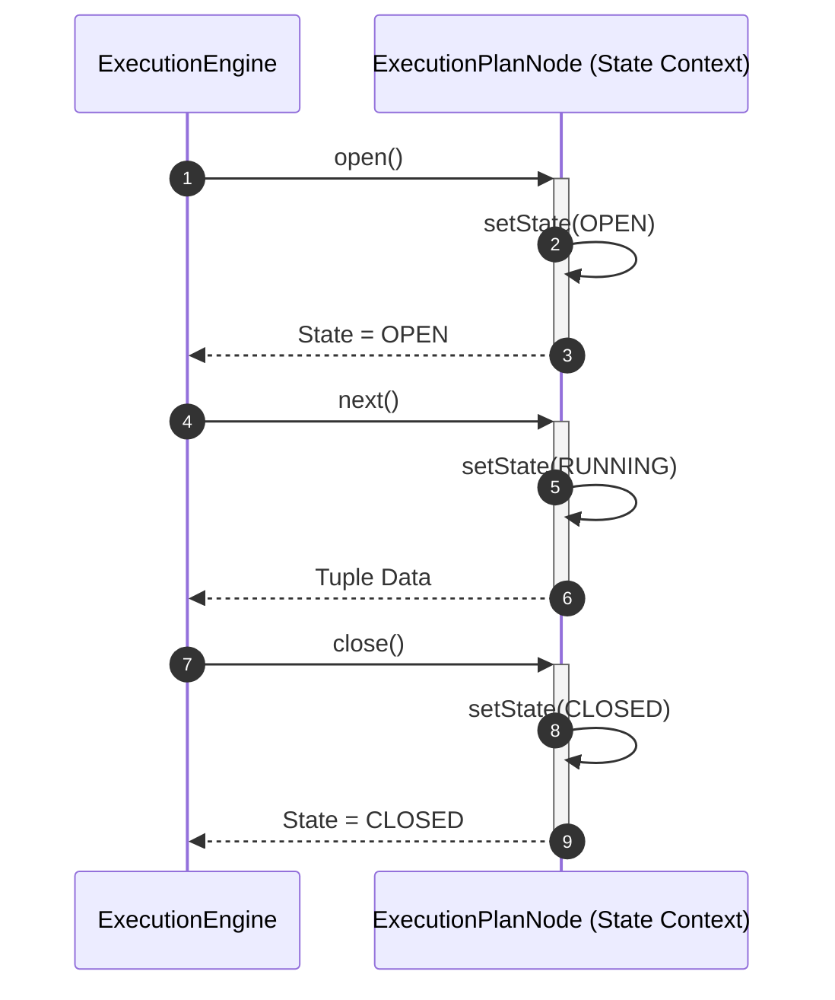

---

### 3.5. Observer Pattern
* **Pattern**: Observer Pattern
* **Class/Interface Applied**: `ExecutionListener` (implemented by `StatisticsCollector`)
* **Method**: `onExecutionStarted()`, `onTupleProcessed()`, `onExecutionFinished()`

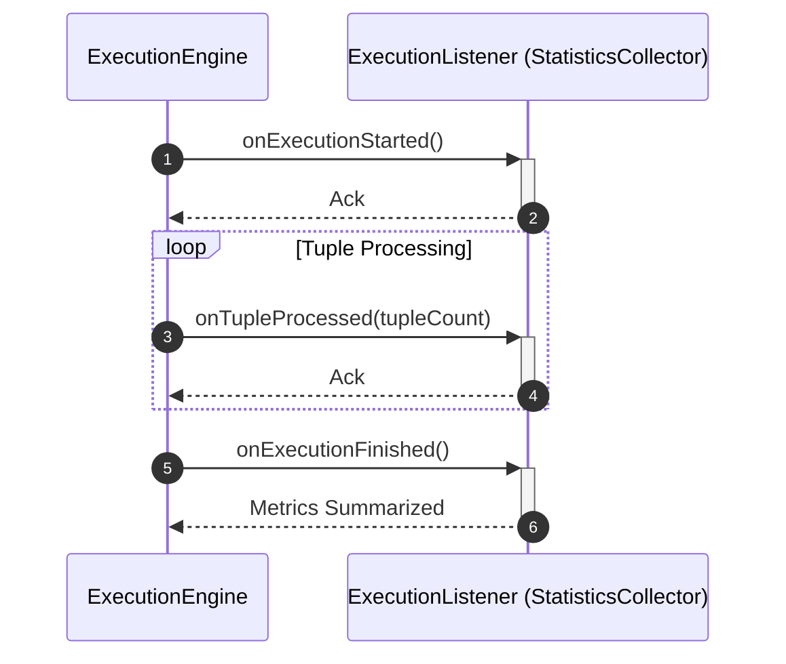

---

# PHẦN II: SƠ ĐỒ TRÌNH TỰ THEO FEATURE CỐT LÕI

## 1. Full Physical Query Plan Execution Workflow
* **Feature**: Complete Physical Plan Execution
* **Actor**: External Caller / QueryProcessor
* **Design Patterns**: Facade, Factory Method, Composite, State, Observer

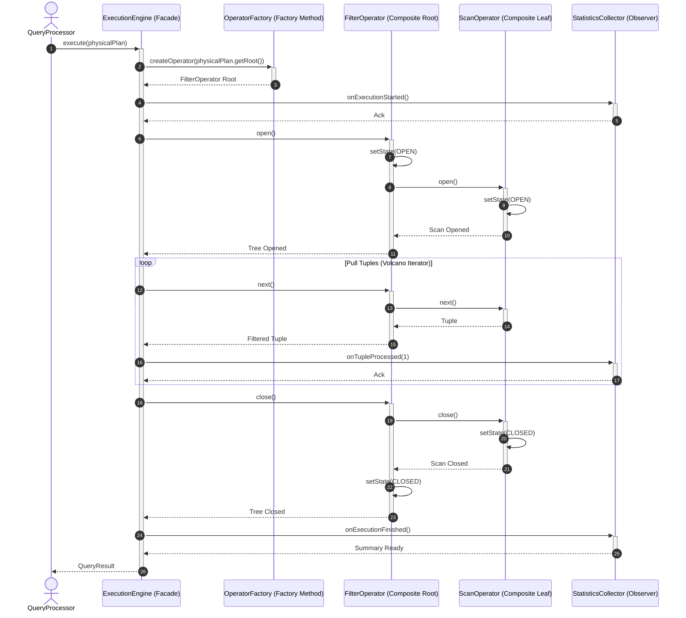

---

## 2. Dynamic Join Strategy Execution Workflow
* **Feature**: Join Execution (Hash Join / Nested Loop Join)
* **Actor**: ExecutionEngine
* **Design Patterns**: Strategy, Composite, Iterator

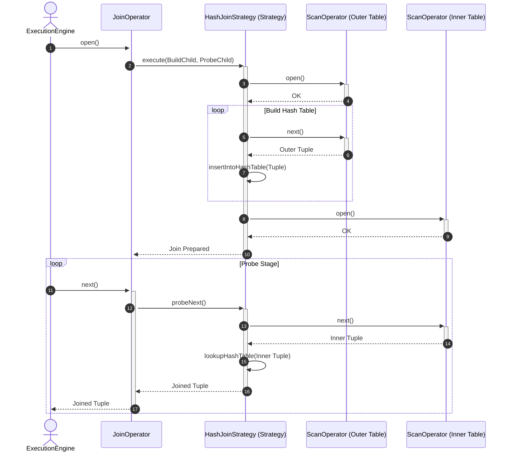

---

## 3. Operator Execution Performance Profiling (Decorator)
* **Feature**: Real-Time Performance Profiling & Logging
* **Actor**: ExecutionEngine
* **Design Patterns**: Decorator, Composite

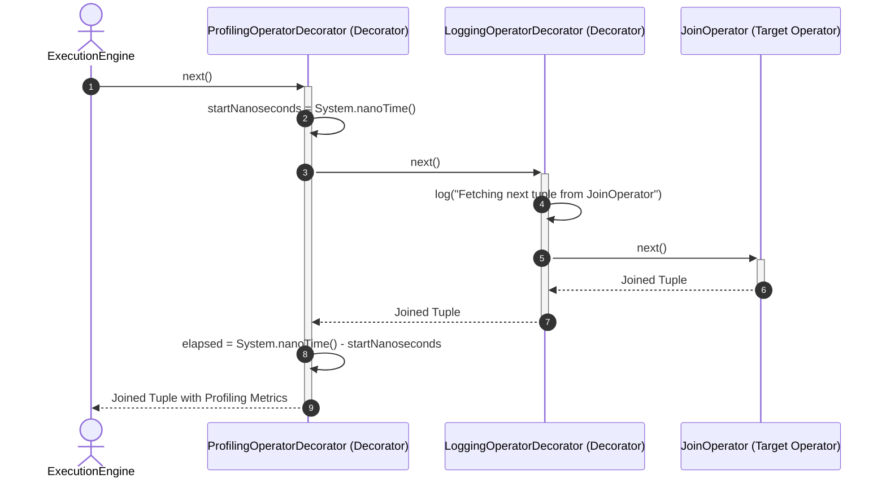
