# Sequence Diagrams for Key Design Patterns in Metadata Module

This document contains **13 Mermaid Sequence Diagrams** illustrating interaction flows for core and operational **Design Patterns** in the `metadata` module, matching 100% with `ListPatterm.md` by object hierarchy from **Root Catalog** ➔ **Database & Schema** ➔ **Table** ➔ **Column, Constraint, & Index** ➔ **Schema Observers**.

---

## 1. CatalogManager & MetadataModule Level (Root Catalog Level)

### 1.1. Singleton Pattern
* **Pattern**: Singleton Pattern
* **Class/Interface Applied**: CatalogManager
* **Method**: `getInstance()`

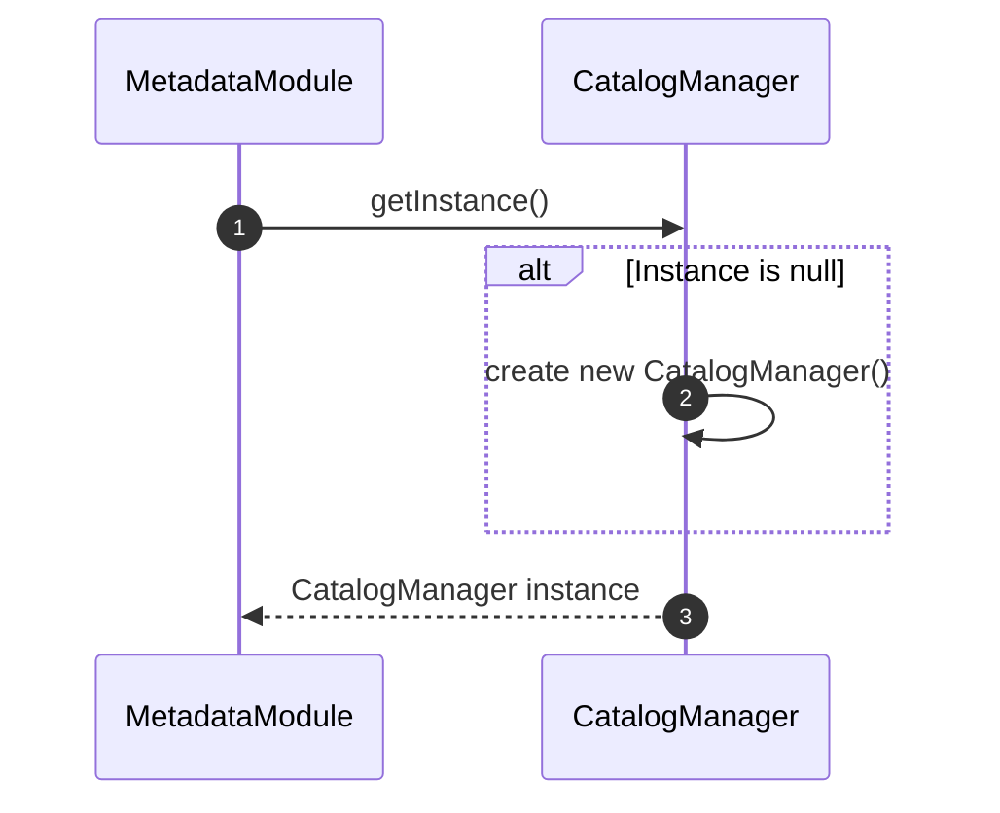

---

### 1.2. Facade Pattern
* **Pattern**: Facade Pattern
* **Class/Interface Applied**: MetadataModule
* **Method**: `getTable(databaseName, schemaName, tableName)`, `getDatabase(databaseName)`, `getCatalogManager()`, `executeDDL(command)`

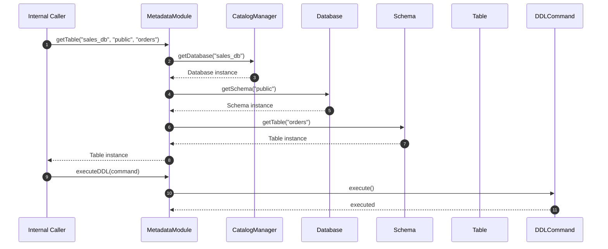

---

### 1.3. Composite Pattern
* **Pattern**: Composite Pattern
* **Class/Interface Applied**: MetadataElement (implemented by CatalogManager, Database, Schema, Table, Column)
* **Method**: `getElementName()`

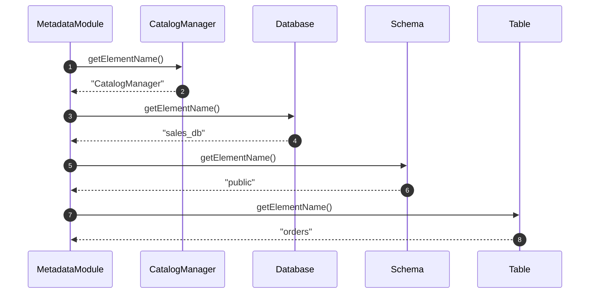

---

## 2. Database Level

### 2.1. State Pattern
* **Pattern**: State Pattern
* **Class/Interface Applied**: DatabaseStatus, Database
* **Method**: `setStatus(status)`, `createSchema(schemaName)`

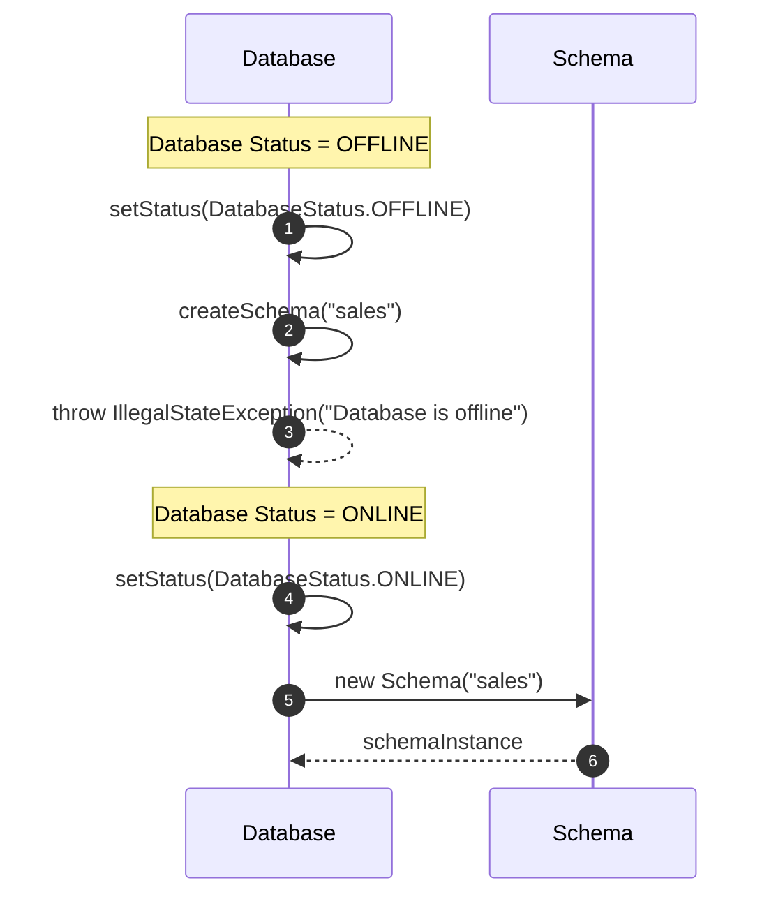

---

## 3. Schema Level

### 3.1. Factory Method Pattern
* **Pattern**: Factory Method Pattern
* **Class/Interface Applied**: Schema
* **Method**: `createTable(tableName)`

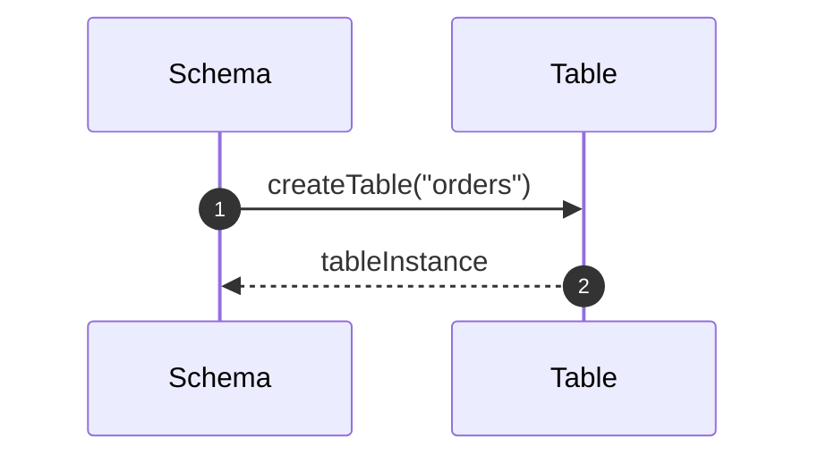

---

### 3.2. Command Pattern
* **Pattern**: Command Pattern
* **Class/Interface Applied**: DDLCommand (CreateTableCommand, DropTableCommand, CreateSchemaCommand, DropSchemaCommand, RenameSchemaCommand)
* **Method**: `execute()`, `undo()`

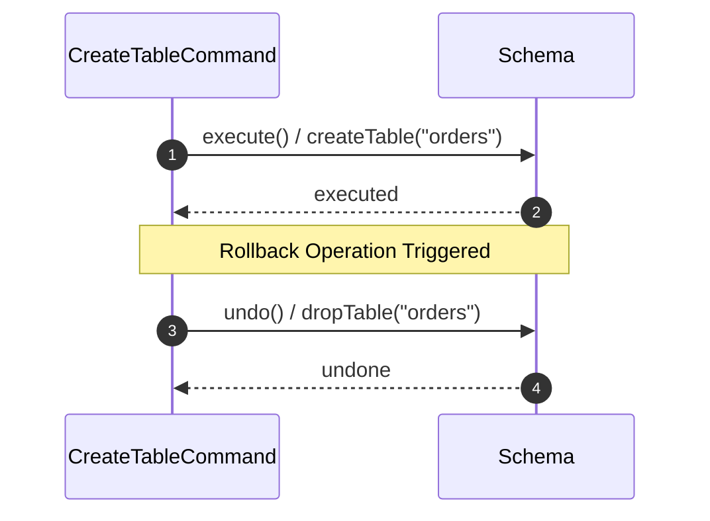

---

## 4. Table Level

### 4.1. Prototype Pattern
* **Pattern**: Prototype Pattern
* **Class/Interface Applied**: Table, Column
* **Method**: `clone()`

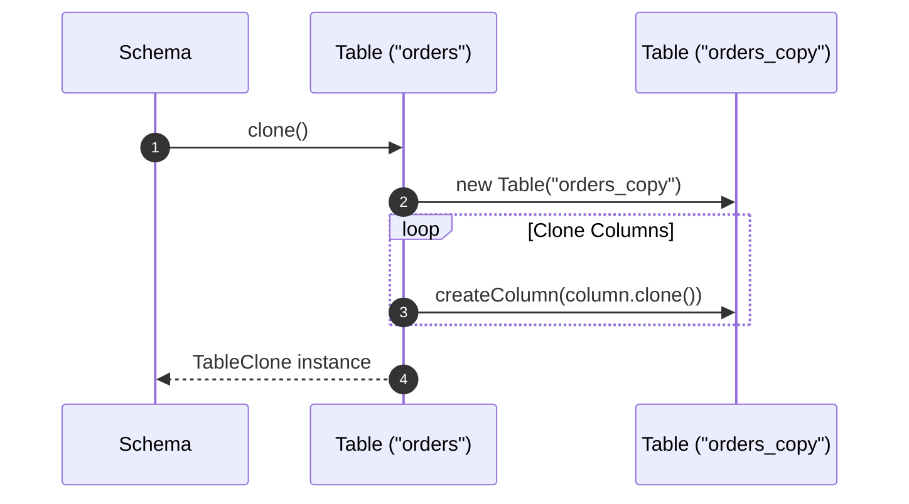

---

### 4.2. Memento Pattern
* **Pattern**: Memento Pattern
* **Class/Interface Applied**: TableMemento, Table
* **Method**: `createMemento()`, `restore(memento)`

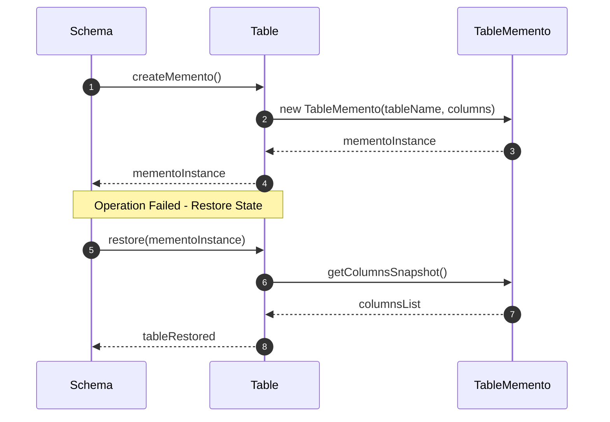

---

### 4.3. Observer Pattern (Subject)
* **Pattern**: Observer Pattern (Subject)
* **Class/Interface Applied**: Table, MetadataChangeListener
* **Method**: `registerListener(listener)`, `removeListener(listener)`, `notifyListeners(eventType, targetName)`

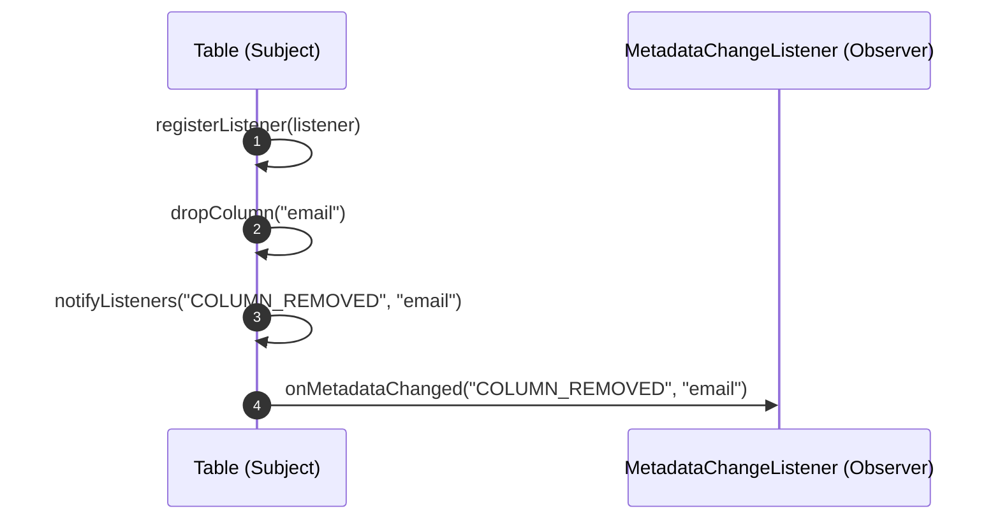

---

## 5. Column Level

### 5.1. Builder Pattern
* **Pattern**: Builder Pattern
* **Class/Interface Applied**: ColumnBuilder
* **Method**: `setName(name)`, `setType(dataType)`, `setNullable(nullable)`, `setDefaultValue(value)`, `build()`

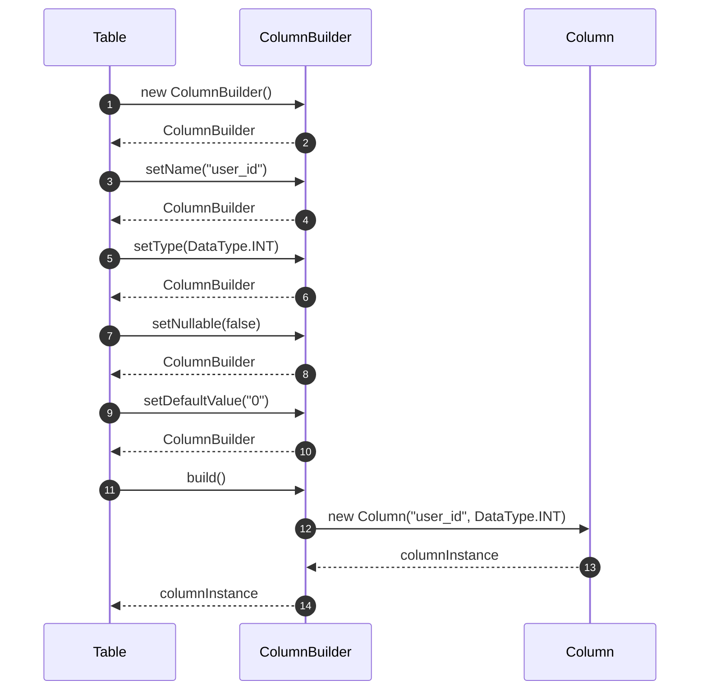

---

## 6. Constraint Level

### 6.1. Factory Method Pattern (Constraint)
* **Pattern**: Factory Method Pattern
* **Class/Interface Applied**: ConstraintFactory
* **Method**: `createConstraint(type, name, args)`

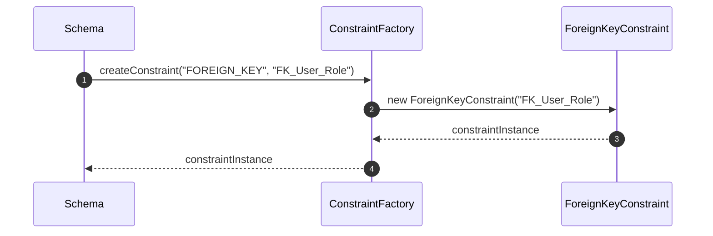

---

### 6.2. Template Method Pattern
* **Pattern**: Template Method Pattern
* **Class/Interface Applied**: Constraint
* **Method**: `validate()`, `preValidate()`, `doValidate()`, `postValidate()`

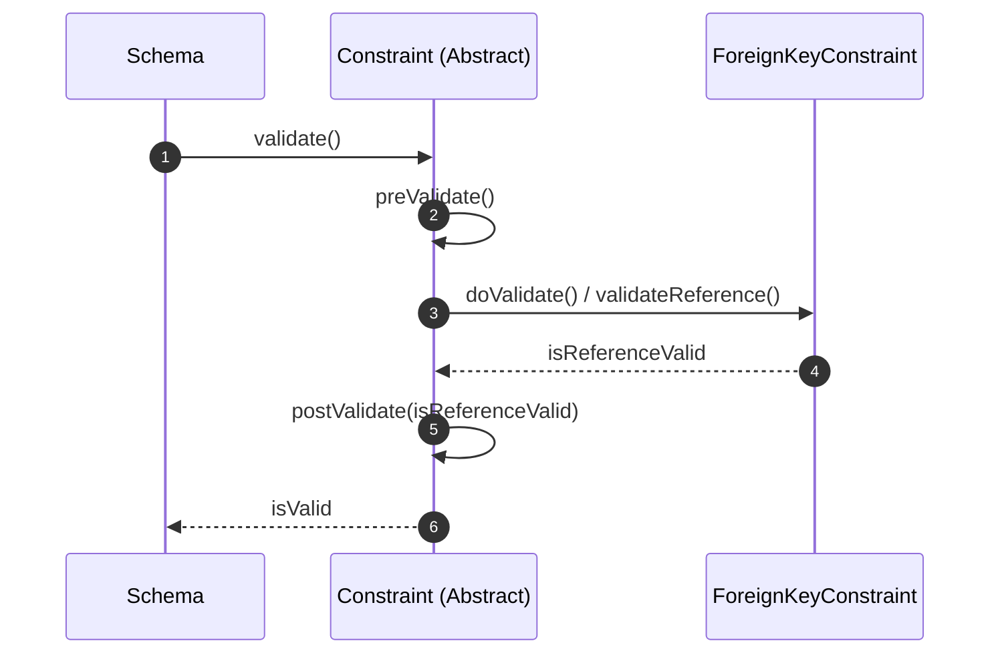

---

### 6.3. Chain of Responsibility Pattern
* **Pattern**: Chain of Responsibility Pattern
* **Class/Interface Applied**: ConstraintValidationChain
* **Method**: `addConstraint(constraint)`, `removeConstraint(constraint)`, `validateAll()`

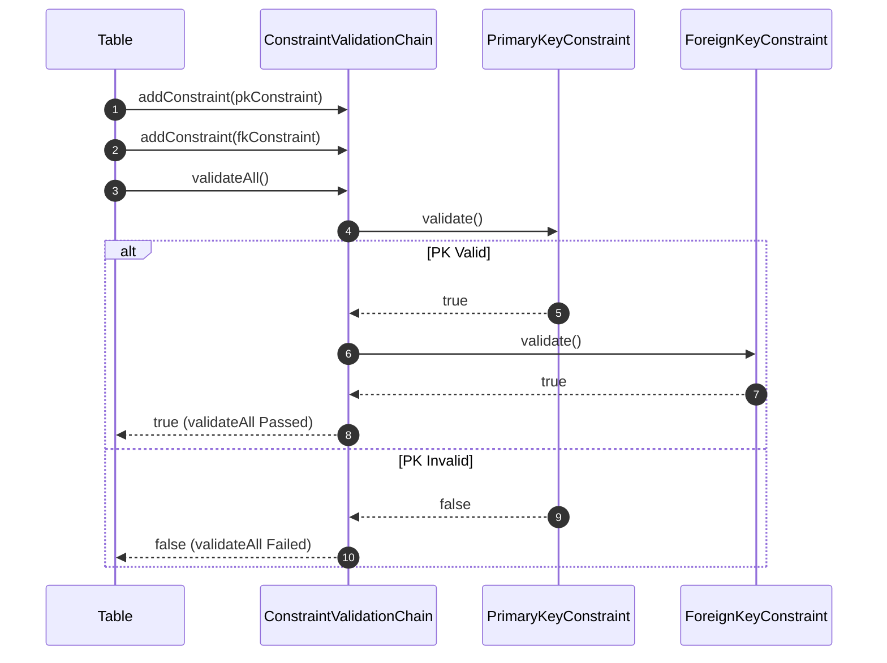

---

## 7. Index Level

### 7.1. Strategy Pattern
* **Pattern**: Strategy Pattern
* **Class/Interface Applied**: Index, IndexRebuildStrategy
* **Method**: `setRebuildStrategy(strategy)`, `rebuild()`

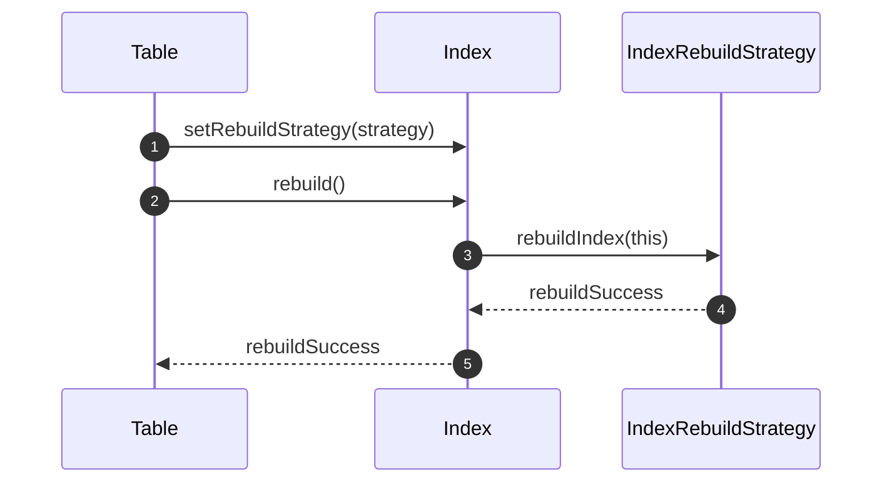
