# Sơ Đồ Tuần Tự (Sequence Diagrams) Thuần Túy Module Metadata

Tài liệu này chứa 23 Sơ đồ tuần tự (Sequence Diagrams) bằng Mermaid biểu diễn luồng tương tác giữa các class và interface **thuần túy trong nội bộ module `metadata`** ([MetadataModule](file:///d:/BBV/Database_Management_BBV/DBMS/src/main/java/metadata/MetadataModule.java), [CatalogManager](file:///d:/BBV/Database_Management_BBV/DBMS/src/main/java/metadata/CatalogManager.java), [Database](file:///d:/BBV/Database_Management_BBV/DBMS/src/main/java/metadata/Database.java), [Schema](file:///d:/BBV/Database_Management_BBV/DBMS/src/main/java/metadata/Schema.java), [Table](file:///d:/BBV/Database_Management_BBV/DBMS/src/main/java/metadata/Table.java), [Column](file:///d:/BBV/Database_Management_BBV/DBMS/src/main/java/metadata/Column.java), [Constraint](file:///d:/BBV/Database_Management_BBV/DBMS/src/main/java/metadata/Constraint.java), [Index](file:///d:/BBV/Database_Management_BBV/DBMS/src/main/java/metadata/Index.java), [View](file:///d:/BBV/Database_Management_BBV/DBMS/src/main/java/metadata/View.java), [Sequence](file:///d:/BBV/Database_Management_BBV/DBMS/src/main/java/metadata/Sequence.java), [Trigger](file:///d:/BBV/Database_Management_BBV/DBMS/src/main/java/metadata/Trigger.java), [StoredProcedure](file:///d:/BBV/Database_Management_BBV/DBMS/src/main/java/metadata/StoredProcedure.java), [Function](file:///d:/BBV/Database_Management_BBV/DBMS/src/main/java/metadata/Function.java), [DataType](file:///d:/BBV/Database_Management_BBV/DBMS/src/main/java/metadata/enums/DataType.java)).

---

## 🟢 I. Creational Design Patterns (Mẫu Khởi Tạo)

### 1. Singleton Pattern
* **Phạm vi nội bộ**: `MetadataModule` lấy instance duy nhất của `CatalogManager`.

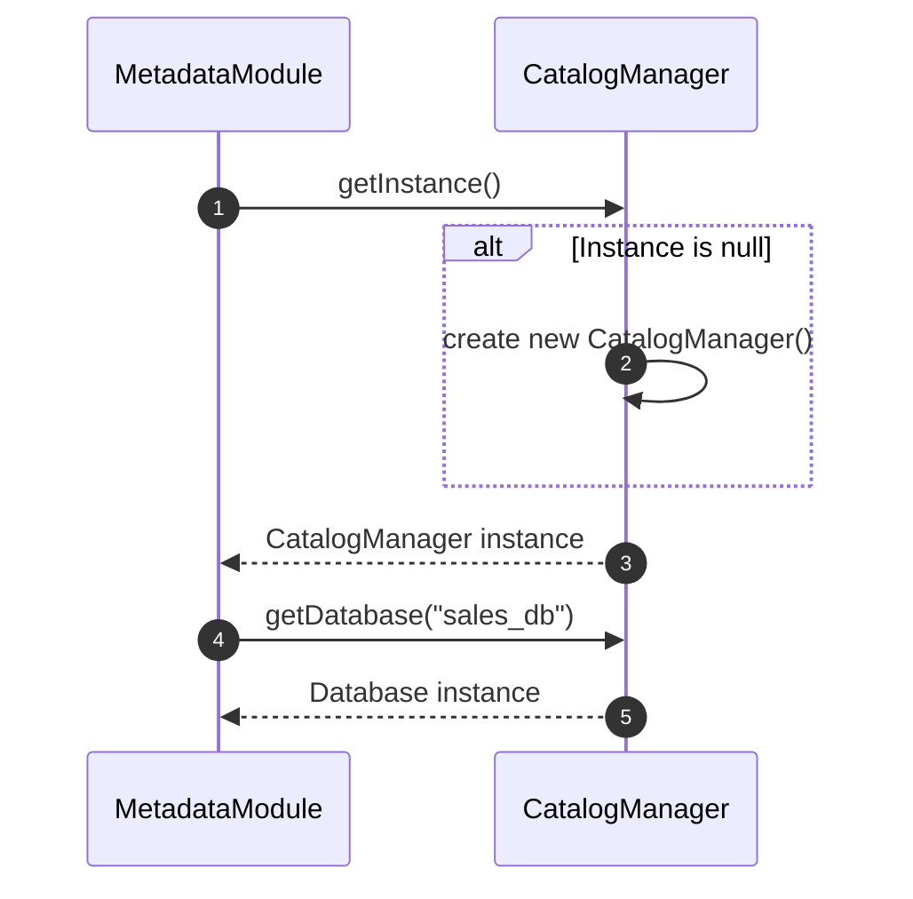
```mermaid
sequenceDiagram
    autonumber
    participant Module as MetadataModule
    participant CM as CatalogManager
    
    Module->>CM: getInstance()
    alt Instance is null
        CM->>CM: create new CatalogManager()
    end
    CM-->>Module: CatalogManager instance
    Module->>CM: getDatabase("sales_db")
    CM-->>Module: Database instance
```

---

### 2. Factory Method Pattern
* **Phạm vi nội bộ**: `Schema` ủy quyền cho `ConstraintFactory` khởi tạo các ràng buộc dữ liệu nội bộ `Constraint`.

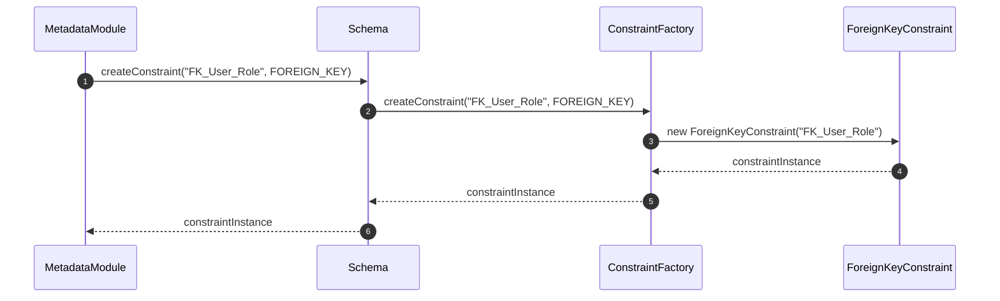
```mermaid
sequenceDiagram
    autonumber
    participant Module as MetadataModule
    participant Schema as Schema
    participant CF as ConstraintFactory
    participant FK as ForeignKeyConstraint

    Module->>Schema: createConstraint("FK_User_Role", FOREIGN_KEY)
    Schema->>CF: createConstraint("FK_User_Role", FOREIGN_KEY)
    CF->>FK: new ForeignKeyConstraint("FK_User_Role")
    FK-->>CF: constraintInstance
    CF-->>Schema: constraintInstance
    Schema-->>Module: constraintInstance
```

---

### 3. Abstract Factory Pattern
* **Phạm vi nội bộ**: `CatalogManager` sử dụng `MetadataObjectFactory` để tạo các đối tượng Metadata đồng bộ.

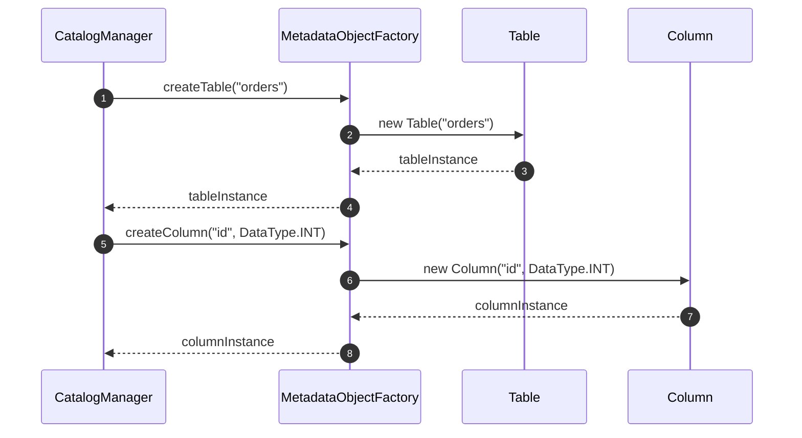
```mermaid
sequenceDiagram
    autonumber
    participant CM as CatalogManager
    participant Factory as MetadataObjectFactory
    participant Table as Table
    participant Column as Column

    CM->>Factory: createTable("orders")
    Factory->>Table: new Table("orders")
    Table-->>Factory: tableInstance
    Factory-->>CM: tableInstance

    CM->>Factory: createColumn("id", DataType.INT)
    Factory->>Column: new Column("id", DataType.INT)
    Column-->>Factory: columnInstance
    Factory-->>CM: columnInstance
```

---

### 4. Builder Pattern
* **Phạm vi nội bộ**: `Table` gọi `ColumnBuilder` tạo đối tượng `Column` trong nội bộ module.

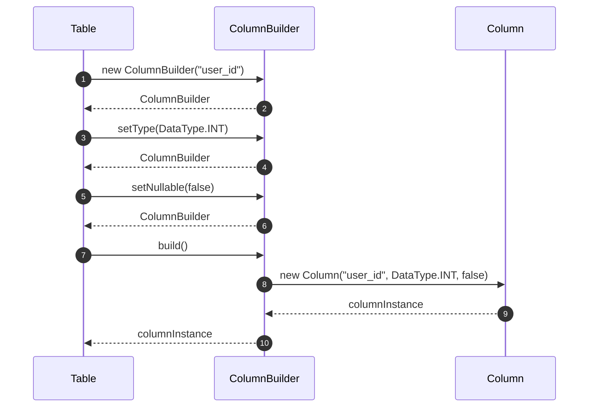
```mermaid
sequenceDiagram
    autonumber
    participant Table as Table
    participant CB as ColumnBuilder
    participant Col as Column

    Table->>CB: new ColumnBuilder("user_id")
    CB-->>Table: ColumnBuilder
    Table->>CB: setType(DataType.INT)
    CB-->>Table: ColumnBuilder
    Table->>CB: setNullable(false)
    CB-->>Table: ColumnBuilder
    Table->>CB: build()
    CB->>Col: new Column("user_id", DataType.INT, false)
    Col-->>CB: columnInstance
    CB-->>Table: columnInstance
```

---

### 5. Prototype Pattern
* **Phạm vi nội bộ**: `Schema` nhân bản đối tượng `Table` trong bộ nhớ thông qua `clone()`.

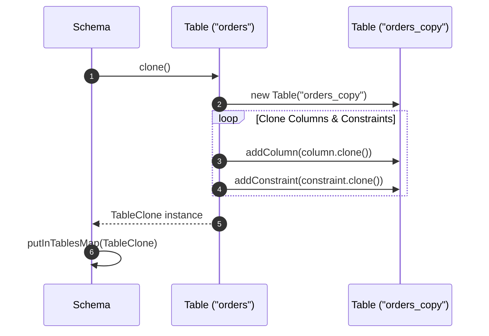
```mermaid
sequenceDiagram
    autonumber
    participant Schema as Schema
    participant TableOrig as Table ("orders")
    participant TableClone as Table ("orders_copy")

    Schema->>TableOrig: clone()
    TableOrig->>TableClone: new Table("orders_copy")
    loop Clone Columns & Constraints
        TableOrig->>TableClone: addColumn(column.clone())
        TableOrig->>TableClone: addConstraint(constraint.clone())
    end
    TableOrig-->>Schema: TableClone instance
    Schema->>Schema: putInTablesMap(TableClone)
```

---

## 🔵 II. Structural Design Patterns (Mẫu Cấu Trúc)

### 6. Composite Pattern
* **Phạm vi nội bộ**: Truy cập và tương tác phân cấp đồng nhất trên các nút cây Metadata (`CatalogManager` ➔ `Database` ➔ `Schema` ➔ `Table`).

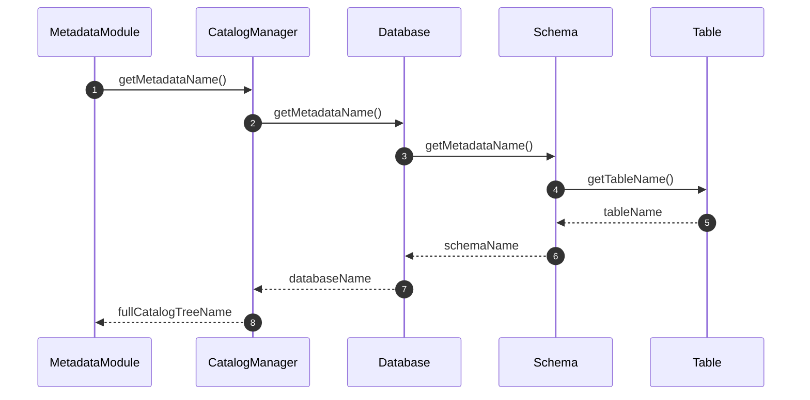
```mermaid
sequenceDiagram
    autonumber
    participant Module as MetadataModule
    participant CM as CatalogManager
    participant DB as Database
    participant Schema as Schema
    participant Table as Table

    Module->>CM: getMetadataName()
    CM->>DB: getMetadataName()
    DB->>Schema: getMetadataName()
    Schema->>Table: getTableName()
    Table-->>Schema: tableName
    Schema-->>DB: schemaName
    DB-->>CM: databaseName
    CM-->>Module: fullCatalogTreeName
```

---

### 7. Decorator Pattern
* **Phạm vi nội bộ**: `ReadOnlyTableDecorator` bọc `Table` để ngăn chặn thao tác ghi sửa đổi nội bộ metadata.

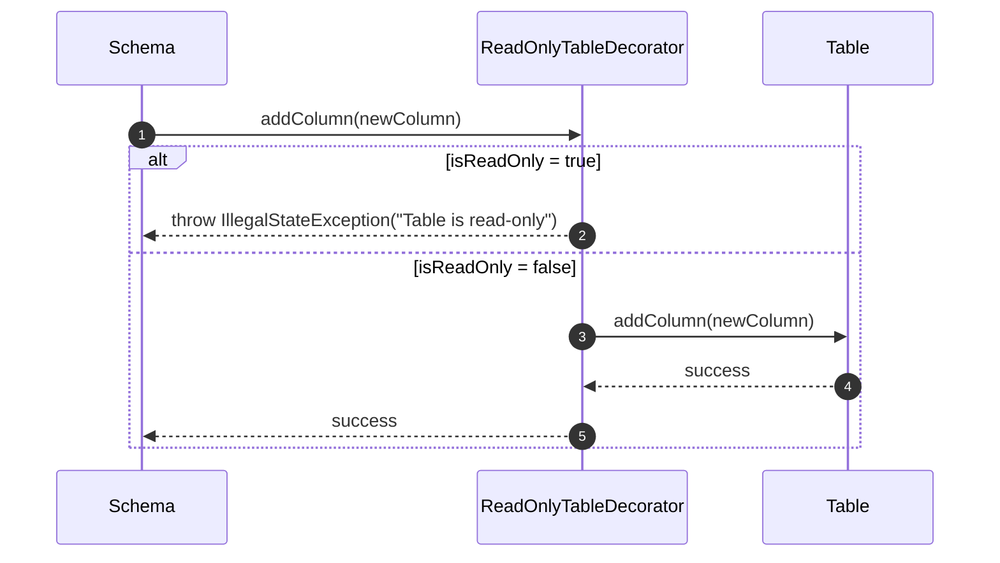
```mermaid
sequenceDiagram
    autonumber
    participant Schema as Schema
    participant Decorator as ReadOnlyTableDecorator
    participant Table as Table

    Schema->>Decorator: addColumn(newColumn)
    alt isReadOnly = true
        Decorator-->>Schema: throw IllegalStateException("Table is read-only")
    else isReadOnly = false
        Decorator->>Table: addColumn(newColumn)
        Table-->>Decorator: success
        Decorator-->>Schema: success
    end
```

---

### 8. Adapter Pattern
* **Phạm vi nội bộ**: `MetadataDefinitionAdapter` chuyển đổi cấu hình chuỗi thành đối tượng `Table` và `Column`.

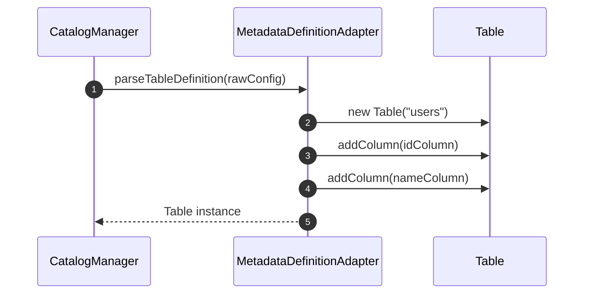
```mermaid
sequenceDiagram
    autonumber
    participant CM as CatalogManager
    participant Adapter as MetadataDefinitionAdapter
    participant Table as Table

    CM->>Adapter: parseTableDefinition(rawConfig)
    Adapter->>Table: new Table("users")
    Adapter->>Table: addColumn(idColumn)
    Adapter->>Table: addColumn(nameColumn)
    Adapter-->>CM: Table instance
```

---

### 9. Facade Pattern
* **Phạm vi nội bộ**: `MetadataModule` đóng vai trò Facade duy nhất điều phối thao tác giữa các sub-components.

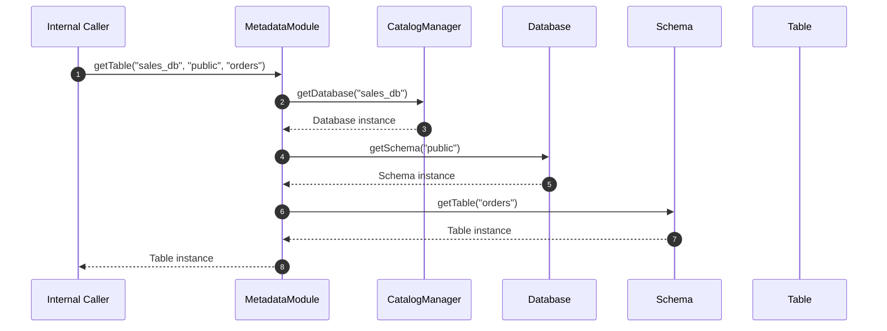
```mermaid
sequenceDiagram
    autonumber
    participant Caller as Internal Caller
    participant Facade as MetadataModule
    participant CM as CatalogManager
    participant DB as Database
    participant Schema as Schema
    participant Table as Table

    Caller->>Facade: getTable("sales_db", "public", "orders")
    Facade->>CM: getDatabase("sales_db")
    CM-->>Facade: Database instance
    Facade->>DB: getSchema("public")
    DB-->>Facade: Schema instance
    Facade->>Schema: getTable("orders")
    Schema-->>Facade: Table instance
    Facade-->>Caller: Table instance
```

---

### 10. Proxy Pattern
* **Phạm vi nội bộ**: `ProtectedSchemaProxy` kiểm tra quyền tác động lên Schema trước khi chuyển giao lệnh cho `Schema`.

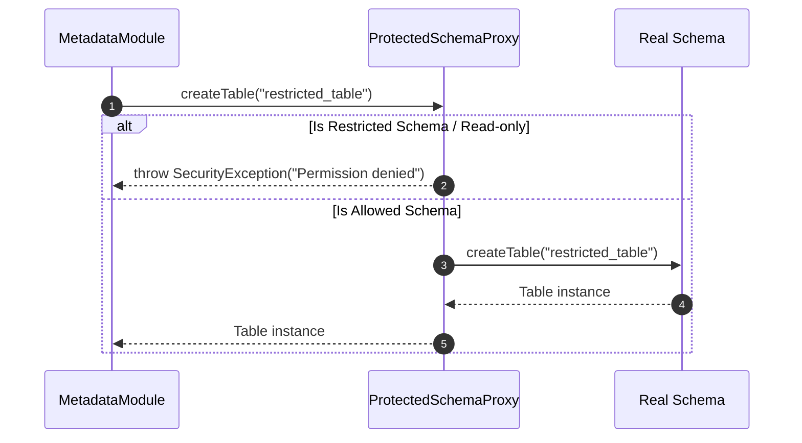
```mermaid
sequenceDiagram
    autonumber
    participant Module as MetadataModule
    participant Proxy as ProtectedSchemaProxy
    participant Schema as Real Schema

    Module->>Proxy: createTable("restricted_table")
    alt Is Restricted Schema / Read-only
        Proxy-->>Module: throw SecurityException("Permission denied")
    else Is Allowed Schema
        Proxy->>Schema: createTable("restricted_table")
        Schema-->>Proxy: Table instance
        Proxy-->>Module: Table instance
    end
```

---

### 11. Flyweight Pattern
* **Phạm vi nội bộ**: `Column` lấy instance kiểu dữ liệu `DataType` dùng chung từ `DataTypeFlyweightFactory`.

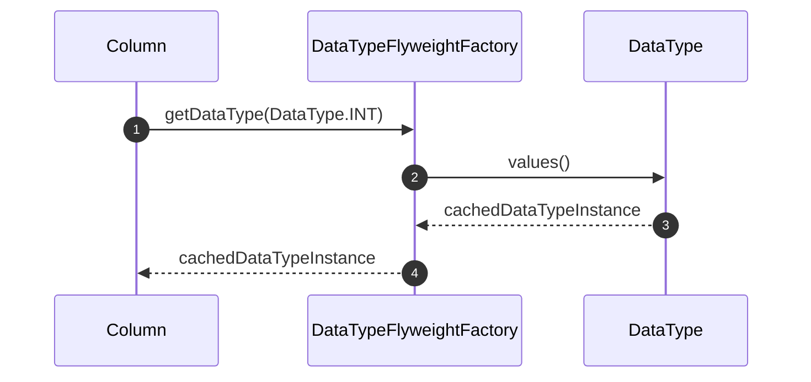
```mermaid
sequenceDiagram
    autonumber
    participant Column as Column
    participant Factory as DataTypeFlyweightFactory
    participant Enum as DataType

    Column->>Factory: getDataType(DataType.INT)
    Factory->>Enum: values()
    Enum-->>Factory: cachedDataTypeInstance
    Factory-->>Column: cachedDataTypeInstance
```

---

### 12. Bridge Pattern
* **Phạm vi nội bộ**: `Index` ủy quyền thao tác rebuild cho đối tượng triển khai `IndexOperationImpl`.

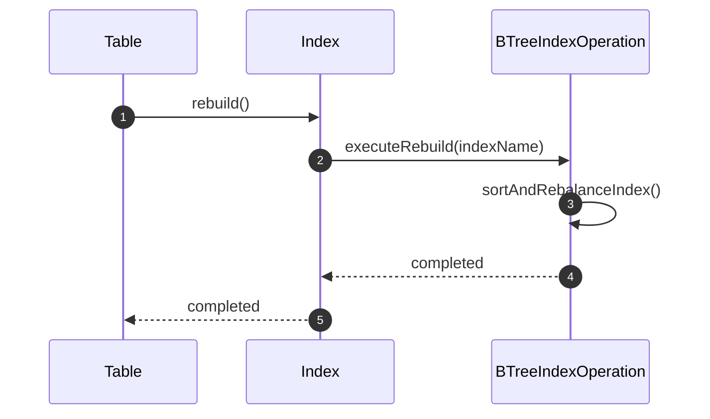
```mermaid
sequenceDiagram
    autonumber
    participant Table as Table
    participant Index as Index
    participant Impl as BTreeIndexOperation

    Table->>Index: rebuild()
    Index->>Impl: executeRebuild(indexName)
    Impl->>Impl: sortAndRebalanceIndex()
    Impl-->>Index: completed
    Index-->>Table: completed
```

---

## 🟡 III. Behavioral Design Patterns (Mẫu Hành Vi)

### 13. Chain of Responsibility Pattern
* **Phạm vi nội bộ**: `Table` truyền lệnh kiểm tra lần lượt qua chuỗi các đối tượng `Constraint`.

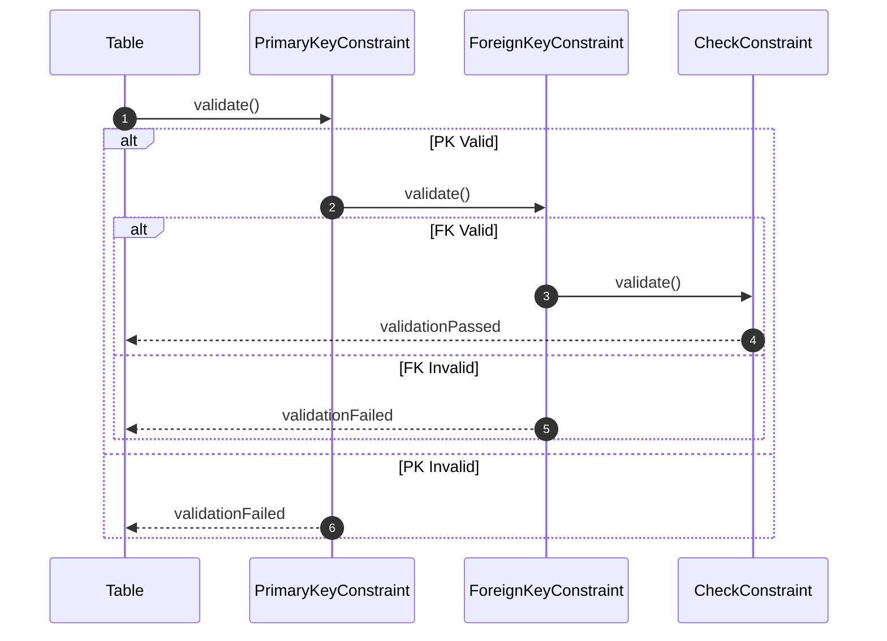
```mermaid
sequenceDiagram
    autonumber
    participant Table as Table
    participant PK as PrimaryKeyConstraint
    participant FK as ForeignKeyConstraint
    participant Check as CheckConstraint

    Table->>PK: validate()
    alt PK Valid
        PK->>FK: validate()
        alt FK Valid
            FK->>Check: validate()
            Check-->>Table: validationPassed
        else FK Invalid
            FK-->>Table: validationFailed
        end
    else PK Invalid
        PK-->>Table: validationFailed
    end
```

---

### 14. Command Pattern
* **Phạm vi nội bộ**: `Schema` gọi `CreateTableCommand` thực thi phương thức `execute()` và `undo()`.

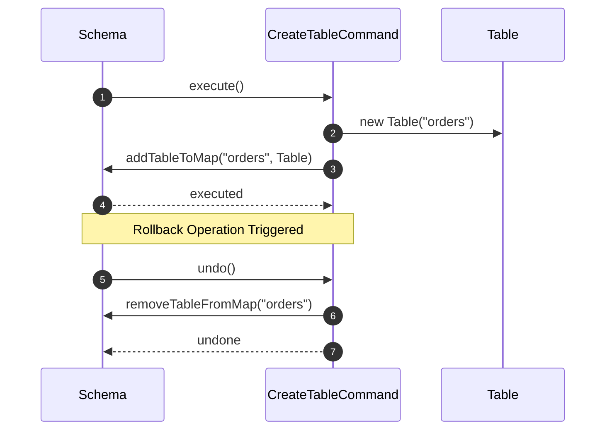
```mermaid
sequenceDiagram
    autonumber
    participant Schema as Schema
    participant Cmd as CreateTableCommand
    participant Table as Table

    Schema->>Cmd: execute()
    Cmd->>Table: new Table("orders")
    Cmd->>Schema: addTableToMap("orders", Table)
    Schema-->>Cmd: executed

    note over Schema, Cmd: Rollback Operation Triggered
    Schema->>Cmd: undo()
    Cmd->>Schema: removeTableFromMap("orders")
    Cmd-->>Schema: undone
```

---

### 15. Interpreter Pattern
* **Phạm vi nội bộ**: `CheckConstraint` giải mã và đánh giá biểu thức bằng `ConstraintExpressionInterpreter`.

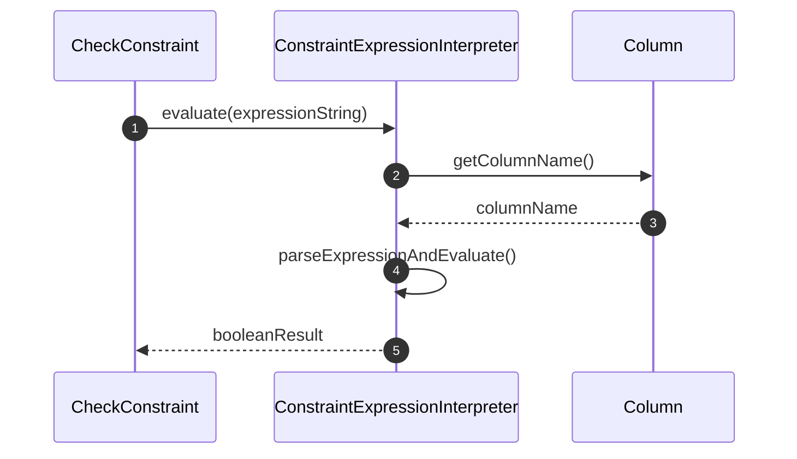
```mermaid
sequenceDiagram
    autonumber
    participant Check as CheckConstraint
    participant Interp as ConstraintExpressionInterpreter
    participant Col as Column

    Check->>Interp: evaluate(expressionString)
    Interp->>Col: getColumnName()
    Col-->>Interp: columnName
    Interp->>Interp: parseExpressionAndEvaluate()
    Interp-->>Check: booleanResult
```

---

### 16. Iterator Pattern
* **Phạm vi nội bộ**: `CatalogManager` tạo `MetadataTreeIterator` để duyệt danh sách `Database`, `Schema`, `Table`.

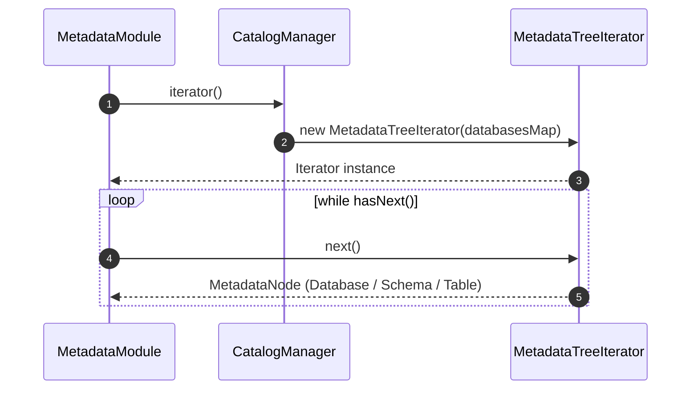
```mermaid
sequenceDiagram
    autonumber
    participant Module as MetadataModule
    participant CM as CatalogManager
    participant Iter as MetadataTreeIterator

    Module->>CM: iterator()
    CM->>Iter: new MetadataTreeIterator(databasesMap)
    Iter-->>Module: Iterator instance

    loop while hasNext()
        Module->>Iter: next()
        Iter-->>Module: MetadataNode (Database / Schema / Table)
    end
```

---

### 17. Mediator Pattern
* **Phạm vi nội bộ**: `SchemaMediator` trung gian truyền thông tin khi `Table` đổi tên tới `ForeignKeyConstraint` và `View`.

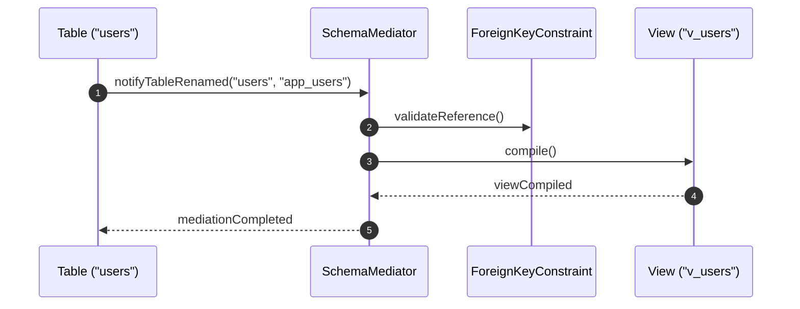
```mermaid
sequenceDiagram
    autonumber
    participant Table as Table ("users")
    participant Mediator as SchemaMediator
    participant FK as ForeignKeyConstraint
    participant View as View ("v_users")

    Table->>Mediator: notifyTableRenamed("users", "app_users")
    Mediator->>FK: validateReference()
    Mediator->>View: compile()
    View-->>Mediator: viewCompiled
    Mediator-->>Table: mediationCompleted
```

---

### 18. Memento Pattern
* **Phạm vi nội bộ**: `Schema` lưu giữ `TableMemento` của `Table` và khôi phục khi thao tác sửa đổi bị lỗi.

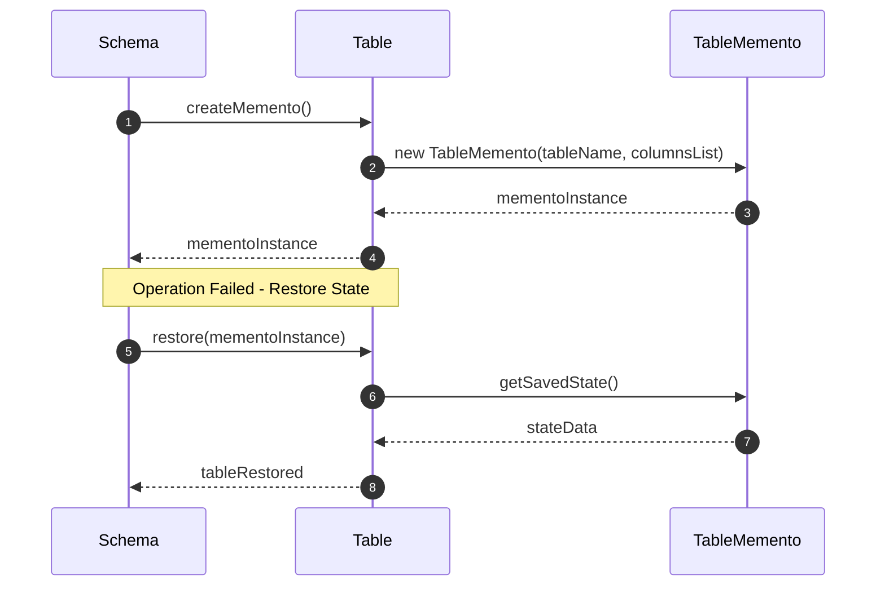
```mermaid
sequenceDiagram
    autonumber
    participant Schema as Schema
    participant Table as Table
    participant Memento as TableMemento

    Schema->>Table: createMemento()
    Table->>Memento: new TableMemento(tableName, columnsList)
    Memento-->>Table: mementoInstance
    Table-->>Schema: mementoInstance

    note over Schema, Table: Operation Failed - Restore State
    Schema->>Table: restore(mementoInstance)
    Table->>Memento: getSavedState()
    Memento-->>Table: stateData
    Table-->>Schema: tableRestored
```

---

### 19. Observer Pattern
* **Phạm vi nội bộ**: `Table` thông báo tới các observer nội bộ `View` và `Trigger` khi cấu trúc cột thay đổi.

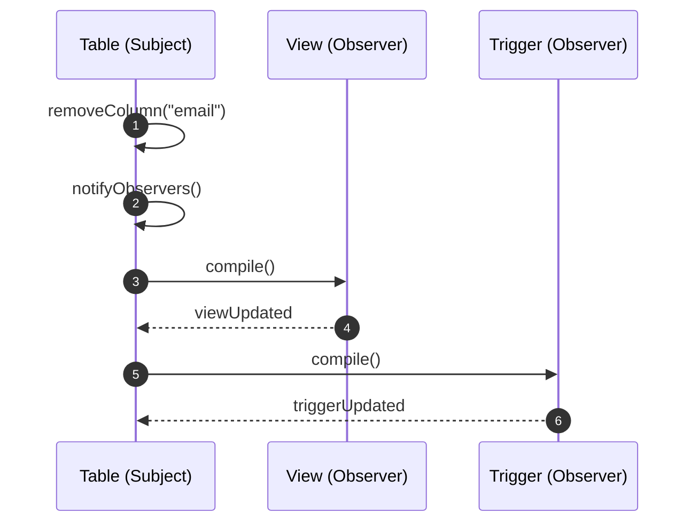
```mermaid
sequenceDiagram
    autonumber
    participant Table as Table (Subject)
    participant View as View (Observer)
    participant Trigger as Trigger (Observer)

    Table->>Table: removeColumn("email")
    Table->>Table: notifyObservers()
    Table->>View: compile()
    View-->>Table: viewUpdated
    Table->>Trigger: compile()
    Trigger-->>Table: triggerUpdated
```

---

### 20. State Pattern
* **Phạm vi nội bộ**: `Database` chuyển giao thực thi `createSchema()` cho trạng thái `DatabaseState` hiện tại.

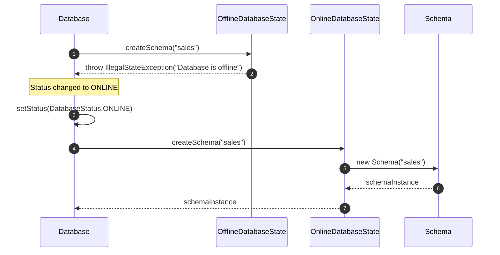
```mermaid
sequenceDiagram
    autonumber
    participant DB as Database
    participant OfflineState as OfflineDatabaseState
    participant OnlineState as OnlineDatabaseState
    participant Schema as Schema

    DB->>OfflineState: createSchema("sales")
    OfflineState-->>DB: throw IllegalStateException("Database is offline")

    note over DB: Status changed to ONLINE
    DB->>DB: setStatus(DatabaseStatus.ONLINE)
    DB->>OnlineState: createSchema("sales")
    OnlineState->>Schema: new Schema("sales")
    Schema-->>OnlineState: schemaInstance
    OnlineState-->>DB: schemaInstance
```

---

### 21. Strategy Pattern
* **Phạm vi nội bộ**: `Index` đổi chiến lược rebuild thông qua `IndexRebuildStrategy`.

```mermaid
sequenceDiagram
    autonumber
    participant Table as Table
    participant Index as Index
    participant Strategy as IndexRebuildStrategy

    Table->>Index: setRebuildStrategy(strategy)
    Table->>Index: rebuild()
    Index->>Strategy: executeRebuild(this)
    Strategy-->>Index: rebuildSuccess
    Index-->>Table: rebuildSuccess
```

---

### 22. Template Method Pattern
* **Phạm vi nội bộ**: Class `Constraint` định nghĩa các bước mẫu trong `validate()`, `ForeignKeyConstraint` triển khai bước `validateReference()`.

```mermaid
sequenceDiagram
    autonumber
    participant Schema as Schema
    participant Base as Constraint (Abstract)
    participant Sub as ForeignKeyConstraint

    Schema->>Base: validate()
    Base->>Base: preValidate()
    Base->>Sub: validateReference()
    Sub-->>Base: isReferenceValid
    Base->>Base: postValidate()
    Base-->>Schema: isValid
```

---

### 23. Visitor Pattern
* **Phạm vi nội bộ**: `MetadataModule` duyệt qua toàn bộ cây Metadata thông qua `MetadataVisitor`.

```mermaid
sequenceDiagram
    autonumber
    participant Module as MetadataModule
    participant Visitor as MetadataVisitor
    participant CM as CatalogManager
    participant DB as Database
    participant Schema as Schema
    participant Table as Table

    Module->>CM: accept(visitor)
    CM->>Visitor: visitCatalogManager(this)
    CM->>DB: accept(visitor)
    DB->>Visitor: visitDatabase(this)
    DB->>Schema: accept(visitor)
    Schema->>Visitor: visitSchema(this)
    Schema->>Table: accept(visitor)
    Table->>Visitor: visitTable(this)
```
