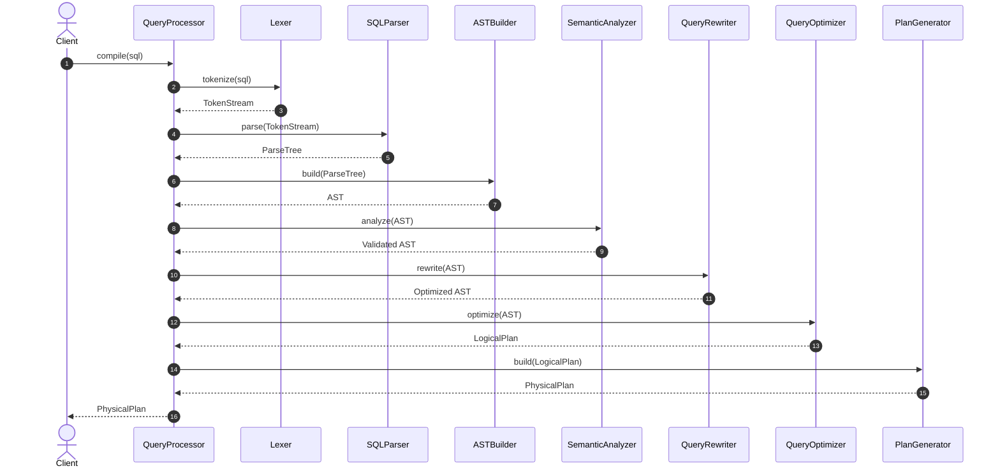
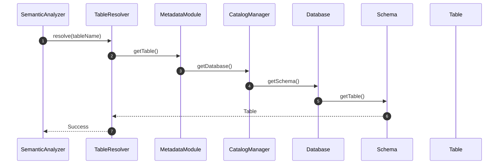
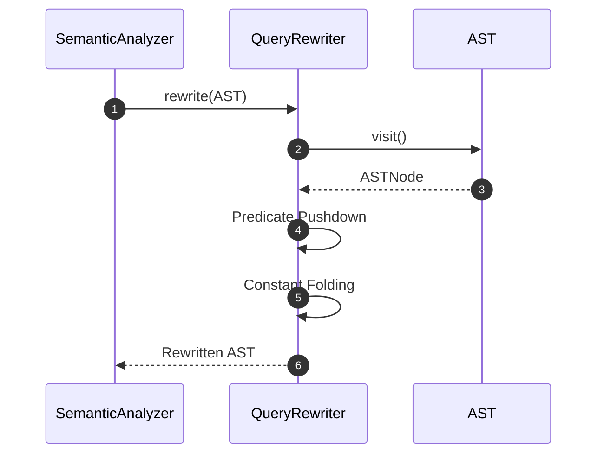
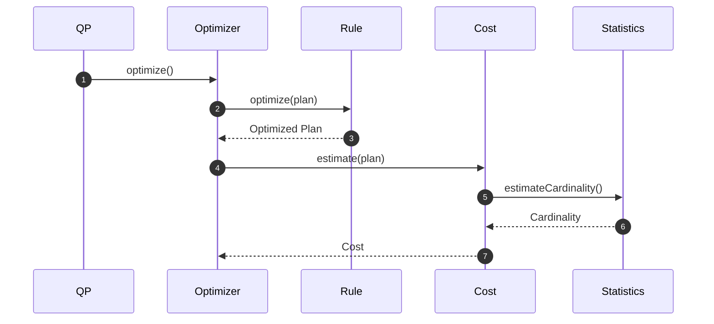
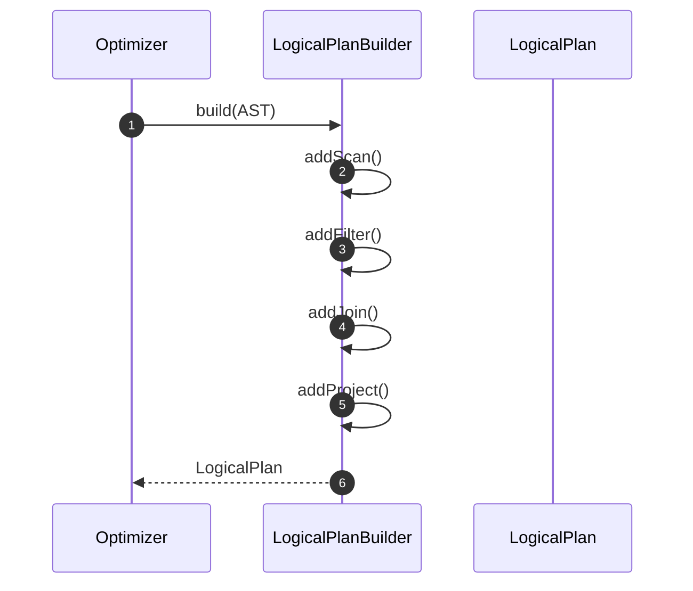
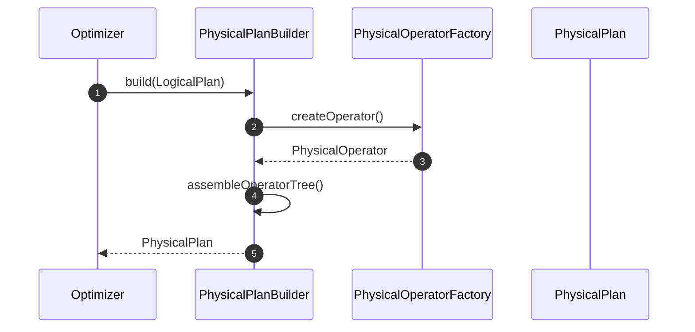

# Sequence Diagrams for Core Features in Query Processor Module

This document contains sequence diagrams for the **core features** of the Query Processor module. Each feature demonstrates one or more design patterns working together rather than illustrating an isolated pattern.

---

# 1. Compile SQL Statement

### Feature
Compile SQL Statement

### Actor
Application / DatabaseServer

### Classes Involved
- QueryProcessor
- Lexer
- SQLParser
- ASTBuilder
- SemanticAnalyzer
- QueryRewriter
- QueryOptimizer
- PlanGenerator

### Design Patterns
- Facade
- Builder
- Interpreter
- Visitor
- Strategy
- Factory Method

---

# 2. Resolve Table Reference

### Feature

Resolve Table Reference

### Actor

QueryProcessor

### Classes

- SemanticAnalyzer
- TableResolver
- MetadataModule
- CatalogManager
- Database
- Schema
- Table

### Design Patterns

- Visitor
- Facade
- Composite

---

# 3. Rewrite Query

### Feature

Rewrite Query

### Design Patterns

- Visitor

---

# 4. Optimize Query

### Feature

Optimize Query

### Design Patterns

- Strategy

- Composite

---

# 5. Build Logical Plan

### Feature

Build Logical Plan

### Design Patterns

- Builder

---

# 6. Build Physical Plan

### Feature

Build Physical Plan

### Design Patterns

- Builder

- Factory Method

