# Sequence Diagrams for Query Processor Module (By Pattern & By Feature)

Tài liệu thể hiện các sơ đồ trình tự (Sequence Diagrams) cho module **Query Processor**, bao gồm 2 phần chính:
- **Phần I: Sơ Đồ Trình Tự Theo Design Pattern** (Đồng nhất 100% với `ListPattern.md`).
- **Phần II: Sơ Đồ Trình Tự Theo Feature Cốt Lõi** (Chuỗi tương tác tính năng thực tế).

---

# PHẦN I: SƠ ĐỒ TRÌNH TỰ THEO DESIGN PATTERN

## 1. Facade & Pipeline Layer

### 1.1. Facade Pattern
* **Pattern**: Facade Pattern
* **Class/Interface Applied**: `QueryProcessor`
* **Method**: `compile(sqlText)`

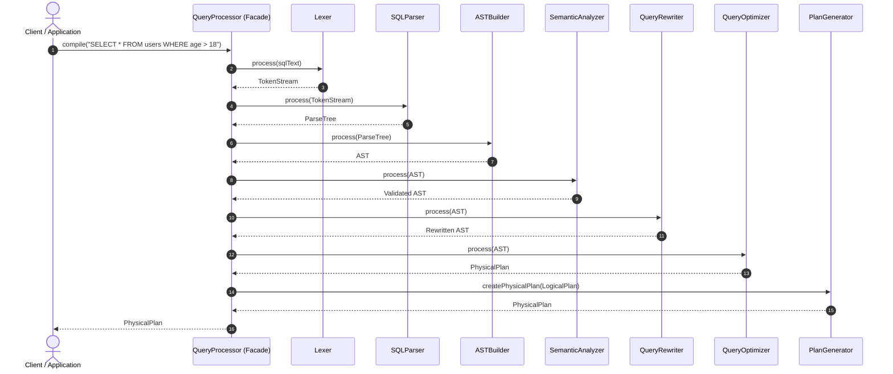
```mermaid
sequenceDiagram
    autonumber
    actor Client as Client / Application
    participant QP as QueryProcessor (Facade)
    participant Lexer as Lexer
    participant Parser as SQLParser
    participant ASTB as ASTBuilder
    participant SA as SemanticAnalyzer
    participant QR as QueryRewriter
    participant Optimizer as QueryOptimizer
    participant PG as PlanGenerator

    Client->>QP: compile("SELECT * FROM users WHERE age > 18")
    QP->>Lexer: process(sqlText)
    Lexer-->>QP: TokenStream
    QP->>Parser: process(TokenStream)
    Parser-->>QP: ParseTree
    QP->>ASTB: process(ParseTree)
    ASTB-->>QP: AST
    QP->>SA: process(AST)
    SA-->>QP: Validated AST
    QP->>QR: process(AST)
    QR-->>QP: Rewritten AST
    QP->>Optimizer: process(AST)
    Optimizer-->>QP: PhysicalPlan
    QP->>PG: createPhysicalPlan(LogicalPlan)
    PG-->>QP: PhysicalPlan
    QP-->>Client: PhysicalPlan
```

---

### 1.2. Chain of Responsibility Pattern
* **Pattern**: Chain of Responsibility Pattern
* **Class/Interface Applied**: `CompilerStage` (Lexer ➔ SQLParser ➔ ASTBuilder ➔ SemanticAnalyzer ➔ QueryRewriter ➔ QueryOptimizer)
* **Method**: `process(input)`

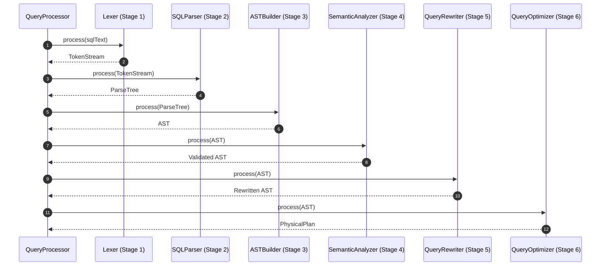
```mermaid
sequenceDiagram
    autonumber
    participant QP as QueryProcessor
    participant Lexer as Lexer (Stage 1)
    participant Parser as SQLParser (Stage 2)
    participant ASTB as ASTBuilder (Stage 3)
    participant SA as SemanticAnalyzer (Stage 4)
    participant QR as QueryRewriter (Stage 5)
    participant Optimizer as QueryOptimizer (Stage 6)

    QP->>Lexer: process(sqlText)
    Lexer-->>QP: TokenStream
    QP->>Parser: process(TokenStream)
    Parser-->>QP: ParseTree
    QP->>ASTB: process(ParseTree)
    ASTB-->>QP: AST
    QP->>SA: process(AST)
    SA-->>QP: Validated AST
    QP->>QR: process(AST)
    QR-->>QP: Rewritten AST
    QP->>Optimizer: process(AST)
    Optimizer-->>QP: PhysicalPlan
```

---

## 2. AST & Syntax Tree Level

### 2.1. Composite Pattern
* **Pattern**: Composite Pattern
* **Class/Interface Applied**: `AST`, `ASTNode`
* **Method**: `accept(visitor)`

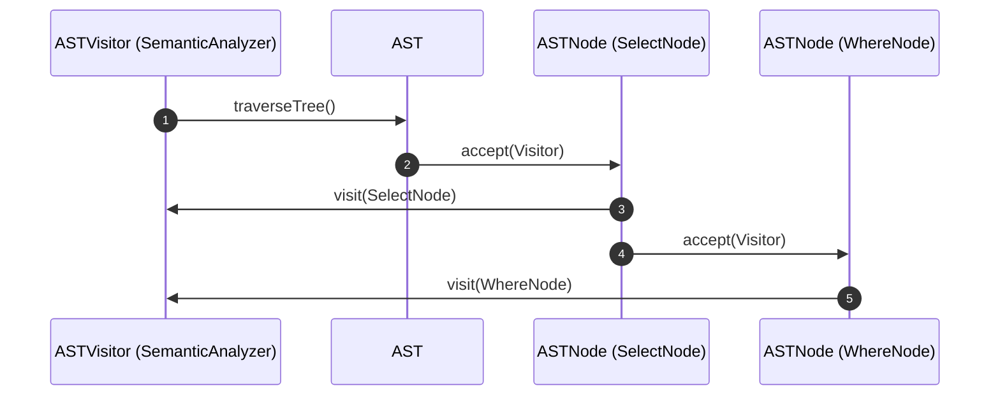
```mermaid
sequenceDiagram
    autonumber
    participant Visitor as ASTVisitor (SemanticAnalyzer)
    participant Tree as AST
    participant RootNode as ASTNode (SelectNode)
    participant ChildNode as ASTNode (WhereNode)

    Visitor->>Tree: traverseTree()
    Tree->>RootNode: accept(Visitor)
    RootNode->>Visitor: visit(SelectNode)
    RootNode->>ChildNode: accept(Visitor)
    ChildNode->>Visitor: visit(WhereNode)
```

---

## 3. Semantic Analysis & Query Rewrite Level

### 3.1. Visitor Pattern
* **Pattern**: Visitor Pattern
* **Class/Interface Applied**: `ASTVisitor` (implemented by `SemanticAnalyzer`, `QueryRewriter`)
* **Method**: `visit(node)`, `analyze(ast)`, `rewrite(ast)`

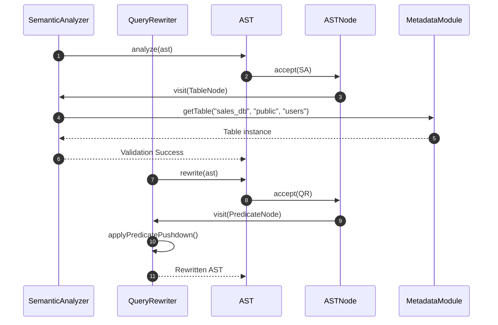
```mermaid
sequenceDiagram
    autonumber
    participant SA as SemanticAnalyzer
    participant QR as QueryRewriter
    participant AST as AST
    participant Node as ASTNode
    participant Meta as MetadataModule

    SA->>AST: analyze(ast)
    AST->>Node: accept(SA)
    Node->>SA: visit(TableNode)
    SA->>Meta: getTable("sales_db", "public", "users")
    Meta-->>SA: Table instance
    SA-->>AST: Validation Success

    QR->>AST: rewrite(ast)
    AST->>Node: accept(QR)
    Node->>QR: visit(PredicateNode)
    QR->>QR: applyPredicatePushdown()
    QR-->>AST: Rewritten AST
```

---

## 4. Query Optimization Level (CBO & Optimization Rules)

### 4.1. Strategy Pattern
* **Pattern**: Strategy Pattern
* **Class/Interface Applied**: `QueryOptimizer` (Strategy Context), `OptimizationRule` (Interface), `CostEstimator`, `PredicatePushdownOptimizer`
* **Method**: `optimize(plan)`, `setOptimizationRule(rule)`, `estimate(plan)`

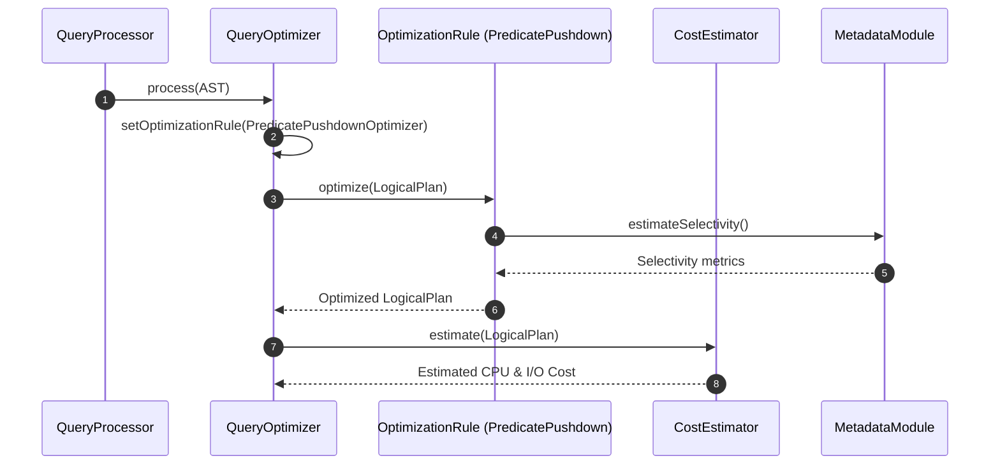
```mermaid
sequenceDiagram
    autonumber
    participant QP as QueryProcessor
    participant Optimizer as QueryOptimizer
    participant Rule as OptimizationRule (PredicatePushdown)
    participant Cost as CostEstimator
    participant Meta as MetadataModule

    QP->>Optimizer: process(AST)
    Optimizer->>Optimizer: setOptimizationRule(PredicatePushdownOptimizer)
    Optimizer->>Rule: optimize(LogicalPlan)
    Rule->>Meta: estimateSelectivity()
    Meta-->>Rule: Selectivity metrics
    Rule-->>Optimizer: Optimized LogicalPlan
    Optimizer->>Cost: estimate(LogicalPlan)
    Cost-->>Optimizer: Estimated CPU & I/O Cost
```

---

## 5. Execution Plan Building & Generation Level

### 5.1. Builder Pattern
* **Pattern**: Builder Pattern
* **Class/Interface Applied**: `LogicalPlanBuilder`, `PhysicalPlanBuilder`
* **Method**: `build(ast)`, `build(logicalPlan)`

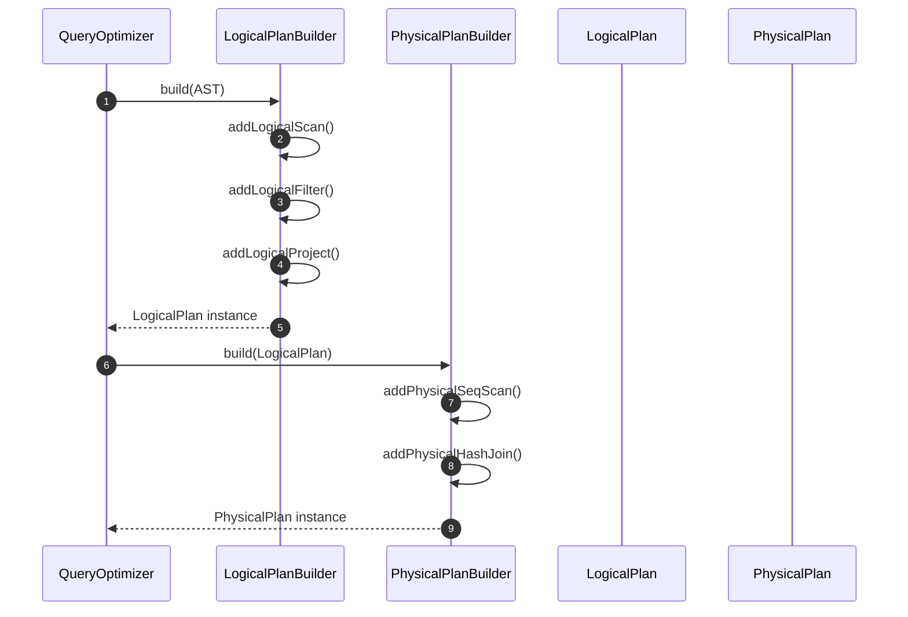
```mermaid
sequenceDiagram
    autonumber
    participant Optimizer as QueryOptimizer
    participant LPB as LogicalPlanBuilder
    participant PPB as PhysicalPlanBuilder
    participant LP as LogicalPlan
    participant PP as PhysicalPlan

    Optimizer->>LPB: build(AST)
    LPB->>LPB: addLogicalScan()
    LPB->>LPB: addLogicalFilter()
    LPB->>LPB: addLogicalProject()
    LPB-->>Optimizer: LogicalPlan instance

    Optimizer->>PPB: build(LogicalPlan)
    PPB->>PPB: addPhysicalSeqScan()
    PPB->>PPB: addPhysicalHashJoin()
    PPB-->>Optimizer: PhysicalPlan instance
```

---

### 5.2. Factory Method Pattern
* **Pattern**: Factory Method Pattern
* **Class/Interface Applied**: `LogicalOperatorFactory`, `PhysicalOperatorFactory`
* **Method**: `createOperator(node)`

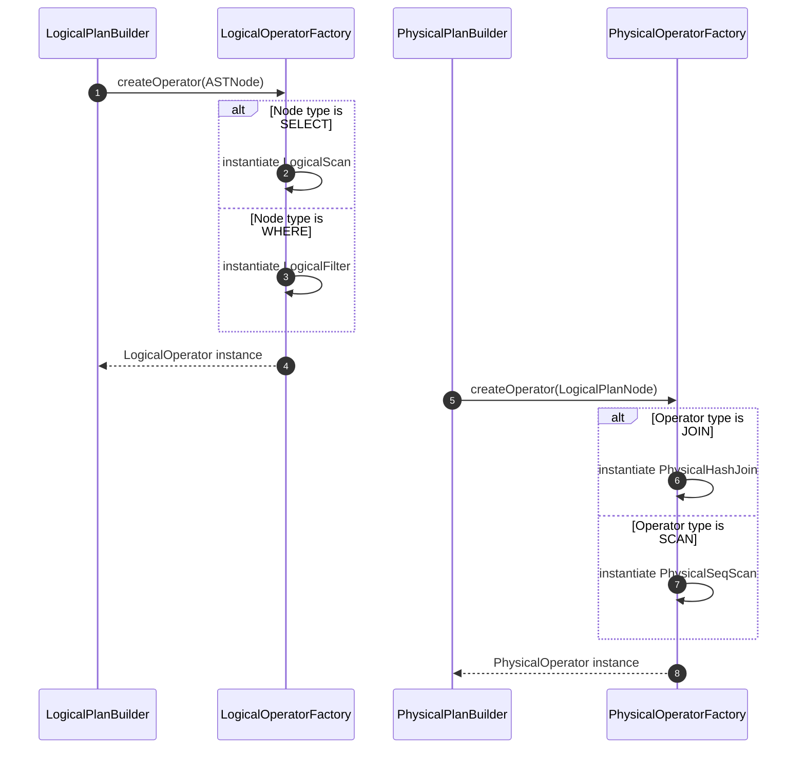
```mermaid
sequenceDiagram
    autonumber
    participant LPB as LogicalPlanBuilder
    participant LOF as LogicalOperatorFactory
    participant PPB as PhysicalPlanBuilder
    participant POF as PhysicalOperatorFactory

    LPB->>LOF: createOperator(ASTNode)
    alt Node type is SELECT
        LOF->>LOF: instantiate LogicalScan
    else Node type is WHERE
        LOF->>LOF: instantiate LogicalFilter
    end
    LOF-->>LPB: LogicalOperator instance

    PPB->>POF: createOperator(LogicalPlanNode)
    alt Operator type is JOIN
        POF->>POF: instantiate PhysicalHashJoin
    else Operator type is SCAN
        POF->>POF: instantiate PhysicalSeqScan
    end
    POF-->>PPB: PhysicalOperator instance
```

---

# PHẦN II: SƠ ĐỒ TRÌNH TỰ THEO FEATURE CỐT LÕI

## 1. Compile SQL Statement
* **Feature**: Compile SQL Statement
* **Actor**: Client / Application
* **Design Patterns**: Facade, Chain of Responsibility, Composite, Visitor, Strategy, Builder, Factory Method

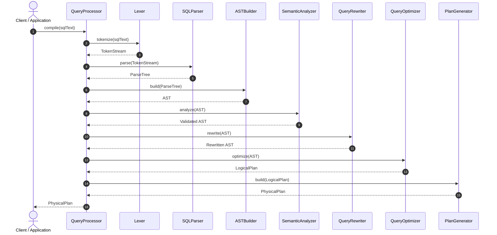
```mermaid
sequenceDiagram
    autonumber
    actor Client as Client / Application
    participant QP as QueryProcessor
    participant Lexer as Lexer
    participant Parser as SQLParser
    participant ASTB as ASTBuilder
    participant SA as SemanticAnalyzer
    participant QR as QueryRewriter
    participant Optimizer as QueryOptimizer
    participant PG as PlanGenerator

    Client->>QP: compile(sqlText)
    QP->>Lexer: tokenize(sqlText)
    Lexer-->>QP: TokenStream
    QP->>Parser: parse(TokenStream)
    Parser-->>QP: ParseTree
    QP->>ASTB: build(ParseTree)
    ASTB-->>QP: AST
    QP->>SA: analyze(AST)
    SA-->>QP: Validated AST
    QP->>QR: rewrite(AST)
    QR-->>QP: Rewritten AST
    QP->>Optimizer: optimize(AST)
    Optimizer-->>QP: LogicalPlan
    QP->>PG: build(LogicalPlan)
    PG-->>QP: PhysicalPlan
    QP-->>Client: PhysicalPlan
```

---

## 2. Resolve Table Reference
* **Feature**: Resolve Table Reference
* **Actor**: QueryProcessor (Internal Pipeline)
* **Design Patterns**: Visitor, Facade, Composite

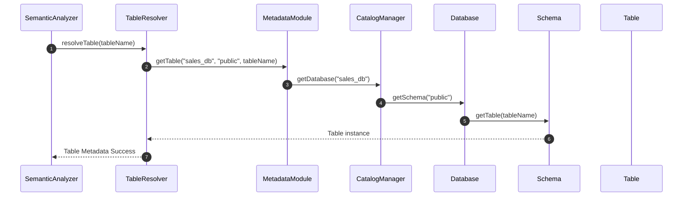
```mermaid
sequenceDiagram
    autonumber
    participant SA as SemanticAnalyzer
    participant Resolver as TableResolver
    participant Meta as MetadataModule
    participant Catalog as CatalogManager
    participant DB as Database
    participant Schema as Schema
    participant Table as Table

    SA->>Resolver: resolveTable(tableName)
    Resolver->>Meta: getTable("sales_db", "public", tableName)
    Meta->>Catalog: getDatabase("sales_db")
    Catalog->>DB: getSchema("public")
    DB->>Schema: getTable(tableName)
    Schema-->>Resolver: Table instance
    Resolver-->>SA: Table Metadata Success
```

---

## 3. Rewrite Query
* **Feature**: Rewrite Query (Predicate Pushdown & Constant Folding)
* **Actor**: QueryProcessor (Internal Pipeline)
* **Design Patterns**: Visitor, Strategy

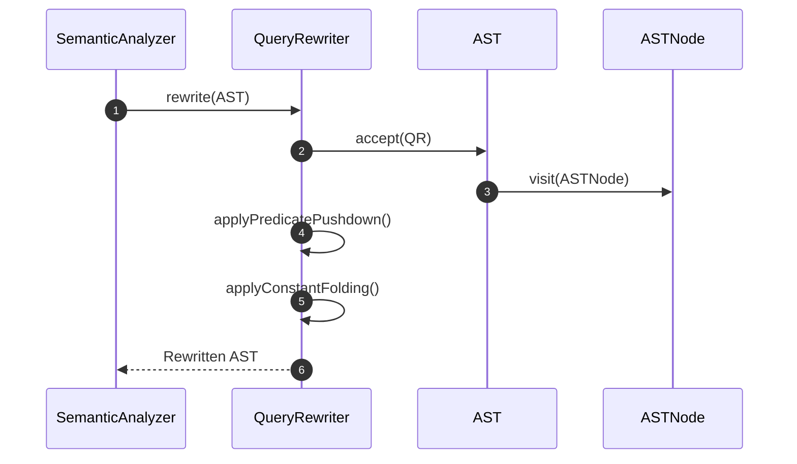
```mermaid
sequenceDiagram
    autonumber
    participant SA as SemanticAnalyzer
    participant QR as QueryRewriter
    participant AST as AST
    participant Node as ASTNode

    SA->>QR: rewrite(AST)
    QR->>AST: accept(QR)
    AST->>Node: visit(ASTNode)
    QR->>QR: applyPredicatePushdown()
    QR->>QR: applyConstantFolding()
    QR-->>SA: Rewritten AST
```

---

## 4. Optimize Query
* **Feature**: Cost-Based Optimization & Cost Estimation
* **Actor**: QueryProcessor (Internal Pipeline)
* **Design Patterns**: Strategy, Composite

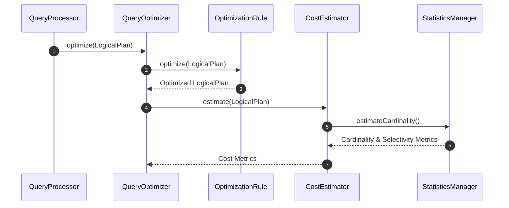
```mermaid
sequenceDiagram
    autonumber
    participant QP as QueryProcessor
    participant Optimizer as QueryOptimizer
    participant Rule as OptimizationRule
    participant Cost as CostEstimator
    participant Stats as StatisticsManager

    QP->>Optimizer: optimize(LogicalPlan)
    Optimizer->>Rule: optimize(LogicalPlan)
    Rule-->>Optimizer: Optimized LogicalPlan
    Optimizer->>Cost: estimate(LogicalPlan)
    Cost->>Stats: estimateCardinality()
    Stats-->>Cost: Cardinality & Selectivity Metrics
    Cost-->>Optimizer: Cost Metrics
```

---

## 5. Build Logical Plan
* **Feature**: Build Logical Plan Tree
* **Actor**: QueryOptimizer
* **Design Patterns**: Builder, Factory Method

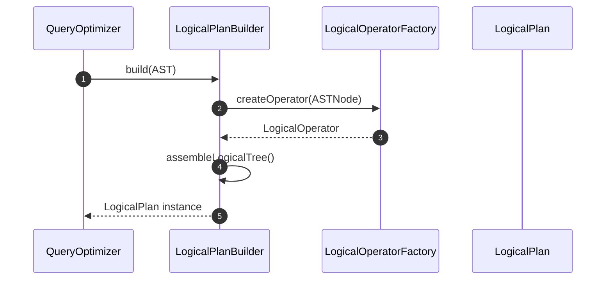
```mermaid
sequenceDiagram
    autonumber
    participant Optimizer as QueryOptimizer
    participant Builder as LogicalPlanBuilder
    participant Factory as LogicalOperatorFactory
    participant LP as LogicalPlan

    Optimizer->>Builder: build(AST)
    Builder->>Factory: createOperator(ASTNode)
    Factory-->>Builder: LogicalOperator
    Builder->>Builder: assembleLogicalTree()
    Builder-->>Optimizer: LogicalPlan instance
```

---

## 6. Build Physical Plan
* **Feature**: Build Physical Plan Tree
* **Actor**: QueryOptimizer
* **Design Patterns**: Builder, Factory Method

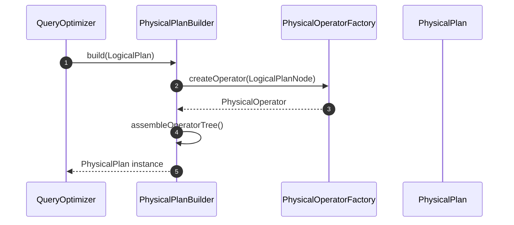
```mermaid
sequenceDiagram
    autonumber
    participant Optimizer as QueryOptimizer
    participant Builder as PhysicalPlanBuilder
    participant Factory as PhysicalOperatorFactory
    participant PP as PhysicalPlan

    Optimizer->>Builder: build(LogicalPlan)
    Builder->>Factory: createOperator(LogicalPlanNode)
    Factory-->>Builder: PhysicalOperator
    Builder->>Builder: assembleOperatorTree()
    Builder-->>Optimizer: PhysicalPlan instance
```