# Sequence Diagrams for Storage Engine Module (By Pattern & By Feature)

Tài liệu thể hiện các sơ đồ trình tự (Sequence Diagrams) cho module **Storage Engine**, bao gồm 2 phần chính:
- **Phần I: Sơ Đồ Trình Tự Theo Design Pattern** (Theo thứ tự: Creational ➔ Structural ➔ Behavioral).
- **Phần II: Sơ Đồ Trình Tự Theo Feature Cốt Lõi** (Chuỗi tương tác tính năng thực tế).

---

# PHẦN I: SƠ ĐỒ TRÌNH TỰ THEO DESIGN PATTERN

## 1. Creational Patterns (Create)

### 1.1. Singleton Pattern
* **Pattern**: Singleton Pattern
* **Class/Interface Applied**: `BufferPoolManager`
* **Method**: `getInstance()`

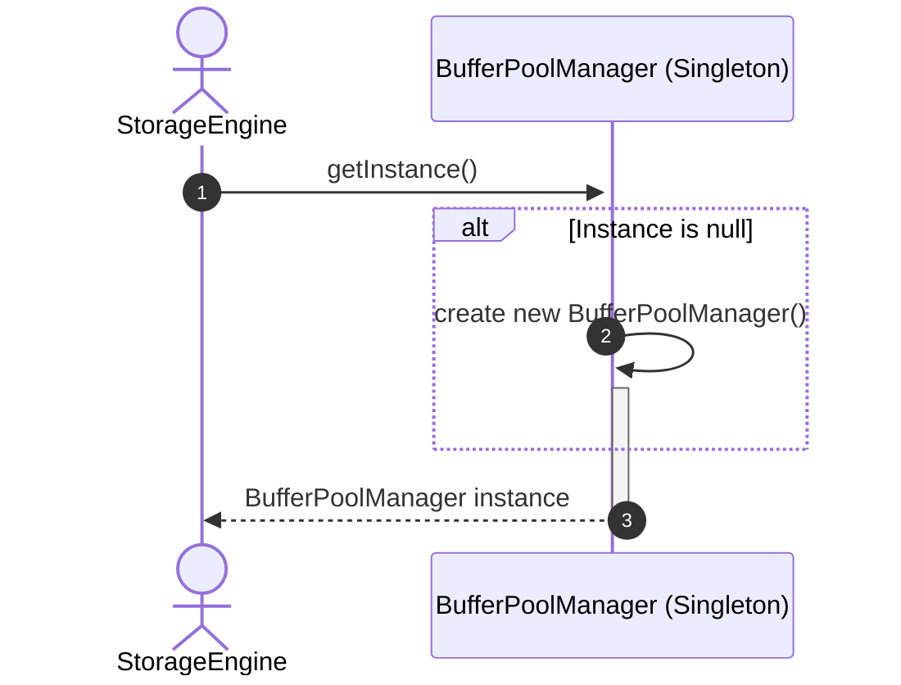

---

### 1.2. Factory Method Pattern
* **Pattern**: Factory Method Pattern
* **Class/Interface Applied**: `PageFactory`
* **Method**: `createPage(pageType)`

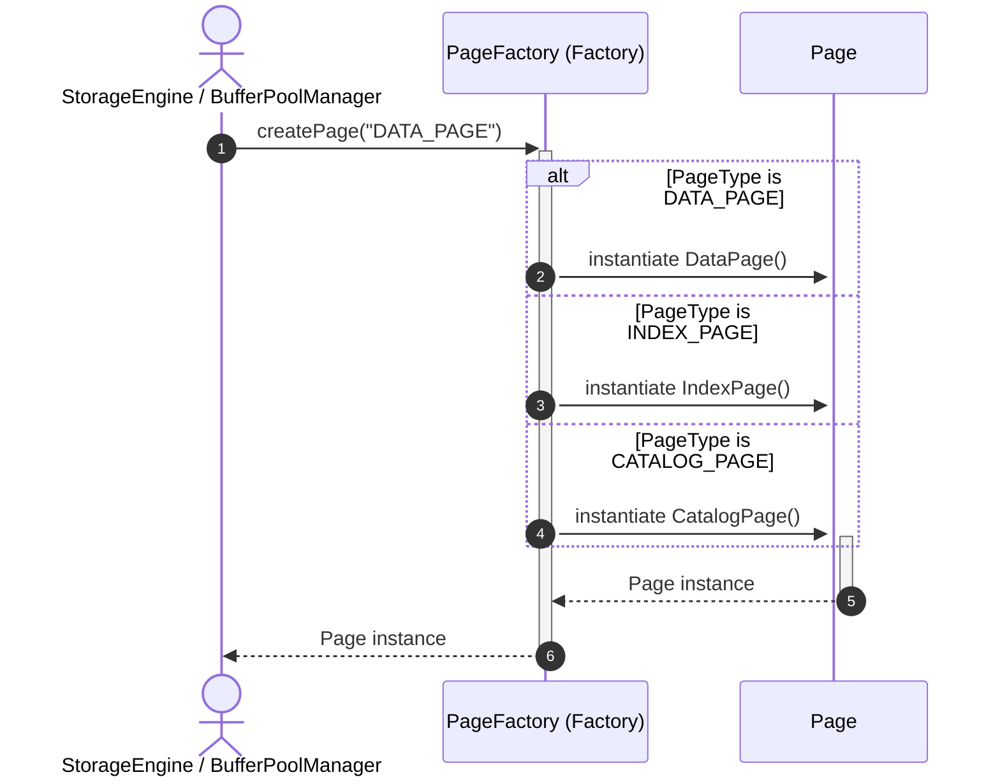

---

### 1.3. Builder Pattern
* **Pattern**: Builder Pattern
* **Class/Interface Applied**: `PageBuilder`
* **Method**: `buildHeader()`, `buildSlots()`, `buildRecords()`, `build()`

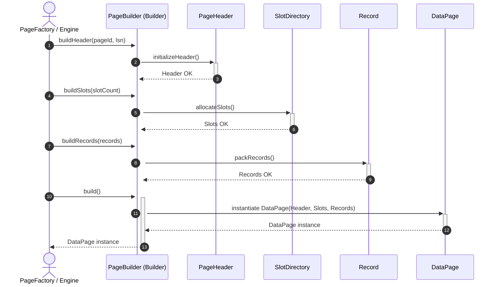

---

## 2. Structural Patterns (Structure)

### 2.1. Facade Pattern
* **Pattern**: Facade Pattern
* **Class/Interface Applied**: `StorageEngine`
* **Method**: `fetchPage(pageId)`

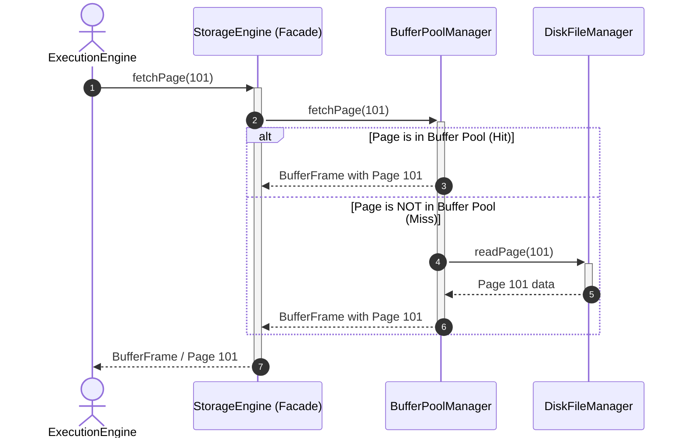

---

### 2.2. Adapter Pattern
* **Pattern**: Adapter Pattern
* **Class/Interface Applied**: `StorageAdapter` (implemented by `LocalDiskAdapter`, `MemoryStorageAdapter`, `CloudStorageAdapter`)
* **Method**: `read(pageId)`, `write(page)`, `flush()`

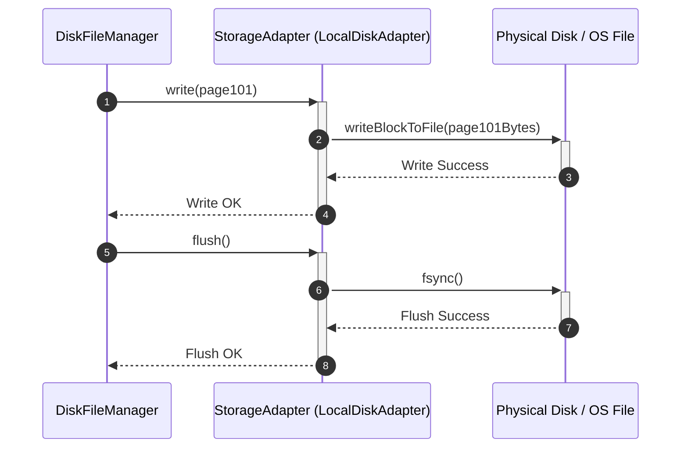

---

### 2.3. Composite Pattern
* **Pattern**: Composite Pattern
* **Class/Interface Applied**: `BTreeNode` (Abstract base for `InternalNode` and `LeafNode`)
* **Method**: `search()`, `insert()`, `split()`

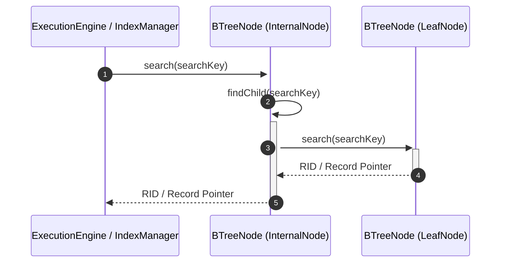

---

## 3. Behavioral Patterns (Behavior)

### 3.1. Strategy Pattern
* **Pattern**: Strategy Pattern
* **Class/Interface Applied**: `PageReplacementStrategy` (Interface implemented by `LRUReplacementStrategy`, `ClockReplacementStrategy`, `FIFOReplacementStrategy`), `ReplacementContext`
* **Method**: `selectVictim()`, `setStrategy()`, `evict()`

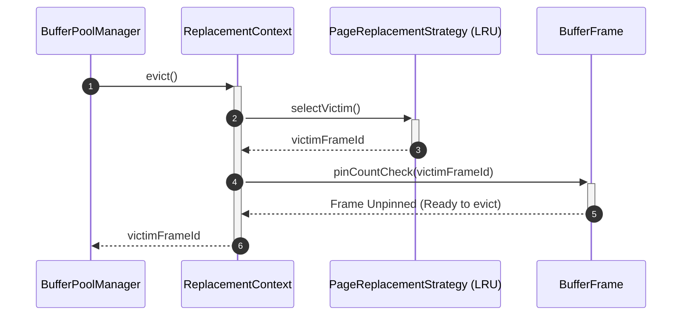

---

### 3.2. State Pattern
* **Pattern**: State Pattern
* **Class/Interface Applied**: `BufferFrame`, `BufferFrameState` (Enum: `CLEAN`, `DIRTY`, `PINNED`, `UNPINNED`)
* **Method**: `pin()`, `unpin()`, `markDirty()`, `setState()`

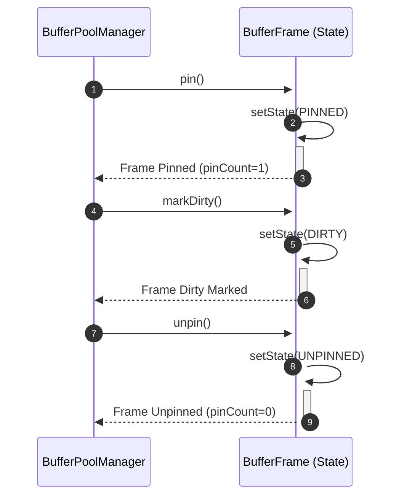

---

### 3.3. Template Method Pattern
* **Pattern**: Template Method Pattern
* **Class/Interface Applied**: `Page` (Abstract Class), `DataPage`
* **Method**: `read()`, `deserialize()`, `modify()`, `serialize()`, `write()`

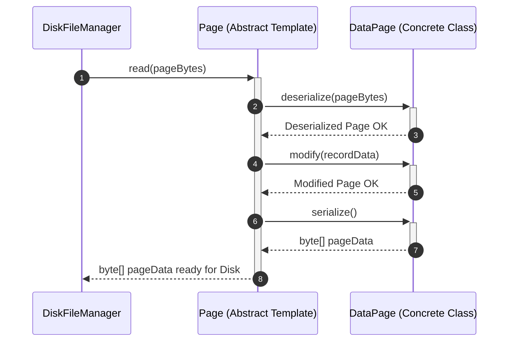

---

### 3.4. Iterator Pattern
* **Pattern**: Iterator Pattern
* **Class/Interface Applied**: `PageIterator`, `BTreeIterator`
* **Method**: `hasNext()`, `next()`

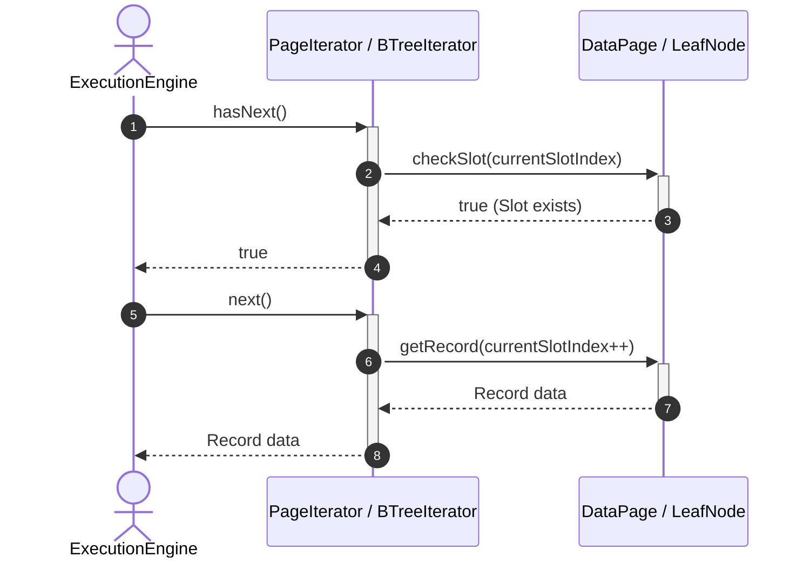

---

# PHẦN II: SƠ ĐỒ TRÌNH TỰ THEO FEATURE CỐT LÕI

## 1. Fetch Page from Storage Engine (Buffer Pool Hit / Miss)
* **Feature**: Fetch Page (Read I/O Workflow)
* **Actor**: ExecutionEngine
* **Design Patterns**: Facade, Singleton, Adapter, State

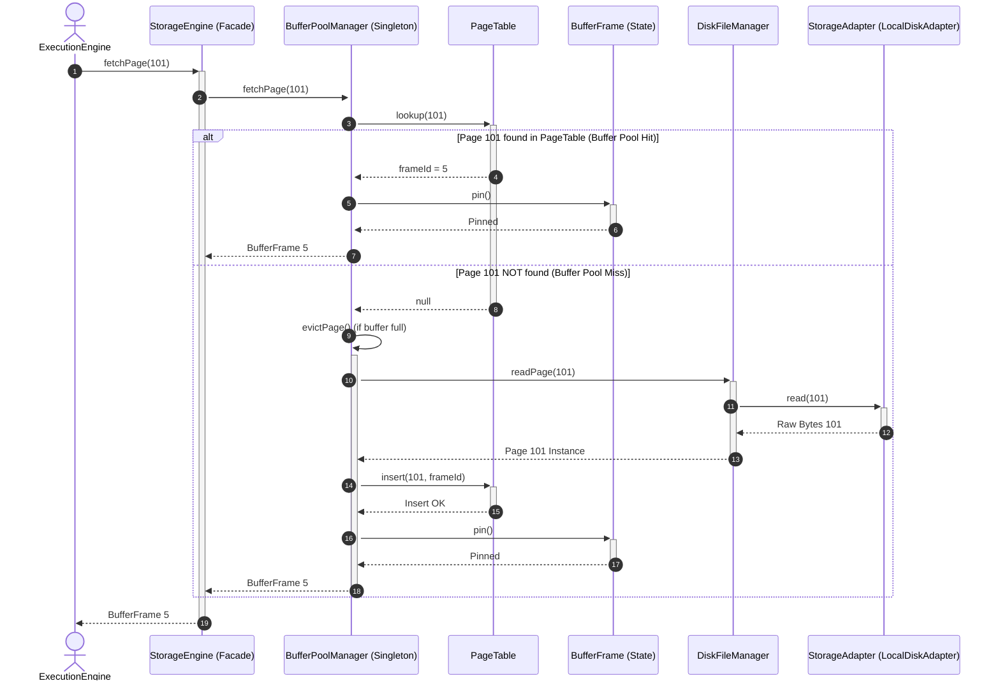

---

## 2. Create & Build New Slotted Data Page
* **Feature**: Create Slotted Data Page
* **Actor**: StorageEngine / PageFactory
* **Design Patterns**: Factory Method, Builder, Template Method

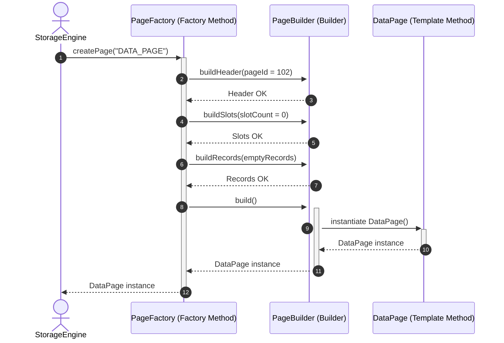

---

## 3. Evict Buffer Page using Strategy Pattern
* **Feature**: Buffer Page Eviction & Dirty Page Flush
* **Actor**: BufferPoolManager
* **Design Patterns**: Singleton, Strategy, State, Adapter

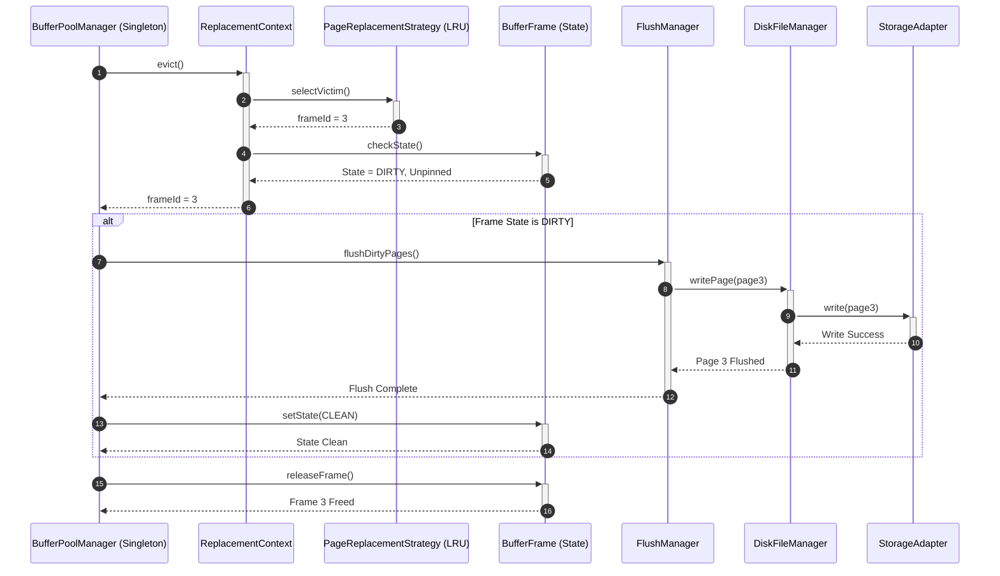

---

## 4. Search Key in B+Tree Index (Composite & Iterator)
* **Feature**: B+Tree Index Range Scan
* **Actor**: ExecutionEngine
* **Design Patterns**: Composite, Iterator

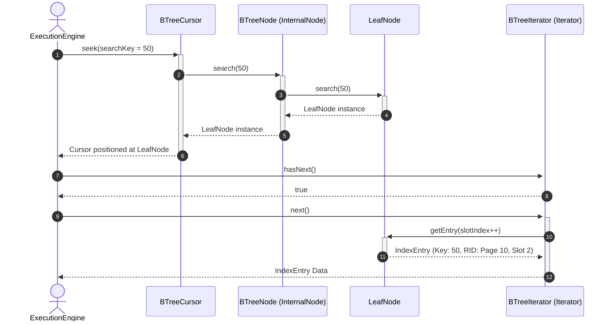

---

## 5. Write Page via Storage Adapter (Local Disk / Memory / Cloud)
* **Feature**: Write Page I/O via Storage Adapter
* **Actor**: StorageEngine / FlushManager
* **Design Patterns**: Facade, Adapter, Template Method

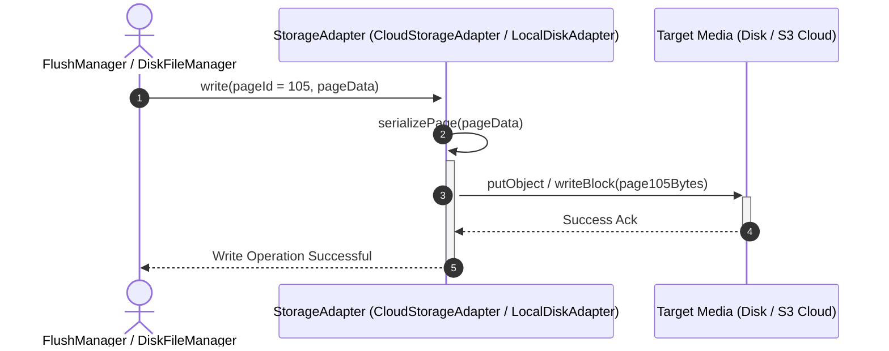
