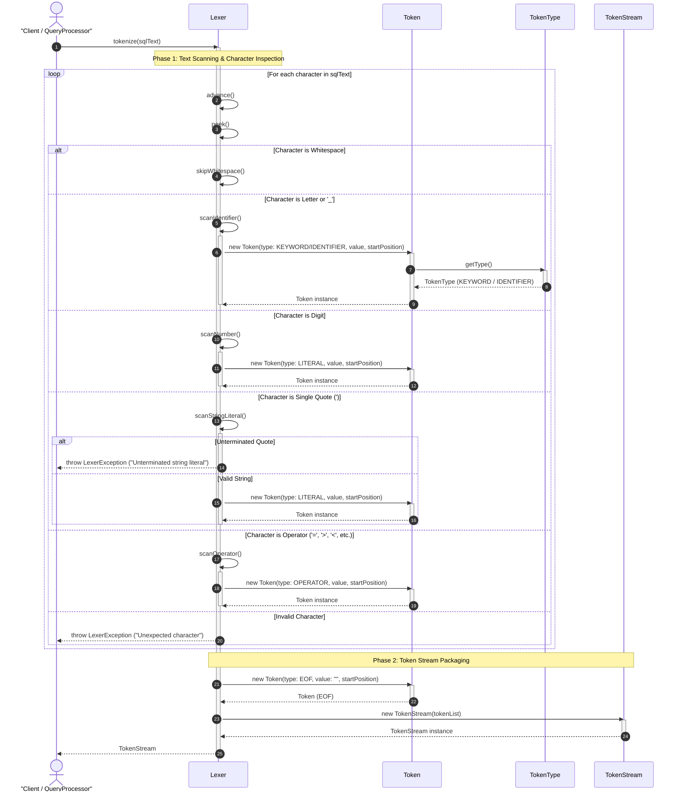

```mermaid
sequenceDiagram
    autonumber
    actor Client as "Client / QueryProcessor"
    participant Lexer as Lexer
    participant Token as Token
    participant TokenType as TokenType
    participant TS as TokenStream

    Client->>Lexer: tokenize(sqlText)
    activate Lexer

    Note over Lexer: Phase 1: Text Scanning & Character Inspection
    loop For each character in sqlText
        Lexer->>Lexer: advance()
        Lexer->>Lexer: peek()
        
        alt Character is Whitespace
            Lexer->>Lexer: skipWhitespace()
        else Character is Letter or '_'
            Lexer->>Lexer: scanIdentifier()
            activate Lexer
            Lexer->>Token: new Token(type: KEYWORD/IDENTIFIER, value, startPosition)
            activate Token
            Token->>TokenType: getType()
            activate TokenType
            TokenType-->>Token: TokenType (KEYWORD / IDENTIFIER)
            deactivate TokenType
            Token-->>Lexer: Token instance
            deactivate Token
            deactivate Lexer
        else Character is Digit
            Lexer->>Lexer: scanNumber()
            activate Lexer
            Lexer->>Token: new Token(type: LITERAL, value, startPosition)
            activate Token
            Token-->>Lexer: Token instance
            deactivate Token
            deactivate Lexer
        else Character is Single Quote (')
            Lexer->>Lexer: scanStringLiteral()
            activate Lexer
            alt Unterminated Quote
                Lexer-->>Client: throw LexerException ("Unterminated string literal")
            else Valid String
                Lexer->>Token: new Token(type: LITERAL, value, startPosition)
                activate Token
                Token-->>Lexer: Token instance
                deactivate Token
            end
            deactivate Lexer
        else Character is Operator ('=', '>', '<', etc.)
            Lexer->>Lexer: scanOperator()
            activate Lexer
            Lexer->>Token: new Token(type: OPERATOR, value, startPosition)
            activate Token
            Token-->>Lexer: Token instance
            deactivate Token
            deactivate Lexer
        else Invalid Character
            Lexer-->>Client: throw LexerException ("Unexpected character")
        end
    end

    Note over Lexer, TS: Phase 2: Token Stream Packaging
    Lexer->>Token: new Token(type: EOF, value: "", startPosition)
    activate Token
    Token-->>Lexer: Token (EOF)
    deactivate Token

    Lexer->>TS: new TokenStream(tokenList)
    activate TS
    TS-->>Lexer: TokenStream instance
    deactivate TS

    Lexer-->>Client: TokenStream
    deactivate Lexer
```
