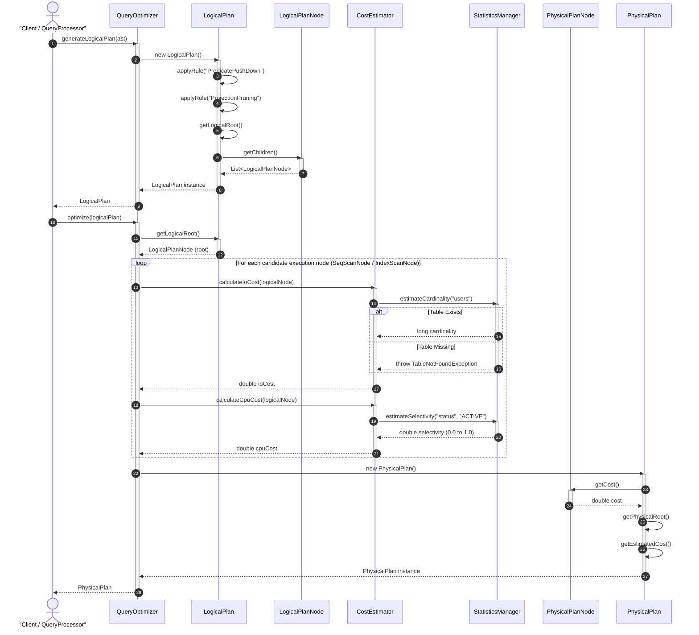

```mermaid
sequenceDiagram
    autonumber
    actor Client as "Client / QueryProcessor"
    participant QO as QueryOptimizer
    participant LP as LogicalPlan
    participant LNode as LogicalPlanNode
    participant CE as CostEstimator
    participant SM as StatisticsManager
    participant PNode as PhysicalPlanNode
    participant PP as PhysicalPlan

    %% =====================================================
    %% GIAI ĐOẠN 1: LOGICAL PLAN GENERATION & RULE APPLICATION
    %% =====================================================
    Client->>QO: generateLogicalPlan(ast)
    activate QO
    
    QO->>LP: new LogicalPlan()
    activate LP
    LP->>LP: applyRule("PredicatePushDown")
    LP->>LP: applyRule("ProjectionPruning")
    LP->>LP: getLogicalRoot()
    LP->>LNode: getChildren()
    activate LNode
    LNode-->>LP: List<LogicalPlanNode>
    deactivate LNode
    LP-->>QO: LogicalPlan instance
    deactivate LP

    QO-->>Client: LogicalPlan
    deactivate QO

    %% =====================================================
    %% GIAI ĐOẠN 2: COST-BASED OPTIMIZATION (CBO) & PHYSICAL PLAN
    %% =====================================================
    Client->>QO: optimize(logicalPlan)
    activate QO

    QO->>LP: getLogicalRoot()
    activate LP
    LP-->>QO: LogicalPlanNode (root)
    deactivate LP

    loop For each candidate execution node (SeqScanNode / IndexScanNode)
        %% IO Cost Calculation
        QO->>CE: calculateIoCost(logicalNode)
        activate CE
        CE->>SM: estimateCardinality("users")
        activate SM
        alt Table Exists
            SM-->>CE: long cardinality
        else Table Missing
            SM-->>CE: throw TableNotFoundException
        end
        deactivate SM
        CE-->>QO: double ioCost
        deactivate CE

        %% CPU Cost Calculation
        QO->>CE: calculateCpuCost(logicalNode)
        activate CE
        CE->>SM: estimateSelectivity("status", "ACTIVE")
        activate SM
        SM-->>CE: double selectivity (0.0 to 1.0)
        deactivate SM
        CE-->>QO: double cpuCost
        deactivate CE
    end

    %% Physical Plan Generation & Cost Aggregation
    QO->>PP: new PhysicalPlan()
    activate PP
    PP->>PNode: getCost()
    activate PNode
    PNode-->>PP: double cost
    deactivate PNode

    PP->>PP: getPhysicalRoot()
    PP->>PP: getEstimatedCost()
    PP-->>QO: PhysicalPlan instance
    deactivate PP

    QO-->>Client: PhysicalPlan
    deactivate QO
```
