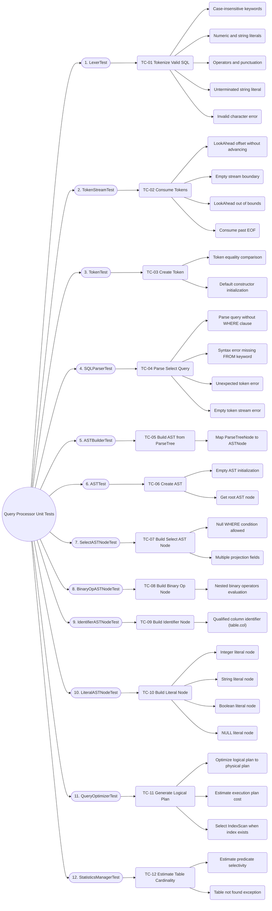
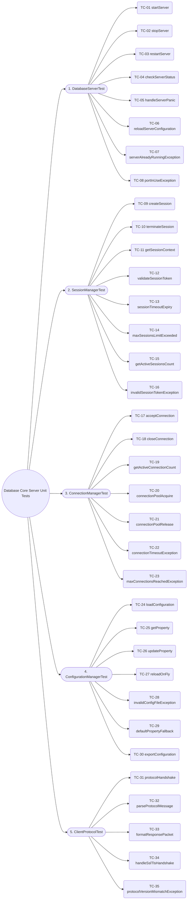
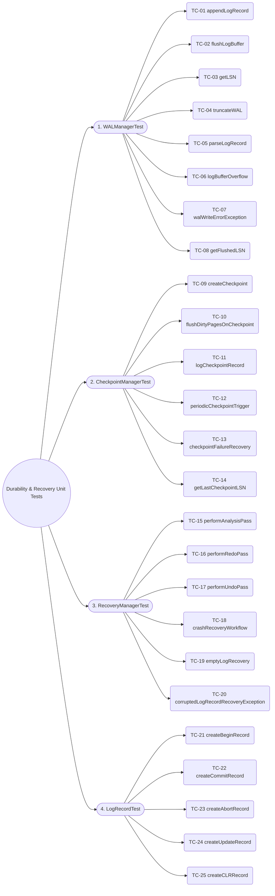
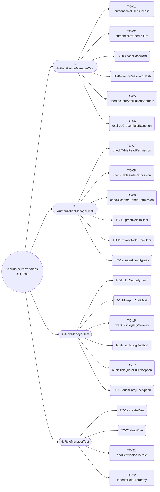
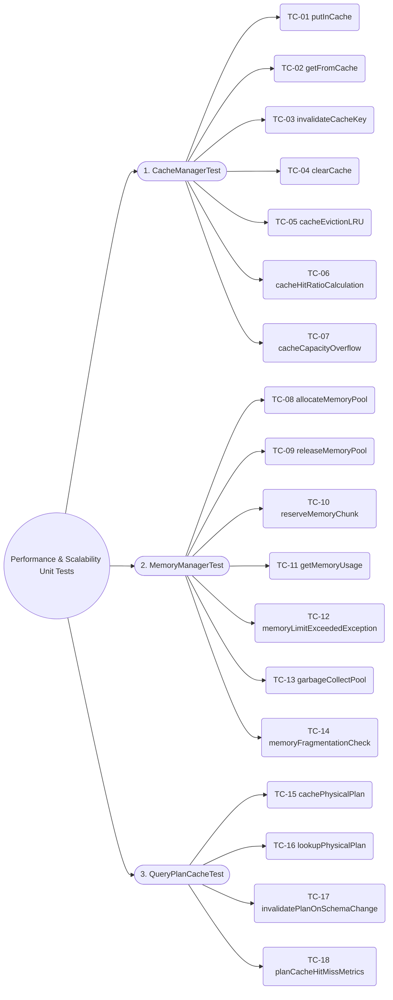
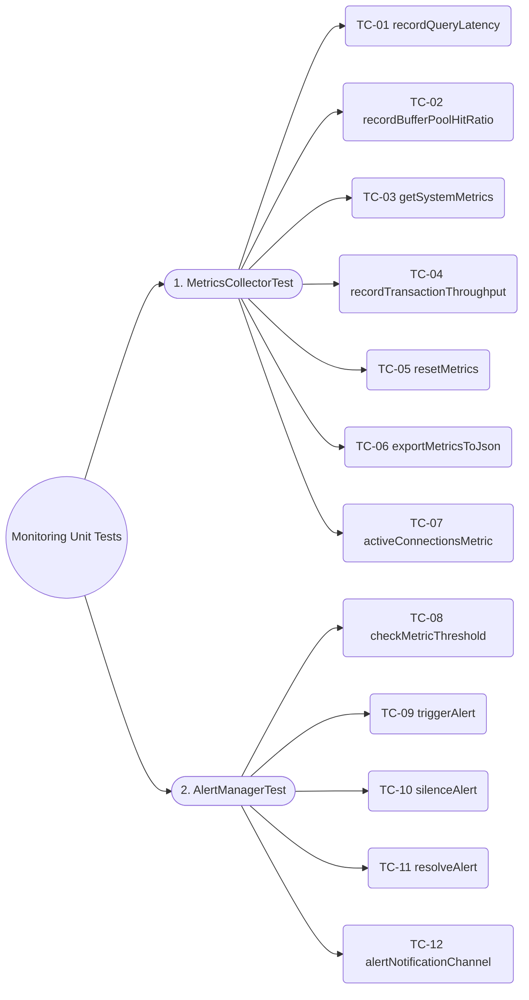
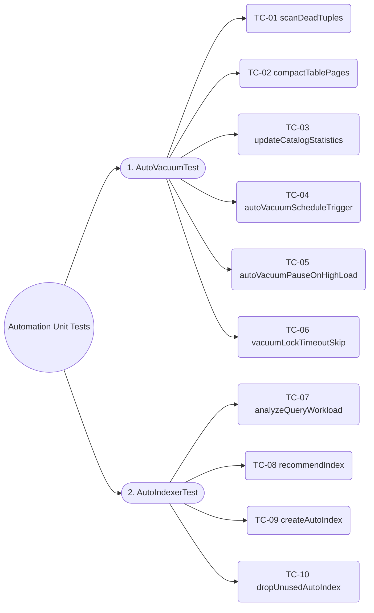

# DBMS Unit Test Scenarios & Test Coverage Architecture

This document provides a comprehensive roadmap of all unit test scenarios across all DBMS system modules and class/interface components.
---

## 1. Summary Testcase Statistics Tables

### Table 1: Summary Statistics by Module

| STT | Module | Number of Test Classes | Total Testcases | Status |
|:---:|:---|:---:|:---:|:---:|
| 1 | Metadata | 12 | 79 | Done |
| 2 | Query Processor | 12 | 43 | Doing |
| 3 | Database Core Server | 5 | 35 | Planned |
| 4 | Execution Engine | 9 | 55 | Planned |
| 5 | Storage Engine | 10 | 65 | Planned |
| 6 | Durability & Recovery | 4 | 25 | Planned |
| 7 | Security & Permissions | 4 | 22 | Planned |
| 8 | Performance & Scalability | 3 | 18 | Planned |
| 9 | Monitoring | 2 | 12 | Planned |
| 10 | Automation | 2 | 10 | Planned |
| **Total** | **10 Modules** | **59 Classes** | **320 Testcases** | |

---

## 2. Master System Unit Test Suite Flowchart

---

## 3. Module Unit Test Flowcharts

### 3.1. Metadata Module (`Metadata`)

```mermaid
flowchart LR
    Root(("Metadata Unit Tests"))

    %% =====================================================
    %% Categories
    %% =====================================================

    Cat1(["1. CatalogManagerTest"])
    Cat2(["2. DatabaseTest"])
    Cat3(["3. SchemaTest"])
    Cat4(["4. TableTest"])
    Cat5(["5. ColumnTest"])
    Cat6(["6. IndexTest"])
    Cat7(["7. ConstraintTest"])
    Cat8(["8. MetadataModuleTest"])
    Cat9(["9. DDLCommandTest"])
    Cat10(["10. ColumnBuilderTest"])
    Cat11(["11. TableMementoTest"])
    Cat12(["12. ConstraintValidationChainTest"])

    Root --> Cat1
    Root --> Cat2
    Root --> Cat3
    Root --> Cat4
    Root --> Cat5
    Root --> Cat6
    Root --> Cat7
    Root --> Cat8
    Root --> Cat9
    Root --> Cat10
    Root --> Cat11
    Root --> Cat12

    %% =====================================================
    %% CatalogManager
    %% =====================================================

    Cat1 --> TC01("TC-01 CreateDatabase")
    TC01 --> TC01A("Database already exists")
    TC01 --> TC01B("Invalid database name")
    TC01 --> TC01C("Permission denied")
    TC01 --> TC01D("Special characters")
    TC01 --> TC01E("Rename database valid")
    TC01 --> TC01F("Rename old database missing")
    TC01 --> TC01G("Rename new database duplicate")

    Cat1 --> TC02("TC-02 DropDatabase")
    TC02 --> TC02A("Database not found")
    TC02 --> TC02B("Database not empty")
    TC02 --> TC02C("Permission denied")

    Cat1 --> TC03("TC-03 ListDatabases")

    Cat1 --> TC04("TC-04 ClearCatalog")

    %% =====================================================
    %% Database
    %% =====================================================

    Cat2 --> TC05("TC-05 CreateSchema")
    TC05 --> TC05A("Schema already exists")
    TC05 --> TC05B("Database offline")
    TC05 --> TC05C("Permission denied")
    TC05 --> TC05D("Special characters")

    Cat2 --> TC06("TC-06 RenameDatabase")
    TC06 --> TC06A("Duplicate database name")
    TC06 --> TC06B("Invalid name")
    TC06 --> TC06C("Rename schema in database")

    %% =====================================================
    %% Schema
    %% =====================================================

    Cat3 --> TC07("TC-07 CreateTable")
    TC07 --> TC07A("Table already exists")
    TC07 --> TC07B("Permission denied")
    TC07 --> TC07C("Schema read-only")
    TC07 --> TC07D("Special characters")

    Cat3 --> TC08("TC-08 RenameSchema")
    TC08 --> TC08A("Schema not found")
    TC08 --> TC08B("Create view in schema")

    %% =====================================================
    %% Table
    %% =====================================================

    Cat4 --> TC09("TC-09 AddColumn")
    TC09 --> TC09A("Column already exists")
    TC09 --> TC09B("Table locked")
    TC09 --> TC09C("Permission denied")
    TC09 --> TC09D("Special characters")
    TC09 --> TC09E("Create column facade")

    Cat4 --> TC10("TC-10 RemoveColumn")
    TC10 --> TC10A("Column not found")
    TC10 --> TC10B("Referenced by constraint")
    TC10 --> TC10E("Table locked when remove column")
    TC10 --> TC10F("Invalid column name when remove column")

    %% =====================================================
    %% Column
    %% =====================================================

    Cat5 --> TC11("TC-11 ChangeDataType")
    TC11 --> TC11A("Unsupported conversion")
    TC11 --> TC11B("Permission denied")

    Cat5 --> TC12("TC-12 SetDefaultValue")
    TC12 --> TC12A("Invalid default value")

    %% =====================================================
    %% Index
    %% =====================================================

    Cat6 --> TC13("TC-13 AddIndex")
    TC13 --> TC13A("Duplicate index")
    TC13 --> TC13B("Invalid indexed column")
    TC13 --> TC13D("Remove index")
    TC13 --> TC13E("Index not found when remove index")
    TC13 --> TC13F("Table locked when remove index")
    TC13 --> TC13G("Invalid index name format")

    Cat6 --> TC14("TC-14 RebuildIndex")
    TC14 --> TC14A("Disabled index")

    %% =====================================================
    %% Constraint
    %% =====================================================

    Cat7 --> TC15("TC-15 ValidateConstraint")
    TC15 --> TC15B("Remove constraint")
    TC15 --> TC15C("Constraint not found when remove constraint")
    TC15 --> TC15D("Table locked when remove constraint")

    Cat7 --> TC16("TC-16 ValidateForeignKey")
    TC16 --> TC16A("Referenced table missing")
    TC16 --> TC16B("Referenced column missing")
    TC16 --> TC16C("Parent row missing")

    Cat7 --> TC17("TC-17 EvaluateCheckConstraint")
    TC17 --> TC17A("Expression invalid")

    %% =====================================================
    %% MetadataModule
    %% =====================================================

    Cat8 --> TC18("TC-18 GetTableFacade")
    Cat8 --> TC18A("ExecuteDDLFacade")

    %% =====================================================
    %% DDLCommand
    %% =====================================================

    Cat9 --> TC19("TC-19 DDLCommandExecution")
    TC19 --> TC19A("CreateDatabaseCommand")
    TC19 --> TC19B("DropDatabaseCommand")
    TC19 --> TC19C("RenameDatabaseCommand")
    TC19 --> TC19D("CreateSchemaCommand")
    TC19 --> TC19E("DropSchemaCommand")
    TC19 --> TC19F("RenameSchemaCommand")
    TC19 --> TC19G("CreateTableCommand")
    TC19 --> TC19H("DropTableCommand")
    TC19 --> TC19I("RenameTableCommand")
    TC19 --> TC19J("CreateColumnCommand")
    TC19 --> TC19K("DropColumnCommand")
    TC19 --> TC19L("RenameColumnCommand")

    %% =====================================================
    %% ColumnBuilder
    %% =====================================================

    Cat10 --> TC20("TC-20 BuildColumn")
    TC20 --> TC20A("BuildColumnDefaults")

    %% =====================================================
    %% TableMemento
    %% =====================================================

    Cat11 --> TC21("TC-21 MementoSnapshotRestore")

    %% =====================================================
    %% ConstraintValidationChain
    %% =====================================================

    Cat12 --> TC22("TC-22 ValidateChainPass")
    TC22 --> TC22A("ValidateChainFail")
```

---

### 3.2. Query Processor Module (`QueryProcessor`)

---

### 3.3. Database Core Server Module (`DatabaseCoreServer`)

---

### 3.4. Execution Engine Module (`ExecutionEngine`)

```mermaid
flowchart LR
    Root(("Execution Engine Unit Tests"))

    Cat1(["1. ExecutionPlannerTest"])
    Cat2(["2. ExecutionContextTest"])
    Cat3(["3. QueryExecutorTest"])
    Cat4(["4. ScanOperatorTest"])
    Cat5(["5. FilterOperatorTest"])
    Cat6(["6. JoinOperatorTest"])
    Cat7(["7. AggregateOperatorTest"])
    Cat8(["8. SortOperatorTest"])
    Cat9(["9. ResultSetTest"])

    Root --> Cat1
    Root --> Cat2
    Root --> Cat3
    Root --> Cat4
    Root --> Cat5
    Root --> Cat6
    Root --> Cat7
    Root --> Cat8
    Root --> Cat9

    Cat1 --> TC01("TC-01 createExecutionPlan")
    Cat1 --> TC02("TC-02 validateExecutionPlan")
    Cat1 --> TC03("TC-03 pushDownPredicates")
    Cat1 --> TC04("TC-04 costBasedPlanSelection")
    Cat1 --> TC05("TC-05 unsupportedPlanException")
    Cat1 --> TC06("TC-06 optimizeSubqueryPlan")

    Cat2 --> TC07("TC-07 initializeContext")
    Cat2 --> TC08("TC-08 setVariable")
    Cat2 --> TC09("TC-09 getVariable")
    Cat2 --> TC10("TC-10 getTransactionContext")
    Cat2 --> TC11("TC-11 clearVariable")
    Cat2 --> TC12("TC-12 contextMemoryQuotaExceeded")

    Cat3 --> TC13("TC-13 executeQuery")
    Cat3 --> TC14("TC-14 executeUpdate")
    Cat3 --> TC15("TC-15 executeBatch")
    Cat3 --> TC16("TC-16 cancelExecution")
    Cat3 --> TC17("TC-17 queryExecutionTimeout")
    Cat3 --> TC18("TC-18 queryExecutionError")
    Cat3 --> TC19("TC-19 getExecutionMetrics")

    Cat4 --> TC20("TC-20 seqScanFetchNext")
    Cat4 --> TC21("TC-21 seqScanFilterPredicate")
    Cat4 --> TC22("TC-22 seqScanEmptyTable")
    Cat4 --> TC23("TC-23 indexScanFetchNext")
    Cat4 --> TC24("TC-24 indexScanKeyLookup")
    Cat4 --> TC25("TC-25 indexScanRangeScan")

    Cat5 --> TC26("TC-26 filterEvaluateTrue")
    Cat5 --> TC27("TC-27 filterEvaluateFalse")
    Cat5 --> TC28("TC-28 filterNullValue")
    Cat5 --> TC29("TC-29 filterCompositePredicate")
    Cat5 --> TC30("TC-30 filterExpressionError")

    Cat6 --> TC31("TC-31 nestedLoopJoinMatch")
    Cat6 --> TC32("TC-32 nestedLoopJoinEmpty")
    Cat6 --> TC33("TC-33 hashJoinBuildTable")
    Cat6 --> TC34("TC-34 hashJoinProbeTable")
    Cat6 --> TC35("TC-35 hashJoinNullKey")
    Cat6 --> TC36("TC-36 sortMergeJoin")

    Cat7 --> TC37("TC-37 countAggregate")
    Cat7 --> TC38("TC-38 sumAggregate")
    Cat7 --> TC39("TC-39 avgAggregate")
    Cat7 --> TC40("TC-40 minMaxAggregate")
    Cat7 --> TC41("TC-41 groupByAggregation")
    Cat7 --> TC42("TC-42 emptyGroupAggregate")

    Cat8 --> TC43("TC-43 sortAscending")
    Cat8 --> TC44("TC-44 sortDescending")
    Cat8 --> TC45("TC-45 sortMultipleColumns")
    Cat8 --> TC46("TC-46 externalSortDiskOverflow")
    Cat8 --> TC47("TC-47 sortEmptyResult")
    Cat8 --> TC48("TC-48 sortNullFirstLast")

    Cat9 --> TC49("TC-49 fetchNextRow")
    Cat9 --> TC50("TC-50 getColumnValue")
    Cat9 --> TC51("TC-51 closeResultSet")
    Cat9 --> TC52("TC-52 getResultSetMetadata")
    Cat9 --> TC53("TC-53 scrollResultSet")
    Cat9 --> TC54("TC-54 fetchPastLastRowException")
    Cat9 --> TC55("TC-55 typeMismatchException")
```

---

### 3.5. Storage Engine Module (`StorageEngine`)

```mermaid
flowchart LR
    Root(("Storage Engine Unit Tests"))

    Cat1(["1. FileManagerTest"])
    Cat2(["2. PageManagerTest"])
    Cat3(["3. BufferPoolManagerTest"])
    Cat4(["4. BufferPoolTest"])
    Cat5(["5. BufferFrameTest"])
    Cat6(["6. DataPageTest"])
    Cat7(["7. PageReplacerTest"])
    Cat8(["8. LockManagerTest"])
    Cat9(["9. LockTableTest"])
    Cat10(["10. TransactionManagerTest"])

    Root --> Cat1
    Root --> Cat2
    Root --> Cat3
    Root --> Cat4
    Root --> Cat5
    Root --> Cat6
    Root --> Cat7
    Root --> Cat8
    Root --> Cat9
    Root --> Cat10

    Cat1 --> TC01("TC-01 createDataFile")
    Cat1 --> TC02("TC-02 readBlock")
    Cat1 --> TC03("TC-03 writeBlock")
    Cat1 --> TC04("TC-04 deleteDataFile")
    Cat1 --> TC05("TC-05 extendFile")
    Cat1 --> TC06("TC-06 seekBlockPosition")
    Cat1 --> TC07("TC-07 diskFullException")
    Cat1 --> TC08("TC-08 fileNotFoundException")

    Cat2 --> TC09("TC-09 allocatePage")
    Cat2 --> TC10("TC-10 deallocatePage")
    Cat2 --> TC11("TC-11 getPageHeader")
    Cat2 --> TC12("TC-12 updatePageHeader")
    Cat2 --> TC13("TC-13 formatDataPage")
    Cat2 --> TC14("TC-14 checkPageChecksum")
    Cat2 --> TC15("TC-15 corruptedPageChecksumException")

    Cat3 --> TC16("TC-16 fetchPageFromBuffer")
    Cat3 --> TC17("TC-17 flushDirtyPage")
    Cat3 --> TC18("TC-18 unpinFrame")
    Cat3 --> TC19("TC-19 flushAllPages")
    Cat3 --> TC20("TC-20 pinCountManagement")
    Cat3 --> TC21("TC-21 bufferPoolCapacityFull")
    Cat3 --> TC22("TC-22 fetchNonExistentPageException")

    Cat4 --> TC23("TC-23 allocateFrames")
    Cat4 --> TC24("TC-24 getFrame")
    Cat4 --> TC25("TC-25 evictFrame")
    Cat4 --> TC26("TC-26 markFrameDirty")
    Cat4 --> TC27("TC-27 clearPool")

    Cat5 --> TC28("TC-28 pinFrame")
    Cat5 --> TC29("TC-29 unpinFrame")
    Cat5 --> TC30("TC-30 isDirty")
    Cat5 --> TC31("TC-31 getPageId")
    Cat5 --> TC32("TC-32 getContent")

    Cat6 --> TC33("TC-33 insertRecord")
    Cat6 --> TC34("TC-34 updateRecord")
    Cat6 --> TC35("TC-35 deleteRecord")
    Cat6 --> TC36("TC-36 compactPage")
    Cat6 --> TC37("TC-37 getRecordSlot")
    Cat6 --> TC38("TC-38 pageOverflowException")

    Cat7 --> TC39("TC-39 clockSelectVictim")
    Cat7 --> TC40("TC-40 clockAdvanceHand")
    Cat7 --> TC41("TC-41 clockSecondChanceFlag")
    Cat7 --> TC42("TC-42 allFramesPinnedException")
    Cat7 --> TC43("TC-43 fifoReplacerFallback")
    Cat7 --> TC44("TC-44 lruReplacerPolicy")

    Cat8 --> TC45("TC-45 acquireSharedLock")
    Cat8 --> TC46("TC-46 acquireExclusiveLock")
    Cat8 --> TC47("TC-47 releaseLock")
    Cat8 --> TC48("TC-48 promoteLock")
    Cat8 --> TC49("TC-49 checkLockConflict")
    Cat8 --> TC50("TC-50 lockTimeoutException")
    Cat8 --> TC51("TC-51 detectDeadlockCycle")
    Cat8 --> TC52("TC-52 lockUpgradeException")

    Cat9 --> TC53("TC-53 addLockEntry")
    Cat9 --> TC54("TC-54 removeLockEntry")
    Cat9 --> TC55("TC-55 getWaitingTransactions")
    Cat9 --> TC56("TC-56 isLockedByTransaction")
    Cat9 --> TC57("TC-57 clearLockTable")

    Cat10 --> TC58("TC-58 beginTransaction")
    Cat10 --> TC59("TC-59 commitTransaction")
    Cat10 --> TC60("TC-60 rollbackTransaction")
    Cat10 --> TC61("TC-61 setSavepoint")
    Cat10 --> TC62("TC-62 rollbackToSavepoint")
    Cat10 --> TC63("TC-63 getTransactionState")
    Cat10 --> TC64("TC-64 transactionAbortedStateException")
    Cat10 --> TC65("TC-65 concurrentTransactionsIsolation")
```

---

### 3.6. Durability & Recovery Data Module (`DurabilityData`)

---

### 3.7. Security & Permissions Module (`SecurityPermission`)

---

### 3.8. Performance & Scalability Module (`PerformanceScalability`)

---

### 3.9. Monitoring Module (`Monitoring`)

---

### 3.10. Automation Module (`Automation`)

