# DBMS Unit Test Scenarios & Test Coverage Architecture

This document provides a roadmap of all unit test scenarios across all DBMS system modules defined in [HighLevel.md](file:///d:/BBV/Database_Management_BBV/docs/class_diagram/HighLevel.md).

---

## 1. Summary Testcase Statistics Tables

### Table 1: Summary Statistics by Module

| STT | Module | Number of Test Classes | Total Testcases | Status |
|:---:|:---|:---:|:---:|:---:|
| 1 | Metadata | 7 | 33 | Doing |
| 2 | Query Processor | 8 | 22 | Doing |
| 3 | Database Core Server | 4 | 12 | Planned |
| 4 | Execution Engine | 5 | 14 | Planned |
| 5 | Storage Engine | 6 | 14 | Planned |
| 6 | Durability & Recovery | 3 | 8 | Planned |
| 7 | Security & Permissions | 3 | 6 | Planned |
| 8 | Performance & Scalability | 2 | 5 | Planned |
| 9 | Monitoring | 1 | 3 | Planned |
| 10 | Automation | 1 | 3 | Planned |
| **Total** | **10 Modules** | **40 Classes** | **120 Testcases** | |

---

### Table 2: Detailed Statistics by Test Class

| Module | Test Class | Testcases Count |
|:---|:---|:---:|
| Metadata | CatalogManagerTest | 8 |
| Metadata | DatabaseTest | 5 |
| Metadata | SchemaTest | 4 |
| Metadata | TableTest | 5 |
| Metadata | ColumnTest | 3 |
| Metadata | IndexTest | 3 |
| Metadata | ConstraintTest | 5 |
| Query Processor | LexerTest | 2 |
| Query Processor | TokenStreamTest | 4 |
| Query Processor | TokenTest | 2 |
| Query Processor | SQLParserTest | 3 |
| Query Processor | ASTTest | 2 |
| Query Processor | ASTNodeTest | 4 |
| Query Processor | QueryOptimizerTest | 3 |
| Query Processor | StatisticsManagerTest | 2 |
| Database Core Server | DatabaseServerTest | 3 |
| Database Core Server | SessionManagerTest | 3 |
| Database Core Server | ConnectionManagerTest | 3 |
| Database Core Server | ConfigurationManagerTest | 3 |
| Execution Engine | ExecutionPlannerTest | 2 |
| Execution Engine | ExecutionContextTest | 2 |
| Execution Engine | QueryExecutorTest | 2 |
| Execution Engine | OperatorPipelineTest | 5 |
| Execution Engine | ResultSetTest | 3 |
| Storage Engine | FileManagerTest | 2 |
| Storage Engine | PageManagerTest | 2 |
| Storage Engine | BufferPoolManagerTest | 3 |
| Storage Engine | PageReplacerTest | 1 |
| Storage Engine | LockManagerTest | 3 |
| Storage Engine | TransactionManagerTest | 3 |
| Durability & Recovery | WALManagerTest | 3 |
| Durability & Recovery | CheckpointManagerTest | 2 |
| Durability & Recovery | RecoveryManagerTest | 3 |
| Security & Permissions | AuthenticationManagerTest | 2 |
| Security & Permissions | AuthorizationManagerTest | 2 |
| Security & Permissions | AuditManagerTest | 2 |
| Performance & Scalability | CacheManagerTest | 3 |
| Performance & Scalability | MemoryManagerTest | 2 |
| Monitoring | MetricsCollectorTest | 3 |
| Automation | AutoVacuumTest | 3 |

---

## 2. Master System Unit Test Suite Flowchart

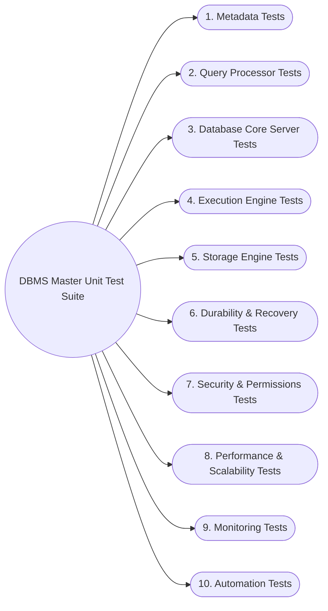

---

## 3. Module Unit Test Flowcharts

### 3.1. Metadata Module (`Metadata`)

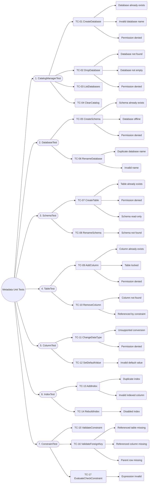

---

### 3.2. Query Processor Module (`QueryProcessor`)

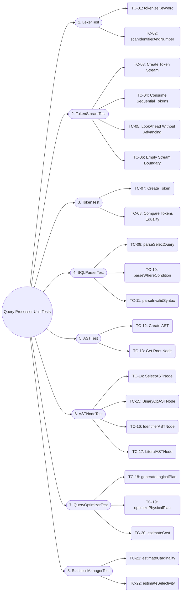

---

### 3.3. Database Core Server Module (`DatabaseCoreServer`)

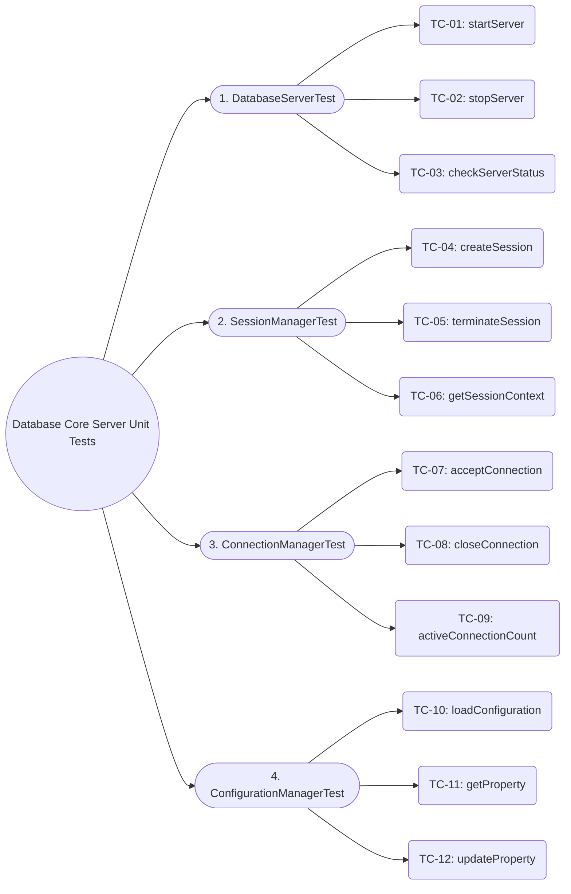

---

### 3.4. Execution Engine Module (`ExecutionEngine`)

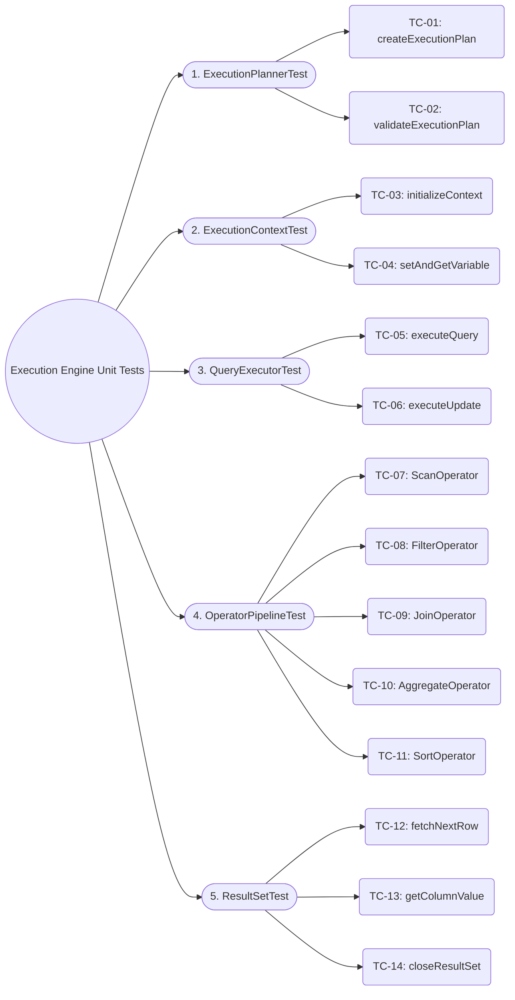

---

### 3.5. Storage Engine Module (`StorageEngine`)

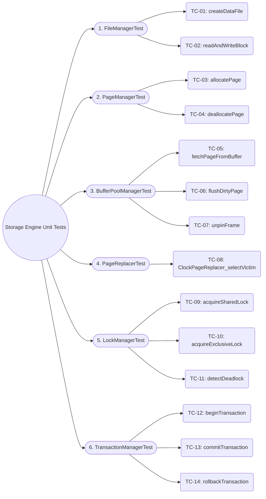

---

### 3.6. Durability & Recovery Data Module (`DurabilityData`)

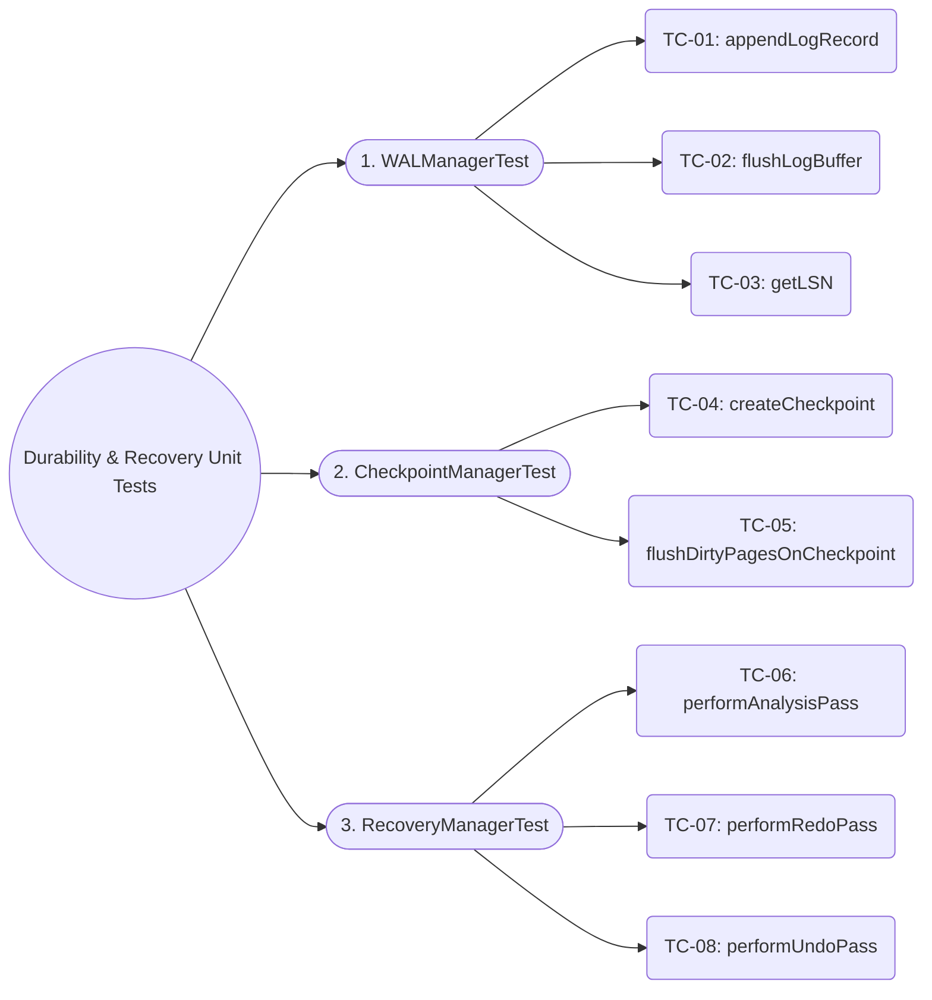

---

### 3.7. Security & Permissions Module (`SecurityPermission`)

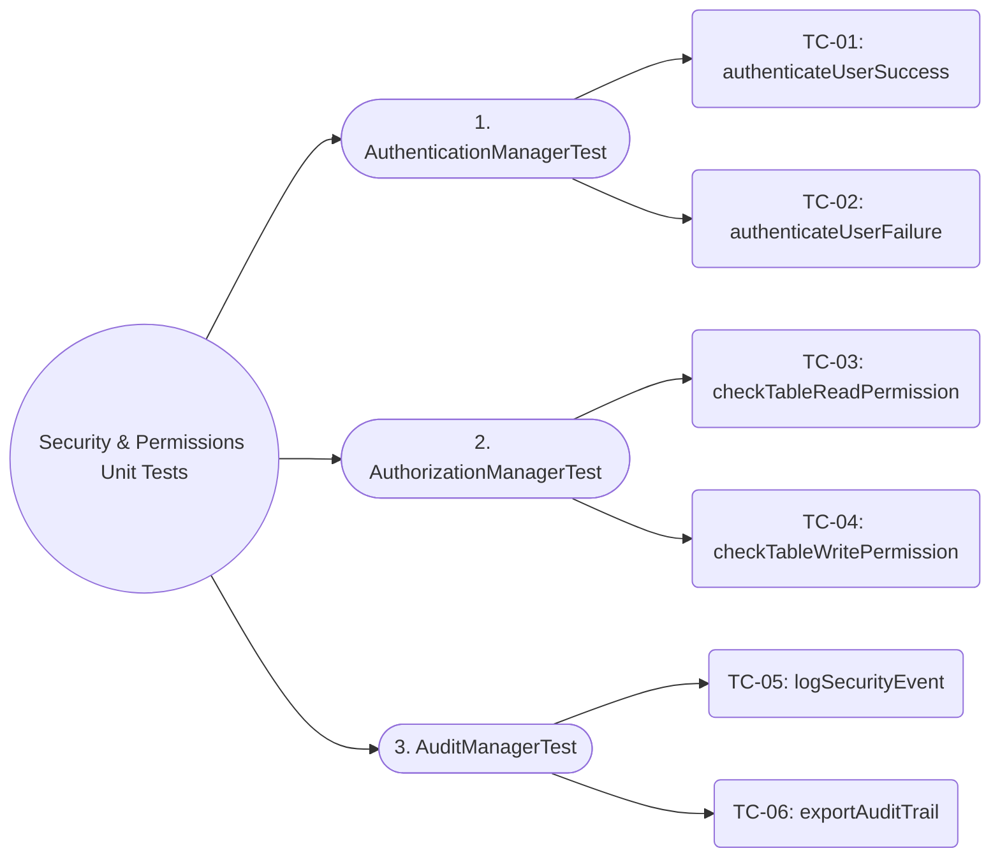

---

### 3.8. Performance & Scalability Module (`PerformanceScalability`)

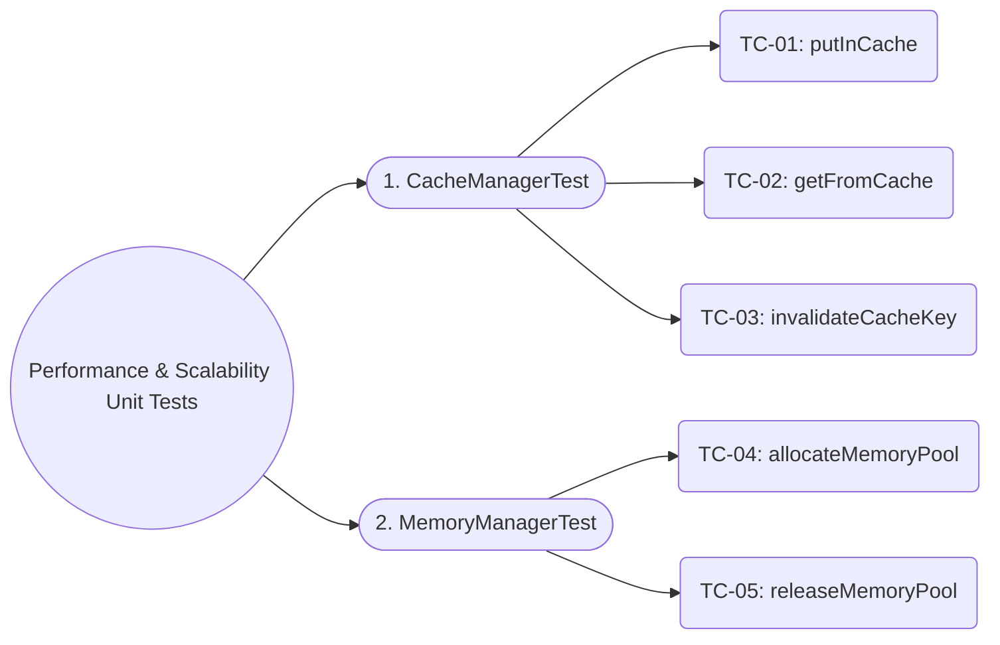

---

### 3.9. Monitoring Module (`Monitoring`)

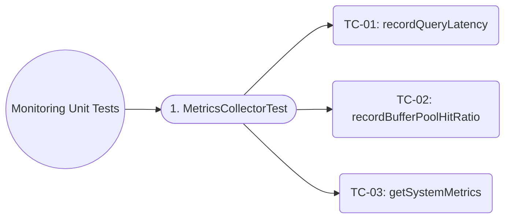

---

### 3.10. Automation Module (`Automation`)

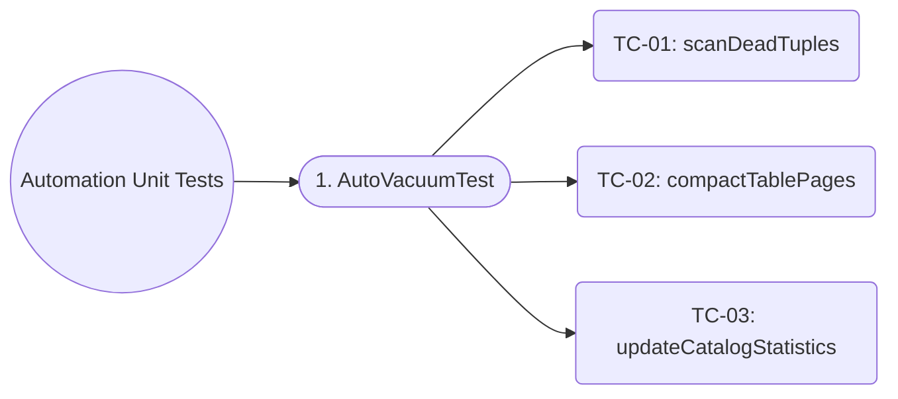
