# Metadata Unit Test Scenarios Mindmap

This mindmap represents the structural taxonomy of the Metadata unit test scenarios, organized from macro/top-level entry point down to micro/element level (`MetadataModule` ➔ `CatalogManager` ➔ `Database` ➔ `Schema` ➔ `Table` ➔ `Column` ➔ `Index` ➔ `Constraint` ➔ `DDLCommands` ➔ Helpers).

```mermaid
flowchart LR
    Root(("Metadata Unit Tests"))

    %% =====================================================
    %% Categories (Top to Bottom Hierarchy)
    %% =====================================================

    Cat1(["1. MetadataModuleTest"])
    Cat2(["2. CatalogManagerTest"])
    Cat3(["3. DatabaseTest"])
    Cat4(["4. SchemaTest"])
    Cat5(["5. TableTest"])
    Cat6(["6. ColumnTest"])
    Cat7(["7. IndexTest"])
    Cat8(["8. ConstraintTest"])
    Cat9(["9. DDLCommandTest"])
    Cat10(["10. ColumnBuilderTest"])
    Cat11(["11. TableMementoTest"])
    Cat12(["12. ConstraintValidationChainTest"])

    Root --> Cat1
    Root --> Cat2
    Root --> Cat3
    Root --> Cat4
    Root --> Cat5
    Root --> Cat6
    Root --> Cat7
    Root --> Cat8
    Root --> Cat9
    Root --> Cat10
    Root --> Cat11
    Root --> Cat12

    %% =====================================================
    %% 1. MetadataModule (Facade Entry Point)
    %% =====================================================

    Cat1 --> TC01("TC-01 GetTableFacade")
    Cat1 --> TC01A("TC-01A ExecuteDDLFacade")
    Cat1 --> TC01B("TC-01B GetDatabaseFacade")
    Cat1 --> TC01C("TC-01C GetDatabaseFacade invalid name")
    Cat1 --> TC01D("TC-01D GetTableFacade invalid identifier")
    Cat1 --> TC01E("TC-01E GetTableFacade not found")
    Cat1 --> TC01F("TC-01F ExecuteDDLFacade null command")

    %% =====================================================
    %% 2. CatalogManager (Root Catalog Level)
    %% =====================================================

    Cat2 --> TC02("TC-02 CreateDatabase")
    TC02 --> TC02A("TC-02A Database already exists")
    TC02 --> TC02B("TC-02B Invalid database name")
    TC02 --> TC02C("TC-02C Permission denied")
    TC02 --> TC02D("TC-02D Special characters")
    TC02 --> TC02E("TC-02E Rename database valid")
    TC02 --> TC02F("TC-02F Rename old database missing")
    TC02 --> TC02G("TC-02G Rename new database duplicate")

    Cat2 --> TC03("TC-03 DropDatabase")
    TC03 --> TC03A("TC-03A Database not found")
    TC03 --> TC03B("TC-03B Database not empty")
    TC03 --> TC03C("TC-03C Permission denied")

    Cat2 --> TC04("TC-04 ListDatabases")
    TC04 --> TC04A("TC-04A Get Database invalid name")

    Cat2 --> TC05("TC-05 ClearCatalog")

    %% =====================================================
    %% 3. Database (Database Level)
    %% =====================================================

    Cat3 --> TC06("TC-06 CreateSchema")
    TC06 --> TC06A("TC-06A Schema already exists")
    TC06 --> TC06B("TC-06B Database offline")
    TC06 --> TC06C("TC-06C Permission denied")
    TC06 --> TC06D("TC-06D Special characters")

    Cat3 --> TC07("TC-07 RenameDatabase")
    TC07 --> TC07A("TC-07A Duplicate database name")
    TC07 --> TC07B("TC-07B Invalid name")
    TC07 --> TC07C("TC-07C Rename schema in database")
    TC07 --> TC07D("TC-07D Get Schema invalid name")

    %% =====================================================
    %% 4. Schema (Schema Level)
    %% =====================================================

    Cat4 --> TC08("TC-08 CreateTable")
    TC08 --> TC08A("TC-08A Table already exists")
    TC08 --> TC08B("TC-08B Permission denied")
    TC08 --> TC08C("TC-08C Schema read-only")
    TC08 --> TC08D("TC-08D Special characters")

    Cat4 --> TC09("TC-09 RenameSchema")
    TC09 --> TC09A("TC-09A Schema not found")
    TC09 --> TC09B("TC-09B Get Table invalid name")

    %% =====================================================
    %% 5. Table (Table Level)
    %% =====================================================

    Cat5 --> TC10("TC-10 AddColumn")
    TC10 --> TC10A("TC-10A Column already exists")
    TC10 --> TC10B("TC-10B Table locked")
    TC10 --> TC10C("TC-10C Permission denied")
    TC10 --> TC10D("TC-10D Special characters")
    TC10 --> TC10E("TC-10E Create column facade")

    Cat5 --> TC11("TC-11 RemoveColumn")
    TC11 --> TC11A("TC-11A Column not found")
    TC11 --> TC11B("TC-11B Referenced by constraint")
    TC11 --> TC11C("TC-11C Table locked when remove column")
    TC11 --> TC11D("TC-11D Invalid column name when remove column")
    TC11 --> TC11E("TC-11E Get Column invalid name")
    TC11 --> TC11F("TC-11F Get Index invalid name")
    TC11 --> TC11G("TC-11G Get Constraint invalid name")

    %% =====================================================
    %% 6. Column (Column Level)
    %% =====================================================

    Cat6 --> TC12("TC-12 ChangeDataType")
    TC12 --> TC12A("TC-12A Unsupported conversion")
    TC12 --> TC12B("TC-12B Permission denied")

    Cat6 --> TC13("TC-13 SetDefaultValue")
    TC13 --> TC13A("TC-13A Invalid default value")

    %% =====================================================
    %% 7. Index (Index Level)
    %% =====================================================

    Cat7 --> TC14("TC-14 AddIndex")
    TC14 --> TC14A("TC-14A Duplicate index")
    TC14 --> TC14B("TC-14B Invalid indexed column")
    TC14 --> TC14C("TC-14C Remove index")
    TC14 --> TC14D("TC-14D Index not found when remove index")
    TC14 --> TC14E("TC-14E Table locked when remove index")
    TC14 --> TC14F("TC-14F Invalid index name format")

    Cat7 --> TC15("TC-15 RebuildIndex")
    TC15 --> TC15A("TC-15A Disabled index")

    %% =====================================================
    %% 8. Constraint (Constraint Level)
    %% =====================================================

    Cat8 --> TC16("TC-16 ValidateConstraint")
    TC16 --> TC16A("TC-16A Remove constraint")
    TC16 --> TC16B("TC-16B Constraint not found when remove constraint")
    TC16 --> TC16C("TC-16C Table locked when remove constraint")

    Cat8 --> TC17("TC-17 ValidateForeignKey")
    TC17 --> TC17A("TC-17A Referenced table missing")
    TC17 --> TC17B("TC-17B Referenced column missing")
    TC17 --> TC17C("TC-17C Parent row missing")

    Cat8 --> TC18("TC-18 EvaluateCheckConstraint")
    TC18 --> TC18A("TC-18A Expression invalid")

    %% =====================================================
    %% 9. DDLCommand
    %% =====================================================

    Cat9 --> TC19("TC-19 DDLCommandExecution")
    TC19 --> TC19A("TC-19A CreateDatabaseCommand")
    TC19 --> TC19B("TC-19B DropDatabaseCommand")
    TC19 --> TC19C("TC-19C RenameDatabaseCommand")
    TC19 --> TC19D("TC-19D CreateSchemaCommand")
    TC19 --> TC19E("TC-19E DropSchemaCommand")
    TC19 --> TC19F("TC-19F RenameSchemaCommand")
    TC19 --> TC19G("TC-19G CreateTableCommand")
    TC19 --> TC19H("TC-19H DropTableCommand")
    TC19 --> TC19I("TC-19I RenameTableCommand")
    TC19 --> TC19J("TC-19J CreateColumnCommand")
    TC19 --> TC19K("TC-19K DropColumnCommand")
    TC19 --> TC19L("TC-19L RenameColumnCommand")

    %% =====================================================
    %% 10. ColumnBuilder
    %% =====================================================

    Cat10 --> TC20("TC-20 BuildColumn")
    TC20 --> TC20A("TC-20A BuildColumnDefaults")

    %% =====================================================
    %% 11. TableMemento
    %% =====================================================

    Cat11 --> TC21("TC-21 MementoSnapshotRestore")

    %% =====================================================
    %% 12. ConstraintValidationChain
    %% =====================================================

    Cat12 --> TC22("TC-22 ValidateChainPass")
    TC22 --> TC22A("TC-22A ValidateChainFail")
```

