# Sequence Diagrams - Metadata Subsystem Unit Test Scenarios

This document provides detailed Mermaid sequence diagrams for all positive (happy path) and negative (edge cases / exception) unit test scenarios mapped out in [MindmapTest.md](file:///d:/BBV/Database_Management_BBV/docs/unit_test/metadata/MindmapTest.md).

---

## 1. CatalogManager Unit Tests

### TC-01: `createDatabase`

#### Happy Path: `createDatabase_ShouldAddDatabaseToCatalog_WhenValidNameIsProvided`
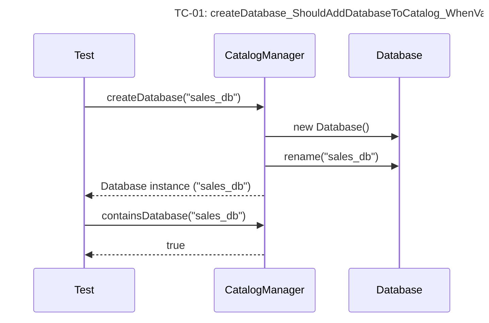
```mermaid
sequenceDiagram
    title TC-01: createDatabase_ShouldAddDatabaseToCatalog_WhenValidNameIsProvided
    participant Test
    participant CatalogManager
    participant Database

    Test->>CatalogManager: createDatabase("sales_db")
    CatalogManager->>Database: new Database()
    CatalogManager->>Database: rename("sales_db")
    CatalogManager-->>Test: Database instance ("sales_db")
    Test->>CatalogManager: containsDatabase("sales_db")
    CatalogManager-->>Test: true
```

#### TC-01A: `createDatabase_ShouldThrowException_WhenDatabaseAlreadyExists`
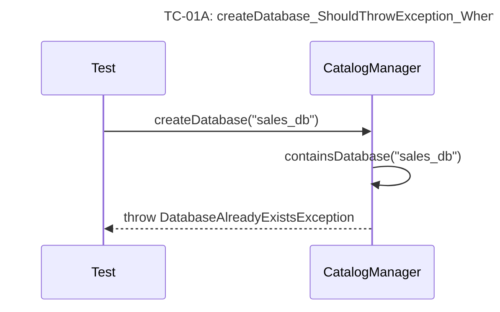
```mermaid
sequenceDiagram
    title TC-01A: createDatabase_ShouldThrowException_WhenDatabaseAlreadyExists
    participant Test
    participant CatalogManager

    Test->>CatalogManager: createDatabase("sales_db")
    CatalogManager->>CatalogManager: containsDatabase("sales_db")
    CatalogManager-->>Test: throw DatabaseAlreadyExistsException
```

#### TC-01B: `createDatabase_ShouldThrowException_WhenDatabaseNameIsInvalid`
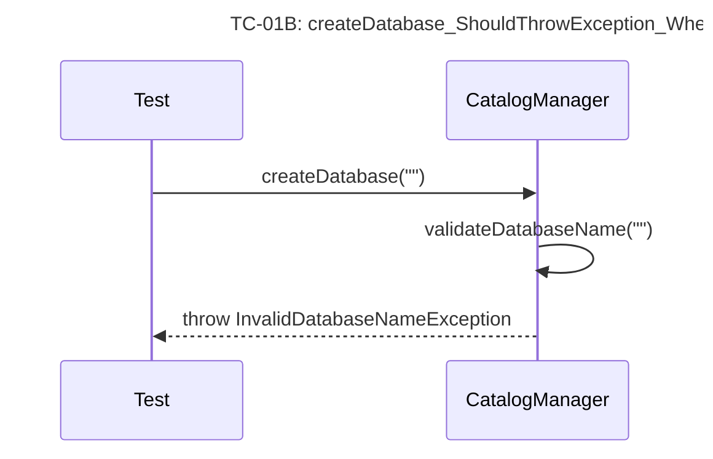
```mermaid
sequenceDiagram
    title TC-01B: createDatabase_ShouldThrowException_WhenDatabaseNameIsInvalid
    participant Test
    participant CatalogManager

    Test->>CatalogManager: createDatabase("")
    CatalogManager->>CatalogManager: validateDatabaseName("")
    CatalogManager-->>Test: throw InvalidDatabaseNameException
```

#### TC-01C: `createDatabase_ShouldThrowException_WhenPermissionDenied`
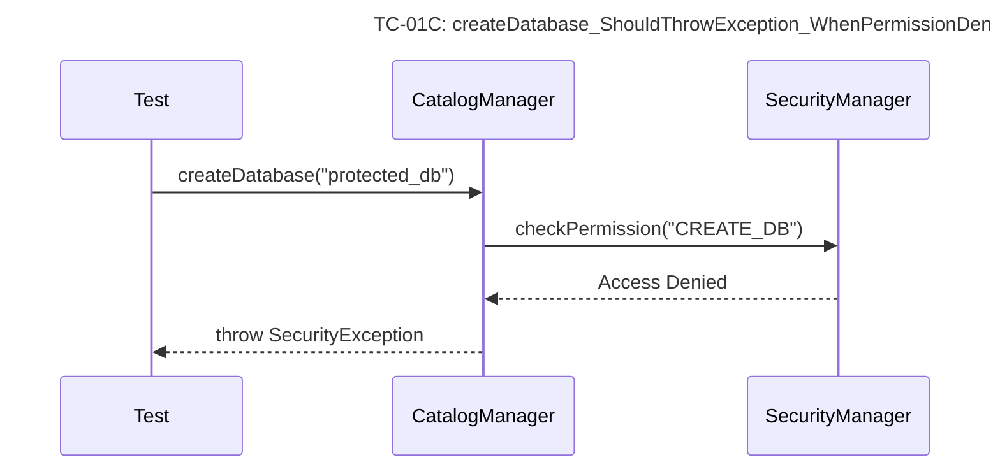
```mermaid
sequenceDiagram
    title TC-01C: createDatabase_ShouldThrowException_WhenPermissionDenied
    participant Test
    participant CatalogManager
    participant SecurityManager

    Test->>CatalogManager: createDatabase("protected_db")
    CatalogManager->>SecurityManager: checkPermission("CREATE_DB")
    SecurityManager-->>CatalogManager: Access Denied
    CatalogManager-->>Test: throw SecurityException
```

---

### TC-02: `dropDatabase`

#### Happy Path: `dropDatabase_ShouldRemoveDatabaseFromCatalog_WhenDatabaseExists`
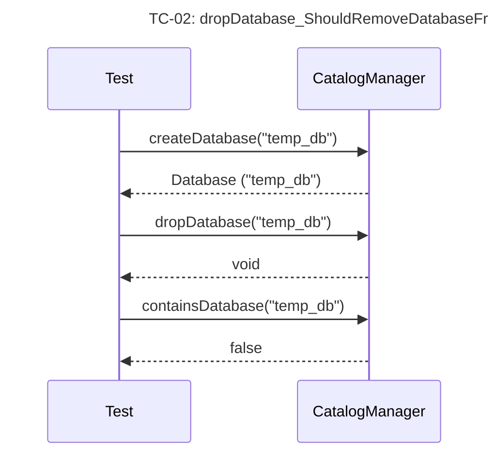
```mermaid
sequenceDiagram
    title TC-02: dropDatabase_ShouldRemoveDatabaseFromCatalog_WhenDatabaseExists
    participant Test
    participant CatalogManager

    Test->>CatalogManager: createDatabase("temp_db")
    CatalogManager-->>Test: Database ("temp_db")
    Test->>CatalogManager: dropDatabase("temp_db")
    CatalogManager-->>Test: void
    Test->>CatalogManager: containsDatabase("temp_db")
    CatalogManager-->>Test: false
```

#### TC-02A: `dropDatabase_ShouldThrowException_WhenDatabaseNotFound`
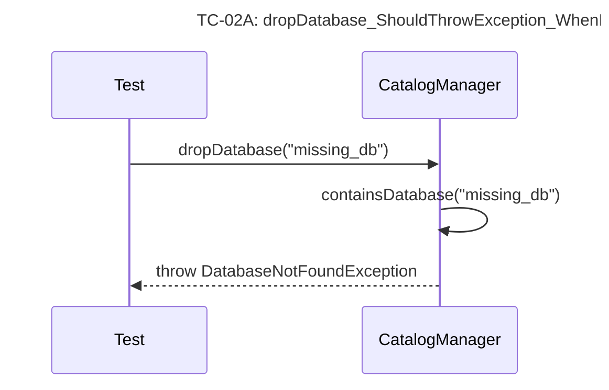
```mermaid
sequenceDiagram
    title TC-02A: dropDatabase_ShouldThrowException_WhenDatabaseNotFound
    participant Test
    participant CatalogManager

    Test->>CatalogManager: dropDatabase("missing_db")
    CatalogManager->>CatalogManager: containsDatabase("missing_db")
    CatalogManager-->>Test: throw DatabaseNotFoundException
```

#### TC-02B: `dropDatabase_ShouldThrowException_WhenDatabaseIsNotEmpty`
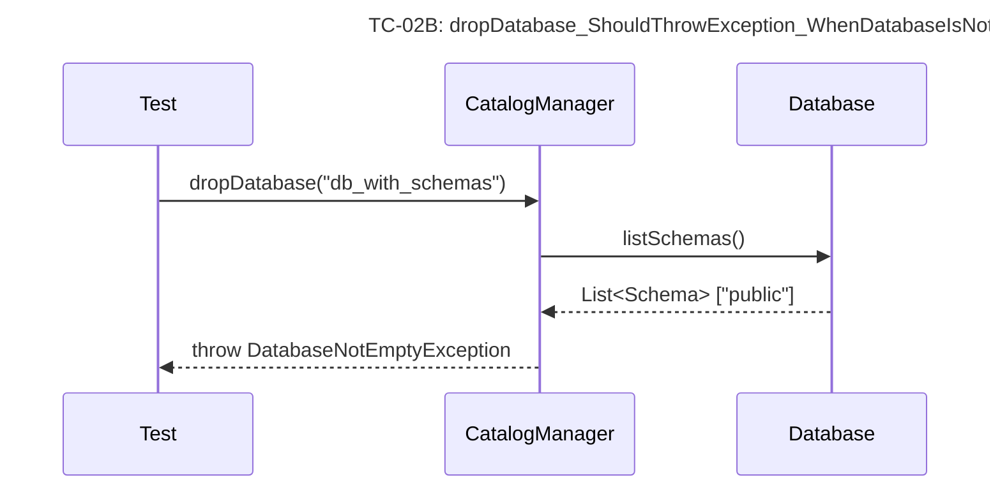
```mermaid
sequenceDiagram
    title TC-02B: dropDatabase_ShouldThrowException_WhenDatabaseIsNotEmpty
    participant Test
    participant CatalogManager
    participant Database

    Test->>CatalogManager: dropDatabase("db_with_schemas")
    CatalogManager->>Database: listSchemas()
    Database-->>CatalogManager: List<Schema> ["public"]
    CatalogManager-->>Test: throw DatabaseNotEmptyException
```

#### TC-02C: `dropDatabase_ShouldThrowException_WhenPermissionDenied`
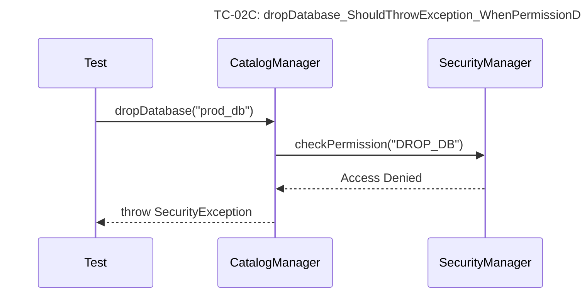
```mermaid
sequenceDiagram
    title TC-02C: dropDatabase_ShouldThrowException_WhenPermissionDenied
    participant Test
    participant CatalogManager
    participant SecurityManager

    Test->>CatalogManager: dropDatabase("prod_db")
    CatalogManager->>SecurityManager: checkPermission("DROP_DB")
    SecurityManager-->>CatalogManager: Access Denied
    CatalogManager-->>Test: throw SecurityException
```

---

### TC-03: `listDatabases`

#### Happy Path: `listDatabases_ShouldReturnAllRegisteredDatabases_WhenDatabasesAreCreated`
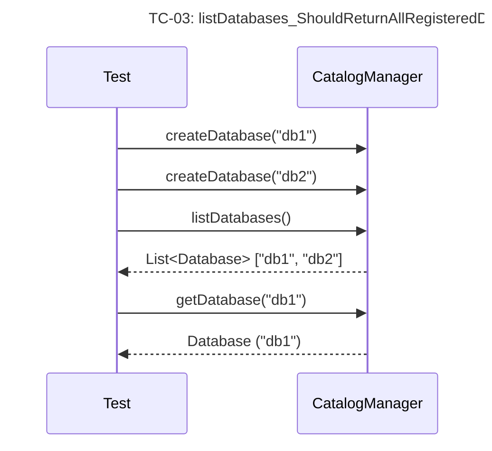
```mermaid
sequenceDiagram
    title TC-03: listDatabases_ShouldReturnAllRegisteredDatabases_WhenDatabasesAreCreated
    participant Test
    participant CatalogManager

    Test->>CatalogManager: createDatabase("db1")
    Test->>CatalogManager: createDatabase("db2")
    Test->>CatalogManager: listDatabases()
    CatalogManager-->>Test: List<Database> ["db1", "db2"]
    Test->>CatalogManager: getDatabase("db1")
    CatalogManager-->>Test: Database ("db1")
```

---

### TC-04: `clear`

#### Happy Path: `clear_ShouldRemoveAllDatabases_WhenCatalogIsCleared`
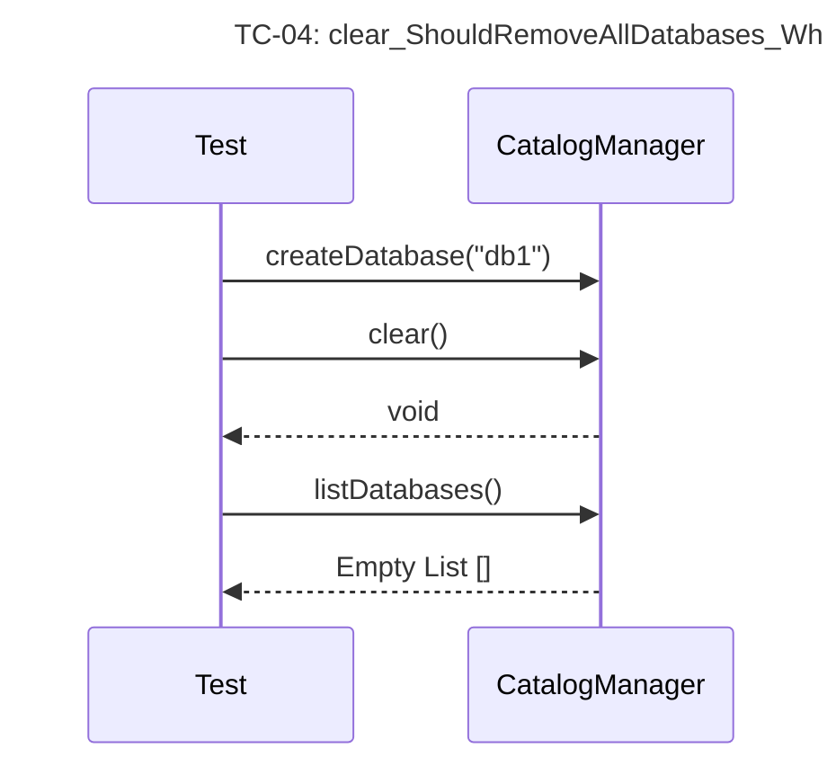
```mermaid
sequenceDiagram
    title TC-04: clear_ShouldRemoveAllDatabases_WhenCatalogIsCleared
    participant Test
    participant CatalogManager

    Test->>CatalogManager: createDatabase("db1")
    Test->>CatalogManager: clear()
    CatalogManager-->>Test: void
    Test->>CatalogManager: listDatabases()
    CatalogManager-->>Test: Empty List []
```

---

## 2. Database Unit Tests

### TC-05: `createSchema`

#### Happy Path: `createSchema_ShouldManageSchemasInDatabase_WhenSchemaIsAddedAndDropped`
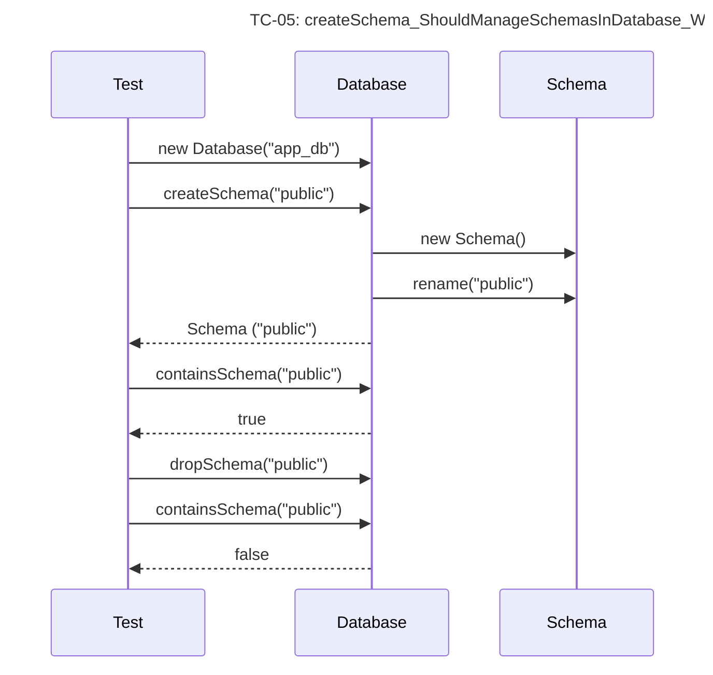
```mermaid
sequenceDiagram
    title TC-05: createSchema_ShouldManageSchemasInDatabase_WhenSchemaIsAddedAndDropped
    participant Test
    participant Database
    participant Schema

    Test->>Database: new Database("app_db")
    Test->>Database: createSchema("public")
    Database->>Schema: new Schema()
    Database->>Schema: rename("public")
    Database-->>Test: Schema ("public")
    Test->>Database: containsSchema("public")
    Database-->>Test: true
    Test->>Database: dropSchema("public")
    Test->>Database: containsSchema("public")
    Database-->>Test: false
```

#### TC-05A: `createSchema_ShouldThrowException_WhenSchemaAlreadyExists`
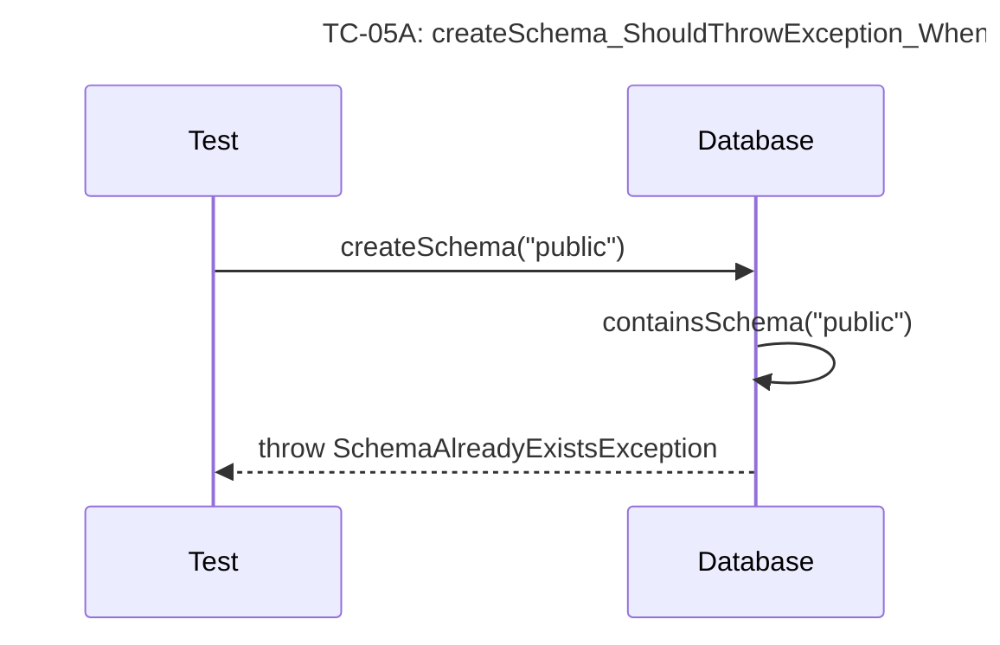
```mermaid
sequenceDiagram
    title TC-05A: createSchema_ShouldThrowException_WhenSchemaAlreadyExists
    participant Test
    participant Database

    Test->>Database: createSchema("public")
    Database->>Database: containsSchema("public")
    Database-->>Test: throw SchemaAlreadyExistsException
```

#### TC-05B: `createSchema_ShouldThrowException_WhenDatabaseIsOffline`
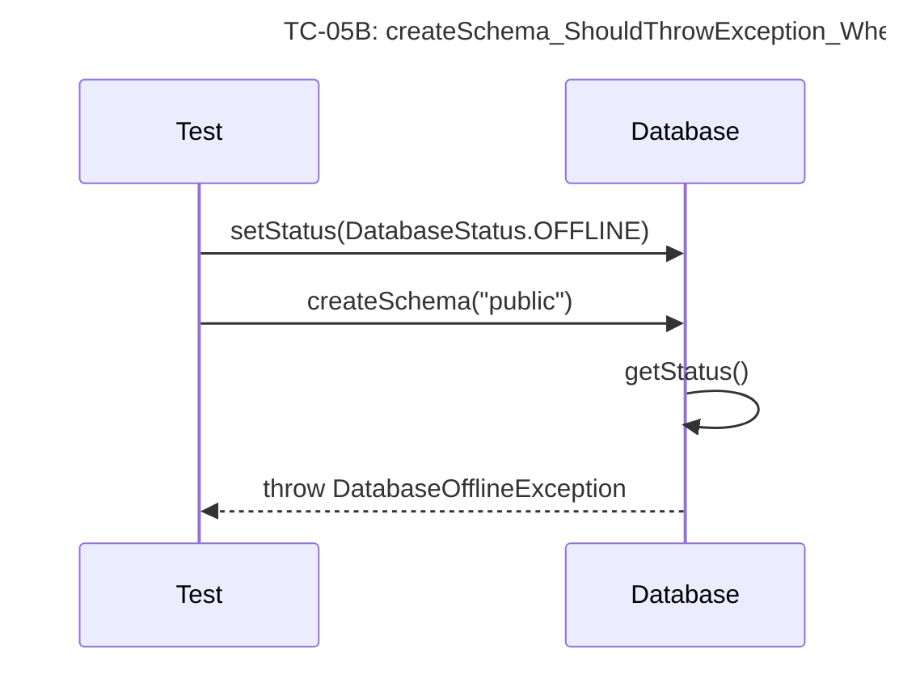
```mermaid
sequenceDiagram
    title TC-05B: createSchema_ShouldThrowException_WhenDatabaseIsOffline
    participant Test
    participant Database

    Test->>Database: setStatus(DatabaseStatus.OFFLINE)
    Test->>Database: createSchema("public")
    Database->>Database: getStatus()
    Database-->>Test: throw DatabaseOfflineException
```

#### TC-05C: `createSchema_ShouldThrowException_WhenPermissionDenied`
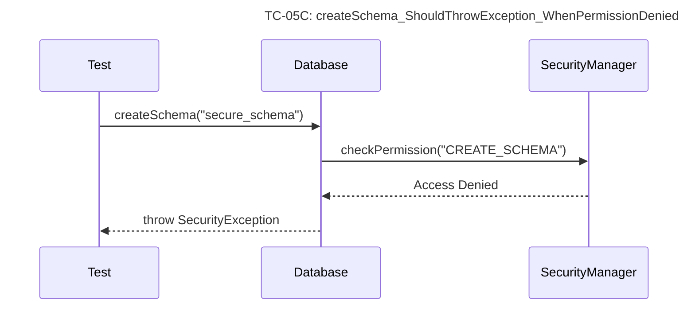
```mermaid
sequenceDiagram
    title TC-05C: createSchema_ShouldThrowException_WhenPermissionDenied
    participant Test
    participant Database
    participant SecurityManager

    Test->>Database: createSchema("secure_schema")
    Database->>SecurityManager: checkPermission("CREATE_SCHEMA")
    SecurityManager-->>Database: Access Denied
    Database-->>Test: throw SecurityException
```

---

### TC-06: `renameDatabase`

#### Happy Path: `setStatus_And_rename_ShouldUpdateDatabaseState_WhenModified`
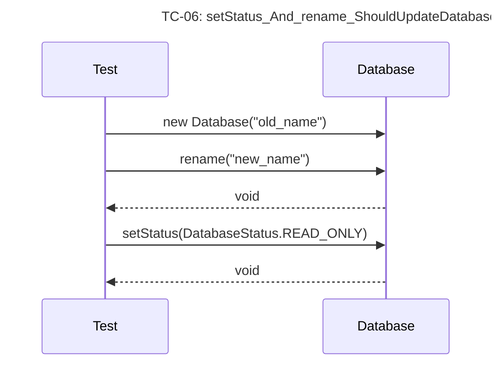
```mermaid
sequenceDiagram
    title TC-06: setStatus_And_rename_ShouldUpdateDatabaseState_WhenModified
    participant Test
    participant Database

    Test->>Database: new Database("old_name")
    Test->>Database: rename("new_name")
    Database-->>Test: void
    Test->>Database: setStatus(DatabaseStatus.READ_ONLY)
    Database-->>Test: void
```

#### TC-06A: `renameDatabase_ShouldThrowException_WhenDuplicateDatabaseName`
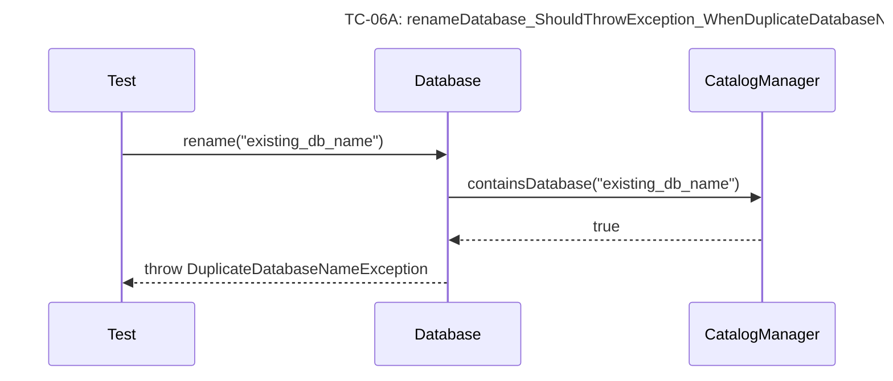
```mermaid
sequenceDiagram
    title TC-06A: renameDatabase_ShouldThrowException_WhenDuplicateDatabaseName
    participant Test
    participant Database
    participant CatalogManager

    Test->>Database: rename("existing_db_name")
    Database->>CatalogManager: containsDatabase("existing_db_name")
    CatalogManager-->>Database: true
    Database-->>Test: throw DuplicateDatabaseNameException
```

#### TC-06B: `renameDatabase_ShouldThrowException_WhenNameIsInvalid`
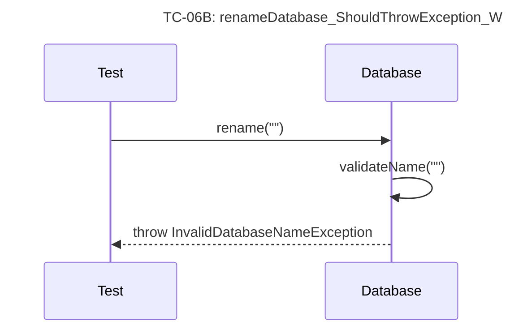
```mermaid
sequenceDiagram
    title TC-06B: renameDatabase_ShouldThrowException_WhenNameIsInvalid
    participant Test
    participant Database

    Test->>Database: rename("")
    Database->>Database: validateName("")
    Database-->>Test: throw InvalidDatabaseNameException
```

---

## 3. Schema Unit Tests

### TC-07: `createTable`

#### Happy Path: `createTable_ShouldRegisterTableInSchema_WhenValidTableNameIsProvided`
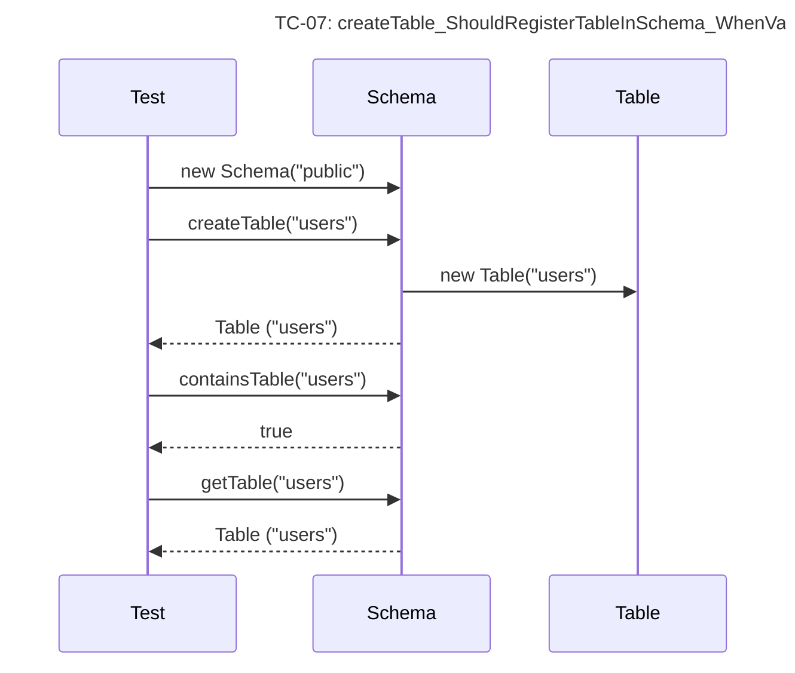
```mermaid
sequenceDiagram
    title TC-07: createTable_ShouldRegisterTableInSchema_WhenValidTableNameIsProvided
    participant Test
    participant Schema
    participant Table

    Test->>Schema: new Schema("public")
    Test->>Schema: createTable("users")
    Schema->>Table: new Table("users")
    Schema-->>Test: Table ("users")
    Test->>Schema: containsTable("users")
    Schema-->>Test: true
    Test->>Schema: getTable("users")
    Schema-->>Test: Table ("users")
```

#### TC-07A: `createTable_ShouldThrowException_WhenTableAlreadyExists`
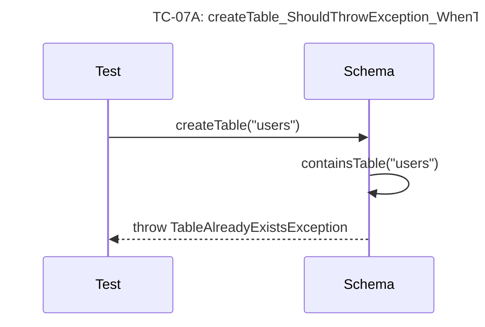
```mermaid
sequenceDiagram
    title TC-07A: createTable_ShouldThrowException_WhenTableAlreadyExists
    participant Test
    participant Schema

    Test->>Schema: createTable("users")
    Schema->>Schema: containsTable("users")
    Schema-->>Test: throw TableAlreadyExistsException
```

#### TC-07B: `createTable_ShouldThrowException_WhenPermissionDenied`
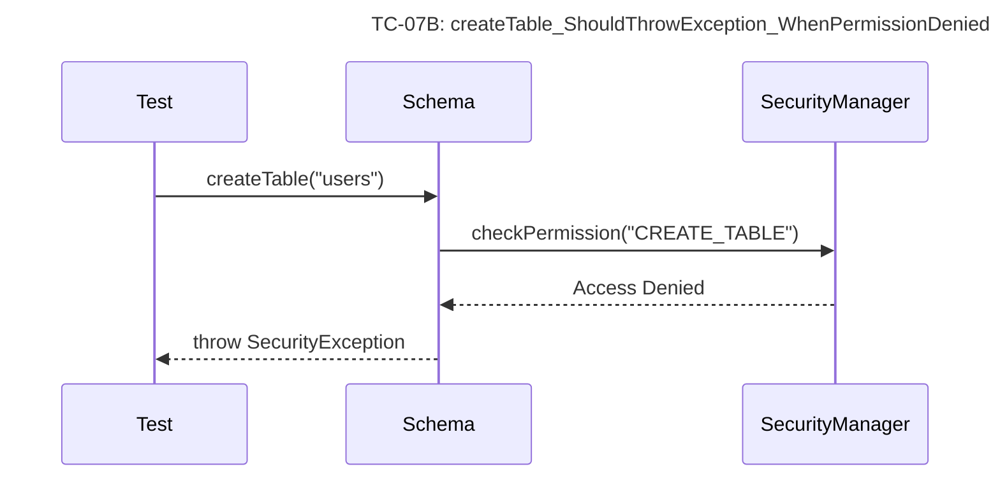
```mermaid
sequenceDiagram
    title TC-07B: createTable_ShouldThrowException_WhenPermissionDenied
    participant Test
    participant Schema
    participant SecurityManager

    Test->>Schema: createTable("users")
    Schema->>SecurityManager: checkPermission("CREATE_TABLE")
    SecurityManager-->>Schema: Access Denied
    Schema-->>Test: throw SecurityException
```

#### TC-07C: `createTable_ShouldThrowException_WhenSchemaIsReadOnly`
```mermaid
sequenceDiagram
    title TC-07C: createTable_ShouldThrowException_WhenSchemaIsReadOnly
    participant Test
    participant Schema

    Test->>Schema: setReadOnly(true)
    Test->>Schema: createTable("users")
    Schema->>Schema: isReadOnly()
    Schema-->>Test: throw SchemaReadOnlyException
```

---

### TC-08: `renameSchema`

#### Happy Path: `rename_And_listTables_ShouldUpdateSchemaNameAndMaintainTables_WhenRenamed`
```mermaid
sequenceDiagram
    title TC-08: rename_And_listTables_ShouldUpdateSchemaNameAndMaintainTables_WhenRenamed
    participant Test
    participant Schema

    Test->>Schema: new Schema("raw_schema")
    Test->>Schema: createTable("t1")
    Test->>Schema: createTable("t2")
    Test->>Schema: listTables()
    Schema-->>Test: List<Table> ["t1", "t2"]
    Test->>Schema: rename("prod_schema")
    Schema-->>Test: void
```

#### TC-08A: `renameSchema_ShouldThrowException_WhenSchemaNotFound`
```mermaid
sequenceDiagram
    title TC-08A: renameSchema_ShouldThrowException_WhenSchemaNotFound
    participant Test
    participant Database

    Test->>Database: renameSchema("missing_schema", "new_name")
    Database->>Database: containsSchema("missing_schema")
    Database-->>Test: throw SchemaNotFoundException
```

---

## 4. Table & Column Unit Tests

### TC-09: `addColumn`

#### Happy Path: `addColumn_ShouldAttachColumnToTable_WhenColumnIsAdded`
```mermaid
sequenceDiagram
    title TC-09: addColumn_ShouldAttachColumnToTable_WhenColumnIsAdded
    participant Test
    participant Table
    participant Column

    Test->>Table: new Table("orders")
    Test->>Column: new Column("order_id", DataType.BIGINT)
    Column-->>Test: Column ("order_id")
    Test->>Table: addColumn(Column)
    Table-->>Test: void
    Test->>Table: listColumns()
    Table-->>Test: List<Column> ["order_id"]
    Test->>Table: containsColumn("order_id")
    Table-->>Test: true
```

#### TC-09A: `addColumn_ShouldThrowException_WhenColumnAlreadyExists`
```mermaid
sequenceDiagram
    title TC-09A: addColumn_ShouldThrowException_WhenColumnAlreadyExists
    participant Test
    participant Table
    participant Column

    Test->>Table: addColumn(Column "order_id")
    Table->>Table: containsColumn("order_id")
    Table-->>Test: throw ColumnAlreadyExistsException
```

#### TC-09B: `addColumn_ShouldThrowException_WhenTableIsLocked`
```mermaid
sequenceDiagram
    title TC-09B: addColumn_ShouldThrowException_WhenTableIsLocked
    participant Test
    participant Table
    participant Column

    Test->>Table: addColumn(Column)
    Table->>Table: isLocked()
    Table-->>Test: throw TableLockedException
```

#### TC-09C: `addColumn_ShouldThrowException_WhenPermissionDenied`
```mermaid
sequenceDiagram
    title TC-09C: addColumn_ShouldThrowException_WhenPermissionDenied
    participant Test
    participant Table
    participant Column
    participant SecurityManager

    Test->>Table: addColumn(Column)
    Table->>SecurityManager: checkPermission("ALTER_TABLE")
    SecurityManager-->>Table: Access Denied
    Table-->>Test: throw SecurityException
```

---

### TC-10: `removeColumn`

#### Happy Path: `removeColumn_ShouldDetachColumnFromTable_WhenColumnExists`
```mermaid
sequenceDiagram
    title TC-10: removeColumn_ShouldDetachColumnFromTable_WhenColumnExists
    participant Test
    participant Table

    Test->>Table: removeColumn("temp_col")
    Table-->>Test: void
    Test->>Table: containsColumn("temp_col")
    Table-->>Test: false
```

#### TC-10A: `removeColumn_ShouldThrowException_WhenColumnNotFound`
```mermaid
sequenceDiagram
    title TC-10A: removeColumn_ShouldThrowException_WhenColumnNotFound
    participant Test
    participant Table

    Test->>Table: removeColumn("missing_col")
    Table->>Table: containsColumn("missing_col")
    Table-->>Test: throw ColumnNotFoundException
```

#### TC-10B: `removeColumn_ShouldThrowException_WhenReferencedByConstraint`
```mermaid
sequenceDiagram
    title TC-10B: removeColumn_ShouldThrowException_WhenReferencedByConstraint
    participant Test
    participant Table

    Test->>Table: removeColumn("id")
    Table->>Table: isReferencedByConstraint("id")
    Table-->>Test: throw ColumnInUseException
```

---

## 5. Column Unit Tests

### TC-11: `changeDataType`

#### Happy Path: `changeDataType_ShouldUpdateColumnDataType_WhenValid`
```mermaid
sequenceDiagram
    title TC-11: changeDataType_ShouldUpdateColumnDataType_WhenValid
    participant Test
    participant Column

    Test->>Column: new Column("age", DataType.INT)
    Test->>Column: changeDataType(DataType.BIGINT)
    Column-->>Test: void
```

#### TC-11A: `changeDataType_ShouldThrowException_WhenUnsupportedConversion`
```mermaid
sequenceDiagram
    title TC-11A: changeDataType_ShouldThrowException_WhenUnsupportedConversion
    participant Test
    participant Column

    Test->>Column: changeDataType(DataType.BOOLEAN)
    Column->>Column: isCompatibleConversion(INT, BOOLEAN)
    Column-->>Test: throw DataTypeConversionException
```

#### TC-11B: `changeDataType_ShouldThrowException_WhenPermissionDenied`
```mermaid
sequenceDiagram
    title TC-11B: changeDataType_ShouldThrowException_WhenPermissionDenied
    participant Test
    participant Column
    participant SecurityManager

    Test->>Column: changeDataType(DataType.VARCHAR)
    Column->>SecurityManager: checkPermission("ALTER_COLUMN")
    SecurityManager-->>Column: Access Denied
    Column-->>Test: throw SecurityException
```

---

### TC-12: `setDefaultValue`

#### Happy Path: `changeDataType_And_setDefaultValue_ShouldUpdateColumnProperties_WhenModified`
```mermaid
sequenceDiagram
    title TC-12: changeDataType_And_setDefaultValue_ShouldUpdateColumnProperties_WhenModified
    participant Test
    participant Column

    Test->>Column: new Column("age", DataType.INT)
    Test->>Column: setNullable(false)
    Test->>Column: setDefaultValue("18")
    Test->>Column: changeDataType(DataType.BIGINT)
    Test->>Column: rename("user_age")
    Column-->>Test: Properties Updated
```

#### TC-12A: `setDefaultValue_ShouldThrowException_WhenDefaultValueIsInvalid`
```mermaid
sequenceDiagram
    title TC-12A: setDefaultValue_ShouldThrowException_WhenDefaultValueIsInvalid
    participant Test
    participant Column

    Test->>Column: setDefaultValue("abc_not_an_int")
    Column->>Column: validateDefaultValueType("abc_not_an_int", INT)
    Column-->>Test: throw InvalidDefaultValueException
```

---

## 6. Index Unit Tests

### TC-13: `addIndex`

#### Happy Path: `addIndex_ShouldAttachIndexToTable_WhenIndexIsAddedAndRebuilt`
```mermaid
sequenceDiagram
    title TC-13: addIndex_ShouldAttachIndexToTable_WhenIndexIsAddedAndRebuilt
    participant Test
    participant Table
    participant Index

    Test->>Index: new Index("idx_user_email", IndexType.BTREE)
    Index-->>Test: Index instance
    Test->>Table: addIndex(Index)
    Table-->>Test: void
    Test->>Index: disable()
    Index-->>Test: void
    Test->>Index: rebuild()
    Index-->>Test: void (enabled = true)
```

#### TC-13A: `addIndex_ShouldThrowException_WhenDuplicateIndexName`
```mermaid
sequenceDiagram
    title TC-13A: addIndex_ShouldThrowException_WhenDuplicateIndexName
    participant Test
    participant Table
    participant Index

    Test->>Table: addIndex(Index "idx_user_email")
    Table->>Table: containsIndex("idx_user_email")
    Table-->>Test: throw DuplicateIndexException
```

#### TC-13B: `addIndex_ShouldThrowException_WhenIndexedColumnNotFound`
```mermaid
sequenceDiagram
    title TC-13B: addIndex_ShouldThrowException_WhenIndexedColumnNotFound
    participant Test
    participant Table
    participant Index

    Test->>Table: addIndex(IndexOnMissingColumn)
    Table->>Table: containsColumn("non_existing_col")
    Table-->>Test: throw ColumnNotFoundException
```

---

### TC-14: `rebuildIndex`

#### Happy Path: `rebuildIndex_ShouldReenableIndex_WhenRebuilt`
```mermaid
sequenceDiagram
    title TC-14: rebuildIndex_ShouldReenableIndex_WhenRebuilt
    participant Test
    participant Index

    Test->>Index: disable()
    Test->>Index: rebuild()
    Index-->>Test: void (enabled = true)
```

#### TC-14A: `rebuildIndex_ShouldThrowException_WhenIndexIsDisabledAndCorrupted`
```mermaid
sequenceDiagram
    title TC-14A: rebuildIndex_ShouldThrowException_WhenIndexIsDisabledAndCorrupted
    participant Test
    participant Index

    Test->>Index: rebuild()
    Index->>Index: checkIntegrity()
    Index-->>Test: throw IndexDisabledException
```

---

## 7. Constraint Unit Tests

### TC-15: `validateConstraint`

#### Happy Path: `validate_ShouldReturnConstraintStatus_WhenPrimaryKeyIsChecked`
```mermaid
sequenceDiagram
    title TC-15: validate_ShouldReturnConstraintStatus_WhenPrimaryKeyIsChecked
    participant Test
    participant PrimaryKeyConstraint

    Test->>PrimaryKeyConstraint: new PrimaryKeyConstraint("pk_users")
    PrimaryKeyConstraint-->>Test: Constraint Instance
    Test->>PrimaryKeyConstraint: validate()
    PrimaryKeyConstraint-->>Test: true
    Test->>PrimaryKeyConstraint: disable()
    Test->>PrimaryKeyConstraint: validate()
    PrimaryKeyConstraint-->>Test: false
```

---

### TC-16: `validateForeignKey`

#### Happy Path: `validateReference_ShouldReturnTrue_WhenForeignKeyReferencesValidTableAndColumn`
```mermaid
sequenceDiagram
    title TC-16: validateReference_ShouldReturnTrue_WhenForeignKeyReferencesValidTableAndColumn
    participant Test
    participant ForeignKeyConstraint
    participant Table
    participant Column

    Test->>Table: new Table("parent_table")
    Test->>Column: new Column("id", DataType.INT)
    Test->>ForeignKeyConstraint: new ForeignKeyConstraint("fk_child", Table, Column)
    ForeignKeyConstraint-->>Test: FK Instance
    Test->>ForeignKeyConstraint: validateReference()
    ForeignKeyConstraint-->>Test: true
```

#### TC-16A: `validateForeignKey_ShouldReturnFalse_WhenReferencedTableMissing`
```mermaid
sequenceDiagram
    title TC-16A: validateForeignKey_ShouldReturnFalse_WhenReferencedTableMissing
    participant Test
    participant ForeignKeyConstraint

    Test->>ForeignKeyConstraint: validateReference()
    ForeignKeyConstraint->>ForeignKeyConstraint: getReferencedTable()
    ForeignKeyConstraint-->>Test: false (Referenced table missing)
```

#### TC-16B: `validateForeignKey_ShouldReturnFalse_WhenReferencedColumnMissing`
```mermaid
sequenceDiagram
    title TC-16B: validateForeignKey_ShouldReturnFalse_WhenReferencedColumnMissing
    participant Test
    participant ForeignKeyConstraint
    participant Table

    Test->>ForeignKeyConstraint: validateReference()
    ForeignKeyConstraint->>Table: containsColumn(refCol)
    Table-->>ForeignKeyConstraint: false
    ForeignKeyConstraint-->>Test: false
```

#### TC-16C: `validateForeignKey_ShouldReturnFalse_WhenParentRowMissing`
```mermaid
sequenceDiagram
    title TC-16C: validateForeignKey_ShouldReturnFalse_WhenParentRowMissing
    participant Test
    participant ForeignKeyConstraint
    participant Table

    Test->>ForeignKeyConstraint: validateReference()
    ForeignKeyConstraint->>Table: parentRowExists(value)
    Table-->>ForeignKeyConstraint: false
    ForeignKeyConstraint-->>Test: false
```

---

### TC-17: `evaluateCheckConstraint`

#### Happy Path: `evaluate_ShouldReturnTrue_WhenCheckConstraintExpressionIsValid`
```mermaid
sequenceDiagram
    title TC-17: evaluate_ShouldReturnTrue_WhenCheckConstraintExpressionIsValid
    participant Test
    participant CheckConstraint

    Test->>CheckConstraint: new CheckConstraint("chk_age", "age >= 18")
    CheckConstraint-->>Test: CheckConstraint Instance
    Test->>CheckConstraint: evaluate()
    CheckConstraint-->>Test: true
```

#### TC-17A: `evaluate_ShouldReturnFalse_WhenExpressionIsInvalid`
```mermaid
sequenceDiagram
    title TC-17A: evaluate_ShouldReturnFalse_WhenExpressionIsInvalid
    participant Test
    participant CheckConstraint

    Test->>CheckConstraint: evaluate()
    CheckConstraint->>CheckConstraint: parseExpression("age >= ")
    CheckConstraint-->>Test: false (Expression invalid)
```
