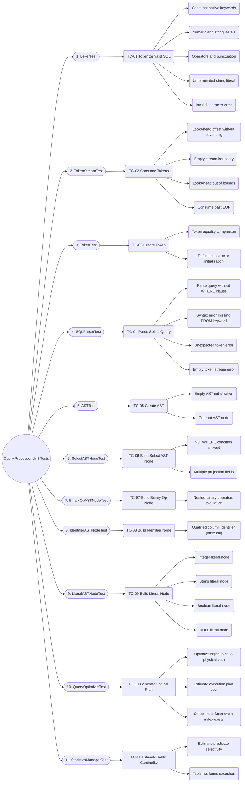

# Query Processor Unit Test Scenarios Mindmap

This mindmap represents the structural taxonomy of the Query Processor unit test scenarios, covering `Lexer`, `TokenStream`, `Token`, `SQLParser`, `AST`, `ASTNode` (`SelectASTNode`, `BinaryOpASTNode`, `IdentifierASTNode`, `LiteralASTNode`), `QueryOptimizer`, and `StatisticsManager` classes.

