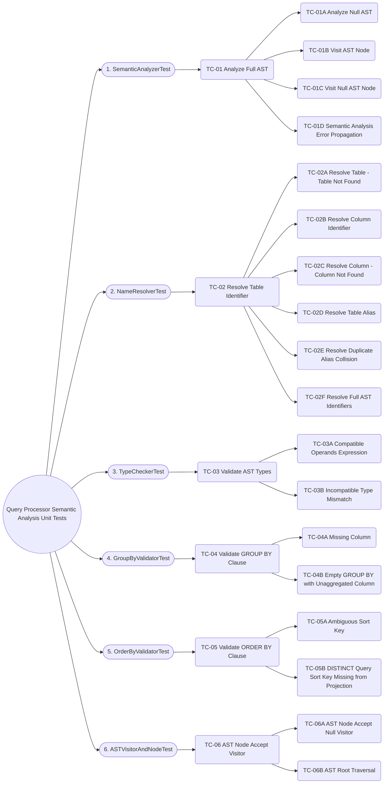

# Query Processor Subsystem - Semantic Analysis Unit Test Scenarios Mindmap

This mindmap represents the structural taxonomy of the Query Processor - Semantic Analysis unit test scenarios, organized from top-level orchestrator (`SemanticAnalyzer`) down to component-level resolvers, type checkers, validators, and AST visitor nodes (`SemanticAnalyzer` ➔ `NameResolver` ➔ `TypeChecker` ➔ `GroupByValidator` ➔ `OrderByValidator` ➔ `ASTVisitor & ASTNode`).

```mermaid
flowchart LR
    Root(("Query Processor Semantic Analysis Unit Tests"))

    %% =====================================================
    %% Categories (Semantic Analysis Subsystem Hierarchy)
    %% =====================================================

    Cat1(["1. SemanticAnalyzerTest"])
    Cat2(["2. NameResolverTest"])
    Cat3(["3. TypeCheckerTest"])
    Cat4(["4. GroupByValidatorTest"])
    Cat5(["5. OrderByValidatorTest"])
    Cat6(["6. ASTVisitorAndNodeTest"])

    Root --> Cat1
    Root --> Cat2
    Root --> Cat3
    Root --> Cat4
    Root --> Cat5
    Root --> Cat6

    %% =====================================================
    %% 1. SemanticAnalyzerTest (Main Orchestrator & Visitor)
    %% =====================================================

    Cat1 --> TC01("TC-01 Analyze Full AST")
    TC01 --> TC01A("TC-01A Analyze Null AST")
    TC01 --> TC01B("TC-01B Visit AST Node")
    TC01 --> TC01C("TC-01C Visit Null AST Node")
    TC01 --> TC01D("TC-01D Semantic Analysis Error Propagation")

    %% =====================================================
    %% 2. NameResolverTest (Table, Column & Alias Resolution)
    %% =====================================================

    Cat2 --> TC02("TC-02 Resolve Table Identifier")
    TC02 --> TC02A("TC-02A Resolve Table - Table Not Found")
    TC02 --> TC02B("TC-02B Resolve Column Identifier")
    TC02 --> TC02C("TC-02C Resolve Column - Column Not Found")
    TC02 --> TC02D("TC-02D Resolve Table Alias")
    TC02 --> TC02E("TC-02E Resolve Duplicate Alias Collision")
    TC02 --> TC02F("TC-02F Resolve Full AST Identifiers")

    %% =====================================================
    %% 3. TypeCheckerTest (Expression Type Checking)
    %% =====================================================

    Cat3 --> TC03("TC-03 Validate AST Types")
    TC03 --> TC03A("TC-03A Compatible Operands Expression")
    TC03 --> TC03B("TC-03B Incompatible Type Mismatch")

    %% =====================================================
    %% 4. GroupByValidatorTest (GROUP BY Clause Validation)
    %% =====================================================

    Cat4 --> TC04("TC-04 Validate GROUP BY Clause")
    TC04 --> TC04A("TC-04A Missing Column")
    TC04 --> TC04B("TC-04B Empty GROUP BY with Unaggregated Column")

    %% =====================================================
    %% 5. OrderByValidatorTest (ORDER BY Clause Validation)
    %% =====================================================

    Cat5 --> TC05("TC-05 Validate ORDER BY Clause")
    TC05 --> TC05A("TC-05A Ambiguous Sort Key")
    TC05 --> TC05B("TC-05B DISTINCT Query Sort Key Missing from Projection")

    %% =====================================================
    %% 6. ASTVisitorAndNodeTest (Visitor Double Dispatch & AST)
    %% =====================================================

    Cat6 --> TC06("TC-06 AST Node Accept Visitor")
    TC06 --> TC06A("TC-06A AST Node Accept Null Visitor")
    TC06 --> TC06B("TC-06B AST Root Traversal")
```
