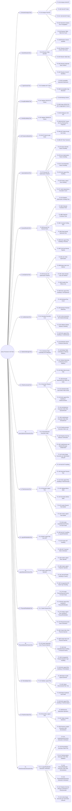

# Query Processor Subsystem - Unit Test Scenarios Mindmap

This mindmap represents the structural taxonomy of the Query Processor subsystem unit test scenarios, covering Semantic Analysis (`SemanticAnalyzer`, `NameResolver`, `TypeChecker`, `GroupByValidator`, `OrderByValidator`, `ASTVisitor & ASTNode`) and Query Optimizer (`QueryOptimizer`, `QueryRewriter`, `JoinOptimizer`, `CostEstimator`, `StatisticsManager`, `PlanEnumerator`, and `QueryOptimizerInteraction`).


```mermaid
flowchart LR
    Root(("Query Processor Unit Tests"))

    %% =====================================================
    %% Categories (Query Processor Subsystem Hierarchy)
    %% =====================================================

    Cat1(["1. SemanticAnalyzerTest"])
    Cat2(["2. NameResolverTest"])
    Cat3(["3. TypeCheckerTest"])
    Cat4(["4. GroupByValidatorTest"])
    Cat5(["5. OrderByValidatorTest"])
    Cat6(["6. ASTVisitorAndNodeTest"])
    Cat7(["7. QueryOptimizerTest"])
    Cat8(["8. QueryRewriterTest"])
    Cat9(["9. JoinOptimizerTest"])
    Cat10(["10. CostEstimatorTest"])
    Cat11(["11. StatisticsManagerTest"])
    Cat12(["12. PlanEnumeratorTest"])
    Cat13(["13. QueryOptimizerInteractionTest"])
    Cat14(["14. PlanGeneratorTest"])
    Cat15(["15. LogicalPlanBuilderTest"])
    Cat16(["16. LogicalOperatorFactoryTest"])
    Cat17(["17. PhysicalPlanBuilderTest"])
    Cat18(["18. PhysicalOperatorFactoryTest"])
    Cat19(["19. PlanValidatorTest"])
    Cat20(["20. PlanNormalizerTest"])
    Cat21(["21. PlanGeneratorInteractionTest"])

    Root --> Cat1
    Root --> Cat2
    Root --> Cat3
    Root --> Cat4
    Root --> Cat5
    Root --> Cat6
    Root --> Cat7
    Root --> Cat8
    Root --> Cat9
    Root --> Cat10
    Root --> Cat11
    Root --> Cat12
    Root --> Cat13
    Root --> Cat14
    Root --> Cat15
    Root --> Cat16
    Root --> Cat17
    Root --> Cat18
    Root --> Cat19
    Root --> Cat20
    Root --> Cat21


    %% =====================================================
    %% 1. SemanticAnalyzerTest (Main Orchestrator & Visitor)
    %% =====================================================

    Cat1 --> TC01("TC-01 Analyze Full AST")
    TC01 --> TC01A("TC-01A Analyze Null AST")
    TC01 --> TC01B("TC-01B Visit AST Node")
    TC01 --> TC01C("TC-01C Visit Null AST Node")
    TC01 --> TC01D("TC-01D Semantic Analysis Error Propagation")

    %% =====================================================
    %% 2. NameResolverTest (Table, Column & Alias Resolution)
    %% =====================================================

    Cat2 --> TC02("TC-02 Resolve Table Identifier")
    TC02 --> TC02A("TC-02A Resolve Table - Table Not Found")
    TC02 --> TC02B("TC-02B Resolve Column Identifier")
    TC02 --> TC02C("TC-02C Resolve Column - Column Not Found")
    TC02 --> TC02D("TC-02D Resolve Table Alias")
    TC02 --> TC02E("TC-02E Resolve Duplicate Alias Collision")
    TC02 --> TC02F("TC-02F Resolve Full AST Identifiers")

    %% =====================================================
    %% 3. TypeCheckerTest (Expression Type Checking)
    %% =====================================================

    Cat3 --> TC03("TC-03 Validate AST Types")
    TC03 --> TC03A("TC-03A Compatible Operands Expression")
    TC03 --> TC03B("TC-03B Incompatible Type Mismatch")

    %% =====================================================
    %% 4. GroupByValidatorTest (GROUP BY Clause Validation)
    %% =====================================================

    Cat4 --> TC04("TC-04 Validate GROUP BY Clause")
    TC04 --> TC04A("TC-04A Missing Column")
    TC04 --> TC04B("TC-04B Empty GROUP BY with Unaggregated Column")

    %% =====================================================
    %% 5. OrderByValidatorTest (ORDER BY Clause Validation)
    %% =====================================================

    Cat5 --> TC05("TC-05 Validate ORDER BY Clause")
    TC05 --> TC05A("TC-05A Ambiguous Sort Key")
    TC05 --> TC05B("TC-05B DISTINCT Query Sort Key Missing from Projection")

    %% =====================================================
    %% 6. ASTVisitorAndNodeTest (Visitor Double Dispatch & AST)
    %% =====================================================

    Cat6 --> TC06("TC-06 AST Node Accept Visitor")
    TC06 --> TC06A("TC-06A AST Node Accept Null Visitor")
    TC06 --> TC06B("TC-06B AST Root Traversal")

    %% =====================================================
    %% 7. QueryOptimizerTest (Optimization Pipeline)
    %% =====================================================

    Cat7 --> TC07("TC-07 Execute Full Optimization Pipeline")
    TC07 --> TC07A("TC-07A Query Rewrite Failure Handling")
    TC07 --> TC07B("TC-07B Join Optimization Failure Handling")
    TC07 --> TC07C("TC-07C Cost Estimation Failure Handling")
    TC07 --> TC07D("TC-07D Null Logical Plan Handling")
    TC07 --> TC07E("TC-07E Empty Logical Plan Handling")
    TC07 --> TC07F("TC-07F Verify Dependency Invocation Count")
    TC07 --> TC07G("TC-07G Replace Optimization Strategy Rule")

    %% =====================================================
    %% 8. QueryRewriterTest (Query Rewrite Rules)
    %% =====================================================

    Cat8 --> TC08("TC-08 Execute Full Rewrite Rules")
    TC08 --> TC08A("TC-08A Predicate Pushdown Rule")
    TC08 --> TC08B("TC-08B Projection Pushdown Rule")
    TC08 --> TC08C("TC-08C Constant Folding Rule")
    TC08 --> TC08D("TC-08D Skip Already Optimized Plan")
    TC08 --> TC08E("TC-08E Null Logical Plan Handling in Rewriter")
    TC08 --> TC08F("TC-08F Fail-Fast Rewrite Pipeline")

    %% =====================================================
    %% 9. JoinOptimizerTest (Join Optimization)
    %% =====================================================

    Cat9 --> TC09("TC-09 Execute Join Optimization Pipeline")
    TC09 --> TC09A("TC-09A Join Order Optimization")
    TC09 --> TC09B("TC-09B Select Hash Join Method")
    TC09 --> TC09C("TC-09C Select Nested Loop Join Method")
    TC09 --> TC09D("TC-09D Handle Plan Without Join")
    TC09 --> TC09E("TC-09E Null Logical Plan Handling in JoinOptimizer")

    %% =====================================================
    %% 10. CostEstimatorTest (Cost Estimation & Cardinality)
    %% =====================================================

    Cat10 --> TC10("TC-10 Calculate Execution Cost")
    TC10 --> TC10A("TC-10A Estimate Row Count")
    TC10 --> TC10B("TC-10B Estimate Predicate Selectivity")
    TC10 --> TC10C("TC-10C Verify Interaction with StatisticsManager")
    TC10 --> TC10D("TC-10D Fallback Default Statistics Handling")
    TC10 --> TC10E("TC-10E Null Logical Plan Handling in CostEstimator")

    %% =====================================================
    %% 11. StatisticsManagerTest (Metadata Statistics)
    %% =====================================================

    Cat11 --> TC11("TC-11 Estimate Table Cardinality from Metadata")
    TC11 --> TC11A("TC-11A Estimate Column Predicate Selectivity")
    TC11 --> TC11B("TC-11B Default Table Cardinality on Missing Statistics")
    TC11 --> TC11C("TC-11C Default Selectivity on Missing Column Statistics")

    %% =====================================================
    %% 12. PlanEnumeratorTest (Physical Plan Generation)
    %% =====================================================

    Cat12 --> TC12("TC-12 Generate Physical Plan")
    TC12 --> TC12A("TC-12A Select Best Access Path")
    TC12 --> TC12B("TC-12B Generate Sequential Scan When No Index")
    TC12 --> TC12C("TC-12C Generate Index Scan When Index Exists")
    TC12 --> TC12D("TC-12D Null Logical Plan Handling in PlanEnumerator")

    %% =====================================================
    %% 13. QueryOptimizerInteractionTest (Pipeline Orchestration)
    %% =====================================================

    Cat13 --> TC13("TC-13 QueryRewriter Execution Order")
    TC13 --> TC13A("TC-13A JoinOptimizer Execution Order After QueryRewriter")
    TC13 --> TC13B("TC-13B CostEstimator Execution Order After JoinOptimizer")
    TC13 --> TC13C("TC-13C PlanEnumerator Execution Order Last")
    TC13 --> TC13D("TC-13D Pipeline Fail-Fast Behavior Verification")
    TC13 --> TC13E("TC-13E CostEstimator and StatisticsManager Collaboration")
    TC13 --> TC13F("TC-13F Verify Single Execution per Optimization Lifecycle")

    %% =====================================================
    %% 14. PlanGeneratorTest (Plan Generation Orchestrator)
    %% =====================================================

    Cat14 --> TC14("TC-14 Generate Logical Plan")
    TC14 --> TC14A("TC-14A Null AST Handling")
    TC14 --> TC14B("TC-14B Generate Physical Plan")
    TC14 --> TC14C("TC-14C Null Logical Plan Handling in PlanGenerator")
    TC14 --> TC14D("TC-14D Validate Before Build")
    TC14 --> TC14E("TC-14E Normalize Before Build")
    TC14 --> TC14F("TC-14F Invoke Physical Plan Builder")
    TC14 --> TC14G("TC-14G Invoke Logical Plan Builder")

    %% =====================================================
    %% 15. LogicalPlanBuilderTest (Logical Tree Construction)
    %% =====================================================

    Cat15 --> TC15("TC-15 Build Logical Plan from AST")
    TC15 --> TC15A("TC-15A Invoke LogicalOperatorFactory For Each Node")
    TC15 --> TC15B("TC-15B Null AST Handling in LogicalPlanBuilder")
    TC15 --> TC15C("TC-15C Empty AST Handling")
    TC15 --> TC15D("TC-15D AST Traversal Order Verification")

    %% =====================================================
    %% 16. LogicalOperatorFactoryTest (Logical Operator Instantiation)
    %% =====================================================

    Cat16 --> TC16("TC-16 Create Logical Scan Operator")
    TC16 --> TC16A("TC-16A Create Logical Filter Operator")
    TC16 --> TC16B("TC-16B Create Logical Projection Operator")
    TC16 --> TC16C("TC-16C Null ASTNode Handling in Factory")
    TC16 --> TC16D("TC-16D Unsupported AST Node Type Handling")

    %% =====================================================
    %% 17. PhysicalPlanBuilderTest (Physical Tree Construction)
    %% =====================================================

    Cat17 --> TC17("TC-17 Build Physical Plan")
    TC17 --> TC17A("TC-17A Invoke PhysicalOperatorFactory For Each Node")
    TC17 --> TC17B("TC-17B Null Logical Plan Handling in PhysicalPlanBuilder")
    TC17 --> TC17C("TC-17C Empty Logical Plan Handling in PhysicalPlanBuilder")
    TC17 --> TC17D("TC-17D Physical Execution Order Verification")

    %% =====================================================
    %% 18. PhysicalOperatorFactoryTest (Physical Operator Instantiation)
    %% =====================================================

    Cat18 --> TC18("TC-18 Create Sequential Scan Physical Operator")
    TC18 --> TC18A("TC-18A Create Index Scan Physical Operator")
    TC18 --> TC18B("TC-18B Create Hash Join Physical Operator")
    TC18 --> TC18C("TC-18C Null LogicalPlanNode Handling in Physical Factory")
    TC18 --> TC18D("TC-18D Unsupported Physical Operator Type Handling")

    %% =====================================================
    %% 19. PlanValidatorTest (Logical Plan Validation)
    %% =====================================================

    Cat19 --> TC19("TC-19 Validate Logical Plan")
    TC19 --> TC19A("TC-19A Null Logical Plan Handling in PlanValidator")
    TC19 --> TC19B("TC-19B Detect Invalid Logical Operator")
    TC19 --> TC19C("TC-19C Detect Disconnected Plan Tree")
    TC19 --> TC19D("TC-19D Reject Duplicate Root Node")

    %% =====================================================
    %% 20. PlanNormalizerTest (Logical Plan Normalization)
    %% =====================================================

    Cat20 --> TC20("TC-20 Normalize Logical Plan")
    TC20 --> TC20A("TC-20A Null Logical Plan Handling in PlanNormalizer")
    TC20 --> TC20B("TC-20B Remove Redundant Operators")
    TC20 --> TC20C("TC-20C Flatten Nested Operators")
    TC20 --> TC20D("TC-20D Preserve Logical Semantics After Normalization")

    %% =====================================================
    %% 21. PlanGeneratorInteractionTest (Plan Generation Pipeline)
    %% =====================================================

    Cat21 --> TC21("TC-21 LogicalPlanBuilder Interaction Verification")
    TC21 --> TC21A("TC-21A LogicalOperatorFactory Interaction Verification")
    TC21 --> TC21B("TC-21B PlanValidator Execution Order First")
    TC21 --> TC21C("TC-21C PlanNormalizer Execution Order After Validation")
    TC21 --> TC21D("TC-21D PhysicalPlanBuilder Execution Order After Normalization")
    TC21 --> TC21E("TC-21E PhysicalOperatorFactory Interaction Verification")
    TC21 --> TC21F("TC-21F Pipeline Fail-Fast Behavior Verification in PlanGenerator")
    TC21 --> TC21G("TC-21G Verify Single Execution per Generation Lifecycle")
```

```
