# Sequence Diagrams - Query Processor Subsystem Unit Test Scenarios

This document provides detailed Mermaid sequence diagrams for all positive (happy path) and negative (edge cases / exception) unit test scenarios mapped out in [MindmapTest.md](file:///d:/BBV/Database_Management_BBV/docs/unit_test/query_prossor/MindmapTest.md) and specified in [QueryProcessorTestcase.md](file:///d:/BBV/Database_Management_BBV/docs/unit_test/query_prossor/QueryProcessorTestcase.md).

---

## 1. Lexer Unit Tests

### TC-01: `tokenize`

#### Happy Path: `tokenize_ShouldReturnTokenStream_WhenValidSqlIsProvided`
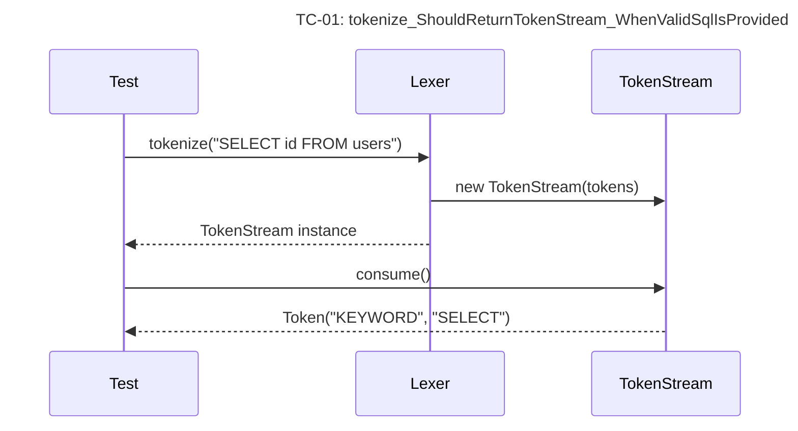
```mermaid
sequenceDiagram
    title TC-01: tokenize_ShouldReturnTokenStream_WhenValidSqlIsProvided
    participant Test
    participant Lexer
    participant TokenStream

    Test->>Lexer: tokenize("SELECT id FROM users")
    Lexer->>TokenStream: new TokenStream(tokens)
    Lexer-->>Test: TokenStream instance
    Test->>TokenStream: consume()
    TokenStream-->>Test: Token("KEYWORD", "SELECT")
```

#### TC-01A: `tokenize_ShouldHandleKeywordsCaseInsensitively_WhenMixedCase`
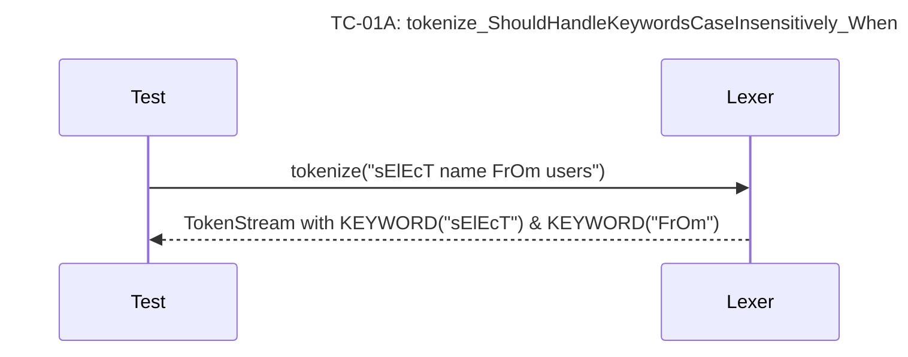
```mermaid
sequenceDiagram
    title TC-01A: tokenize_ShouldHandleKeywordsCaseInsensitively_WhenMixedCase
    participant Test
    participant Lexer

    Test->>Lexer: tokenize("sElEcT name FrOm users")
    Lexer-->>Test: TokenStream with KEYWORD("sElEcT") & KEYWORD("FrOm")
```

#### TC-01B: `tokenize_ShouldScanNumericAndStringLiterals_WhenPresent`
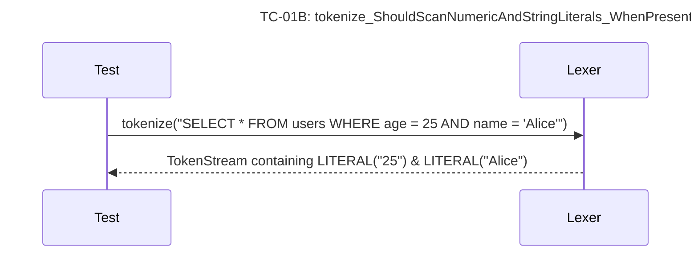
```mermaid
sequenceDiagram
    title TC-01B: tokenize_ShouldScanNumericAndStringLiterals_WhenPresent
    participant Test
    participant Lexer

    Test->>Lexer: tokenize("SELECT * FROM users WHERE age = 25 AND name = 'Alice'")
    Lexer-->>Test: TokenStream containing LITERAL("25") & LITERAL("Alice")
```

#### TC-01C: `tokenize_ShouldScanOperatorsAndPunctuation_WhenValid`
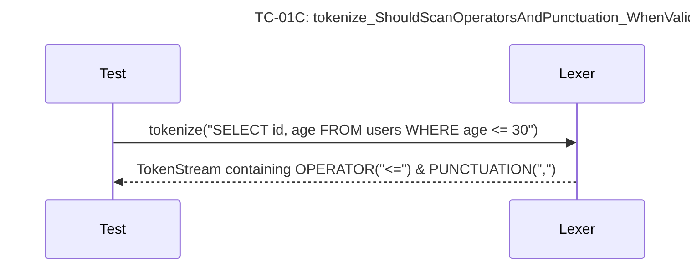
```mermaid
sequenceDiagram
    title TC-01C: tokenize_ShouldScanOperatorsAndPunctuation_WhenValid
    participant Test
    participant Lexer

    Test->>Lexer: tokenize("SELECT id, age FROM users WHERE age <= 30")
    Lexer-->>Test: TokenStream containing OPERATOR("<=") & PUNCTUATION(",")
```

#### TC-01D: `tokenize_ShouldThrowException_WhenUnterminatedStringLiteral`
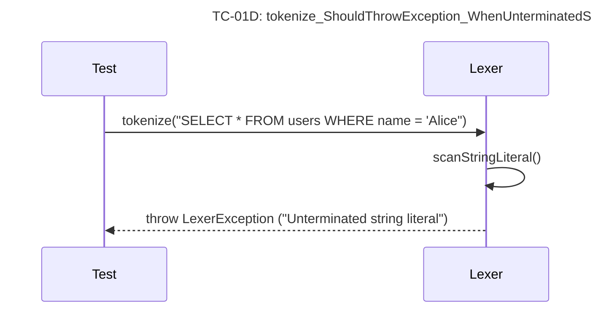
```mermaid
sequenceDiagram
    title TC-01D: tokenize_ShouldThrowException_WhenUnterminatedStringLiteral
    participant Test
    participant Lexer

    Test->>Lexer: tokenize("SELECT * FROM users WHERE name = 'Alice")
    Lexer->>Lexer: scanStringLiteral()
    Lexer-->>Test: throw LexerException ("Unterminated string literal")
```

#### TC-01E: `tokenize_ShouldThrowException_WhenInvalidCharacterEncountered`
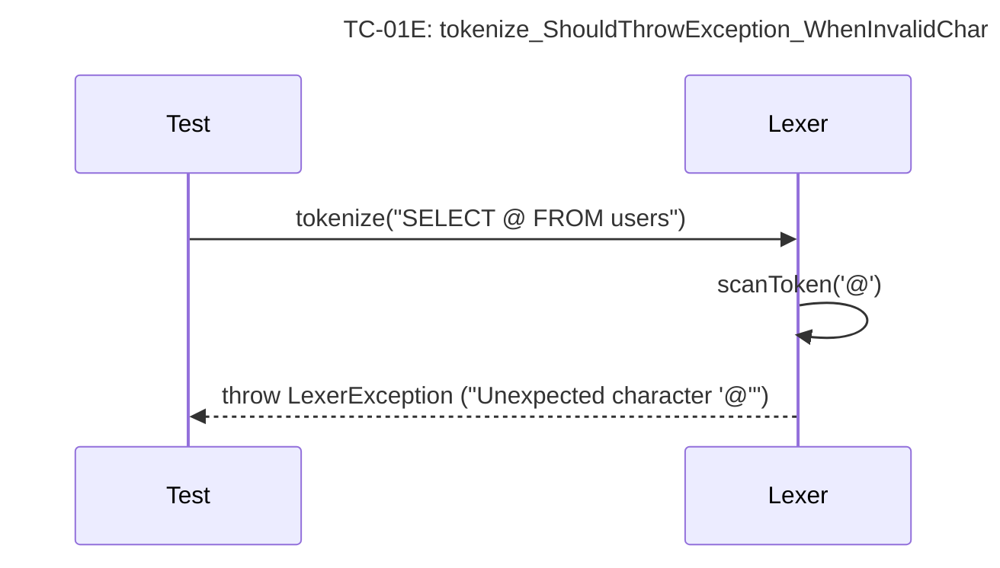
```mermaid
sequenceDiagram
    title TC-01E: tokenize_ShouldThrowException_WhenInvalidCharacterEncountered
    participant Test
    participant Lexer

    Test->>Lexer: tokenize("SELECT @ FROM users")
    Lexer->>Lexer: scanToken('@')
    Lexer-->>Test: throw LexerException ("Unexpected character '@'")
```

---

## 2. TokenStream Unit Tests

### TC-02: `consume` & `lookAhead`

#### Happy Path: `consume_ShouldReturnNextTokenAndAdvance_WhenHasNext`
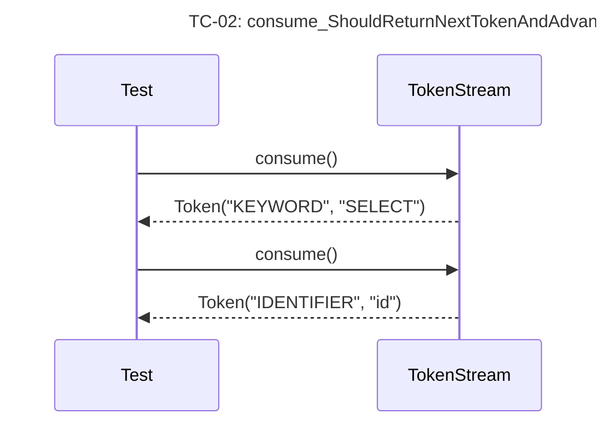
```mermaid
sequenceDiagram
    title TC-02: consume_ShouldReturnNextTokenAndAdvance_WhenHasNext
    participant Test
    participant TokenStream

    Test->>TokenStream: consume()
    TokenStream-->>Test: Token("KEYWORD", "SELECT")
    Test->>TokenStream: consume()
    TokenStream-->>Test: Token("IDENTIFIER", "id")
```

#### TC-02A: `lookAhead_ShouldReturnTokenAtOffset_WithoutAdvancingPointer`
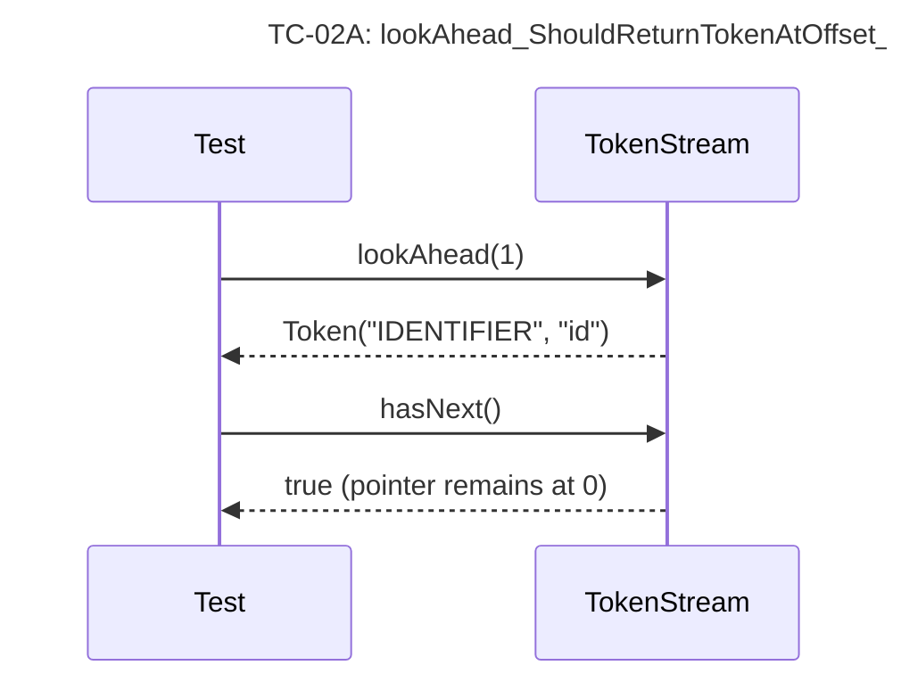
```mermaid
sequenceDiagram
    title TC-02A: lookAhead_ShouldReturnTokenAtOffset_WithoutAdvancingPointer
    participant Test
    participant TokenStream

    Test->>TokenStream: lookAhead(1)
    TokenStream-->>Test: Token("IDENTIFIER", "id")
    Test->>TokenStream: hasNext()
    TokenStream-->>Test: true (pointer remains at 0)
```

#### TC-02B: `consume_ShouldReturnNullOrThrow_WhenStreamIsEmpty`
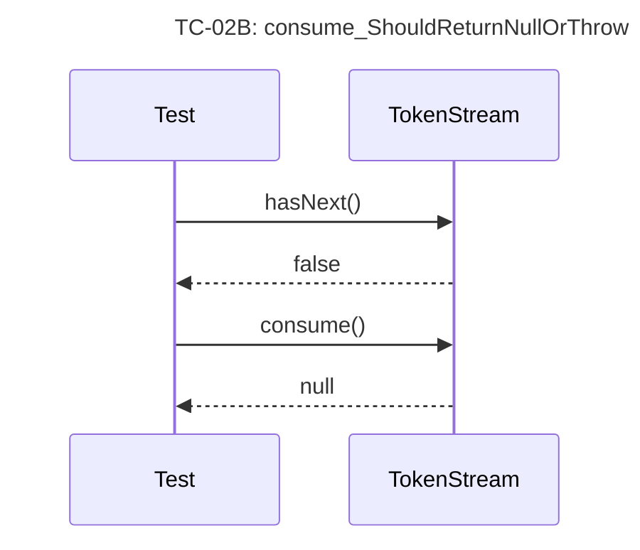
```mermaid
sequenceDiagram
    title TC-02B: consume_ShouldReturnNullOrThrow_WhenStreamIsEmpty
    participant Test
    participant TokenStream

    Test->>TokenStream: hasNext()
    TokenStream-->>Test: false
    Test->>TokenStream: consume()
    TokenStream-->>Test: null
```

#### TC-02C: `lookAhead_ShouldReturnNull_WhenOffsetExceedsBounds`
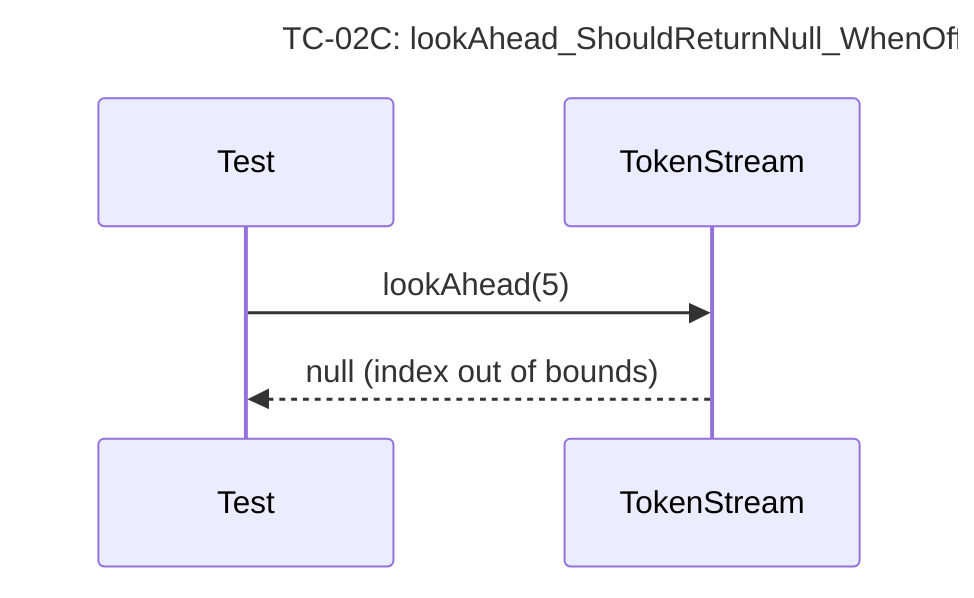
```mermaid
sequenceDiagram
    title TC-02C: lookAhead_ShouldReturnNull_WhenOffsetExceedsBounds
    participant Test
    participant TokenStream

    Test->>TokenStream: lookAhead(5)
    TokenStream-->>Test: null (index out of bounds)
```

#### TC-02D: `consume_ShouldReturnNull_WhenConsumingPastEOF`
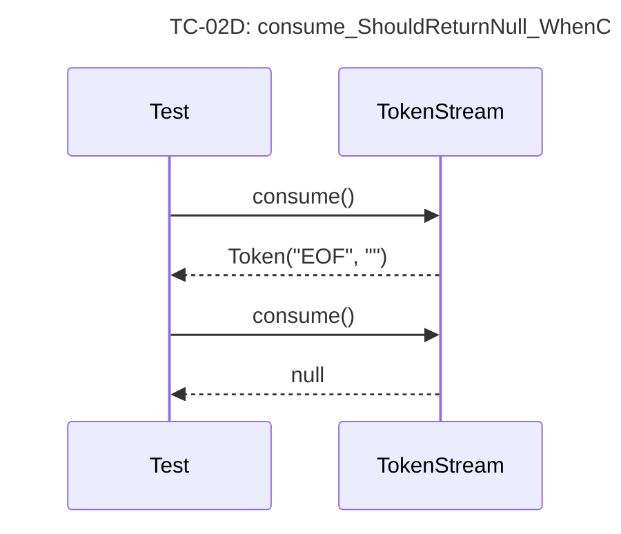
```mermaid
sequenceDiagram
    title TC-02D: consume_ShouldReturnNull_WhenConsumingPastEOF
    participant Test
    participant TokenStream

    Test->>TokenStream: consume()
    TokenStream-->>Test: Token("EOF", "")
    Test->>TokenStream: consume()
    TokenStream-->>Test: null
```

---

## 3. Token Unit Tests

### TC-03: `createToken`

#### Happy Path: `createToken_ShouldInitializeTypeAndValue_WhenValidArgsProvided`
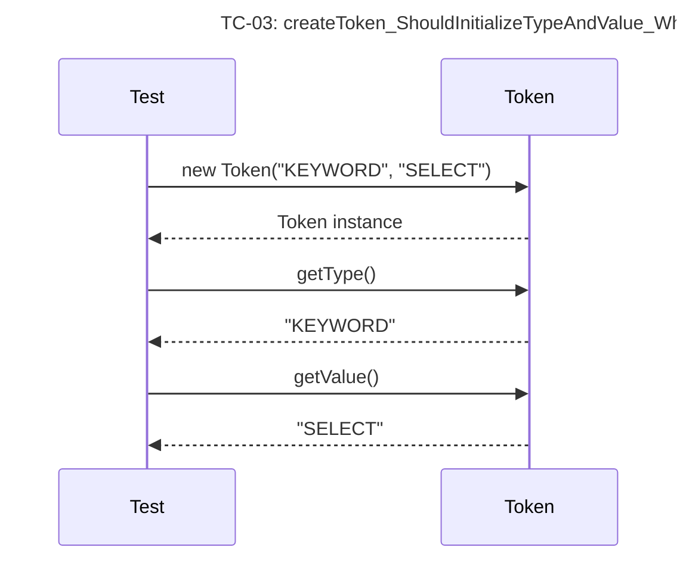
```mermaid
sequenceDiagram
    title TC-03: createToken_ShouldInitializeTypeAndValue_WhenValidArgsProvided
    participant Test
    participant Token

    Test->>Token: new Token("KEYWORD", "SELECT")
    Token-->>Test: Token instance
    Test->>Token: getType()
    Token-->>Test: "KEYWORD"
    Test->>Token: getValue()
    Token-->>Test: "SELECT"
```

#### TC-03A: `equals_ShouldCompareTokenTypeAndValue_WhenObjectsChecked`
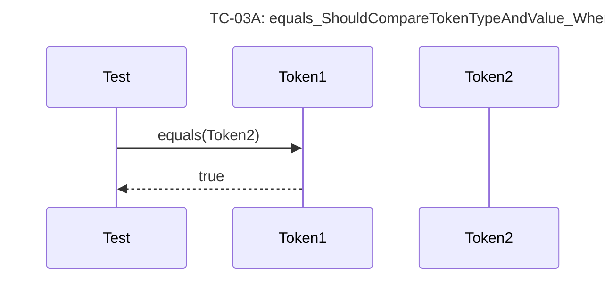
```mermaid
sequenceDiagram
    title TC-03A: equals_ShouldCompareTokenTypeAndValue_WhenObjectsChecked
    participant Test
    participant Token1
    participant Token2

    Test->>Token1: equals(Token2)
    Token1-->>Test: true
```

#### TC-03B: `defaultConstructor_ShouldInitializeWithNulls`
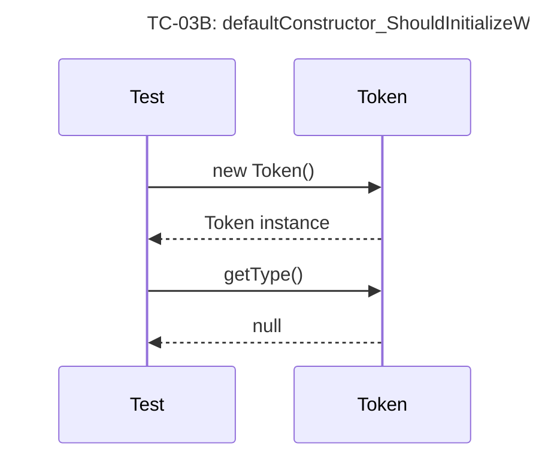
```mermaid
sequenceDiagram
    title TC-03B: defaultConstructor_ShouldInitializeWithNulls
    participant Test
    participant Token

    Test->>Token: new Token()
    Token-->>Test: Token instance
    Test->>Token: getType()
    Token-->>Test: null
```

---

## 4. SQLParser Unit Tests

### TC-04: `parse`

#### Happy Path: `parse_ShouldGenerateParseTree_WhenValidSelectQuery`
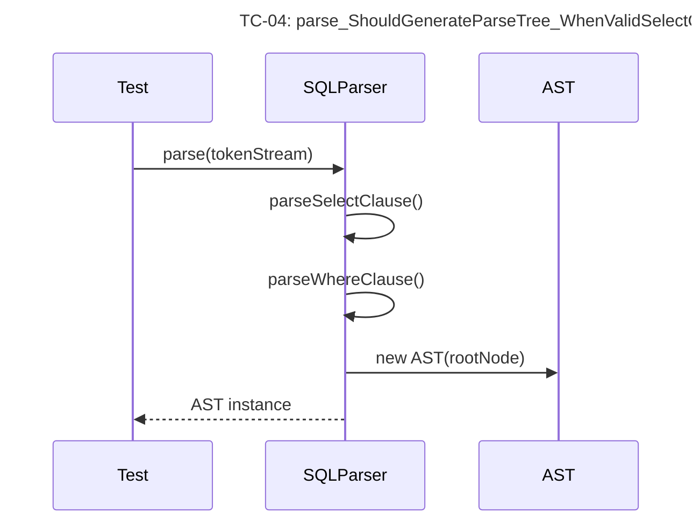
```mermaid
sequenceDiagram
    title TC-04: parse_ShouldGenerateParseTree_WhenValidSelectQuery
    participant Test
    participant SQLParser
    participant AST

    Test->>SQLParser: parse(tokenStream)
    SQLParser->>SQLParser: parseSelectClause()
    SQLParser->>SQLParser: parseWhereClause()
    SQLParser->>AST: new AST(rootNode)
    SQLParser-->>Test: AST instance
```

#### TC-04A: `parse_ShouldParseQueryWithoutWhereClause_WhenWhereIsOmitted`
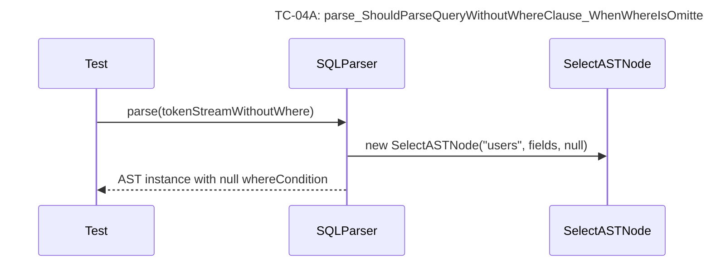
```mermaid
sequenceDiagram
    title TC-04A: parse_ShouldParseQueryWithoutWhereClause_WhenWhereIsOmitted
    participant Test
    participant SQLParser
    participant SelectASTNode

    Test->>SQLParser: parse(tokenStreamWithoutWhere)
    SQLParser->>SelectASTNode: new SelectASTNode("users", fields, null)
    SQLParser-->>Test: AST instance with null whereCondition
```

#### TC-04B: `parse_ShouldThrowException_WhenSyntaxIsInvalid`
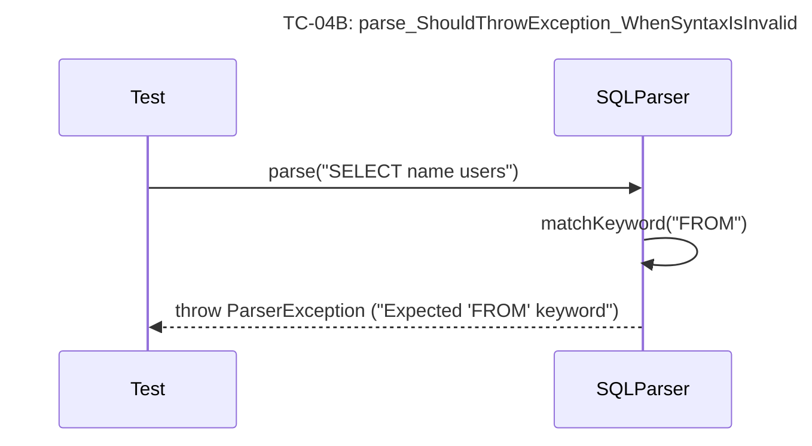
```mermaid
sequenceDiagram
    title TC-04B: parse_ShouldThrowException_WhenSyntaxIsInvalid
    participant Test
    participant SQLParser

    Test->>SQLParser: parse("SELECT name users")
    SQLParser->>SQLParser: matchKeyword("FROM")
    SQLParser-->>Test: throw ParserException ("Expected 'FROM' keyword")
```

#### TC-04C: `parse_ShouldThrowException_WhenUnexpectedTokenEncountered`
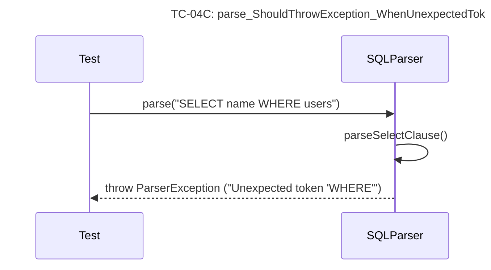
```mermaid
sequenceDiagram
    title TC-04C: parse_ShouldThrowException_WhenUnexpectedTokenEncountered
    participant Test
    participant SQLParser

    Test->>SQLParser: parse("SELECT name WHERE users")
    SQLParser->>SQLParser: parseSelectClause()
    SQLParser-->>Test: throw ParserException ("Unexpected token 'WHERE'")
```

#### TC-04D: `parse_ShouldThrowException_WhenStreamIsEmpty`
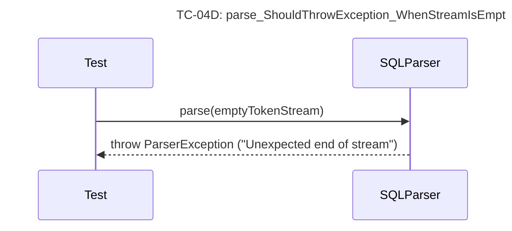
```mermaid
sequenceDiagram
    title TC-04D: parse_ShouldThrowException_WhenStreamIsEmpty
    participant Test
    participant SQLParser

    Test->>SQLParser: parse(emptyTokenStream)
    SQLParser-->>Test: throw ParserException ("Unexpected end of stream")
```

---

## 5. AST Unit Tests

### TC-05: `createAST`

#### Happy Path: `createAST_ShouldAssignRootNode_WhenProvided`
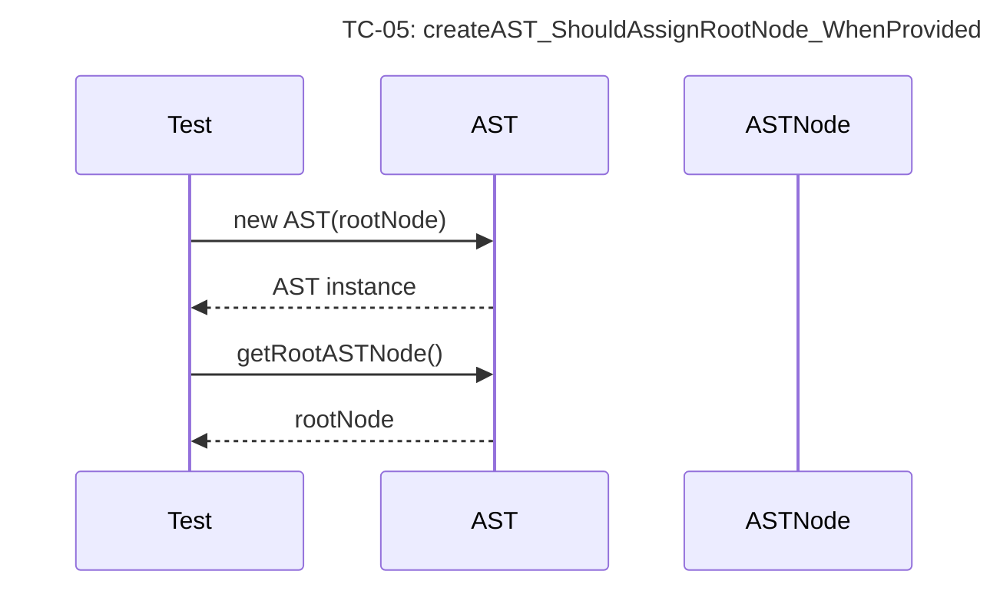
```mermaid
sequenceDiagram
    title TC-05: createAST_ShouldAssignRootNode_WhenProvided
    participant Test
    participant AST
    participant ASTNode

    Test->>AST: new AST(rootNode)
    AST-->>Test: AST instance
    Test->>AST: getRootASTNode()
    AST-->>Test: rootNode
```

#### TC-05A: `defaultConstructor_ShouldInitializeNullRoot`
```mermaid
sequenceDiagram
    title TC-05A: defaultConstructor_ShouldInitializeNullRoot
    participant Test
    participant AST

    Test->>AST: new AST()
    AST-->>Test: AST instance
    Test->>AST: getRootASTNode()
    AST-->>Test: null
```

#### TC-05B: `getRootASTNode_ShouldReturnAssignedRootNode`
```mermaid
sequenceDiagram
    title TC-05B: getRootASTNode_ShouldReturnAssignedRootNode
    participant Test
    participant AST

    Test->>AST: getRootASTNode()
    AST-->>Test: selectASTNode
```

---

## 6. SelectASTNode Unit Tests

### TC-06: `buildSelectASTNode`

#### Happy Path: `buildSelectASTNode_ShouldStoreTableFieldsAndWhereCondition`
```mermaid
sequenceDiagram
    title TC-06: buildSelectASTNode_ShouldStoreTableFieldsAndWhereCondition
    participant Test
    participant SelectASTNode

    Test->>SelectASTNode: new SelectASTNode("orders", ["id"], whereNode)
    SelectASTNode-->>Test: Node instance
    Test->>SelectASTNode: getTableName()
    SelectASTNode-->>Test: "orders"
    Test->>SelectASTNode: getWhereCondition()
    SelectASTNode-->>Test: whereNode
```

#### TC-06A: `buildSelectASTNode_ShouldAllowNullWhereCondition_WhenNoWhereClause`
```mermaid
sequenceDiagram
    title TC-06A: buildSelectASTNode_ShouldAllowNullWhereCondition_WhenNoWhereClause
    participant Test
    participant SelectASTNode

    Test->>SelectASTNode: new SelectASTNode("users", ["name"], null)
    SelectASTNode-->>Test: Node instance
    Test->>SelectASTNode: getWhereCondition()
    SelectASTNode-->>Test: null
```

#### TC-06B: `buildSelectASTNode_ShouldSupportMultipleProjectionFields`
```mermaid
sequenceDiagram
    title TC-06B: buildSelectASTNode_ShouldSupportMultipleProjectionFields
    participant Test
    participant SelectASTNode

    Test->>SelectASTNode: new SelectASTNode("users", ["id", "name", "age"], null)
    SelectASTNode-->>Test: Node instance
    Test->>SelectASTNode: getProjectionFields()
    SelectASTNode-->>Test: List of 3 fields
```

---

## 7. BinaryOpASTNode Unit Tests

### TC-07: `buildBinaryOpNode`

#### Happy Path: `buildBinaryOpNode_ShouldStoreOperatorAndLeftRightChildNodes`
```mermaid
sequenceDiagram
    title TC-07: buildBinaryOpNode_ShouldStoreOperatorAndLeftRightChildNodes
    participant Test
    participant BinaryOpASTNode

    Test->>BinaryOpASTNode: new BinaryOpASTNode(">", leftNode, rightNode)
    BinaryOpASTNode-->>Test: Node instance
    Test->>BinaryOpASTNode: getOperatorType()
    BinaryOpASTNode-->>Test: ">"
```

#### TC-07A: `buildBinaryOpNode_ShouldSupportNestedBinaryOperators`
```mermaid
sequenceDiagram
    title TC-07A: buildBinaryOpNode_ShouldSupportNestedBinaryOperators
    participant Test
    participant BinaryOpASTNode

    Test->>BinaryOpASTNode: new BinaryOpASTNode("AND", leftOpNode, rightOpNode)
    BinaryOpASTNode-->>Test: Nested Node instance
```

---

## 8. IdentifierASTNode Unit Tests

### TC-08: `buildIdentifierNode`

#### Happy Path: `buildIdentifierNode_ShouldStoreColumnName`
```mermaid
sequenceDiagram
    title TC-08: buildIdentifierNode_ShouldStoreColumnName
    participant Test
    participant IdentifierASTNode

    Test->>IdentifierASTNode: new IdentifierASTNode("user_id")
    IdentifierASTNode-->>Test: Node instance
    Test->>IdentifierASTNode: getValue()
    IdentifierASTNode-->>Test: "user_id"
```

#### TC-08A: `buildIdentifierNode_ShouldHandleQualifiedColumnNames`
```mermaid
sequenceDiagram
    title TC-08A: buildIdentifierNode_ShouldHandleQualifiedColumnNames
    participant Test
    participant IdentifierASTNode

    Test->>IdentifierASTNode: new IdentifierASTNode("users.user_id")
    IdentifierASTNode-->>Test: Node instance
    Test->>IdentifierASTNode: getValue()
    IdentifierASTNode-->>Test: "users.user_id"
```

---

## 9. LiteralASTNode Unit Tests

### TC-09: `buildLiteralNode`

#### Happy Path: `buildLiteralNode_ShouldStoreRawValueAndInferredType`
```mermaid
sequenceDiagram
    title TC-09: buildLiteralNode_ShouldStoreRawValueAndInferredType
    participant Test
    participant LiteralASTNode

    Test->>LiteralASTNode: new LiteralASTNode("100", "INT")
    LiteralASTNode-->>Test: Node instance
    Test->>LiteralASTNode: getValue()
    LiteralASTNode-->>Test: "100"
    Test->>LiteralASTNode: getInferredType()
    LiteralASTNode-->>Test: "INT"
```

#### TC-09A: `buildLiteralNode_ShouldSupportIntegerLiteral`
```mermaid
sequenceDiagram
    title TC-09A: buildLiteralNode_ShouldSupportIntegerLiteral
    participant Test
    participant LiteralASTNode

    Test->>LiteralASTNode: new LiteralASTNode("42", "INT")
    LiteralASTNode-->>Test: Node instance
```

#### TC-09B: `buildLiteralNode_ShouldSupportStringLiteral`
```mermaid
sequenceDiagram
    title TC-09B: buildLiteralNode_ShouldSupportStringLiteral
    participant Test
    participant LiteralASTNode

    Test->>LiteralASTNode: new LiteralASTNode("John", "VARCHAR")
    LiteralASTNode-->>Test: Node instance
```

#### TC-09C: `buildLiteralNode_ShouldSupportBooleanLiteral`
```mermaid
sequenceDiagram
    title TC-09C: buildLiteralNode_ShouldSupportBooleanLiteral
    participant Test
    participant LiteralASTNode

    Test->>LiteralASTNode: new LiteralASTNode("true", "BOOLEAN")
    LiteralASTNode-->>Test: Node instance
```

#### TC-09D: `buildLiteralNode_ShouldSupportNullLiteral`
```mermaid
sequenceDiagram
    title TC-09D: buildLiteralNode_ShouldSupportNullLiteral
    participant Test
    participant LiteralASTNode

    Test->>LiteralASTNode: new LiteralASTNode("NULL", "UNKNOWN")
    LiteralASTNode-->>Test: Node instance
```

---

## 10. QueryOptimizer Unit Tests

### TC-10: `generateLogicalPlan` & `optimize`

#### Happy Path: `generateLogicalPlan_ShouldConvertASTToLogicalPlan`
```mermaid
sequenceDiagram
    title TC-10: generateLogicalPlan_ShouldConvertASTToLogicalPlan
    participant Test
    participant QueryOptimizer
    participant LogicalPlan

    Test->>QueryOptimizer: generateLogicalPlan(ast)
    QueryOptimizer->>LogicalPlan: new LogicalPlan()
    QueryOptimizer-->>Test: LogicalPlan instance
```

#### TC-10A: `optimize_ShouldTransformLogicalPlanToPhysicalPlan_WhenRulesApplied`
```mermaid
sequenceDiagram
    title TC-10A: optimize_ShouldTransformLogicalPlanToPhysicalPlan_WhenRulesApplied
    participant Test
    participant QueryOptimizer
    participant PhysicalPlan

    Test->>QueryOptimizer: optimize(logicalPlan)
    QueryOptimizer->>PhysicalPlan: new PhysicalPlan()
    QueryOptimizer-->>Test: PhysicalPlan instance
```

#### TC-10B: `estimateCost_ShouldComputeTotalPlanCost_WhenPhysicalPlanOptimized`
```mermaid
sequenceDiagram
    title TC-10B: estimateCost_ShouldComputeTotalPlanCost_WhenPhysicalPlanOptimized
    participant Test
    participant PhysicalPlan

    Test->>PhysicalPlan: getEstimatedCost()
    PhysicalPlan-->>Test: costValue (>= 0.0)
```

#### TC-10C: `optimize_ShouldSelectIndexScan_WhenIndexExistsOnFilterColumn`
```mermaid
sequenceDiagram
    title TC-10C: optimize_ShouldSelectIndexScan_WhenIndexExistsOnFilterColumn
    participant Test
    participant QueryOptimizer
    participant PhysicalPlan

    Test->>QueryOptimizer: optimize(logicalPlanWithIndexFilter)
    QueryOptimizer->>PhysicalPlan: createIndexScanNode()
    QueryOptimizer-->>Test: PhysicalPlan with IndexScanNode
```

---

## 11. StatisticsManager Unit Tests

### TC-11: `estimateCardinality`

#### Happy Path: `estimateCardinality_ShouldReturnTableRowCount`
```mermaid
sequenceDiagram
    title TC-11: estimateCardinality_ShouldReturnTableRowCount
    participant Test
    participant StatisticsManager

    Test->>StatisticsManager: estimateCardinality("users")
    StatisticsManager-->>Test: rowCount (long)
```

#### TC-11A: `estimateSelectivity_ShouldComputeFractionalSelectivity_ForPredicate`
```mermaid
sequenceDiagram
    title TC-11A: estimateSelectivity_ShouldComputeFractionalSelectivity_ForPredicate
    participant Test
    participant StatisticsManager

    Test->>StatisticsManager: estimateSelectivity("status", "ACTIVE")
    StatisticsManager-->>Test: selectivityValue (0.0 to 1.0)
```

#### TC-11B: `estimateCardinality_ShouldThrowException_WhenTableNotFound`
```mermaid
sequenceDiagram
    title TC-11B: estimateCardinality_ShouldThrowException_WhenTableNotFound
    participant Test
    participant StatisticsManager

    Test->>StatisticsManager: estimateCardinality("unknown_table")
    StatisticsManager->>StatisticsManager: checkTable("unknown_table")
    StatisticsManager-->>Test: throw TableNotFoundException
```