# Sequence Diagrams - Query Processor Subsystem (Semantic Analysis Unit Test Scenarios)

This document provides detailed Mermaid sequence diagrams with explicit UML activation bars for all positive (happy path) and negative (edge cases / exception) unit test scenarios mapped out in [MindmapTest.md](file:///d:/BBV/Database_Management_BBV/docs/unit_test/query_prossor/MindmapTest.md) and specified in [QueryProcessorTestcase.md](file:///d:/BBV/Database_Management_BBV/docs/unit_test/query_prossor/QueryProcessorTestcase.md).

---

## 1. SemanticAnalyzer Unit Tests

### TC-01: `analyze`

#### Happy Path: `analyze_ShouldExecuteFourStepValidationInOrder_WhenValidASTProvided`
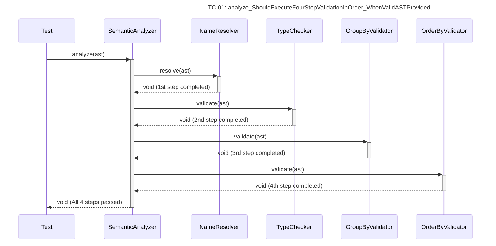
```mermaid
sequenceDiagram
    title TC-01: analyze_ShouldExecuteFourStepValidationInOrder_WhenValidASTProvided
    participant Test
    participant SemanticAnalyzer
    participant NameResolver
    participant TypeChecker
    participant GroupByValidator
    participant OrderByValidator

    Test->>+SemanticAnalyzer: analyze(ast)
    SemanticAnalyzer->>+NameResolver: resolve(ast)
    NameResolver-->>-SemanticAnalyzer: void (1st step completed)
    SemanticAnalyzer->>+TypeChecker: validate(ast)
    TypeChecker-->>-SemanticAnalyzer: void (2nd step completed)
    SemanticAnalyzer->>+GroupByValidator: validate(ast)
    GroupByValidator-->>-SemanticAnalyzer: void (3rd step completed)
    SemanticAnalyzer->>+OrderByValidator: validate(ast)
    OrderByValidator-->>-SemanticAnalyzer: void (4th step completed)
    SemanticAnalyzer-->>-Test: void (All 4 steps passed)
```

#### TC-01A: `analyze_ShouldHandleNullASTGracefully_WhenASTIsNull`
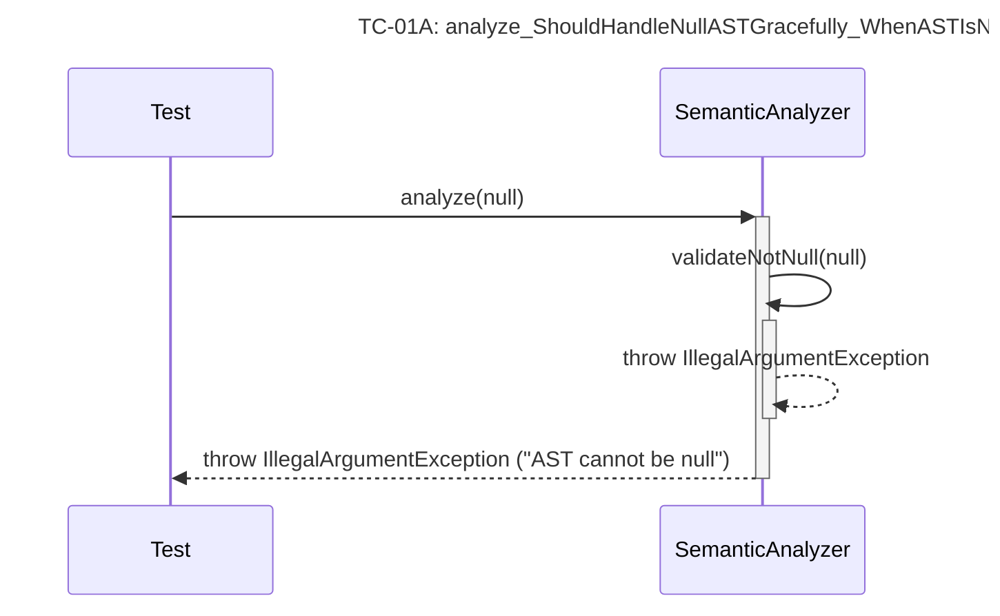
```mermaid
sequenceDiagram
    title TC-01A: analyze_ShouldHandleNullASTGracefully_WhenASTIsNull
    participant Test
    participant SemanticAnalyzer

    Test->>+SemanticAnalyzer: analyze(null)
    SemanticAnalyzer->>+SemanticAnalyzer: validateNotNull(null)
    SemanticAnalyzer-->>-SemanticAnalyzer: throw IllegalArgumentException
    SemanticAnalyzer-->>-Test: throw IllegalArgumentException ("AST cannot be null")
```

#### TC-01B: `visit_ShouldInvokeAcceptOnASTNode_WhenValidNodeVisited`
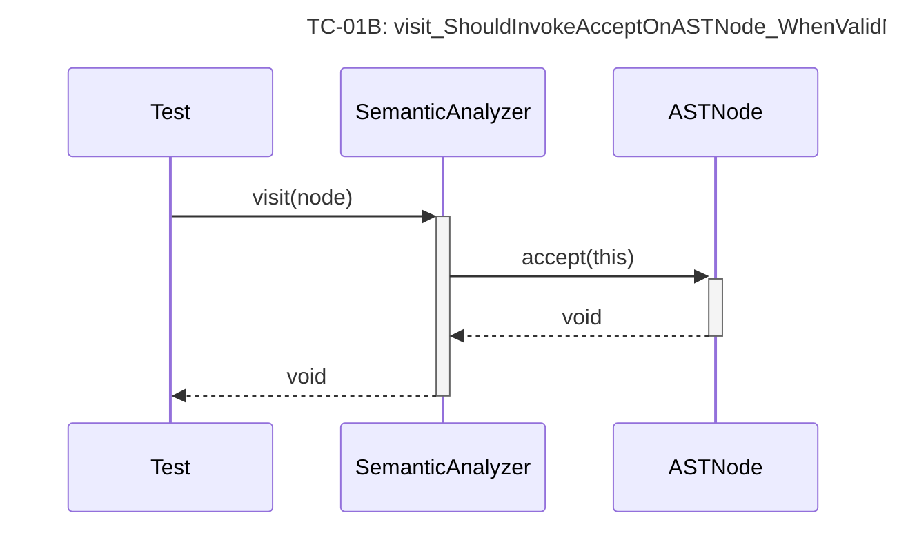
```mermaid
sequenceDiagram
    title TC-01B: visit_ShouldInvokeAcceptOnASTNode_WhenValidNodeVisited
    participant Test
    participant SemanticAnalyzer
    participant ASTNode

    Test->>+SemanticAnalyzer: visit(node)
    SemanticAnalyzer->>+ASTNode: accept(this)
    ASTNode-->>-SemanticAnalyzer: void
    SemanticAnalyzer-->>-Test: void
```

#### TC-01C: `visit_ShouldDoNothing_WhenASTNodeIsNull`
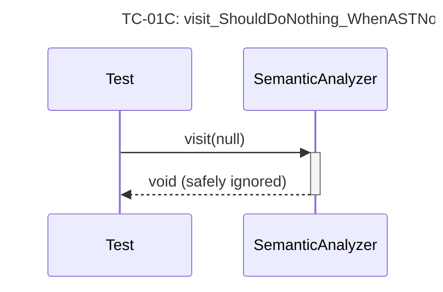
```mermaid
sequenceDiagram
    title TC-01C: visit_ShouldDoNothing_WhenASTNodeIsNull
    participant Test
    participant SemanticAnalyzer

    Test->>+SemanticAnalyzer: visit(null)
    SemanticAnalyzer-->>-Test: void (safely ignored)
```

#### TC-01D: `analyze_ShouldPropagateException_WhenAnyStepValidationFails`
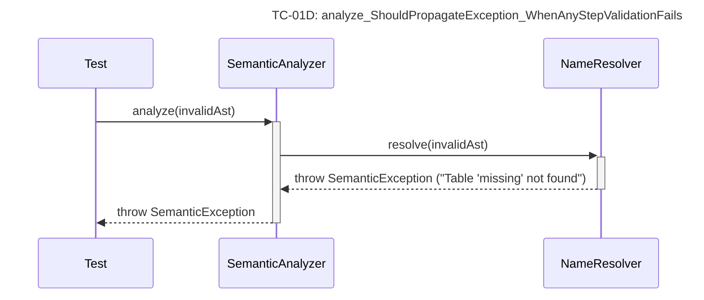
```mermaid
sequenceDiagram
    title TC-01D: analyze_ShouldPropagateException_WhenAnyStepValidationFails
    participant Test
    participant SemanticAnalyzer
    participant NameResolver

    Test->>+SemanticAnalyzer: analyze(invalidAst)
    SemanticAnalyzer->>+NameResolver: resolve(invalidAst)
    NameResolver-->>-SemanticAnalyzer: throw SemanticException ("Table 'missing' not found")
    SemanticAnalyzer-->>-Test: throw SemanticException
```

---

## 2. NameResolver Unit Tests

### TC-02: `resolveTable` & `resolveColumn`

#### Happy Path: `resolveTable_ShouldReturnTrue_WhenTableExistsInMetadata`
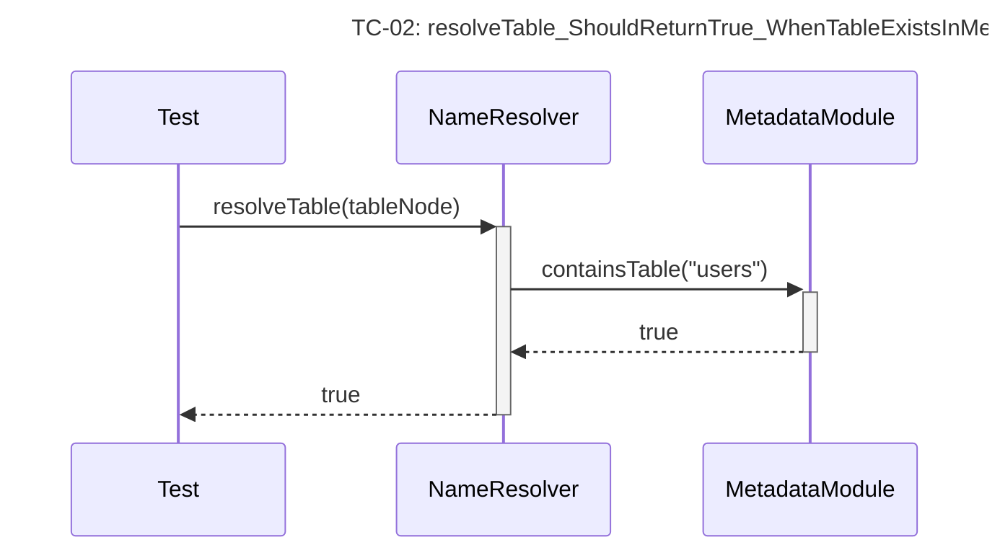
```mermaid
sequenceDiagram
    title TC-02: resolveTable_ShouldReturnTrue_WhenTableExistsInMetadata
    participant Test
    participant NameResolver
    participant MetadataModule

    Test->>+NameResolver: resolveTable(tableNode)
    NameResolver->>+MetadataModule: containsTable("users")
    MetadataModule-->>-NameResolver: true
    NameResolver-->>-Test: true
```

#### TC-02A: `resolveTable_ShouldReturnFalse_WhenTableDoesNotExistInMetadata`
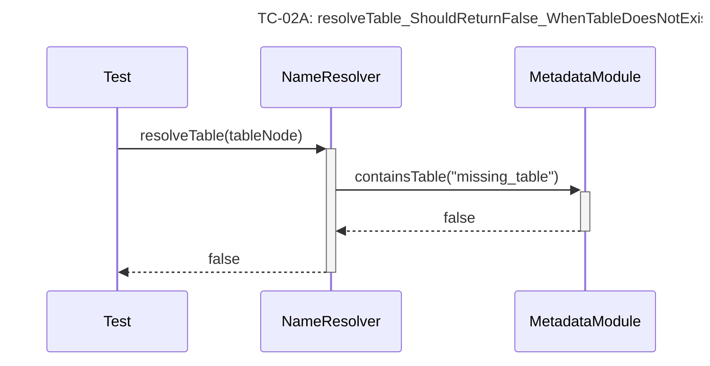
```mermaid
sequenceDiagram
    title TC-02A: resolveTable_ShouldReturnFalse_WhenTableDoesNotExistInMetadata
    participant Test
    participant NameResolver
    participant MetadataModule

    Test->>+NameResolver: resolveTable(tableNode)
    NameResolver->>+MetadataModule: containsTable("missing_table")
    MetadataModule-->>-NameResolver: false
    NameResolver-->>-Test: false
```

#### TC-02B: `resolveColumn_ShouldReturnTrue_WhenColumnExistsInTable`
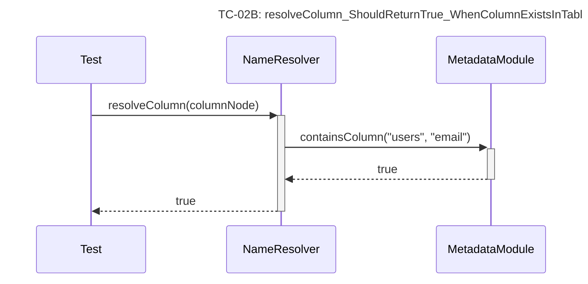
```mermaid
sequenceDiagram
    title TC-02B: resolveColumn_ShouldReturnTrue_WhenColumnExistsInTable
    participant Test
    participant NameResolver
    participant MetadataModule

    Test->>+NameResolver: resolveColumn(columnNode)
    NameResolver->>+MetadataModule: containsColumn("users", "email")
    MetadataModule-->>-NameResolver: true
    NameResolver-->>-Test: true
```

#### TC-02C: `resolveColumn_ShouldReturnFalse_WhenColumnDoesNotExist`
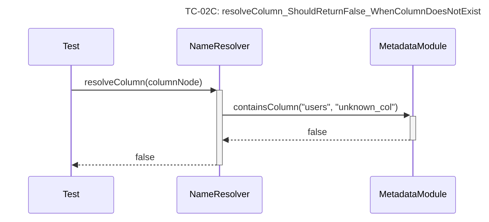
```mermaid
sequenceDiagram
    title TC-02C: resolveColumn_ShouldReturnFalse_WhenColumnDoesNotExist
    participant Test
    participant NameResolver
    participant MetadataModule

    Test->>+NameResolver: resolveColumn(columnNode)
    NameResolver->>+MetadataModule: containsColumn("users", "unknown_col")
    MetadataModule-->>-NameResolver: false
    NameResolver-->>-Test: false
```

#### TC-02D: `resolveAlias_ShouldReturnTrue_WhenAliasIsValid`
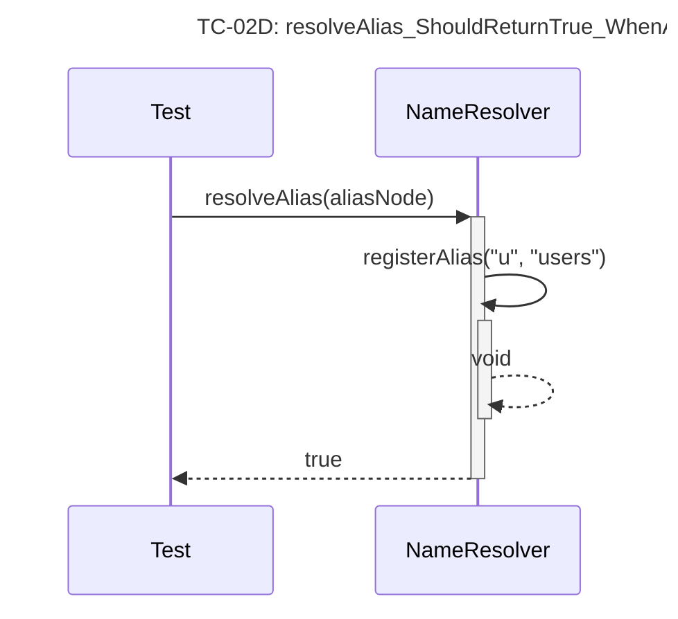
```mermaid
sequenceDiagram
    title TC-02D: resolveAlias_ShouldReturnTrue_WhenAliasIsValid
    participant Test
    participant NameResolver

    Test->>+NameResolver: resolveAlias(aliasNode)
    NameResolver->>+NameResolver: registerAlias("u", "users")
    NameResolver-->>-NameResolver: void
    NameResolver-->>-Test: true
```

#### TC-02E: `resolveAlias_ShouldReturnFalse_WhenAliasIsDuplicatedInSameScope`
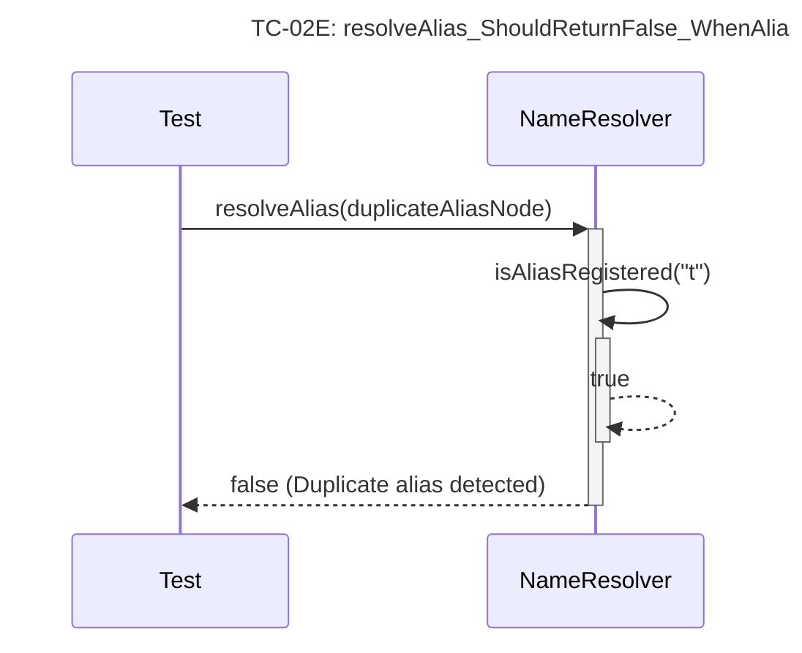
```mermaid
sequenceDiagram
    title TC-02E: resolveAlias_ShouldReturnFalse_WhenAliasIsDuplicatedInSameScope
    participant Test
    participant NameResolver

    Test->>+NameResolver: resolveAlias(duplicateAliasNode)
    NameResolver->>+NameResolver: isAliasRegistered("t")
    NameResolver-->>-NameResolver: true
    NameResolver-->>-Test: false (Duplicate alias detected)
```

#### TC-02F: `resolve_ShouldProcessAllIdentifiersInAST_WhenASTIsProvided`
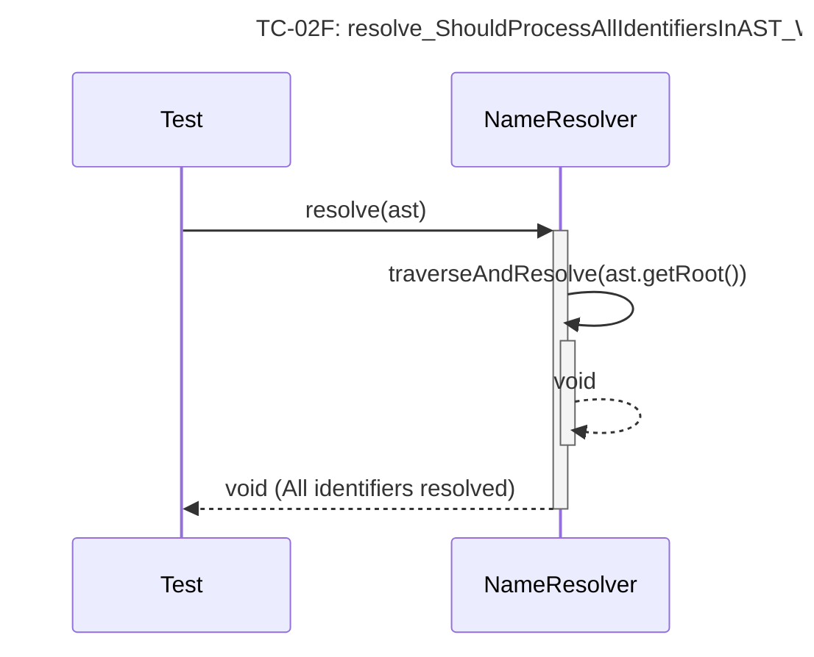
```mermaid
sequenceDiagram
    title TC-02F: resolve_ShouldProcessAllIdentifiersInAST_WhenASTIsProvided
    participant Test
    participant NameResolver

    Test->>+NameResolver: resolve(ast)
    NameResolver->>+NameResolver: traverseAndResolve(ast.getRoot())
    NameResolver-->>-NameResolver: void
    NameResolver-->>-Test: void (All identifiers resolved)
```

---

## 3. TypeChecker Unit Tests

### TC-03: `validate` & `checkExpression`

#### Happy Path: `validate_ShouldCheckAllExpressions_WhenASTIsProvided`
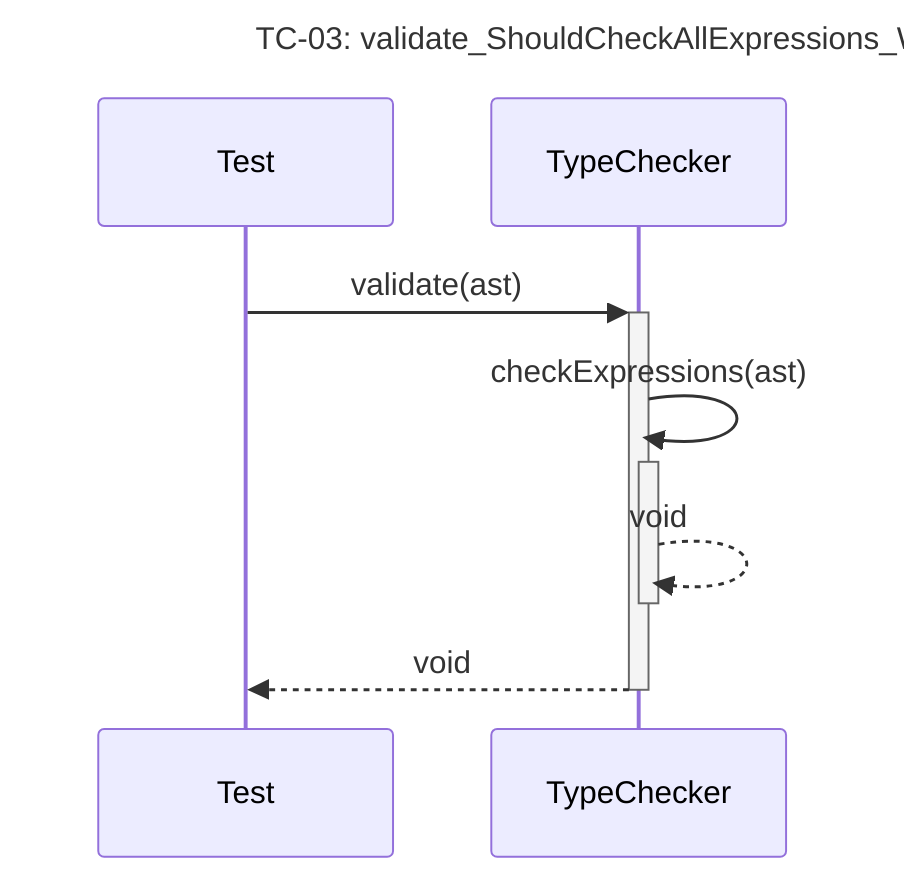
```mermaid
sequenceDiagram
    title TC-03: validate_ShouldCheckAllExpressions_WhenASTIsProvided
    participant Test
    participant TypeChecker

    Test->>+TypeChecker: validate(ast)
    TypeChecker->>+TypeChecker: checkExpressions(ast)
    TypeChecker-->>-TypeChecker: void
    TypeChecker-->>-Test: void
```

#### TC-03A: `checkExpression_ShouldReturnTrue_WhenOperandTypesAreCompatible`
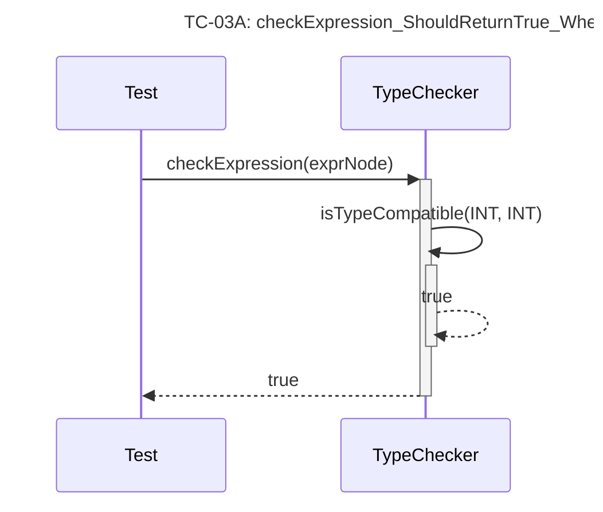
```mermaid
sequenceDiagram
    title TC-03A: checkExpression_ShouldReturnTrue_WhenOperandTypesAreCompatible
    participant Test
    participant TypeChecker

    Test->>+TypeChecker: checkExpression(exprNode)
    TypeChecker->>+TypeChecker: isTypeCompatible(INT, INT)
    TypeChecker-->>-TypeChecker: true
    TypeChecker-->>-Test: true
```

#### TC-03B: `checkExpression_ShouldReturnFalse_WhenOperandTypesAreIncompatible`
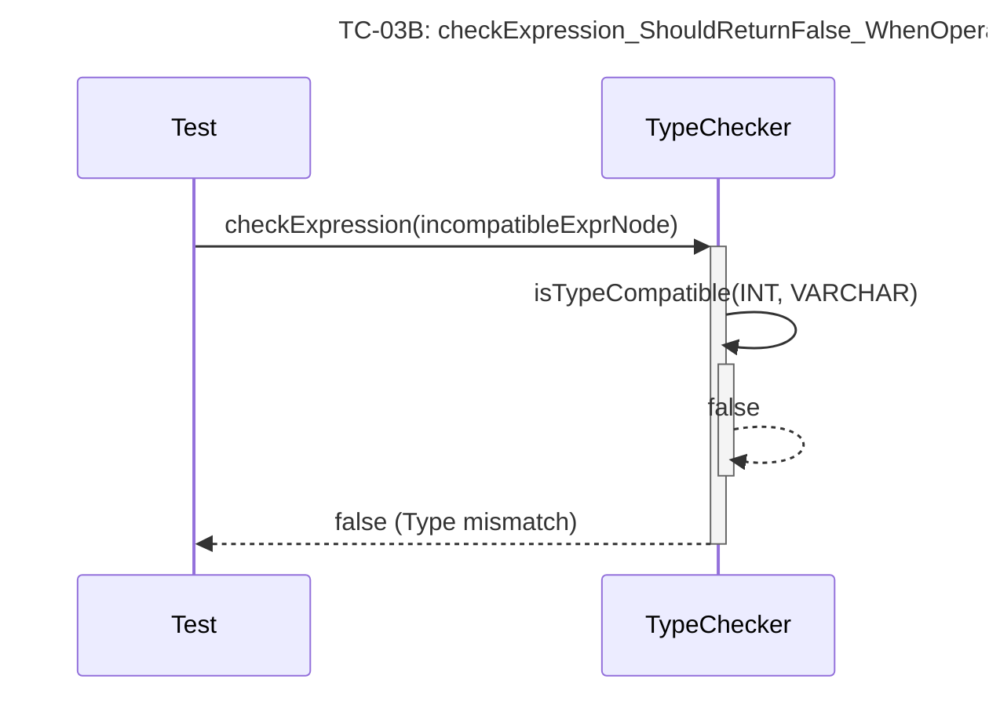
```mermaid
sequenceDiagram
    title TC-03B: checkExpression_ShouldReturnFalse_WhenOperandTypesAreIncompatible
    participant Test
    participant TypeChecker

    Test->>+TypeChecker: checkExpression(incompatibleExprNode)
    TypeChecker->>+TypeChecker: isTypeCompatible(INT, VARCHAR)
    TypeChecker-->>-TypeChecker: false
    TypeChecker-->>-Test: false (Type mismatch)
```

---

## 4. GroupByValidator Unit Tests

### TC-04: `validate`

#### Happy Path: `validate_ShouldPass_WhenAllNonAggregatedSelectColumnsAreInGroupBy`
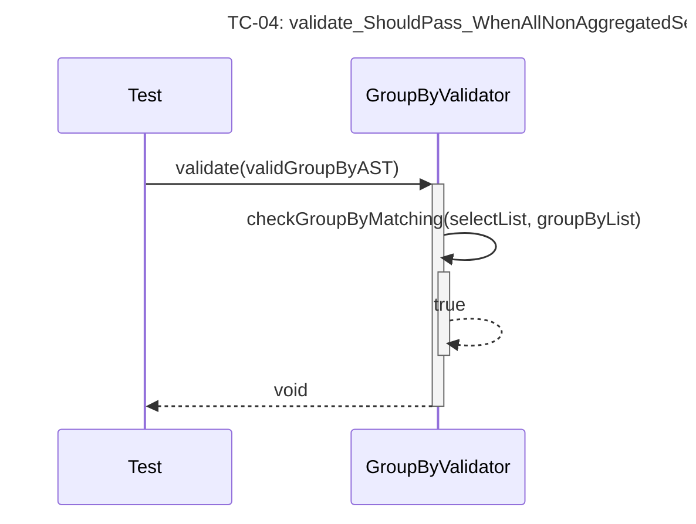
```mermaid
sequenceDiagram
    title TC-04: validate_ShouldPass_WhenAllNonAggregatedSelectColumnsAreInGroupBy
    participant Test
    participant GroupByValidator

    Test->>+GroupByValidator: validate(validGroupByAST)
    GroupByValidator->>+GroupByValidator: checkGroupByMatching(selectList, groupByList)
    GroupByValidator-->>-GroupByValidator: true
    GroupByValidator-->>-Test: void
```

#### TC-04A: `validate_ShouldThrowException_WhenNonAggregatedColumnMissingFromGroupBy`
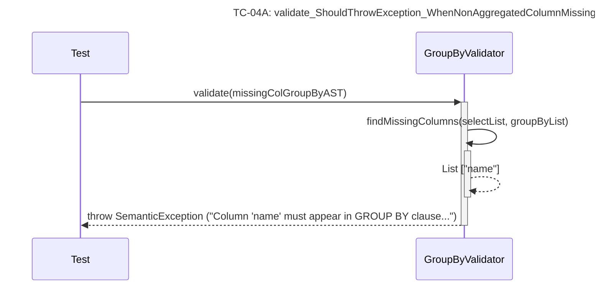
```mermaid
sequenceDiagram
    title TC-04A: validate_ShouldThrowException_WhenNonAggregatedColumnMissingFromGroupBy
    participant Test
    participant GroupByValidator

    Test->>+GroupByValidator: validate(missingColGroupByAST)
    GroupByValidator->>+GroupByValidator: findMissingColumns(selectList, groupByList)
    GroupByValidator-->>-GroupByValidator: List ["name"]
    GroupByValidator-->>-Test: throw SemanticException ("Column 'name' must appear in GROUP BY clause...")
```

#### TC-04B: `validate_ShouldThrowException_WhenQueryHasAggregatesAndUnaggregatedColumnsWithoutGroupBy`
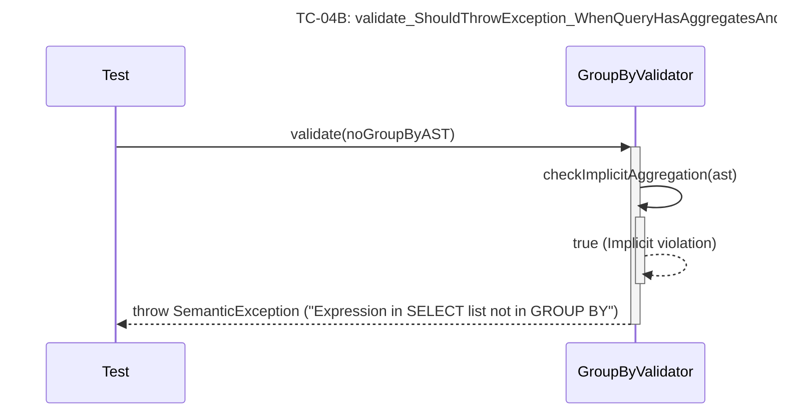
```mermaid
sequenceDiagram
    title TC-04B: validate_ShouldThrowException_WhenQueryHasAggregatesAndUnaggregatedColumnsWithoutGroupBy
    participant Test
    participant GroupByValidator

    Test->>+GroupByValidator: validate(noGroupByAST)
    GroupByValidator->>+GroupByValidator: checkImplicitAggregation(ast)
    GroupByValidator-->>-GroupByValidator: true (Implicit violation)
    GroupByValidator-->>-Test: throw SemanticException ("Expression in SELECT list not in GROUP BY")
```

---

## 5. OrderByValidator Unit Tests

### TC-05: `validate`

#### Happy Path: `validate_ShouldPass_WhenOrderByColumnsAreValid`
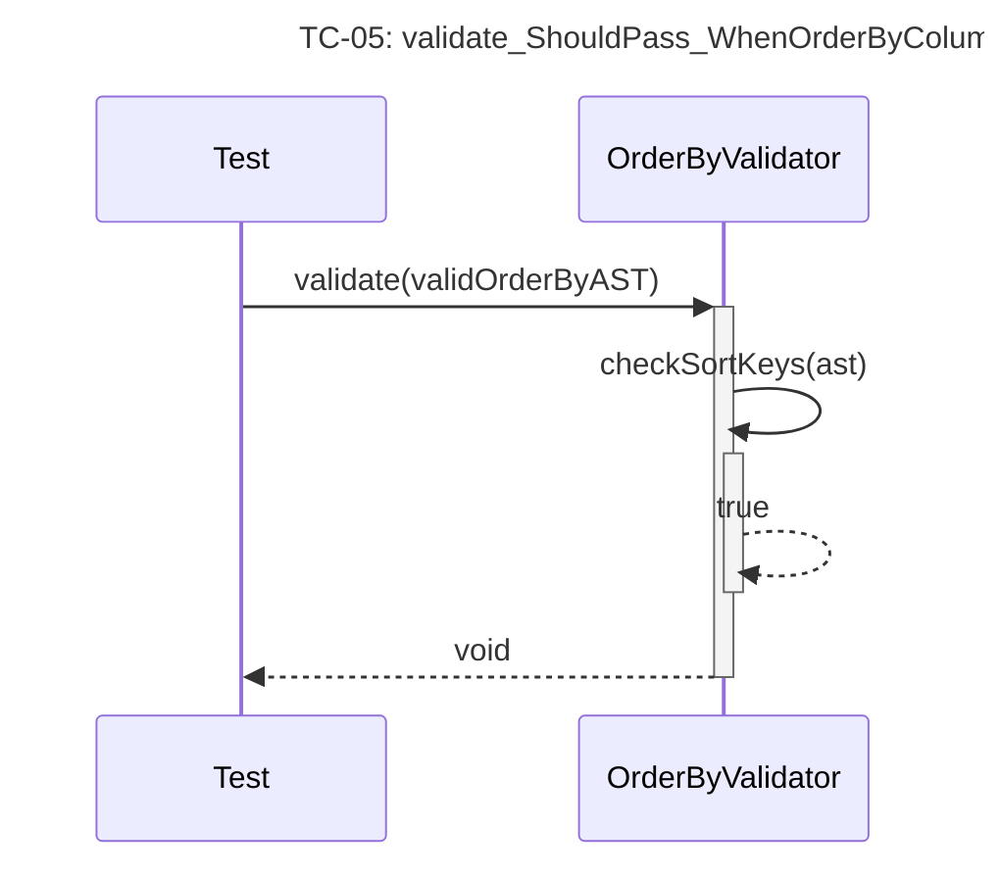
```mermaid
sequenceDiagram
    title TC-05: validate_ShouldPass_WhenOrderByColumnsAreValid
    participant Test
    participant OrderByValidator

    Test->>+OrderByValidator: validate(validOrderByAST)
    OrderByValidator->>+OrderByValidator: checkSortKeys(ast)
    OrderByValidator-->>-OrderByValidator: true
    OrderByValidator-->>-Test: void
```

#### TC-05A: `validate_ShouldThrowException_WhenOrderByColumnIsAmbiguous`
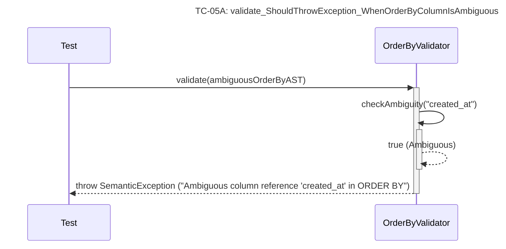
```mermaid
sequenceDiagram
    title TC-05A: validate_ShouldThrowException_WhenOrderByColumnIsAmbiguous
    participant Test
    participant OrderByValidator

    Test->>+OrderByValidator: validate(ambiguousOrderByAST)
    OrderByValidator->>+OrderByValidator: checkAmbiguity("created_at")
    OrderByValidator-->>-OrderByValidator: true (Ambiguous)
    OrderByValidator-->>-Test: throw SemanticException ("Ambiguous column reference 'created_at' in ORDER BY")
```

#### TC-05B: `validate_ShouldThrowException_WhenDistinctQuerySortColumnNotInSelectList`
```mermaid
sequenceDiagram
    title TC-05B: validate_ShouldThrowException_WhenDistinctQuerySortColumnNotInSelectList
    participant Test
    participant OrderByValidator

    Test->>+OrderByValidator: validate(distinctOrderByAST)
    OrderByValidator->>+OrderByValidator: checkDistinctOrderByMatch(selectList, sortKeys)
    OrderByValidator-->>-OrderByValidator: false (Missing from SELECT)
    OrderByValidator-->>-Test: throw SemanticException ("ORDER BY items must appear in select list if SELECT DISTINCT is specified")
```

---

## 6. ASTVisitorAndNode Unit Tests

### TC-06: `accept` & `getRoot`

#### Happy Path: `accept_ShouldInvokeVisitOnVisitor_WhenAcceptCalled`
```mermaid
sequenceDiagram
    title TC-06: accept_ShouldInvokeVisitOnVisitor_WhenAcceptCalled
    participant Test
    participant ASTNode
    participant ASTVisitor

    Test->>+ASTNode: accept(visitor)
    ASTNode->>+ASTVisitor: visit(this)
    ASTVisitor-->>-ASTNode: void
    ASTNode-->>-Test: void
```

#### TC-06A: `accept_ShouldHandleNullVisitor_WhenVisitorIsNull`
```mermaid
sequenceDiagram
    title TC-06A: accept_ShouldHandleNullVisitor_WhenVisitorIsNull
    participant Test
    participant ASTNode

    Test->>+ASTNode: accept(null)
    ASTNode->>+ASTNode: checkVisitorNotNull(null)
    ASTNode-->>-ASTNode: null
    ASTNode-->>-Test: void (Safely handled)
```

#### TC-06B: `getRoot_ShouldReturnAndSetRootNode_WhenASTConstructed`
```mermaid
sequenceDiagram
    title TC-06B: getRoot_ShouldReturnAndSetRootNode_WhenASTConstructed
    participant Test
    participant AST

    Test->>+AST: setRoot(rootNode)
    AST-->>-Test: void
    Test->>+AST: getRoot()
    AST-->>-Test: rootNode
```
