# Sequence Diagrams - Query Processor Subsystem (Semantic Analysis Unit Test Scenarios)

This document provides detailed Mermaid sequence diagrams with explicit UML activation bars for all positive (happy path) and negative (edge cases / exception) unit test scenarios mapped out in [MindmapTest.md](file:///d:/BBV/Database_Management_BBV/docs/unit_test/query_prossor/MindmapTest.md) and specified in [QueryProcessorTestcase.md](file:///d:/BBV/Database_Management_BBV/docs/unit_test/query_prossor/QueryProcessorTestcase.md).

---

## 1. SemanticAnalyzer Unit Tests

### TC-01: `analyze`

#### Happy Path: `analyze_ShouldExecuteFourStepValidationInOrder_WhenValidASTProvided`
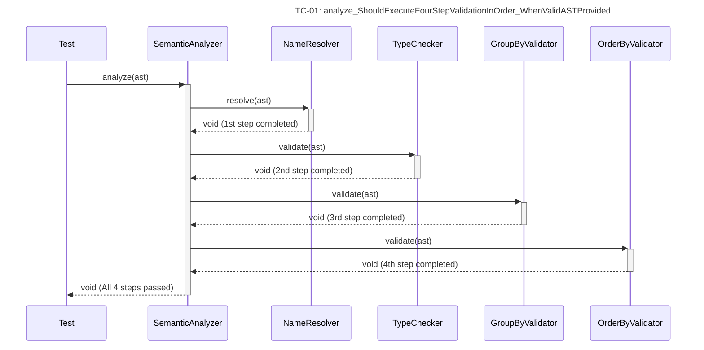
```mermaid
sequenceDiagram
    title TC-01: analyze_ShouldExecuteFourStepValidationInOrder_WhenValidASTProvided
    participant Test
    participant SemanticAnalyzer
    participant NameResolver
    participant TypeChecker
    participant GroupByValidator
    participant OrderByValidator

    Test->>+SemanticAnalyzer: analyze(ast)
    SemanticAnalyzer->>+NameResolver: resolve(ast)
    NameResolver-->>-SemanticAnalyzer: void (1st step completed)
    SemanticAnalyzer->>+TypeChecker: validate(ast)
    TypeChecker-->>-SemanticAnalyzer: void (2nd step completed)
    SemanticAnalyzer->>+GroupByValidator: validate(ast)
    GroupByValidator-->>-SemanticAnalyzer: void (3rd step completed)
    SemanticAnalyzer->>+OrderByValidator: validate(ast)
    OrderByValidator-->>-SemanticAnalyzer: void (4th step completed)
    SemanticAnalyzer-->>-Test: void (All 4 steps passed)
```

#### TC-01A: `analyze_ShouldHandleNullASTGracefully_WhenASTIsNull`
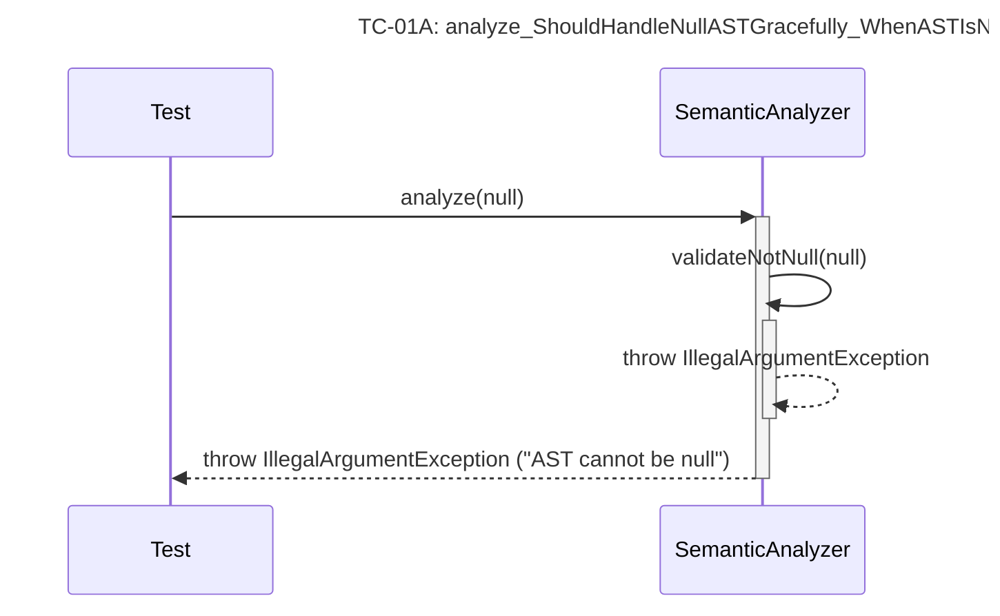
```mermaid
sequenceDiagram
    title TC-01A: analyze_ShouldHandleNullASTGracefully_WhenASTIsNull
    participant Test
    participant SemanticAnalyzer

    Test->>+SemanticAnalyzer: analyze(null)
    SemanticAnalyzer->>+SemanticAnalyzer: validateNotNull(null)
    SemanticAnalyzer-->>-SemanticAnalyzer: throw IllegalArgumentException
    SemanticAnalyzer-->>-Test: throw IllegalArgumentException ("AST cannot be null")
```

#### TC-01B: `visit_ShouldInvokeAcceptOnASTNode_WhenValidNodeVisited`
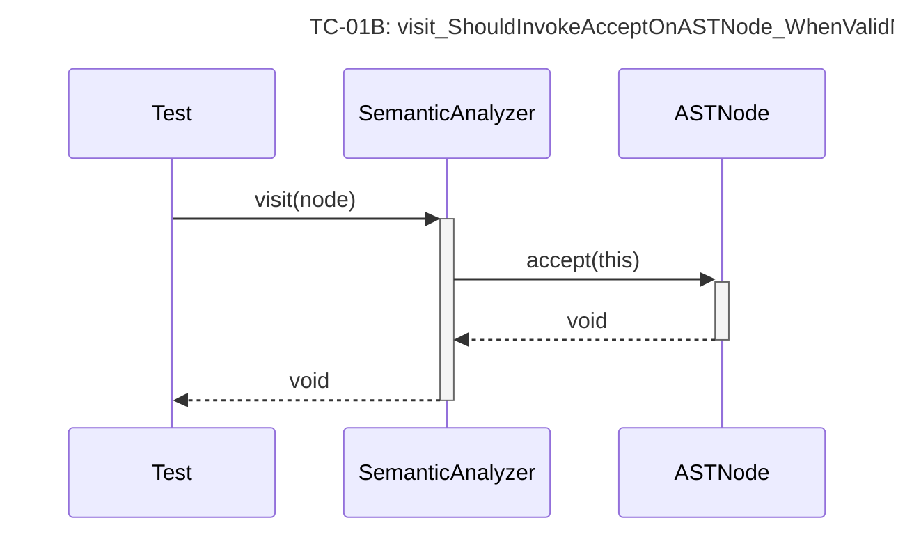
```mermaid
sequenceDiagram
    title TC-01B: visit_ShouldInvokeAcceptOnASTNode_WhenValidNodeVisited
    participant Test
    participant SemanticAnalyzer
    participant ASTNode

    Test->>+SemanticAnalyzer: visit(node)
    SemanticAnalyzer->>+ASTNode: accept(this)
    ASTNode-->>-SemanticAnalyzer: void
    SemanticAnalyzer-->>-Test: void
```

#### TC-01C: `visit_ShouldDoNothing_WhenASTNodeIsNull`
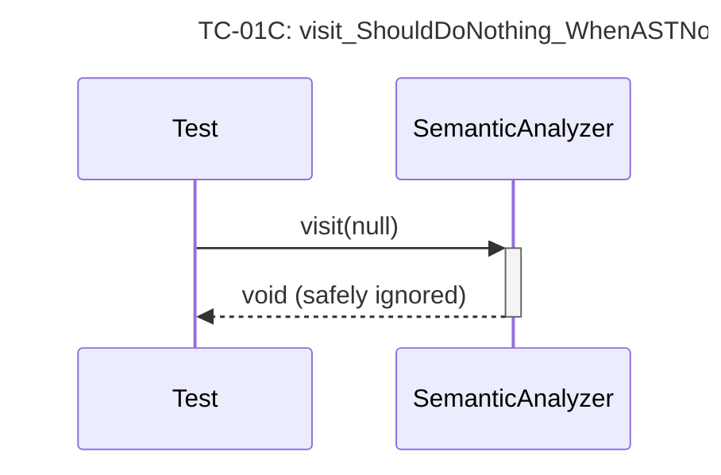
```mermaid
sequenceDiagram
    title TC-01C: visit_ShouldDoNothing_WhenASTNodeIsNull
    participant Test
    participant SemanticAnalyzer

    Test->>+SemanticAnalyzer: visit(null)
    SemanticAnalyzer-->>-Test: void (safely ignored)
```

#### TC-01D: `analyze_ShouldPropagateException_WhenAnyStepValidationFails`
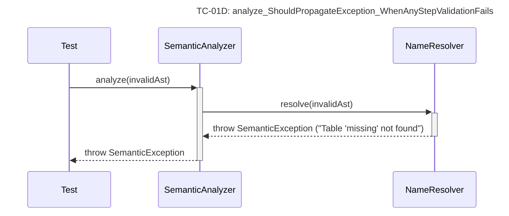
```mermaid
sequenceDiagram
    title TC-01D: analyze_ShouldPropagateException_WhenAnyStepValidationFails
    participant Test
    participant SemanticAnalyzer
    participant NameResolver

    Test->>+SemanticAnalyzer: analyze(invalidAst)
    SemanticAnalyzer->>+NameResolver: resolve(invalidAst)
    NameResolver-->>-SemanticAnalyzer: throw SemanticException ("Table 'missing' not found")
    SemanticAnalyzer-->>-Test: throw SemanticException
```

---

## 2. NameResolver Unit Tests

### TC-02: `resolveTable` & `resolveColumn`

#### Happy Path: `resolveTable_ShouldReturnTrue_WhenTableExistsInMetadata`
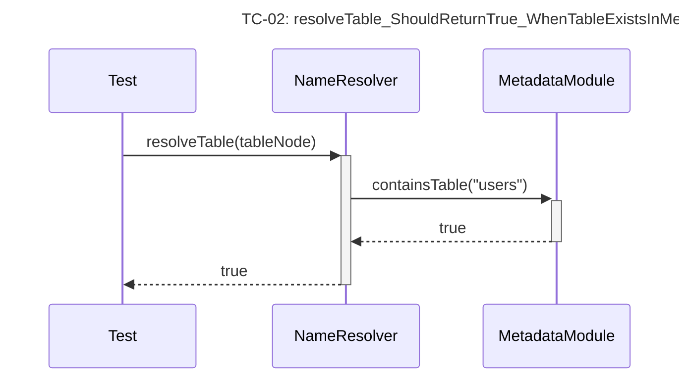
```mermaid
sequenceDiagram
    title TC-02: resolveTable_ShouldReturnTrue_WhenTableExistsInMetadata
    participant Test
    participant NameResolver
    participant MetadataModule

    Test->>+NameResolver: resolveTable(tableNode)
    NameResolver->>+MetadataModule: containsTable("users")
    MetadataModule-->>-NameResolver: true
    NameResolver-->>-Test: true
```

#### TC-02A: `resolveTable_ShouldReturnFalse_WhenTableDoesNotExistInMetadata`
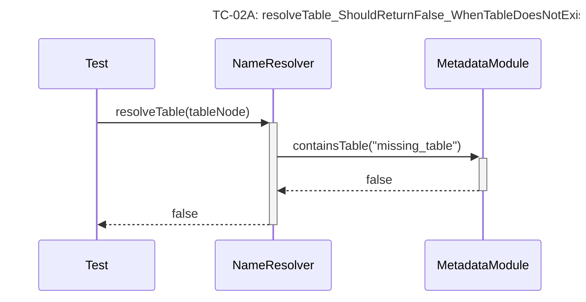
```mermaid
sequenceDiagram
    title TC-02A: resolveTable_ShouldReturnFalse_WhenTableDoesNotExistInMetadata
    participant Test
    participant NameResolver
    participant MetadataModule

    Test->>+NameResolver: resolveTable(tableNode)
    NameResolver->>+MetadataModule: containsTable("missing_table")
    MetadataModule-->>-NameResolver: false
    NameResolver-->>-Test: false
```

#### TC-02B: `resolveColumn_ShouldReturnTrue_WhenColumnExistsInTable`
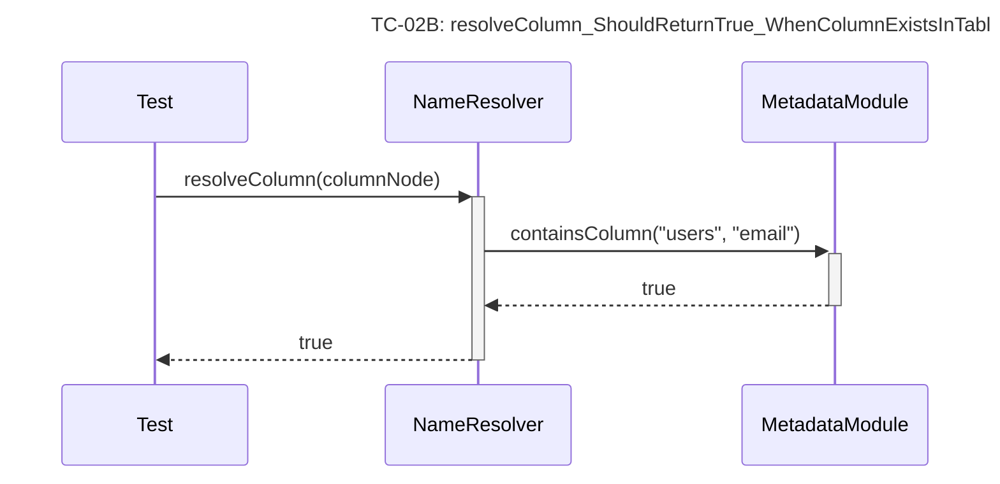
```mermaid
sequenceDiagram
    title TC-02B: resolveColumn_ShouldReturnTrue_WhenColumnExistsInTable
    participant Test
    participant NameResolver
    participant MetadataModule

    Test->>+NameResolver: resolveColumn(columnNode)
    NameResolver->>+MetadataModule: containsColumn("users", "email")
    MetadataModule-->>-NameResolver: true
    NameResolver-->>-Test: true
```

#### TC-02C: `resolveColumn_ShouldReturnFalse_WhenColumnDoesNotExist`
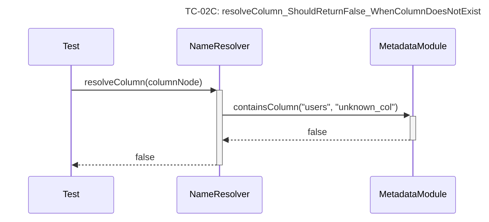
```mermaid
sequenceDiagram
    title TC-02C: resolveColumn_ShouldReturnFalse_WhenColumnDoesNotExist
    participant Test
    participant NameResolver
    participant MetadataModule

    Test->>+NameResolver: resolveColumn(columnNode)
    NameResolver->>+MetadataModule: containsColumn("users", "unknown_col")
    MetadataModule-->>-NameResolver: false
    NameResolver-->>-Test: false
```

#### TC-02D: `resolveAlias_ShouldReturnTrue_WhenAliasIsValid`
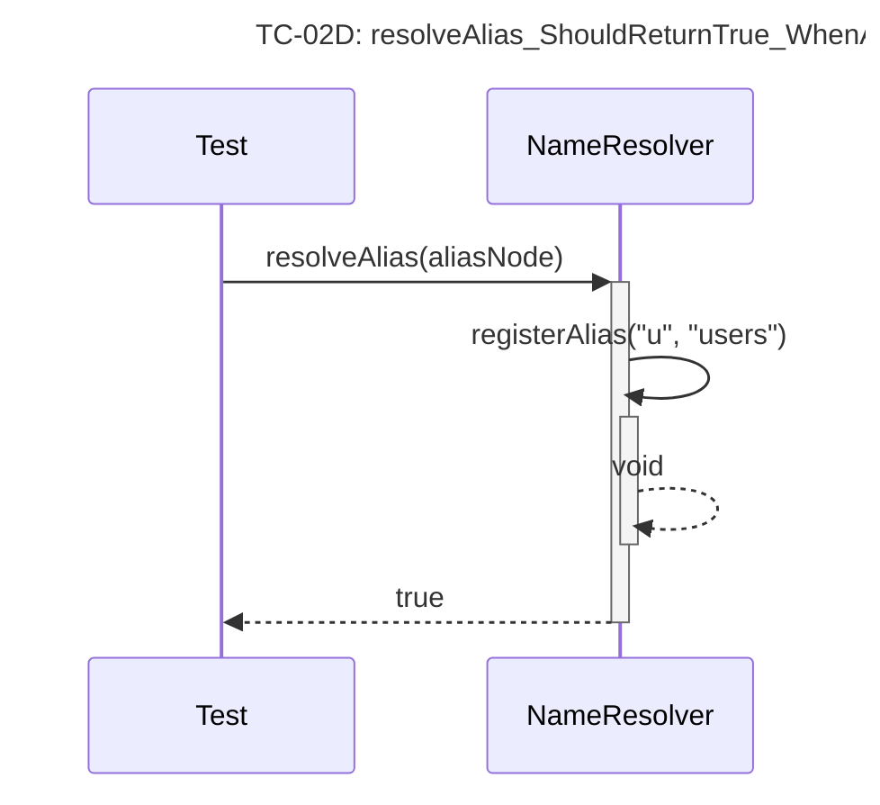
```mermaid
sequenceDiagram
    title TC-02D: resolveAlias_ShouldReturnTrue_WhenAliasIsValid
    participant Test
    participant NameResolver

    Test->>+NameResolver: resolveAlias(aliasNode)
    NameResolver->>+NameResolver: registerAlias("u", "users")
    NameResolver-->>-NameResolver: void
    NameResolver-->>-Test: true
```

#### TC-02E: `resolveAlias_ShouldReturnFalse_WhenAliasIsDuplicatedInSameScope`
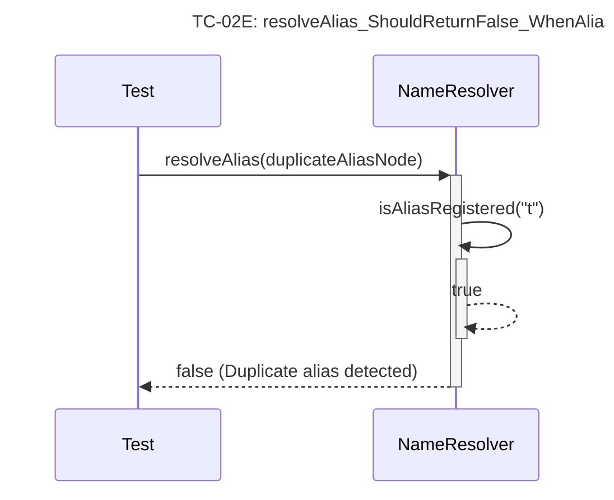
```mermaid
sequenceDiagram
    title TC-02E: resolveAlias_ShouldReturnFalse_WhenAliasIsDuplicatedInSameScope
    participant Test
    participant NameResolver

    Test->>+NameResolver: resolveAlias(duplicateAliasNode)
    NameResolver->>+NameResolver: isAliasRegistered("t")
    NameResolver-->>-NameResolver: true
    NameResolver-->>-Test: false (Duplicate alias detected)
```

#### TC-02F: `resolve_ShouldProcessAllIdentifiersInAST_WhenASTIsProvided`
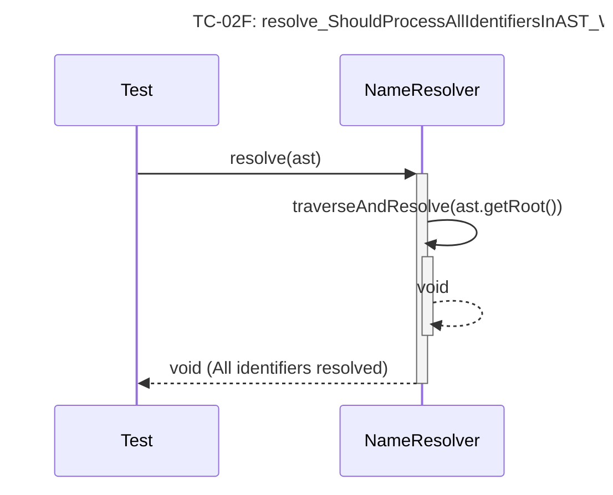
```mermaid
sequenceDiagram
    title TC-02F: resolve_ShouldProcessAllIdentifiersInAST_WhenASTIsProvided
    participant Test
    participant NameResolver

    Test->>+NameResolver: resolve(ast)
    NameResolver->>+NameResolver: traverseAndResolve(ast.getRoot())
    NameResolver-->>-NameResolver: void
    NameResolver-->>-Test: void (All identifiers resolved)
```

---

## 3. TypeChecker Unit Tests

### TC-03: `validate` & `checkExpression`

#### Happy Path: `validate_ShouldCheckAllExpressions_WhenASTIsProvided`
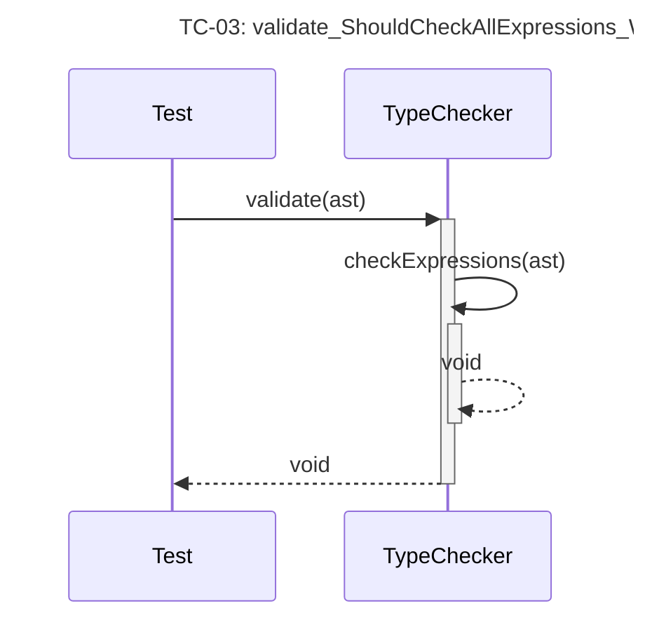
```mermaid
sequenceDiagram
    title TC-03: validate_ShouldCheckAllExpressions_WhenASTIsProvided
    participant Test
    participant TypeChecker

    Test->>+TypeChecker: validate(ast)
    TypeChecker->>+TypeChecker: checkExpressions(ast)
    TypeChecker-->>-TypeChecker: void
    TypeChecker-->>-Test: void
```

#### TC-03A: `checkExpression_ShouldReturnTrue_WhenOperandTypesAreCompatible`
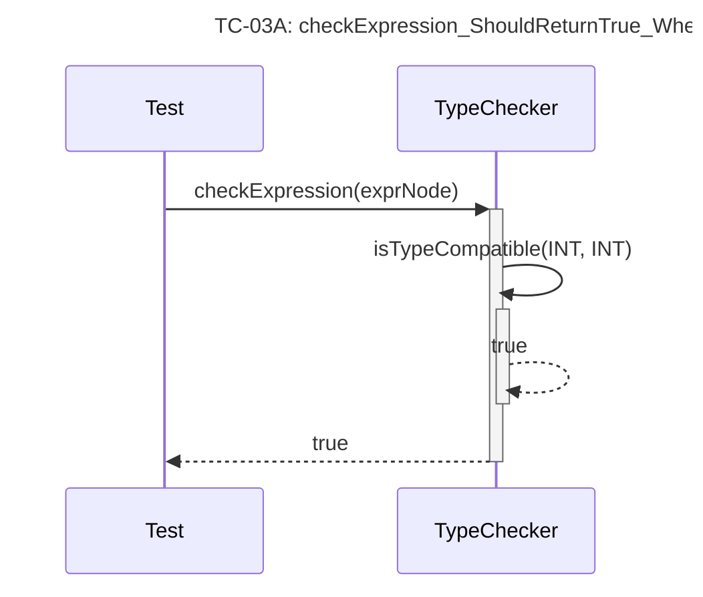
```mermaid
sequenceDiagram
    title TC-03A: checkExpression_ShouldReturnTrue_WhenOperandTypesAreCompatible
    participant Test
    participant TypeChecker

    Test->>+TypeChecker: checkExpression(exprNode)
    TypeChecker->>+TypeChecker: isTypeCompatible(INT, INT)
    TypeChecker-->>-TypeChecker: true
    TypeChecker-->>-Test: true
```

#### TC-03B: `checkExpression_ShouldReturnFalse_WhenOperandTypesAreIncompatible`
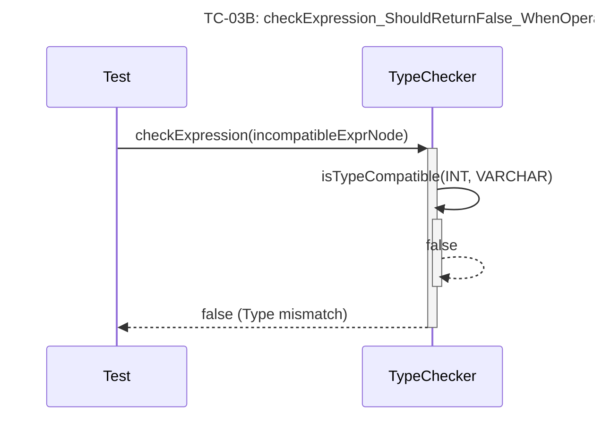
```mermaid
sequenceDiagram
    title TC-03B: checkExpression_ShouldReturnFalse_WhenOperandTypesAreIncompatible
    participant Test
    participant TypeChecker

    Test->>+TypeChecker: checkExpression(incompatibleExprNode)
    TypeChecker->>+TypeChecker: isTypeCompatible(INT, VARCHAR)
    TypeChecker-->>-TypeChecker: false
    TypeChecker-->>-Test: false (Type mismatch)
```

---

## 4. GroupByValidator Unit Tests

### TC-04: `validate`

#### Happy Path: `validate_ShouldPass_WhenAllNonAggregatedSelectColumnsAreInGroupBy`
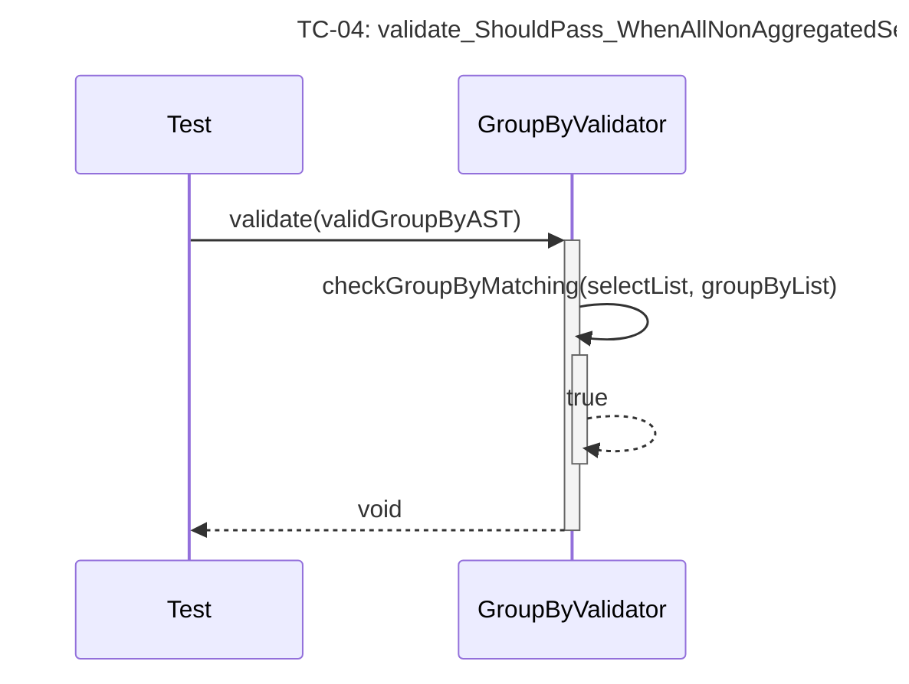
```mermaid
sequenceDiagram
    title TC-04: validate_ShouldPass_WhenAllNonAggregatedSelectColumnsAreInGroupBy
    participant Test
    participant GroupByValidator

    Test->>+GroupByValidator: validate(validGroupByAST)
    GroupByValidator->>+GroupByValidator: checkGroupByMatching(selectList, groupByList)
    GroupByValidator-->>-GroupByValidator: true
    GroupByValidator-->>-Test: void
```

#### TC-04A: `validate_ShouldThrowException_WhenNonAggregatedColumnMissingFromGroupBy`
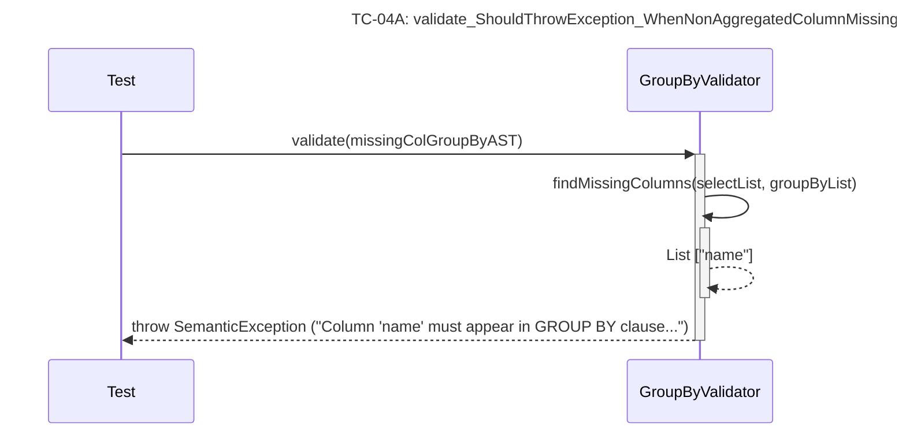
```mermaid
sequenceDiagram
    title TC-04A: validate_ShouldThrowException_WhenNonAggregatedColumnMissingFromGroupBy
    participant Test
    participant GroupByValidator

    Test->>+GroupByValidator: validate(missingColGroupByAST)
    GroupByValidator->>+GroupByValidator: findMissingColumns(selectList, groupByList)
    GroupByValidator-->>-GroupByValidator: List ["name"]
    GroupByValidator-->>-Test: throw SemanticException ("Column 'name' must appear in GROUP BY clause...")
```

#### TC-04B: `validate_ShouldThrowException_WhenQueryHasAggregatesAndUnaggregatedColumnsWithoutGroupBy`
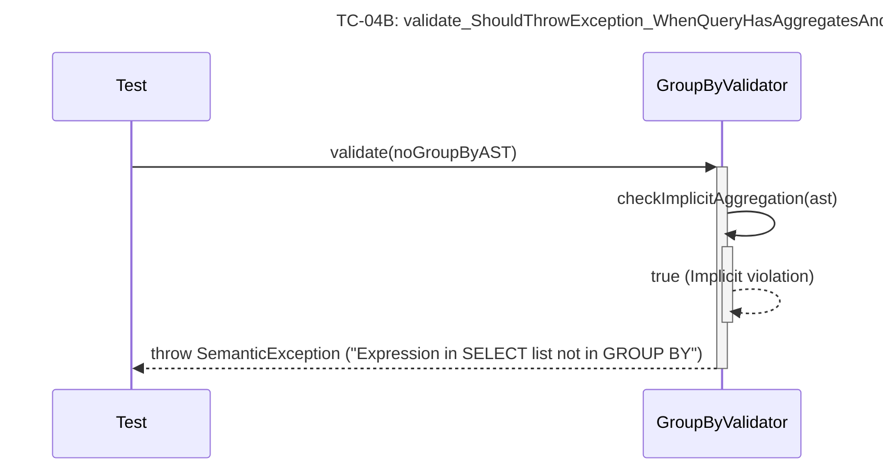
```mermaid
sequenceDiagram
    title TC-04B: validate_ShouldThrowException_WhenQueryHasAggregatesAndUnaggregatedColumnsWithoutGroupBy
    participant Test
    participant GroupByValidator

    Test->>+GroupByValidator: validate(noGroupByAST)
    GroupByValidator->>+GroupByValidator: checkImplicitAggregation(ast)
    GroupByValidator-->>-GroupByValidator: true (Implicit violation)
    GroupByValidator-->>-Test: throw SemanticException ("Expression in SELECT list not in GROUP BY")
```

---

## 5. OrderByValidator Unit Tests

### TC-05: `validate`

#### Happy Path: `validate_ShouldPass_WhenOrderByColumnsAreValid`
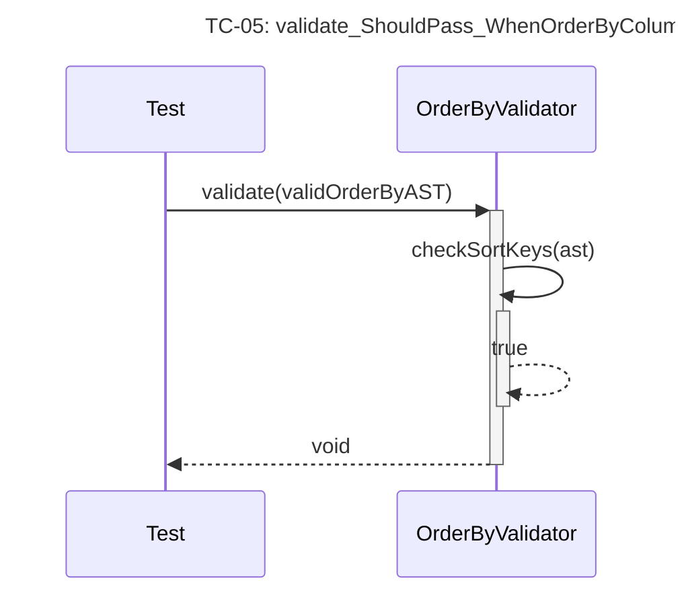
```mermaid
sequenceDiagram
    title TC-05: validate_ShouldPass_WhenOrderByColumnsAreValid
    participant Test
    participant OrderByValidator

    Test->>+OrderByValidator: validate(validOrderByAST)
    OrderByValidator->>+OrderByValidator: checkSortKeys(ast)
    OrderByValidator-->>-OrderByValidator: true
    OrderByValidator-->>-Test: void
```

#### TC-05A: `validate_ShouldThrowException_WhenOrderByColumnIsAmbiguous`
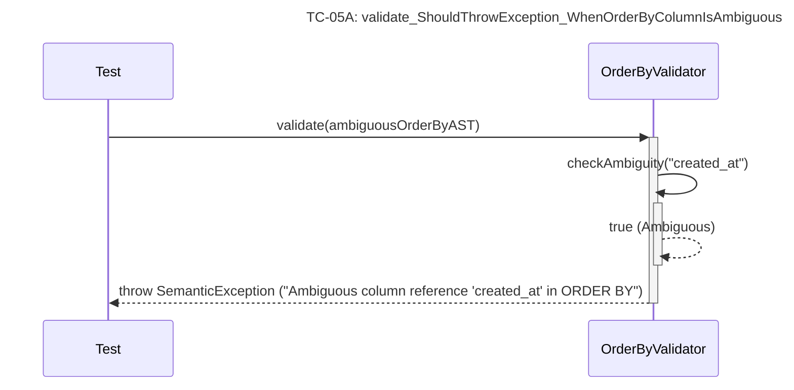
```mermaid
sequenceDiagram
    title TC-05A: validate_ShouldThrowException_WhenOrderByColumnIsAmbiguous
    participant Test
    participant OrderByValidator

    Test->>+OrderByValidator: validate(ambiguousOrderByAST)
    OrderByValidator->>+OrderByValidator: checkAmbiguity("created_at")
    OrderByValidator-->>-OrderByValidator: true (Ambiguous)
    OrderByValidator-->>-Test: throw SemanticException ("Ambiguous column reference 'created_at' in ORDER BY")
```

#### TC-05B: `validate_ShouldThrowException_WhenDistinctQuerySortColumnNotInSelectList`
```mermaid
sequenceDiagram
    title TC-05B: validate_ShouldThrowException_WhenDistinctQuerySortColumnNotInSelectList
    participant Test
    participant OrderByValidator

    Test->>+OrderByValidator: validate(distinctOrderByAST)
    OrderByValidator->>+OrderByValidator: checkDistinctOrderByMatch(selectList, sortKeys)
    OrderByValidator-->>-OrderByValidator: false (Missing from SELECT)
    OrderByValidator-->>-Test: throw SemanticException ("ORDER BY items must appear in select list if SELECT DISTINCT is specified")
```

---

## 6. ASTVisitorAndNode Unit Tests

### TC-06: `accept` & `getRoot`

#### Happy Path: `accept_ShouldInvokeVisitOnVisitor_WhenAcceptCalled`
```mermaid
sequenceDiagram
    title TC-06: accept_ShouldInvokeVisitOnVisitor_WhenAcceptCalled
    participant Test
    participant ASTNode
    participant ASTVisitor

    Test->>+ASTNode: accept(visitor)
    ASTNode->>+ASTVisitor: visit(this)
    ASTVisitor-->>-ASTNode: void
    ASTNode-->>-Test: void
```

#### TC-06A: `accept_ShouldHandleNullVisitor_WhenVisitorIsNull`
```mermaid
sequenceDiagram
    title TC-06A: accept_ShouldHandleNullVisitor_WhenVisitorIsNull
    participant Test
    participant ASTNode

    Test->>+ASTNode: accept(null)
    ASTNode->>+ASTNode: checkVisitorNotNull(null)
    ASTNode-->>-ASTNode: null
    ASTNode-->>-Test: void (Safely handled)
```

#### TC-06B: `getRoot_ShouldReturnAndSetRootNode_WhenASTConstructed`
```mermaid
sequenceDiagram
    title TC-06B: getRoot_ShouldReturnAndSetRootNode_WhenASTConstructed
    participant Test
    participant AST

    Test->>+AST: setRoot(rootNode)
    AST-->>-Test: void
    Test->>+AST: getRoot()
    AST-->>-Test: rootNode
```

---

## 7. QueryOptimizer Unit Tests

### TC-07: `optimize` Pipeline Execution

#### Happy Path: `optimize_ShouldExecuteOptimizationPipeline_WhenLogicalPlanIsValid`
```mermaid
sequenceDiagram
    title TC-07: optimize_ShouldExecuteOptimizationPipeline_WhenLogicalPlanIsValid
    participant Test
    participant QueryOptimizer
    participant QueryRewriter
    participant JoinOptimizer
    participant CostEstimator
    participant PlanEnumerator

    Test->>+QueryOptimizer: optimize(logicalPlan)
    QueryOptimizer->>+QueryRewriter: rewrite(logicalPlan)
    QueryRewriter-->>-QueryOptimizer: rewrittenLogicalPlan
    QueryOptimizer->>+JoinOptimizer: optimize(rewrittenLogicalPlan)
    JoinOptimizer-->>-QueryOptimizer: joinOptimizedLogicalPlan
    QueryOptimizer->>+CostEstimator: estimate(joinOptimizedLogicalPlan)
    CostEstimator-->>-QueryOptimizer: estimatedCost (double)
    QueryOptimizer->>+PlanEnumerator: enumerate(joinOptimizedLogicalPlan)
    PlanEnumerator-->>-QueryOptimizer: physicalPlan
    QueryOptimizer-->>-Test: physicalPlan (Complete optimization pipeline)
```

#### TC-07A: `optimize_ShouldStopPipeline_WhenQueryRewriteFails`
```mermaid
sequenceDiagram
    title TC-07A: optimize_ShouldStopPipeline_WhenQueryRewriteFails
    participant Test
    participant QueryOptimizer
    participant QueryRewriter

    Test->>+QueryOptimizer: optimize(logicalPlan)
    QueryOptimizer->>+QueryRewriter: rewrite(logicalPlan)
    QueryRewriter-->>-QueryOptimizer: throw QueryRewriteException ("Rewrite rule failed")
    QueryOptimizer-->>-Test: throw QueryRewriteException (Pipeline halted fail-fast)
```

#### TC-07B: `optimize_ShouldStopPipeline_WhenJoinOptimizationFails`
```mermaid
sequenceDiagram
    title TC-07B: optimize_ShouldStopPipeline_WhenJoinOptimizationFails
    participant Test
    participant QueryOptimizer
    participant QueryRewriter
    participant JoinOptimizer

    Test->>+QueryOptimizer: optimize(logicalPlan)
    QueryOptimizer->>+QueryRewriter: rewrite(logicalPlan)
    QueryRewriter-->>-QueryOptimizer: rewrittenLogicalPlan
    QueryOptimizer->>+JoinOptimizer: optimize(rewrittenLogicalPlan)
    JoinOptimizer-->>-QueryOptimizer: throw RuntimeException ("Join optimization failed")
    QueryOptimizer-->>-Test: throw RuntimeException (Pipeline halted)
```

#### TC-07C: `optimize_ShouldStopPipeline_WhenCostEstimationFails`
```mermaid
sequenceDiagram
    title TC-07C: optimize_ShouldStopPipeline_WhenCostEstimationFails
    participant Test
    participant QueryOptimizer
    participant QueryRewriter
    participant JoinOptimizer
    participant CostEstimator

    Test->>+QueryOptimizer: optimize(logicalPlan)
    QueryOptimizer->>+QueryRewriter: rewrite(logicalPlan)
    QueryRewriter-->>-QueryOptimizer: rewrittenLogicalPlan
    QueryOptimizer->>+JoinOptimizer: optimize(rewrittenLogicalPlan)
    JoinOptimizer-->>-QueryOptimizer: joinOptimizedLogicalPlan
    QueryOptimizer->>+CostEstimator: estimate(joinOptimizedLogicalPlan)
    CostEstimator-->>-QueryOptimizer: throw RuntimeException ("Cost estimation failed")
    QueryOptimizer-->>-Test: throw RuntimeException (PlanEnumerator skipped)
```

#### TC-07D: `optimize_ShouldThrowIllegalArgumentException_WhenLogicalPlanIsNull`
```mermaid
sequenceDiagram
    title TC-07D: optimize_ShouldThrowIllegalArgumentException_WhenLogicalPlanIsNull
    participant Test
    participant QueryOptimizer

    Test->>+QueryOptimizer: optimize(null)
    QueryOptimizer->>+QueryOptimizer: validateNotNull(null)
    QueryOptimizer-->>-QueryOptimizer: throw IllegalArgumentException
    QueryOptimizer-->>-Test: throw IllegalArgumentException ("Logical plan cannot be null")
```

#### TC-07E: `optimize_ShouldReturnPhysicalPlan_WhenLogicalPlanIsEmpty`
```mermaid
sequenceDiagram
    title TC-07E: optimize_ShouldReturnPhysicalPlan_WhenLogicalPlanIsEmpty
    participant Test
    participant QueryOptimizer
    participant PlanEnumerator

    Test->>+QueryOptimizer: optimize(emptyLogicalPlan)
    QueryOptimizer->>+PlanEnumerator: enumerate(emptyLogicalPlan)
    PlanEnumerator-->>-QueryOptimizer: emptyPhysicalPlan
    QueryOptimizer-->>-Test: emptyPhysicalPlan
```

#### TC-07F: `optimize_ShouldInvokeEachDependencyExactlyOnce_WhenOptimizationSucceeds`
```mermaid
sequenceDiagram
    title TC-07F: optimize_ShouldInvokeEachDependencyExactlyOnce_WhenOptimizationSucceeds
    participant Test
    participant QueryOptimizer
    participant QueryRewriter
    participant JoinOptimizer
    participant CostEstimator
    participant PlanEnumerator

    Test->>+QueryOptimizer: optimize(logicalPlan)
    QueryOptimizer->>+QueryRewriter: rewrite(logicalPlan) (times=1)
    QueryRewriter-->>-QueryOptimizer: rewrittenPlan
    QueryOptimizer->>+JoinOptimizer: optimize(rewrittenPlan) (times=1)
    JoinOptimizer-->>-QueryOptimizer: joinPlan
    QueryOptimizer->>+CostEstimator: estimate(joinPlan) (times=1)
    CostEstimator-->>-QueryOptimizer: cost
    QueryOptimizer->>+PlanEnumerator: enumerate(joinPlan) (times=1)
    PlanEnumerator-->>-QueryOptimizer: physicalPlan
    QueryOptimizer-->>-Test: physicalPlan (Verified 1 call per dependency)
```

#### TC-07G: `setOptimizationRule_ShouldReplaceOptimizationStrategy_WhenNewRuleProvided`
```mermaid
sequenceDiagram
    title TC-07G: setOptimizationRule_ShouldReplaceOptimizationStrategy_WhenNewRuleProvided
    participant Test
    participant QueryOptimizer

    Test->>+QueryOptimizer: setOptimizationRule(newStrategyRule)
    QueryOptimizer->>+QueryOptimizer: updateStrategy(newStrategyRule)
    QueryOptimizer-->>-QueryOptimizer: void
    QueryOptimizer-->>-Test: void (Strategy updated)
```

---

## 8. QueryRewriter Unit Tests

### TC-08: `rewrite` Rules Execution

#### Happy Path: `rewrite_ShouldApplyAllRewriteRules_WhenLogicalPlanIsValid`
```mermaid
sequenceDiagram
    title TC-08: rewrite_ShouldApplyAllRewriteRules_WhenLogicalPlanIsValid
    participant Test
    participant QueryRewriter

    Test->>+QueryRewriter: rewrite(logicalPlan)
    QueryRewriter->>+QueryRewriter: predicatePushdown(logicalPlan)
    QueryRewriter-->>-QueryRewriter: planWithPushdown
    QueryRewriter->>+QueryRewriter: projectionPushdown(planWithPushdown)
    QueryRewriter-->>-QueryRewriter: planWithProjection
    QueryRewriter->>+QueryRewriter: constantFolding(planWithProjection)
    QueryRewriter-->>-QueryRewriter: fullyRewrittenPlan
    QueryRewriter-->>-Test: fullyRewrittenPlan
```

#### TC-08A: `predicatePushdown_ShouldMovePredicatesCloserToScan_WhenFilterExists`
```mermaid
sequenceDiagram
    title TC-08A: predicatePushdown_ShouldMovePredicatesCloserToScan_WhenFilterExists
    participant Test
    participant QueryRewriter

    Test->>+QueryRewriter: predicatePushdown(logicalPlanWithFilterAboveJoin)
    QueryRewriter->>+QueryRewriter: pushFilterBelowJoin(filterNode, joinNode)
    QueryRewriter-->>-QueryRewriter: optimizedFilterPlan
    QueryRewriter-->>-Test: optimizedFilterPlan
```

#### TC-08B: `projectionPushdown_ShouldRemoveUnusedColumns_WhenProjectionContainsExtraColumns`
```mermaid
sequenceDiagram
    title TC-08B: projectionPushdown_ShouldRemoveUnusedColumns_WhenProjectionContainsExtraColumns
    participant Test
    participant QueryRewriter

    Test->>+QueryRewriter: projectionPushdown(logicalPlanWithExtraCols)
    QueryRewriter->>+QueryRewriter: pruneUnusedColumns(scanNode, unusedColList)
    QueryRewriter-->>-QueryRewriter: prunedProjectionPlan
    QueryRewriter-->>-Test: prunedProjectionPlan
```

#### TC-08C: `constantFolding_ShouldSimplifyConstantExpressions_WhenExpressionIsConstant`
```mermaid
sequenceDiagram
    title TC-08C: constantFolding_ShouldSimplifyConstantExpressions_WhenExpressionIsConstant
    participant Test
    participant QueryRewriter

    Test->>+QueryRewriter: constantFolding(logicalPlanWithConstantExpr)
    QueryRewriter->>+QueryRewriter: evaluateConstant("1 + 1")
    QueryRewriter-->>-QueryRewriter: constantValue(2)
    QueryRewriter-->>-Test: simplifiedPlan
```

#### TC-08D: `rewrite_ShouldSkipRewrite_WhenLogicalPlanAlreadyOptimized`
```mermaid
sequenceDiagram
    title TC-08D: rewrite_ShouldSkipRewrite_WhenLogicalPlanAlreadyOptimized
    participant Test
    participant QueryRewriter

    Test->>+QueryRewriter: rewrite(optimizedLogicalPlan)
    QueryRewriter->>+QueryRewriter: isAlreadyOptimized(optimizedLogicalPlan)
    QueryRewriter-->>-QueryRewriter: true
    QueryRewriter-->>-Test: originalLogicalPlan (Unchanged)
```

#### TC-08E: `rewrite_ShouldThrowIllegalArgumentException_WhenLogicalPlanIsNull`
```mermaid
sequenceDiagram
    title TC-08E: rewrite_ShouldThrowIllegalArgumentException_WhenLogicalPlanIsNull
    participant Test
    participant QueryRewriter

    Test->>+QueryRewriter: rewrite(null)
    QueryRewriter-->>-Test: throw IllegalArgumentException ("Logical plan cannot be null")
```

#### TC-08F: `rewrite_ShouldStopRemainingRewriteRules_WhenPredicatePushdownFails`
```mermaid
sequenceDiagram
    title TC-08F: rewrite_ShouldStopRemainingRewriteRules_WhenPredicatePushdownFails
    participant Test
    participant QueryRewriter

    Test->>+QueryRewriter: rewrite(invalidLogicalPlan)
    QueryRewriter->>+QueryRewriter: predicatePushdown(invalidLogicalPlan)
    QueryRewriter-->>-QueryRewriter: throw RuntimeException ("Pushdown error")
    QueryRewriter-->>-Test: throw RuntimeException (Remaining rewrite steps aborted)
```

---

## 9. JoinOptimizer Unit Tests

### TC-09: `optimize` & Join Selection

#### Happy Path: `optimize_ShouldOptimizeJoinPipeline_WhenLogicalPlanContainsJoin`
```mermaid
sequenceDiagram
    title TC-09: optimize_ShouldOptimizeJoinPipeline_WhenLogicalPlanContainsJoin
    participant Test
    participant JoinOptimizer

    Test->>+JoinOptimizer: optimize(joinLogicalPlan)
    JoinOptimizer->>+JoinOptimizer: optimizeJoinOrder(joinLogicalPlan)
    JoinOptimizer-->>-JoinOptimizer: reorderedJoinPlan
    JoinOptimizer->>+JoinOptimizer: selectJoinMethod(reorderedJoinPlan)
    JoinOptimizer-->>-JoinOptimizer: optimalMethodPlan
    JoinOptimizer-->>-Test: optimalMethodPlan
```

#### TC-09A: `optimizeJoinOrder_ShouldReorderJoinSequence_WhenMultipleTablesExist`
```mermaid
sequenceDiagram
    title TC-09A: optimizeJoinOrder_ShouldReorderJoinSequence_WhenMultipleTablesExist
    participant Test
    participant JoinOptimizer

    Test->>+JoinOptimizer: optimizeJoinOrder(planWithTables_A_B_C)
    JoinOptimizer->>+JoinOptimizer: calculateJoinOrderCost(B_JOIN_C_FIRST)
    JoinOptimizer-->>-JoinOptimizer: optimalOrder [(B JOIN C) JOIN A]
    JoinOptimizer-->>-Test: reorderedPlan
```

#### TC-09B: `selectJoinMethod_ShouldChooseHashJoin_WhenHashJoinIsOptimal`
```mermaid
sequenceDiagram
    title TC-09B: selectJoinMethod_ShouldChooseHashJoin_WhenHashJoinIsOptimal
    participant Test
    participant JoinOptimizer

    Test->>+JoinOptimizer: selectJoinMethod(equiJoinPlan)
    JoinOptimizer->>+JoinOptimizer: evaluateJoinCosts(equiJoinPlan)
    JoinOptimizer-->>-JoinOptimizer: HashJoinMethod
    JoinOptimizer-->>-Test: planWithHashJoin
```

#### TC-09C: `selectJoinMethod_ShouldChooseNestedLoopJoin_WhenInputTablesAreSmall`
```mermaid
sequenceDiagram
    title TC-09C: selectJoinMethod_ShouldChooseNestedLoopJoin_WhenInputTablesAreSmall
    participant Test
    participant JoinOptimizer

    Test->>+JoinOptimizer: selectJoinMethod(smallTableJoinPlan)
    JoinOptimizer->>+JoinOptimizer: checkTableRowCounts(smallTableJoinPlan)
    JoinOptimizer-->>-JoinOptimizer: NestedLoopMethod (Rows < 100)
    JoinOptimizer-->>-Test: planWithNestedLoopJoin
```

#### TC-09D: `optimize_ShouldReturnOriginalPlan_WhenLogicalPlanContainsNoJoin`
```mermaid
sequenceDiagram
    title TC-09D: optimize_ShouldReturnOriginalPlan_WhenLogicalPlanContainsNoJoin
    participant Test
    participant JoinOptimizer

    Test->>+JoinOptimizer: optimize(singleTablePlan)
    JoinOptimizer->>+JoinOptimizer: containsJoin(singleTablePlan)
    JoinOptimizer-->>-JoinOptimizer: false
    JoinOptimizer-->>-Test: singleTablePlan (Unchanged)
```

#### TC-09E: `optimize_ShouldThrowIllegalArgumentException_WhenLogicalPlanIsNull`
```mermaid
sequenceDiagram
    title TC-09E: optimize_ShouldThrowIllegalArgumentException_WhenLogicalPlanIsNull
    participant Test
    participant JoinOptimizer

    Test->>+JoinOptimizer: optimize(null)
    JoinOptimizer-->>-Test: throw IllegalArgumentException ("Logical plan cannot be null")
```

---

## 10. CostEstimator Unit Tests

### TC-10: `estimate`, `estimateCardinality` & `estimateSelectivity`

#### Happy Path: `estimate_ShouldCalculateExecutionCost_WhenLogicalPlanIsValid`
```mermaid
sequenceDiagram
    title TC-10: estimate_ShouldCalculateExecutionCost_WhenLogicalPlanIsValid
    participant Test
    participant CostEstimator
    participant StatisticsManager

    Test->>+CostEstimator: estimate(logicalPlan)
    CostEstimator->>+CostEstimator: estimateCardinality(logicalPlan)
    CostEstimator->>+StatisticsManager: estimateCardinality()
    StatisticsManager-->>-CostEstimator: rowCount (10000.0)
    CostEstimator-->>-CostEstimator: estimatedCardinality
    CostEstimator->>+CostEstimator: estimateSelectivity(logicalPlan)
    CostEstimator->>+StatisticsManager: estimateSelectivity()
    StatisticsManager-->>-CostEstimator: filterRatio (0.1)
    CostEstimator-->>-CostEstimator: estimatedSelectivity
    CostEstimator-->>-Test: totalCost (double > 0.0)
```

#### TC-10A: `estimateCardinality_ShouldEstimateRowCount_WhenStatisticsAvailable`
```mermaid
sequenceDiagram
    title TC-10A: estimateCardinality_ShouldEstimateRowCount_WhenStatisticsAvailable
    participant Test
    participant CostEstimator
    participant StatisticsManager

    Test->>+CostEstimator: estimateCardinality(logicalPlan)
    CostEstimator->>+StatisticsManager: estimateCardinality()
    StatisticsManager-->>-CostEstimator: 5000.0
    CostEstimator-->>-Test: 5000.0 (Cardinality estimated)
```

#### TC-10B: `estimateSelectivity_ShouldEstimatePredicateSelectivity_WhenFilterExists`
```mermaid
sequenceDiagram
    title TC-10B: estimateSelectivity_ShouldEstimatePredicateSelectivity_WhenFilterExists
    participant Test
    participant CostEstimator
    participant StatisticsManager

    Test->>+CostEstimator: estimateSelectivity(filterPlan)
    CostEstimator->>+StatisticsManager: estimateSelectivity()
    StatisticsManager-->>-CostEstimator: 0.15
    CostEstimator-->>-Test: 0.15 (Selectivity in range [0.0, 1.0])
```

#### TC-10C: `estimate_ShouldInvokeStatisticsManager_WhenCostCalculationStarts`
```mermaid
sequenceDiagram
    title TC-10C: estimate_ShouldInvokeStatisticsManager_WhenCostCalculationStarts
    participant Test
    participant CostEstimator
    participant StatisticsManager

    Test->>+CostEstimator: estimate(logicalPlan)
    CostEstimator->>+StatisticsManager: estimateCardinality()
    StatisticsManager-->>-CostEstimator: 1000.0
    CostEstimator->>+StatisticsManager: estimateSelectivity()
    StatisticsManager-->>-CostEstimator: 0.2
    CostEstimator-->>-Test: totalCost
```

#### TC-10D: `estimate_ShouldUseDefaultStatistics_WhenMetadataStatisticsUnavailable`
```mermaid
sequenceDiagram
    title TC-10D: estimate_ShouldUseDefaultStatistics_WhenMetadataStatisticsUnavailable
    participant Test
    participant CostEstimator
    participant StatisticsManager

    Test->>+CostEstimator: estimate(newTablePlan)
    CostEstimator->>+StatisticsManager: estimateCardinality()
    StatisticsManager-->>-CostEstimator: -1.0 (Missing stats)
    CostEstimator->>+CostEstimator: applyDefaultHeuristics()
    CostEstimator-->>-CostEstimator: defaultCost (1000.0)
    CostEstimator-->>-Test: defaultCost
```

#### TC-10E: `estimate_ShouldThrowIllegalArgumentException_WhenLogicalPlanIsNull`
```mermaid
sequenceDiagram
    title TC-10E: estimate_ShouldThrowIllegalArgumentException_WhenLogicalPlanIsNull
    participant Test
    participant CostEstimator

    Test->>+CostEstimator: estimate(null)
    CostEstimator-->>-Test: throw IllegalArgumentException ("Logical plan cannot be null")
```

---

## 11. StatisticsManager Unit Tests

### TC-11: `estimateCardinality` & `estimateSelectivity`

#### Happy Path: `estimateCardinality_ShouldReturnEstimatedRowCount_WhenTableStatisticsExist`
```mermaid
sequenceDiagram
    title TC-11: estimateCardinality_ShouldReturnEstimatedRowCount_WhenTableStatisticsExist
    participant Test
    participant StatisticsManager
    participant MetadataModule

    Test->>+StatisticsManager: estimateCardinality()
    StatisticsManager->>+MetadataModule: getTableStatistics("users")
    MetadataModule-->>-StatisticsManager: rowCount = 10000.0
    StatisticsManager-->>-Test: 10000.0
```

#### TC-11A: `estimateSelectivity_ShouldReturnEstimatedFilterRatio_WhenColumnStatisticsExist`
```mermaid
sequenceDiagram
    title TC-11A: estimateSelectivity_ShouldReturnEstimatedFilterRatio_WhenColumnStatisticsExist
    participant Test
    participant StatisticsManager
    participant MetadataModule

    Test->>+StatisticsManager: estimateSelectivity()
    StatisticsManager->>+MetadataModule: getColumnHistogram("age")
    MetadataModule-->>-StatisticsManager: distinctValues = 20
    StatisticsManager-->>-Test: 0.05 (1 / 20)
```

#### TC-11B: `estimateCardinality_ShouldReturnDefaultValue_WhenTableStatisticsMissing`
```mermaid
sequenceDiagram
    title TC-11B: estimateCardinality_ShouldReturnDefaultValue_WhenTableStatisticsMissing
    participant Test
    participant StatisticsManager
    participant MetadataModule

    Test->>+StatisticsManager: estimateCardinality()
    StatisticsManager->>+MetadataModule: getTableStatistics("unknown_table")
    MetadataModule-->>-StatisticsManager: null
    StatisticsManager-->>-Test: 1000.0 (Default table cardinality fallback)
```

#### TC-11C: `estimateSelectivity_ShouldReturnDefaultValue_WhenColumnStatisticsMissing`
```mermaid
sequenceDiagram
    title TC-11C: estimateSelectivity_ShouldReturnDefaultValue_WhenColumnStatisticsMissing
    participant Test
    participant StatisticsManager
    participant MetadataModule

    Test->>+StatisticsManager: estimateSelectivity()
    StatisticsManager->>+MetadataModule: getColumnHistogram("unknown_column")
    MetadataModule-->>-StatisticsManager: null
    StatisticsManager-->>-Test: 0.1 (Default equality selectivity fallback)
```

---

## 12. PlanEnumerator Unit Tests

### TC-12: `enumerate` & `selectAccessPath`

#### Happy Path: `enumerate_ShouldGeneratePhysicalPlan_WhenLogicalPlanIsValid`
```mermaid
sequenceDiagram
    title TC-12: enumerate_ShouldGeneratePhysicalPlan_WhenLogicalPlanIsValid
    participant Test
    participant PlanEnumerator
    participant PhysicalPlanBuilder

    Test->>+PlanEnumerator: enumerate(logicalPlan)
    PlanEnumerator->>+PlanEnumerator: selectAccessPath(logicalPlan)
    PlanEnumerator-->>-PlanEnumerator: selectedAccessPath
    PlanEnumerator->>+PhysicalPlanBuilder: build(selectedAccessPath)
    PhysicalPlanBuilder-->>-PlanEnumerator: physicalPlan
    PlanEnumerator-->>-Test: physicalPlan
```

#### TC-12A: `selectAccessPath_ShouldChooseBestAccessPath_WhenMultipleCandidatesExist`
```mermaid
sequenceDiagram
    title TC-12A: selectAccessPath_ShouldChooseBestAccessPath_WhenMultipleCandidatesExist
    participant Test
    participant PlanEnumerator

    Test->>+PlanEnumerator: selectAccessPath(logicalPlan)
    PlanEnumerator->>+PlanEnumerator: compareAccessPaths(SeqScan, IndexScan)
    PlanEnumerator-->>-PlanEnumerator: IndexScan (Lower cost)
    PlanEnumerator-->>-Test: IndexScanAccessPath
```

#### TC-12B: `enumerate_ShouldGenerateSequentialScan_WhenNoIndexAvailable`
```mermaid
sequenceDiagram
    title TC-12B: enumerate_ShouldGenerateSequentialScan_WhenNoIndexAvailable
    participant Test
    participant PlanEnumerator

    Test->>+PlanEnumerator: enumerate(planWithoutIndex)
    PlanEnumerator->>+PlanEnumerator: selectAccessPath(planWithoutIndex)
    PlanEnumerator-->>-PlanEnumerator: PhysicalSeqScanNode
    PlanEnumerator-->>-Test: physicalPlanWithSeqScan
```

#### TC-12C: `enumerate_ShouldGenerateIndexScan_WhenMatchingIndexExists`
```mermaid
sequenceDiagram
    title TC-12C: enumerate_ShouldGenerateIndexScan_WhenMatchingIndexExists
    participant Test
    participant PlanEnumerator

    Test->>+PlanEnumerator: enumerate(planWithBTreeIndex)
    PlanEnumerator->>+PlanEnumerator: selectAccessPath(planWithBTreeIndex)
    PlanEnumerator-->>-PlanEnumerator: PhysicalIndexScanNode
    PlanEnumerator-->>-Test: physicalPlanWithIndexScan
```

#### TC-12D: `enumerate_ShouldThrowIllegalArgumentException_WhenLogicalPlanIsNull`
```mermaid
sequenceDiagram
    title TC-12D: enumerate_ShouldThrowIllegalArgumentException_WhenLogicalPlanIsNull
    participant Test
    participant PlanEnumerator

    Test->>+PlanEnumerator: enumerate(null)
    PlanEnumerator-->>-Test: throw IllegalArgumentException ("Logical plan cannot be null")
```

---

## 13. QueryOptimizerInteraction Unit Tests

### TC-13: Pipeline Interaction & Execution Order

#### TC-13: `optimize_ShouldInvokeQueryRewriterFirst_WhenOptimizationPipelineStarts`
```mermaid
sequenceDiagram
    title TC-13: optimize_ShouldInvokeQueryRewriterFirst_WhenOptimizationPipelineStarts
    participant Test
    participant QueryOptimizer
    participant QueryRewriter

    Test->>+QueryOptimizer: optimize(logicalPlan)
    QueryOptimizer->>+QueryRewriter: rewrite(logicalPlan) (Step 1 - First)
    QueryRewriter-->>-QueryOptimizer: rewrittenPlan
    QueryOptimizer-->>-Test: physicalPlan
```

#### TC-13A: `optimize_ShouldInvokeJoinOptimizerAfterQueryRewriter_WhenRewriteCompletes`
```mermaid
sequenceDiagram
    title TC-13A: optimize_ShouldInvokeJoinOptimizerAfterQueryRewriter_WhenRewriteCompletes
    participant Test
    participant QueryOptimizer
    participant QueryRewriter
    participant JoinOptimizer

    Test->>+QueryOptimizer: optimize(logicalPlan)
    QueryOptimizer->>+QueryRewriter: rewrite(logicalPlan)
    QueryRewriter-->>-QueryOptimizer: rewrittenPlan (Step 1)
    QueryOptimizer->>+JoinOptimizer: optimize(rewrittenPlan) (Step 2 - Next)
    JoinOptimizer-->>-QueryOptimizer: joinPlan
    QueryOptimizer-->>-Test: physicalPlan
```

#### TC-13B: `optimize_ShouldInvokeCostEstimatorAfterJoinOptimizer_WhenJoinOptimizationCompletes`
```mermaid
sequenceDiagram
    title TC-13B: optimize_ShouldInvokeCostEstimatorAfterJoinOptimizer_WhenJoinOptimizationCompletes
    participant Test
    participant QueryOptimizer
    participant JoinOptimizer
    participant CostEstimator

    Test->>+QueryOptimizer: optimize(logicalPlan)
    QueryOptimizer->>+JoinOptimizer: optimize(plan)
    JoinOptimizer-->>-QueryOptimizer: joinPlan (Step 2)
    QueryOptimizer->>+CostEstimator: estimate(joinPlan) (Step 3 - Next)
    CostEstimator-->>-QueryOptimizer: cost
    QueryOptimizer-->>-Test: physicalPlan
```

#### TC-13C: `optimize_ShouldInvokePlanEnumeratorLast_WhenOptimizationPipelineCompletes`
```mermaid
sequenceDiagram
    title TC-13C: optimize_ShouldInvokePlanEnumeratorLast_WhenOptimizationPipelineCompletes
    participant Test
    participant QueryOptimizer
    participant CostEstimator
    participant PlanEnumerator

    Test->>+QueryOptimizer: optimize(logicalPlan)
    QueryOptimizer->>+CostEstimator: estimate(plan)
    CostEstimator-->>-QueryOptimizer: cost (Step 3)
    QueryOptimizer->>+PlanEnumerator: enumerate(plan) (Step 4 - Last)
    PlanEnumerator-->>-QueryOptimizer: physicalPlan
    QueryOptimizer-->>-Test: physicalPlan
```

#### TC-13D: `optimize_ShouldStopRemainingStages_WhenAnyOptimizationStageFails`
```mermaid
sequenceDiagram
    title TC-13D: optimize_ShouldStopRemainingStages_WhenAnyOptimizationStageFails
    participant Test
    participant QueryOptimizer
    participant QueryRewriter
    participant JoinOptimizer
    participant CostEstimator
    participant PlanEnumerator

    Test->>+QueryOptimizer: optimize(logicalPlan)
    QueryOptimizer->>+QueryRewriter: rewrite(logicalPlan)
    QueryRewriter-->>-QueryOptimizer: rewrittenPlan
    QueryOptimizer->>+JoinOptimizer: optimize(rewrittenPlan)
    JoinOptimizer-->>-QueryOptimizer: throw RuntimeException ("Stage 2 Failed")
    note over QueryOptimizer, PlanEnumerator: CostEstimator and PlanEnumerator are NEVER invoked
    QueryOptimizer-->>-Test: throw RuntimeException
```

#### TC-13E: `estimate_ShouldInvokeStatisticsManager_WhenCostEstimatorCalculatesCost`
```mermaid
sequenceDiagram
    title TC-13E: estimate_ShouldInvokeStatisticsManager_WhenCostEstimatorCalculatesCost
    participant Test
    participant CostEstimator
    participant StatisticsManager

    Test->>+CostEstimator: estimate(logicalPlan)
    CostEstimator->>+StatisticsManager: estimateCardinality()
    StatisticsManager-->>-CostEstimator: 1000.0
    CostEstimator->>+StatisticsManager: estimateSelectivity()
    StatisticsManager-->>-CostEstimator: 0.1
    CostEstimator-->>-Test: calculatedCost
```

#### TC-13F: `optimize_ShouldInvokeEachDependencyExactlyOnce_WhenOptimizationSucceeds`
```mermaid
sequenceDiagram
    title TC-13F: optimize_ShouldInvokeEachDependencyExactlyOnce_WhenOptimizationSucceeds
    participant Test
    participant QueryOptimizer
    participant QueryRewriter
    participant JoinOptimizer
    participant CostEstimator
    participant PlanEnumerator

    Test->>+QueryOptimizer: optimize(logicalPlan)
    QueryOptimizer->>+QueryRewriter: rewrite(logicalPlan) (verify 1 time)
    QueryRewriter-->>-QueryOptimizer: rewrittenPlan
    QueryOptimizer->>+JoinOptimizer: optimize(rewrittenPlan) (verify 1 time)
    JoinOptimizer-->>-QueryOptimizer: joinPlan
    QueryOptimizer->>+CostEstimator: estimate(joinPlan) (verify 1 time)
    CostEstimator-->>-QueryOptimizer: cost
    QueryOptimizer->>+PlanEnumerator: enumerate(joinPlan) (verify 1 time)
    PlanEnumerator-->>-QueryOptimizer: physicalPlan
    QueryOptimizer-->>-Test: physicalPlan (All dependencies invoked exactly once)
```

---

## 14. PlanGenerator Unit Tests

### TC-14: `createLogicalPlan` Happy Path
```mermaid
sequenceDiagram
    title TC-14: createLogicalPlan_ShouldGenerateLogicalPlan_WhenASTIsValid
    participant Test
    participant PlanGenerator
    participant LogicalPlanBuilder

    Test->>+PlanGenerator: createLogicalPlan(ast)
    PlanGenerator->>+LogicalPlanBuilder: build(ast)
    LogicalPlanBuilder-->>-PlanGenerator: logicalPlan
    PlanGenerator-->>-Test: logicalPlan
```

#### TC-14A: `createLogicalPlan_ShouldThrowIllegalArgumentException_WhenASTIsNull`
```mermaid
sequenceDiagram
    title TC-14A: createLogicalPlan_ShouldThrowIllegalArgumentException_WhenASTIsNull
    participant Test
    participant PlanGenerator

    Test->>+PlanGenerator: createLogicalPlan(null)
    PlanGenerator-->>-Test: throw IllegalArgumentException ("AST cannot be null")
```

#### TC-14B: `createPhysicalPlan_ShouldGeneratePhysicalPlan_WhenLogicalPlanIsValid`
```mermaid
sequenceDiagram
    title TC-14B: createPhysicalPlan_ShouldGeneratePhysicalPlan_WhenLogicalPlanIsValid
    participant Test
    participant PlanGenerator
    participant PlanValidator
    participant PlanNormalizer
    participant PhysicalPlanBuilder

    Test->>+PlanGenerator: createPhysicalPlan(logicalPlan)
    PlanGenerator->>+PlanValidator: validate(logicalPlan)
    PlanValidator-->>-PlanGenerator: true
    PlanGenerator->>+PlanNormalizer: normalize(logicalPlan)
    PlanNormalizer-->>-PlanGenerator: normalizedPlan
    PlanGenerator->>+PhysicalPlanBuilder: build(normalizedPlan)
    PhysicalPlanBuilder-->>-PlanGenerator: physicalPlan
    PlanGenerator-->>-Test: physicalPlan
```

#### TC-14C: `createPhysicalPlan_ShouldThrowIllegalArgumentException_WhenLogicalPlanIsNull`
```mermaid
sequenceDiagram
    title TC-14C: createPhysicalPlan_ShouldThrowIllegalArgumentException_WhenLogicalPlanIsNull
    participant Test
    participant PlanGenerator

    Test->>+PlanGenerator: createPhysicalPlan(null)
    PlanGenerator-->>-Test: throw IllegalArgumentException ("Logical plan cannot be null")
```

#### TC-14D: `createPhysicalPlan_ShouldValidateLogicalPlan_BeforeBuildingPhysicalPlan`
```mermaid
sequenceDiagram
    title TC-14D: createPhysicalPlan_ShouldValidateLogicalPlan_BeforeBuildingPhysicalPlan
    participant Test
    participant PlanGenerator
    participant PlanValidator

    Test->>+PlanGenerator: createPhysicalPlan(logicalPlan)
    PlanGenerator->>+PlanValidator: validate(logicalPlan)
    PlanValidator-->>-PlanGenerator: true
    PlanGenerator-->>-Test: physicalPlan
```

#### TC-14E: `createPhysicalPlan_ShouldNormalizeLogicalPlan_BeforeBuildingPhysicalPlan`
```mermaid
sequenceDiagram
    title TC-14E: createPhysicalPlan_ShouldNormalizeLogicalPlan_BeforeBuildingPhysicalPlan
    participant Test
    participant PlanGenerator
    participant PlanNormalizer

    Test->>+PlanGenerator: createPhysicalPlan(logicalPlan)
    PlanGenerator->>+PlanNormalizer: normalize(logicalPlan)
    PlanNormalizer-->>-PlanGenerator: normalizedPlan
    PlanGenerator-->>-Test: physicalPlan
```

#### TC-14F: `createPhysicalPlan_ShouldInvokePhysicalPlanBuilder_WhenValidationSucceeds`
```mermaid
sequenceDiagram
    title TC-14F: createPhysicalPlan_ShouldInvokePhysicalPlanBuilder_WhenValidationSucceeds
    participant Test
    participant PlanGenerator
    participant PhysicalPlanBuilder

    Test->>+PlanGenerator: createPhysicalPlan(logicalPlan)
    PlanGenerator->>+PhysicalPlanBuilder: build(normalizedPlan)
    PhysicalPlanBuilder-->>-PlanGenerator: physicalPlan
    PlanGenerator-->>-Test: physicalPlan
```

#### TC-14G: `createLogicalPlan_ShouldInvokeLogicalPlanBuilder_WhenASTIsValid`
```mermaid
sequenceDiagram
    title TC-14G: createLogicalPlan_ShouldInvokeLogicalPlanBuilder_WhenASTIsValid
    participant Test
    participant PlanGenerator
    participant LogicalPlanBuilder

    Test->>+PlanGenerator: createLogicalPlan(ast)
    PlanGenerator->>+LogicalPlanBuilder: build(ast)
    LogicalPlanBuilder-->>-PlanGenerator: logicalPlan
    PlanGenerator-->>-Test: logicalPlan
```

---

## 15. LogicalPlanBuilder Unit Tests

### TC-15: `build` Logical Plan from AST
```mermaid
sequenceDiagram
    title TC-15: build_ShouldGenerateLogicalPlan_WhenASTContainsValidNodes
    participant Test
    participant LogicalPlanBuilder
    participant LogicalOperatorFactory

    Test->>+LogicalPlanBuilder: build(ast)
    LogicalPlanBuilder->>+LogicalOperatorFactory: createOperator(astNode)
    LogicalOperatorFactory-->>-LogicalPlanBuilder: logicalOperator
    LogicalPlanBuilder-->>-Test: logicalPlan
```

#### TC-15A: `build_ShouldInvokeLogicalOperatorFactory_ForEachASTNode`
```mermaid
sequenceDiagram
    title TC-15A: build_ShouldInvokeLogicalOperatorFactory_ForEachASTNode
    participant Test
    participant LogicalPlanBuilder
    participant LogicalOperatorFactory

    Test->>+LogicalPlanBuilder: build(astWithN-Nodes)
    loop For each ASTNode in AST
        LogicalPlanBuilder->>+LogicalOperatorFactory: createOperator(node_i)
        LogicalOperatorFactory-->>-LogicalPlanBuilder: operator_i
    end
    LogicalPlanBuilder-->>-Test: logicalPlan
```

#### TC-15B: `build_ShouldThrowIllegalArgumentException_WhenASTIsNull`
```mermaid
sequenceDiagram
    title TC-15B: build_ShouldThrowIllegalArgumentException_WhenASTIsNull
    participant Test
    participant LogicalPlanBuilder

    Test->>+LogicalPlanBuilder: build(null)
    LogicalPlanBuilder-->>-Test: throw IllegalArgumentException ("AST cannot be null")
```

#### TC-15C: `build_ShouldReturnEmptyLogicalPlan_WhenASTContainsNoNodes`
```mermaid
sequenceDiagram
    title TC-15C: build_ShouldReturnEmptyLogicalPlan_WhenASTContainsNoNodes
    participant Test
    participant LogicalPlanBuilder

    Test->>+LogicalPlanBuilder: build(emptyAST)
    LogicalPlanBuilder-->>-Test: emptyLogicalPlan
```

#### TC-15D: `build_ShouldCreateLogicalOperatorsInTraversalOrder_WhenASTContainsMultipleNodes`
```mermaid
sequenceDiagram
    title TC-15D: build_ShouldCreateLogicalOperatorsInTraversalOrder_WhenASTContainsMultipleNodes
    participant Test
    participant LogicalPlanBuilder
    participant LogicalOperatorFactory

    Test->>+LogicalPlanBuilder: build(ast)
    LogicalPlanBuilder->>+LogicalOperatorFactory: createOperator(node1)
    LogicalOperatorFactory-->>-LogicalPlanBuilder: op1
    LogicalPlanBuilder->>+LogicalOperatorFactory: createOperator(node2)
    LogicalOperatorFactory-->>-LogicalPlanBuilder: op2
    LogicalPlanBuilder-->>-Test: logicalPlan (In traversal order node1 -> node2)
```

---

## 16. LogicalOperatorFactory Unit Tests

### TC-16: `createOperator` Table Node
```mermaid
sequenceDiagram
    title TC-16: createOperator_ShouldCreateLogicalScanOperator_WhenASTNodeIsTableNode
    participant Test
    participant LogicalOperatorFactory

    Test->>+LogicalOperatorFactory: createOperator(tableNode)
    LogicalOperatorFactory-->>-Test: LogicalScanOperator
```

#### TC-16A: `createOperator_ShouldCreateLogicalFilterOperator_WhenASTNodeIsPredicateNode`
```mermaid
sequenceDiagram
    title TC-16A: createOperator_ShouldCreateLogicalFilterOperator_WhenASTNodeIsPredicateNode
    participant Test
    participant LogicalOperatorFactory

    Test->>+LogicalOperatorFactory: createOperator(predicateNode)
    LogicalOperatorFactory-->>-Test: LogicalFilterOperator
```

#### TC-16B: `createOperator_ShouldCreateLogicalProjectionOperator_WhenASTNodeIsProjectionNode`
```mermaid
sequenceDiagram
    title TC-16B: createOperator_ShouldCreateLogicalProjectionOperator_WhenASTNodeIsProjectionNode
    participant Test
    participant LogicalOperatorFactory

    Test->>+LogicalOperatorFactory: createOperator(projectionNode)
    LogicalOperatorFactory-->>-Test: LogicalProjectionOperator
```

#### TC-16C: `createOperator_ShouldThrowIllegalArgumentException_WhenASTNodeIsNull`
```mermaid
sequenceDiagram
    title TC-16C: createOperator_ShouldThrowIllegalArgumentException_WhenASTNodeIsNull
    participant Test
    participant LogicalOperatorFactory

    Test->>+LogicalOperatorFactory: createOperator(null)
    LogicalOperatorFactory-->>-Test: throw IllegalArgumentException ("ASTNode cannot be null")
```

#### TC-16D: `createOperator_ShouldThrowUnsupportedOperationException_WhenNodeTypeUnsupported`
```mermaid
sequenceDiagram
    title TC-16D: createOperator_ShouldThrowUnsupportedOperationException_WhenNodeTypeUnsupported
    participant Test
    participant LogicalOperatorFactory

    Test->>+LogicalOperatorFactory: createOperator(unsupportedNode)
    LogicalOperatorFactory-->>-Test: throw UnsupportedOperationException ("Unsupported AST node type")
```

---

## 17. PhysicalPlanBuilder Unit Tests

### TC-17: `build` Physical Plan
```mermaid
sequenceDiagram
    title TC-17: build_ShouldGeneratePhysicalPlan_WhenLogicalPlanIsValid
    participant Test
    participant PhysicalPlanBuilder
    participant PhysicalOperatorFactory

    Test->>+PhysicalPlanBuilder: build(logicalPlan)
    PhysicalPlanBuilder->>+PhysicalOperatorFactory: createOperator(logicalPlanNode)
    PhysicalOperatorFactory-->>-PhysicalPlanBuilder: physicalOperator
    PhysicalPlanBuilder-->>-Test: physicalPlan
```

#### TC-17A: `build_ShouldInvokePhysicalOperatorFactory_ForEachLogicalPlanNode`
```mermaid
sequenceDiagram
    title TC-17A: build_ShouldInvokePhysicalOperatorFactory_ForEachLogicalPlanNode
    participant Test
    participant PhysicalPlanBuilder
    participant PhysicalOperatorFactory

    Test->>+PhysicalPlanBuilder: build(logicalPlanWithN-Nodes)
    loop For each LogicalPlanNode in LogicalPlan
        PhysicalPlanBuilder->>+PhysicalOperatorFactory: createOperator(logicalNode_i)
        PhysicalOperatorFactory-->>-PhysicalPlanBuilder: physicalOp_i
    end
    PhysicalPlanBuilder-->>-Test: physicalPlan
```

#### TC-17B: `build_ShouldThrowIllegalArgumentException_WhenLogicalPlanIsNull`
```mermaid
sequenceDiagram
    title TC-17B: build_ShouldThrowIllegalArgumentException_WhenLogicalPlanIsNull
    participant Test
    participant PhysicalPlanBuilder

    Test->>+PhysicalPlanBuilder: build(null)
    PhysicalPlanBuilder-->>-Test: throw IllegalArgumentException ("Logical plan cannot be null")
```

#### TC-17C: `build_ShouldReturnEmptyPhysicalPlan_WhenLogicalPlanContainsNoOperators`
```mermaid
sequenceDiagram
    title TC-17C: build_ShouldReturnEmptyPhysicalPlan_WhenLogicalPlanContainsNoOperators
    participant Test
    participant PhysicalPlanBuilder

    Test->>+PhysicalPlanBuilder: build(emptyLogicalPlan)
    PhysicalPlanBuilder-->>-Test: emptyPhysicalPlan
```

#### TC-17D: `build_ShouldGenerateOperatorsInExecutionOrder_WhenLogicalPlanContainsMultipleOperators`
```mermaid
sequenceDiagram
    title TC-17D: build_ShouldGenerateOperatorsInExecutionOrder_WhenLogicalPlanContainsMultipleOperators
    participant Test
    participant PhysicalPlanBuilder
    participant PhysicalOperatorFactory

    Test->>+PhysicalPlanBuilder: build(logicalPlan)
    PhysicalPlanBuilder->>+PhysicalOperatorFactory: createOperator(scanNode)
    PhysicalOperatorFactory-->>-PhysicalPlanBuilder: physicalScan
    PhysicalPlanBuilder->>+PhysicalOperatorFactory: createOperator(filterNode)
    PhysicalOperatorFactory-->>-PhysicalPlanBuilder: physicalFilter
    PhysicalPlanBuilder-->>-Test: physicalPlan (In execution order)
```

---

## 18. PhysicalOperatorFactory Unit Tests

### TC-18: `createOperator` Sequential Scan
```mermaid
sequenceDiagram
    title TC-18: createOperator_ShouldCreateSequentialScan_WhenLogicalNodeIsScan
    participant Test
    participant PhysicalOperatorFactory

    Test->>+PhysicalOperatorFactory: createOperator(scanLogicalNode)
    PhysicalOperatorFactory-->>-Test: SequentialScanPhysicalOperator
```

#### TC-18A: `createOperator_ShouldCreateIndexScan_WhenLogicalNodeUsesIndex`
```mermaid
sequenceDiagram
    title TC-18A: createOperator_ShouldCreateIndexScan_WhenLogicalNodeUsesIndex
    participant Test
    participant PhysicalOperatorFactory

    Test->>+PhysicalOperatorFactory: createOperator(indexLogicalNode)
    PhysicalOperatorFactory-->>-Test: IndexScanPhysicalOperator
```

#### TC-18B: `createOperator_ShouldCreateHashJoin_WhenLogicalNodeIsHashJoin`
```mermaid
sequenceDiagram
    title TC-18B: createOperator_ShouldCreateHashJoin_WhenLogicalNodeIsHashJoin
    participant Test
    participant PhysicalOperatorFactory

    Test->>+PhysicalOperatorFactory: createOperator(hashJoinLogicalNode)
    PhysicalOperatorFactory-->>-Test: HashJoinPhysicalOperator
```

#### TC-18C: `createOperator_ShouldThrowIllegalArgumentException_WhenLogicalPlanNodeIsNull`
```mermaid
sequenceDiagram
    title TC-18C: createOperator_ShouldThrowIllegalArgumentException_WhenLogicalPlanNodeIsNull
    participant Test
    participant PhysicalOperatorFactory

    Test->>+PhysicalOperatorFactory: createOperator(null)
    PhysicalOperatorFactory-->>-Test: throw IllegalArgumentException ("LogicalPlanNode cannot be null")
```

#### TC-18D: `createOperator_ShouldThrowUnsupportedOperationException_WhenOperatorTypeUnsupported`
```mermaid
sequenceDiagram
    title TC-18D: createOperator_ShouldThrowUnsupportedOperationException_WhenOperatorTypeUnsupported
    participant Test
    participant PhysicalOperatorFactory

    Test->>+PhysicalOperatorFactory: createOperator(unsupportedLogicalNode)
    PhysicalOperatorFactory-->>-Test: throw UnsupportedOperationException ("Unsupported logical operator type")
```

---

## 19. PlanValidator Unit Tests

### TC-19: `validate` Valid Logical Plan
```mermaid
sequenceDiagram
    title TC-19: validate_ShouldReturnTrue_WhenLogicalPlanIsValid
    participant Test
    participant PlanValidator

    Test->>+PlanValidator: validate(validLogicalPlan)
    PlanValidator-->>-Test: void (Valid plan)
```

#### TC-19A: `validate_ShouldThrowIllegalArgumentException_WhenLogicalPlanIsNull`
```mermaid
sequenceDiagram
    title TC-19A: validate_ShouldThrowIllegalArgumentException_WhenLogicalPlanIsNull
    participant Test
    participant PlanValidator

    Test->>+PlanValidator: validate(null)
    PlanValidator-->>-Test: throw IllegalArgumentException ("Logical plan cannot be null")
```

#### TC-19B: `validate_ShouldDetectInvalidLogicalOperator_WhenLogicalPlanContainsInvalidOperator`
```mermaid
sequenceDiagram
    title TC-19B: validate_ShouldDetectInvalidLogicalOperator_WhenLogicalPlanContainsInvalidOperator
    participant Test
    participant PlanValidator

    Test->>+PlanValidator: validate(invalidOperatorPlan)
    PlanValidator-->>-Test: throw PlanValidationException ("Invalid operator detected")
```

#### TC-19C: `validate_ShouldDetectDisconnectedPlan_WhenLogicalPlanContainsBrokenTree`
```mermaid
sequenceDiagram
    title TC-19C: validate_ShouldDetectDisconnectedPlan_WhenLogicalPlanContainsBrokenTree
    participant Test
    participant PlanValidator

    Test->>+PlanValidator: validate(brokenTreePlan)
    PlanValidator-->>-Test: throw PlanValidationException ("Disconnected plan tree")
```

#### TC-19D: `validate_ShouldRejectDuplicateRootNode_WhenLogicalPlanContainsMultipleRoots`
```mermaid
sequenceDiagram
    title TC-19D: validate_ShouldRejectDuplicateRootNode_WhenLogicalPlanContainsMultipleRoots
    participant Test
    participant PlanValidator

    Test->>+PlanValidator: validate(multipleRootsPlan)
    PlanValidator-->>-Test: throw PlanValidationException ("Multiple root nodes detected")
```

---

## 20. PlanNormalizer Unit Tests

### TC-20: `normalize` Valid Logical Plan
```mermaid
sequenceDiagram
    title TC-20: normalize_ShouldReturnNormalizedLogicalPlan_WhenLogicalPlanIsValid
    participant Test
    participant PlanNormalizer

    Test->>+PlanNormalizer: normalize(logicalPlan)
    PlanNormalizer-->>-Test: normalizedLogicalPlan
```

#### TC-20A: `normalize_ShouldThrowIllegalArgumentException_WhenLogicalPlanIsNull`
```mermaid
sequenceDiagram
    title TC-20A: normalize_ShouldThrowIllegalArgumentException_WhenLogicalPlanIsNull
    participant Test
    participant PlanNormalizer

    Test->>+PlanNormalizer: normalize(null)
    PlanNormalizer-->>-Test: throw IllegalArgumentException ("Logical plan cannot be null")
```

#### TC-20B: `normalize_ShouldRemoveRedundantOperators_WhenDuplicateOperatorsExist`
```mermaid
sequenceDiagram
    title TC-20B: normalize_ShouldRemoveRedundantOperators_WhenDuplicateOperatorsExist
    participant Test
    participant PlanNormalizer

    Test->>+PlanNormalizer: normalize(planWithDuplicateFilters)
    PlanNormalizer->>+PlanNormalizer: removeRedundantFilterNodes()
    PlanNormalizer-->>-PlanNormalizer: simplifiedPlan
    PlanNormalizer-->>-Test: simplifiedPlan
```

#### TC-20C: `normalize_ShouldFlattenNestedOperators_WhenNestedTreeExists`
```mermaid
sequenceDiagram
    title TC-20C: normalize_ShouldFlattenNestedOperators_WhenNestedTreeExists
    participant Test
    participant PlanNormalizer

    Test->>+PlanNormalizer: normalize(nestedTreePlan)
    PlanNormalizer->>+PlanNormalizer: flattenNestedNodes()
    PlanNormalizer-->>-PlanNormalizer: flattenedPlan
    PlanNormalizer-->>-Test: flattenedPlan
```

#### TC-20D: `normalize_ShouldPreserveLogicalSemantics_WhenNormalizationCompletes`
```mermaid
sequenceDiagram
    title TC-20D: normalize_ShouldPreserveLogicalSemantics_WhenNormalizationCompletes
    participant Test
    participant PlanNormalizer

    Test->>+PlanNormalizer: normalize(logicalPlan)
    PlanNormalizer-->>-Test: normalizedPlan (Semantics preserved 100%)
```

---

## 21. PlanGeneratorInteraction Unit Tests

### TC-21: `createLogicalPlan_ShouldInvokeLogicalPlanBuilder_WhenGenerationStarts`
```mermaid
sequenceDiagram
    title TC-21: createLogicalPlan_ShouldInvokeLogicalPlanBuilder_WhenGenerationStarts
    participant Test
    participant PlanGenerator
    participant LogicalPlanBuilder

    Test->>+PlanGenerator: createLogicalPlan(ast)
    PlanGenerator->>+LogicalPlanBuilder: build(ast)
    LogicalPlanBuilder-->>-PlanGenerator: logicalPlan
    PlanGenerator-->>-Test: logicalPlan
```

#### TC-21A: `createLogicalPlan_ShouldInvokeLogicalOperatorFactory_WhenBuildingLogicalPlan`
```mermaid
sequenceDiagram
    title TC-21A: createLogicalPlan_ShouldInvokeLogicalOperatorFactory_WhenBuildingLogicalPlan
    participant Test
    participant PlanGenerator
    participant LogicalPlanBuilder
    participant LogicalOperatorFactory

    Test->>+PlanGenerator: createLogicalPlan(ast)
    PlanGenerator->>+LogicalPlanBuilder: build(ast)
    LogicalPlanBuilder->>+LogicalOperatorFactory: createOperator(node)
    LogicalOperatorFactory-->>-LogicalPlanBuilder: operator
    LogicalPlanBuilder-->>-PlanGenerator: logicalPlan
    PlanGenerator-->>-Test: logicalPlan
```

#### TC-21B: `createPhysicalPlan_ShouldInvokePlanValidatorFirst_WhenGenerationStarts`
```mermaid
sequenceDiagram
    title TC-21B: createPhysicalPlan_ShouldInvokePlanValidatorFirst_WhenGenerationStarts
    participant Test
    participant PlanGenerator
    participant PlanValidator
    participant PlanNormalizer

    Test->>+PlanGenerator: createPhysicalPlan(logicalPlan)
    PlanGenerator->>+PlanValidator: validate(logicalPlan)
    PlanValidator-->>-PlanGenerator: true
    PlanGenerator->>+PlanNormalizer: normalize(logicalPlan)
    PlanNormalizer-->>-PlanGenerator: normalizedPlan
    PlanGenerator-->>-Test: physicalPlan (Validator invoked first)
```

#### TC-21C: `createPhysicalPlan_ShouldInvokePlanNormalizerAfterValidation_WhenValidationSucceeds`
```mermaid
sequenceDiagram
    title TC-21C: createPhysicalPlan_ShouldInvokePlanNormalizerAfterValidation_WhenValidationSucceeds
    participant Test
    participant PlanGenerator
    participant PlanValidator
    participant PlanNormalizer

    Test->>+PlanGenerator: createPhysicalPlan(logicalPlan)
    PlanGenerator->>+PlanValidator: validate(logicalPlan)
    PlanValidator-->>-PlanGenerator: true
    PlanGenerator->>+PlanNormalizer: normalize(logicalPlan)
    PlanNormalizer-->>-PlanGenerator: normalizedPlan
    PlanGenerator-->>-Test: physicalPlan (Normalizer invoked after validator)
```

#### TC-21D: `createPhysicalPlan_ShouldInvokePhysicalPlanBuilderAfterNormalization_WhenNormalizationCompletes`
```mermaid
sequenceDiagram
    title TC-21D: createPhysicalPlan_ShouldInvokePhysicalPlanBuilderAfterNormalization_WhenNormalizationCompletes
    participant Test
    participant PlanGenerator
    participant PlanNormalizer
    participant PhysicalPlanBuilder

    Test->>+PlanGenerator: createPhysicalPlan(logicalPlan)
    PlanGenerator->>+PlanNormalizer: normalize(logicalPlan)
    PlanNormalizer-->>-PlanGenerator: normalizedPlan
    PlanGenerator->>+PhysicalPlanBuilder: build(normalizedPlan)
    PhysicalPlanBuilder-->>-PlanGenerator: physicalPlan
    PlanGenerator-->>-Test: physicalPlan (Builder invoked last)
```

#### TC-21E: `build_ShouldInvokePhysicalOperatorFactory_WhenBuildingPhysicalPlan`
```mermaid
sequenceDiagram
    title TC-21E: build_ShouldInvokePhysicalOperatorFactory_WhenBuildingPhysicalPlan
    participant Test
    participant PhysicalPlanBuilder
    participant PhysicalOperatorFactory

    Test->>+PhysicalPlanBuilder: build(logicalPlan)
    PhysicalPlanBuilder->>+PhysicalOperatorFactory: createOperator(logicalPlanNode)
    PhysicalOperatorFactory-->>-PhysicalPlanBuilder: physicalOperator
    PhysicalPlanBuilder-->>-Test: physicalPlan
```

#### TC-21F: `createPhysicalPlan_ShouldStopPipeline_WhenPlanValidationFails`
```mermaid
sequenceDiagram
    title TC-21F: createPhysicalPlan_ShouldStopPipeline_WhenPlanValidationFails
    participant Test
    participant PlanGenerator
    participant PlanValidator
    participant PlanNormalizer
    participant PhysicalPlanBuilder

    Test->>+PlanGenerator: createPhysicalPlan(logicalPlan)
    PlanGenerator->>+PlanValidator: validate(logicalPlan)
    PlanValidator-->>-PlanGenerator: throw PlanValidationException
    note over PlanNormalizer, PhysicalPlanBuilder: PlanNormalizer and PhysicalPlanBuilder are NEVER invoked
    PlanGenerator-->>-Test: throw PlanValidationException (Fail-Fast)
```

#### TC-21G: `createPhysicalPlan_ShouldInvokeEachDependencyExactlyOnce_WhenGenerationSucceeds`
```mermaid
sequenceDiagram
    title TC-21G: createPhysicalPlan_ShouldInvokeEachDependencyExactlyOnce_WhenGenerationSucceeds
    participant Test
    participant PlanGenerator
    participant PlanValidator
    participant PlanNormalizer
    participant PhysicalPlanBuilder

    Test->>+PlanGenerator: createPhysicalPlan(logicalPlan)
    PlanGenerator->>+PlanValidator: validate(logicalPlan) (verify 1 time)
    PlanValidator-->>-PlanGenerator: true
    PlanGenerator->>+PlanNormalizer: normalize(logicalPlan) (verify 1 time)
    PlanNormalizer-->>-PlanGenerator: normalizedPlan
    PlanGenerator->>+PhysicalPlanBuilder: build(normalizedPlan) (verify 1 time)
    PhysicalPlanBuilder-->>-PlanGenerator: physicalPlan
    PlanGenerator-->>-Test: physicalPlan (All dependencies invoked exactly once)
```

