# Storage Engine Unit Test Scenarios Mindmap

This mindmap represents the structural taxonomy of the Storage Engine unit test scenarios, organized by Design Patterns and architectural components (`StorageEngine` Facade ➔ `BufferPoolManager` Singleton ➔ `PageReplacementStrategy` Strategy ➔ `PageFactory` Factory Method ➔ `Page` Template Method ➔ `BufferFrame` State ➔ `PageBuilder` Builder ➔ `PageIterator` Iterator ➔ `BTreeIndex` Composite ➔ `DiskFileManager` Adapter).

```mermaid
flowchart LR
    Root(("Storage Engine Unit Tests (10 Classes / 61 Testcases)"))

    %% =====================================================
    %% Categories (Design Pattern & Architectural Components)
    %% =====================================================

    Cat1(["1. StorageEngineTest (Facade)"])
    Cat2(["2. BufferPoolManagerTest (Singleton)"])
    Cat3(["3. PageReplacementStrategyTest (Strategy)"])
    Cat4(["4. PageFactoryTest (Factory Method)"])
    Cat5(["5. PageTemplateTest (Template Method)"])
    Cat6(["6. BufferFrameStateTest (State)"])
    Cat7(["7. PageBuilderTest (Builder)"])
    Cat8(["8. PageIteratorTest (Iterator)"])
    Cat9(["9. BTreeIndexTest (Composite & Iterator)"])
    Cat10(["10. DiskFileManagerTest (Adapter)"])

    Root --> Cat1
    Root --> Cat2
    Root --> Cat3
    Root --> Cat4
    Root --> Cat5
    Root --> Cat6
    Root --> Cat7
    Root --> Cat8
    Root --> Cat9
    Root --> Cat10

    %% =====================================================
    %% 1. StorageEngineTest (Facade Entry Point)
    %% =====================================================

    Cat1 --> TC01("TC-01 FetchPageFacade")
    Cat1 --> TC01A("TC-01A AllocatePageFacade")
    Cat1 --> TC01B("TC-01B FreePageFacade")
    Cat1 --> TC01C("TC-01C FlushAllFacade")
    Cat1 --> TC01D("TC-01D FetchPage Invalid ID")
    Cat1 --> TC01E("TC-01E AllocatePage Null PageType")

    %% =====================================================
    %% 2. BufferPoolManagerTest (Singleton Buffer Pool)
    %% =====================================================

    Cat2 --> TC02("TC-02 GetInstance Singleton")
    TC02 --> TC02A("TC-02A FetchPage Cache Miss Read Disk")
    TC02 --> TC02B("TC-02B FetchPage Cache Hit Return Buffer")
    TC02 --> TC02C("TC-02C Pin and Unpin Page Lifetime")
    TC02 --> TC02D("TC-02D Evict Dirty Victim Page")
    TC02 --> TC02E("TC-02E Evict Fail All Pages Pinned")
    TC02 --> TC02F("TC-02F Flush Dirty Page To Disk")
    TC02 --> TC02G("TC-02G Clear Buffer Pool")

    %% =====================================================
    %% 3. PageReplacementStrategyTest (Strategy Pattern)
    %% =====================================================

    Cat3 --> TC03("TC-03 LRU Replacement Strategy")
    TC03 --> TC03A("TC-03A Clock Replacement Strategy")
    TC03 --> TC03B("TC-03B FIFO Replacement Strategy")
    TC03 --> TC03C("TC-03C Skip Pinned Victim Frame")
    TC03 --> TC03D("TC-03D Replacement Strategy Victim Not Found")
    TC03 --> TC03E("TC-03E Dynamic Strategy Switching")

    %% =====================================================
    %% 4. PageFactoryTest (Factory Method Pattern)
    %% =====================================================

    Cat4 --> TC04("TC-04 Create DataPage")
    TC04 --> TC04A("TC-04A Create IndexPage")
    TC04 --> TC04B("TC-04B Create CatalogPage")
    TC04 --> TC04C("TC-04C Create Page Unknown Type")

    %% =====================================================
    %% 5. PageTemplateTest (Template Method Pattern)
    %% =====================================================

    Cat5 --> TC05("TC-05 ProcessPageIO DataPage")
    TC05 --> TC05A("TC-05A ProcessPageIO IndexPage")
    TC05 --> TC05B("TC-05B ProcessPageIO CatalogPage")
    TC05 --> TC05C("TC-05C Insert Record Update Header")
    TC05 --> TC05D("TC-05D Delete Record Slot Free")
    TC05 --> TC05E("TC-05E Insert Record Overflow Exception")
    TC05 --> TC05F("TC-05F Update Record In Place")
    TC05 --> TC05G("TC-05G Compact Page Defragmentation")

    %% =====================================================
    %% 6. BufferFrameStateTest (State Pattern)
    %% =====================================================

    Cat6 --> TC06("TC-06 Pin Frame State Transition")
    TC06 --> TC06A("TC-06A Unpin Frame State Transition")
    TC06 --> TC06B("TC-06B Mark Dirty Frame State")
    TC06 --> TC06C("TC-06C BufferFrame State Mutator")
    TC06 --> TC06D("TC-06D Unpin Frame Already Zero Exception")

    %% =====================================================
    %% 7. PageBuilderTest (Builder Pattern)
    %% =====================================================

    Cat7 --> TC07("TC-07 Build Complete Page")
    TC07 --> TC07A("TC-07A Build Page Header")
    TC07 --> TC07B("TC-07B Build Slot Directory")
    TC07 --> TC07C("TC-07C Add Record Builder")
    TC07 --> TC07D("TC-07D Build Missing PageType Exception")

    %% =====================================================
    %% 8. PageIteratorTest (Iterator Pattern)
    %% =====================================================

    Cat8 --> TC08("TC-08 Page Iterator Traversal")
    TC08 --> TC08A("TC-08A Iterator HasNext Boundary")
    TC08 --> TC08B("TC-08B Iterator Next NoSuchElement Exception")
    TC08 --> TC08C("TC-08C Iterator Skip Tombstone Slot")

    %% =====================================================
    %% 9. BTreeIndexTest (Composite & Iterator Pattern)
    %% =====================================================

    Cat9 --> TC09("TC-09 LeafNode Insert and Search")
    TC09 --> TC09A("TC-09A InternalNode Route Child")
    TC09 --> TC09B("TC-09B LeafNode Split On Overflow")
    TC09 --> TC09C("TC-09C InternalNode Split Promote Key")
    TC09 --> TC09D("TC-09D BTreeCursor Seek Leaf")
    TC09 --> TC09E("TC-09E BTreeIterator Sorted Traversal")
    TC09 --> TC09F("TC-09F BTree Search Key Not Found")
    TC09 --> TC09G("TC-09G BTreeNode Delete Underflow Rebalance")

    %% =====================================================
    %% 10. DiskFileManagerTest (Adapter Pattern)
    %% =====================================================

    Cat10 --> TC10("TC-10 LocalDiskAdapter Read Page")
    TC10 --> TC10A("TC-10A MemoryStorageAdapter Write Page")
    TC10 --> TC10B("TC-10B CloudStorageAdapter Upload Page")
    TC10 --> TC10C("TC-10C StorageAdapter Dynamic Switch")
    TC10 --> TC10D("TC-10D PageSerializer and Deserializer Integrity")
    TC10 --> TC10E("TC-10E ReadPage Page Not Found Exception")
    TC10 --> TC10F("TC-10F DiskFileManager Flush Adapter Sync")
```

