# Sequence Diagrams - Storage Engine Subsystem Unit Test Scenarios

This document provides detailed Mermaid sequence diagrams for all positive (happy path) and negative (edge cases / exception) unit test scenarios mapped out in [MindmapTest.md](file:///d:/BBV/Database_Management_BBV/docs/unit_test/storage_engine/MindmapTest.md) and specified in [StorageEngineTestcase.md](file:///d:/BBV/Database_Management_BBV/docs/unit_test/storage_engine/StorageEngineTestcase.md).

---

## 1. StorageEngine Unit Tests (Facade Pattern)

### TC-01: `fetchPage`

#### Happy Path: `fetchPage_ShouldReturnBufferFrame_WhenPageExists`
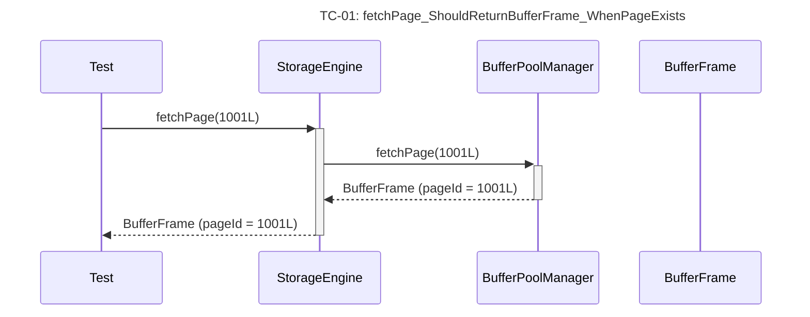
```mermaid
sequenceDiagram
    title TC-01: fetchPage_ShouldReturnBufferFrame_WhenPageExists
    participant Test
    participant StorageEngine
    participant BufferPoolManager
    participant BufferFrame

    Test->>+StorageEngine: fetchPage(1001L)
    StorageEngine->>+BufferPoolManager: fetchPage(1001L)
    BufferPoolManager-->>-StorageEngine: BufferFrame (pageId = 1001L)
    StorageEngine-->>-Test: BufferFrame (pageId = 1001L)
```

#### TC-01A: `allocatePage_ShouldDelegateToPageFactoryAndBufferPoolManager_WhenPageTypeProvided`
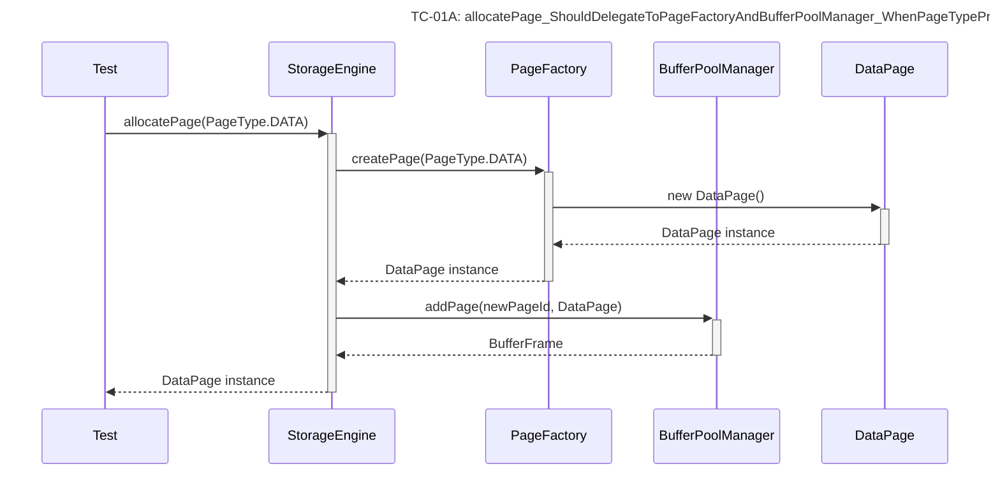
```mermaid
sequenceDiagram
    title TC-01A: allocatePage_ShouldDelegateToPageFactoryAndBufferPoolManager_WhenPageTypeProvided
    participant Test
    participant StorageEngine
    participant PageFactory
    participant BufferPoolManager
    participant DataPage

    Test->>+StorageEngine: allocatePage(PageType.DATA)
    StorageEngine->>+PageFactory: createPage(PageType.DATA)
    PageFactory->>+DataPage: new DataPage()
    DataPage-->>-PageFactory: DataPage instance
    PageFactory-->>-StorageEngine: DataPage instance
    StorageEngine->>+BufferPoolManager: addPage(newPageId, DataPage)
    BufferPoolManager-->>-StorageEngine: BufferFrame
    StorageEngine-->>-Test: DataPage instance
```

#### TC-01B: `freePage_ShouldRemovePageFromBufferPoolManager_WhenValidPageId`
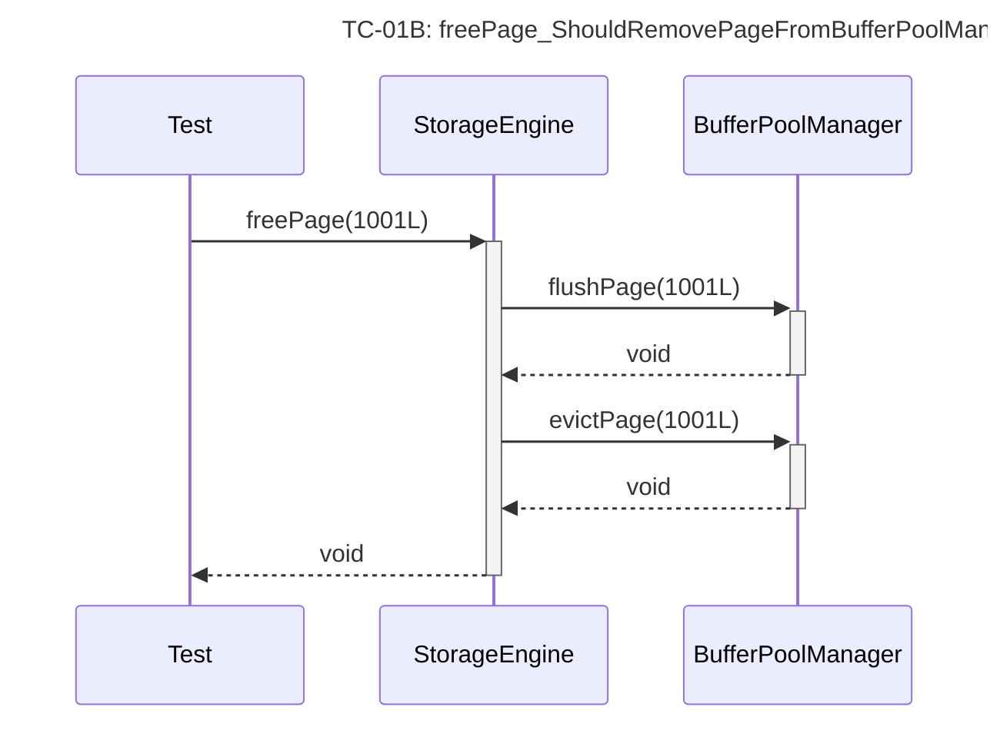
```mermaid
sequenceDiagram
    title TC-01B: freePage_ShouldRemovePageFromBufferPoolManager_WhenValidPageId
    participant Test
    participant StorageEngine
    participant BufferPoolManager

    Test->>+StorageEngine: freePage(1001L)
    StorageEngine->>+BufferPoolManager: flushPage(1001L)
    BufferPoolManager-->>-StorageEngine: void
    StorageEngine->>+BufferPoolManager: evictPage(1001L)
    BufferPoolManager-->>-StorageEngine: void
    StorageEngine-->>-Test: void
```

#### TC-01C: `flushAll_ShouldInvokeFlushOnBufferPoolAndDiskManager_WhenTriggered`
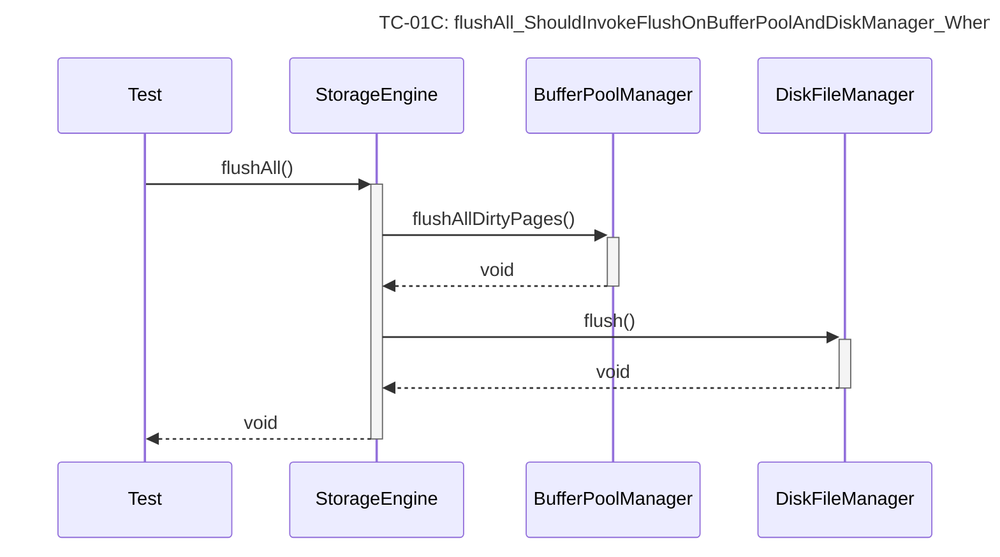
```mermaid
sequenceDiagram
    title TC-01C: flushAll_ShouldInvokeFlushOnBufferPoolAndDiskManager_WhenTriggered
    participant Test
    participant StorageEngine
    participant BufferPoolManager
    participant DiskFileManager

    Test->>+StorageEngine: flushAll()
    StorageEngine->>+BufferPoolManager: flushAllDirtyPages()
    BufferPoolManager-->>-StorageEngine: void
    StorageEngine->>+DiskFileManager: flush()
    DiskFileManager-->>-StorageEngine: void
    StorageEngine-->>-Test: void
```

#### TC-01D: `fetchPage_ShouldThrowException_WhenPageIdIsNegative`
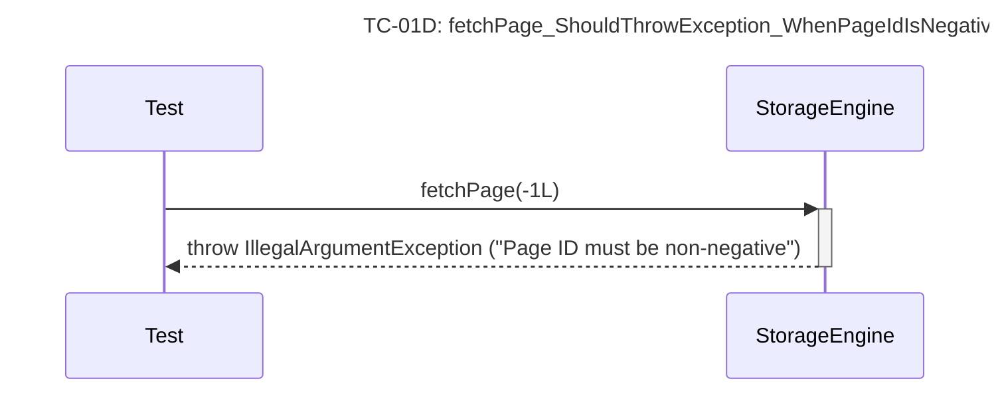
```mermaid
sequenceDiagram
    title TC-01D: fetchPage_ShouldThrowException_WhenPageIdIsNegative
    participant Test
    participant StorageEngine

    Test->>+StorageEngine: fetchPage(-1L)
    StorageEngine-->>-Test: throw IllegalArgumentException ("Page ID must be non-negative")
```

#### TC-01E: `allocatePage_ShouldThrowException_WhenPageTypeIsNull`
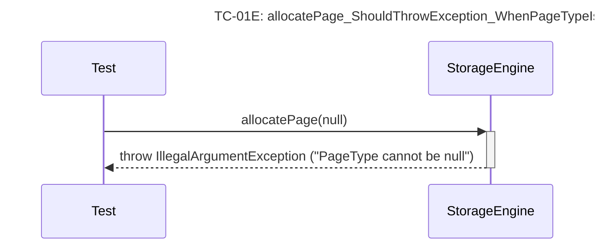
```mermaid
sequenceDiagram
    title TC-01E: allocatePage_ShouldThrowException_WhenPageTypeIsNull
    participant Test
    participant StorageEngine

    Test->>+StorageEngine: allocatePage(null)
    StorageEngine-->>-Test: throw IllegalArgumentException ("PageType cannot be null")
```

---

## 2. BufferPoolManager Unit Tests (Singleton Pattern)

### TC-02: `getInstance`

#### Happy Path: `getInstance_ShouldReturnSameSingletonInstance_Always`
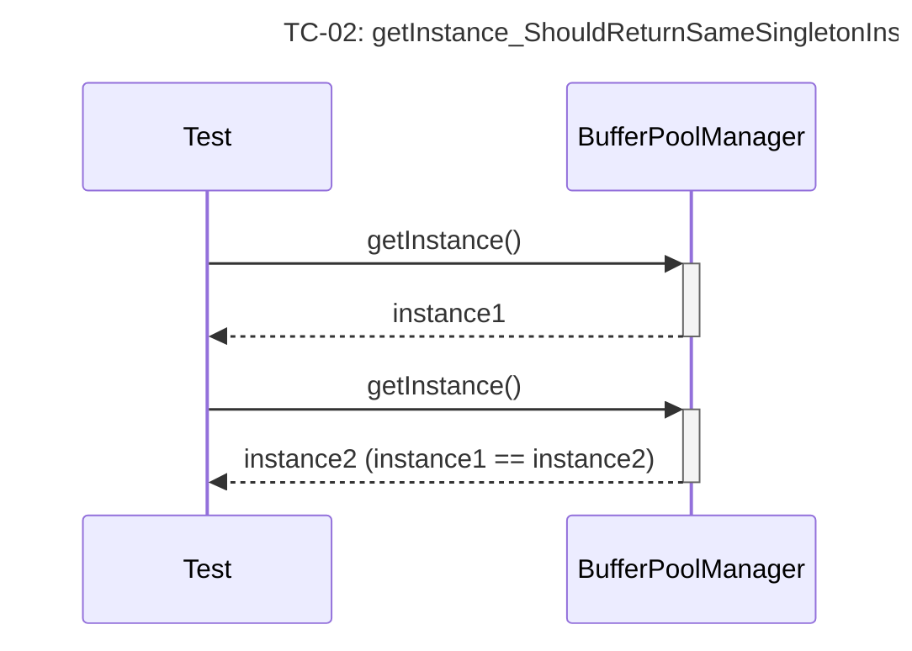
```mermaid
sequenceDiagram
    title TC-02: getInstance_ShouldReturnSameSingletonInstance_Always
    participant Test
    participant BufferPoolManager

    Test->>+BufferPoolManager: getInstance()
    BufferPoolManager-->>-Test: instance1
    Test->>+BufferPoolManager: getInstance()
    BufferPoolManager-->>-Test: instance2 (instance1 == instance2)
```

#### TC-02A: `fetchPage_ShouldReadFromDiskAndBufferFrame_WhenPageNotInPool`
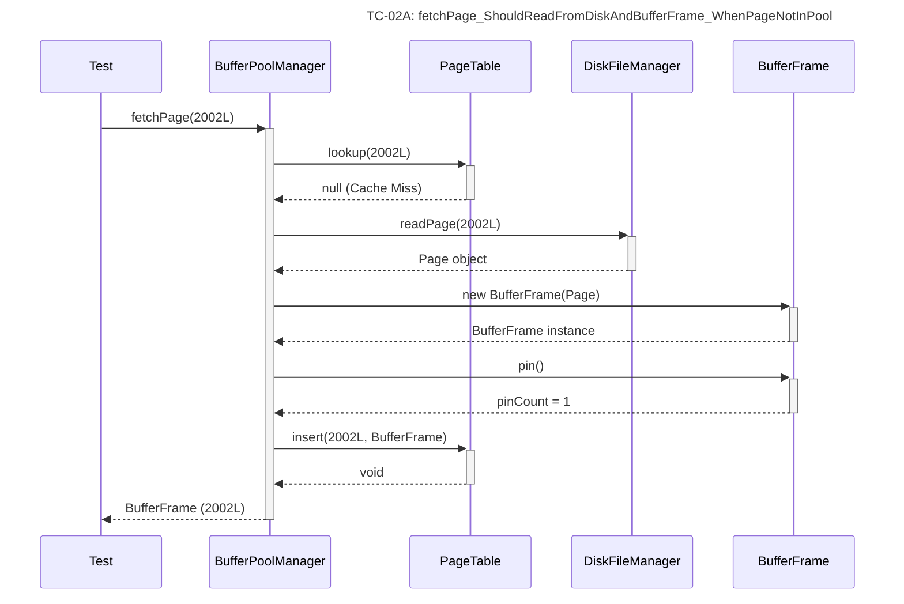
```mermaid
sequenceDiagram
    title TC-02A: fetchPage_ShouldReadFromDiskAndBufferFrame_WhenPageNotInPool
    participant Test
    participant BufferPoolManager
    participant PageTable
    participant DiskFileManager
    participant BufferFrame

    Test->>+BufferPoolManager: fetchPage(2002L)
    BufferPoolManager->>+PageTable: lookup(2002L)
    PageTable-->>-BufferPoolManager: null (Cache Miss)
    BufferPoolManager->>+DiskFileManager: readPage(2002L)
    DiskFileManager-->>-BufferPoolManager: Page object
    BufferPoolManager->>+BufferFrame: new BufferFrame(Page)
    BufferFrame-->>-BufferPoolManager: BufferFrame instance
    BufferPoolManager->>+BufferFrame: pin()
    BufferFrame-->>-BufferPoolManager: pinCount = 1
    BufferPoolManager->>+PageTable: insert(2002L, BufferFrame)
    PageTable-->>-BufferPoolManager: void
    BufferPoolManager-->>-Test: BufferFrame (2002L)
```

#### TC-02B: `fetchPage_ShouldReturnBufferedFrameDirectly_WhenPageInPool`
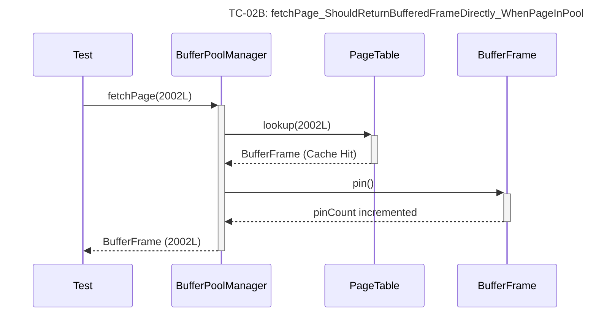
```mermaid
sequenceDiagram
    title TC-02B: fetchPage_ShouldReturnBufferedFrameDirectly_WhenPageInPool
    participant Test
    participant BufferPoolManager
    participant PageTable
    participant BufferFrame

    Test->>+BufferPoolManager: fetchPage(2002L)
    BufferPoolManager->>+PageTable: lookup(2002L)
    PageTable-->>-BufferPoolManager: BufferFrame (Cache Hit)
    BufferPoolManager->>+BufferFrame: pin()
    BufferFrame-->>-BufferPoolManager: pinCount incremented
    BufferPoolManager-->>-Test: BufferFrame (2002L)
```

#### TC-02C: `pinAndUnpin_ShouldManageFramePinCountCorrectly`
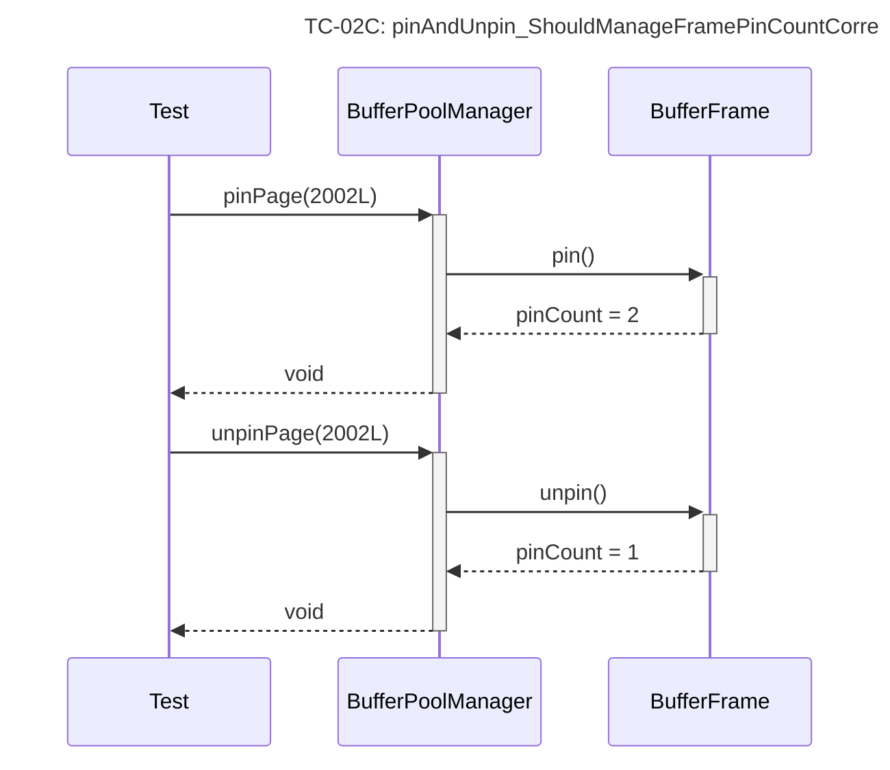
```mermaid
sequenceDiagram
    title TC-02C: pinAndUnpin_ShouldManageFramePinCountCorrectly
    participant Test
    participant BufferPoolManager
    participant BufferFrame

    Test->>+BufferPoolManager: pinPage(2002L)
    BufferPoolManager->>+BufferFrame: pin()
    BufferFrame-->>-BufferPoolManager: pinCount = 2
    BufferPoolManager-->>-Test: void
    Test->>+BufferPoolManager: unpinPage(2002L)
    BufferPoolManager->>+BufferFrame: unpin()
    BufferFrame-->>-BufferPoolManager: pinCount = 1
    BufferPoolManager-->>-Test: void
```

#### TC-02D: `evictPage_ShouldFlushDirtyVictimPageToDisk_WhenBufferPoolIsFull`
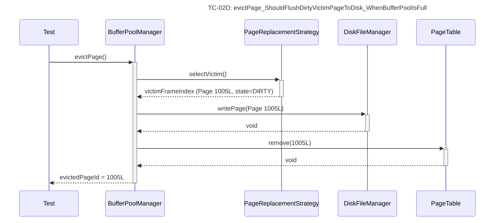
```mermaid
sequenceDiagram
    title TC-02D: evictPage_ShouldFlushDirtyVictimPageToDisk_WhenBufferPoolIsFull
    participant Test
    participant BufferPoolManager
    participant PageReplacementStrategy
    participant DiskFileManager
    participant PageTable

    Test->>+BufferPoolManager: evictPage()
    BufferPoolManager->>+PageReplacementStrategy: selectVictim()
    PageReplacementStrategy-->>-BufferPoolManager: victimFrameIndex (Page 1005L, state=DIRTY)
    BufferPoolManager->>+DiskFileManager: writePage(Page 1005L)
    DiskFileManager-->>-BufferPoolManager: void
    BufferPoolManager->>+PageTable: remove(1005L)
    PageTable-->>-BufferPoolManager: void
    BufferPoolManager-->>-Test: evictedPageId = 1005L
```

#### TC-02E: `evictPage_ShouldThrowException_WhenAllFramesInPoolArePinned`
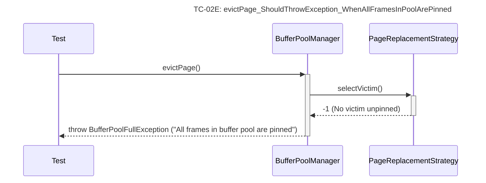
```mermaid
sequenceDiagram
    title TC-02E: evictPage_ShouldThrowException_WhenAllFramesInPoolArePinned
    participant Test
    participant BufferPoolManager
    participant PageReplacementStrategy

    Test->>+BufferPoolManager: evictPage()
    BufferPoolManager->>+PageReplacementStrategy: selectVictim()
    PageReplacementStrategy-->>-BufferPoolManager: -1 (No victim unpinned)
    BufferPoolManager-->>-Test: throw BufferPoolFullException ("All frames in buffer pool are pinned")
```

#### TC-02F: `flushPage_ShouldWriteDirtyPageToDiskAndResetDirtyFlag`
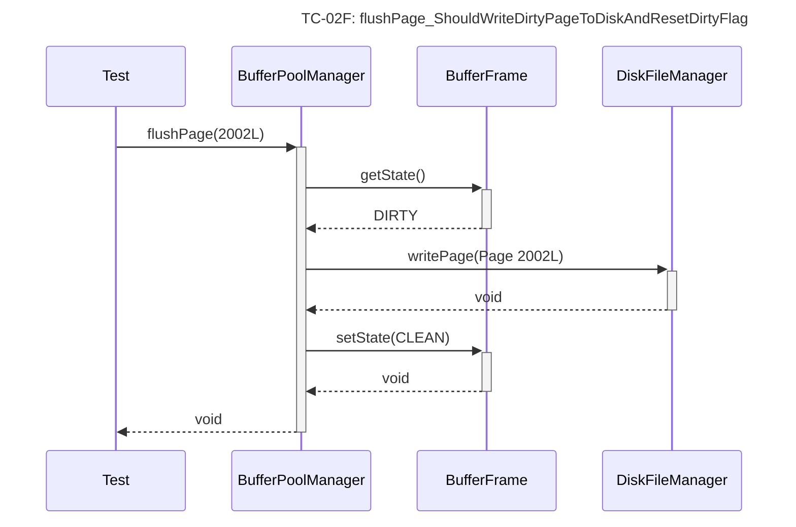
```mermaid
sequenceDiagram
    title TC-02F: flushPage_ShouldWriteDirtyPageToDiskAndResetDirtyFlag
    participant Test
    participant BufferPoolManager
    participant BufferFrame
    participant DiskFileManager

    Test->>+BufferPoolManager: flushPage(2002L)
    BufferPoolManager->>+BufferFrame: getState()
    BufferFrame-->>-BufferPoolManager: DIRTY
    BufferPoolManager->>+DiskFileManager: writePage(Page 2002L)
    DiskFileManager-->>-BufferPoolManager: void
    BufferPoolManager->>+BufferFrame: setState(CLEAN)
    BufferFrame-->>-BufferPoolManager: void
    BufferPoolManager-->>-Test: void
```

#### TC-02G: `clearPool_ShouldReleaseAllFramesAndResetPageTable`
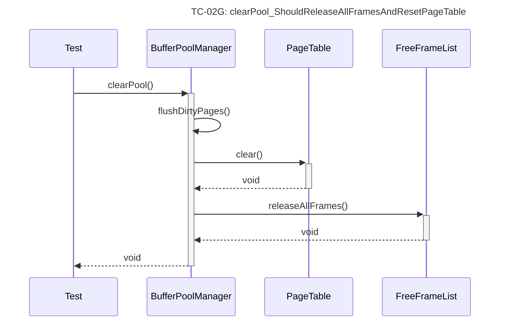
```mermaid
sequenceDiagram
    title TC-02G: clearPool_ShouldReleaseAllFramesAndResetPageTable
    participant Test
    participant BufferPoolManager
    participant PageTable
    participant FreeFrameList

    Test->>+BufferPoolManager: clearPool()
    BufferPoolManager->>BufferPoolManager: flushDirtyPages()
    BufferPoolManager->>+PageTable: clear()
    PageTable-->>-BufferPoolManager: void
    BufferPoolManager->>+FreeFrameList: releaseAllFrames()
    FreeFrameList-->>-BufferPoolManager: void
    BufferPoolManager-->>-Test: void
```

---

## 3. PageReplacementStrategy Unit Tests (Strategy Pattern)

### TC-03: `selectVictim_LRUStrategy`

#### Happy Path: `selectVictim_LRUStrategy_ShouldEvictLeastRecentlyUsedFrame`
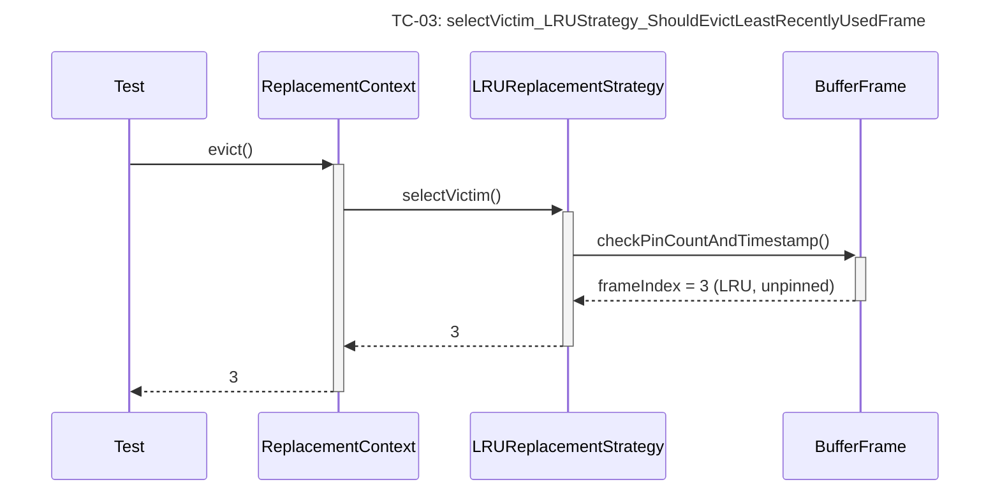
```mermaid
sequenceDiagram
    title TC-03: selectVictim_LRUStrategy_ShouldEvictLeastRecentlyUsedFrame
    participant Test
    participant ReplacementContext
    participant LRUReplacementStrategy
    participant BufferFrame

    Test->>+ReplacementContext: evict()
    ReplacementContext->>+LRUReplacementStrategy: selectVictim()
    LRUReplacementStrategy->>+BufferFrame: checkPinCountAndTimestamp()
    BufferFrame-->>-LRUReplacementStrategy: frameIndex = 3 (LRU, unpinned)
    LRUReplacementStrategy-->>-ReplacementContext: 3
    ReplacementContext-->>-Test: 3
```

#### TC-03A: `selectVictim_ClockStrategy_ShouldEvictFrameWithZeroRefBit`
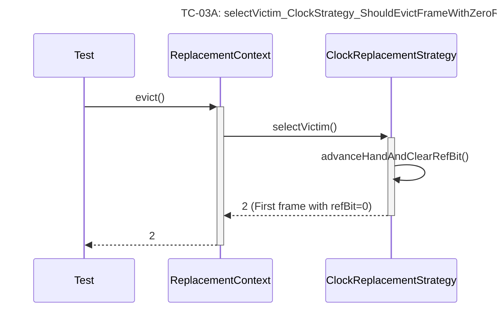
```mermaid
sequenceDiagram
    title TC-03A: selectVictim_ClockStrategy_ShouldEvictFrameWithZeroRefBit
    participant Test
    participant ReplacementContext
    participant ClockReplacementStrategy

    Test->>+ReplacementContext: evict()
    ReplacementContext->>+ClockReplacementStrategy: selectVictim()
    ClockReplacementStrategy->>ClockReplacementStrategy: advanceHandAndClearRefBit()
    ClockReplacementStrategy-->>-ReplacementContext: 2 (First frame with refBit=0)
    ReplacementContext-->>-Test: 2
```

#### TC-03B: `selectVictim_FIFOStrategy_ShouldEvictOldestLoadedFrame`
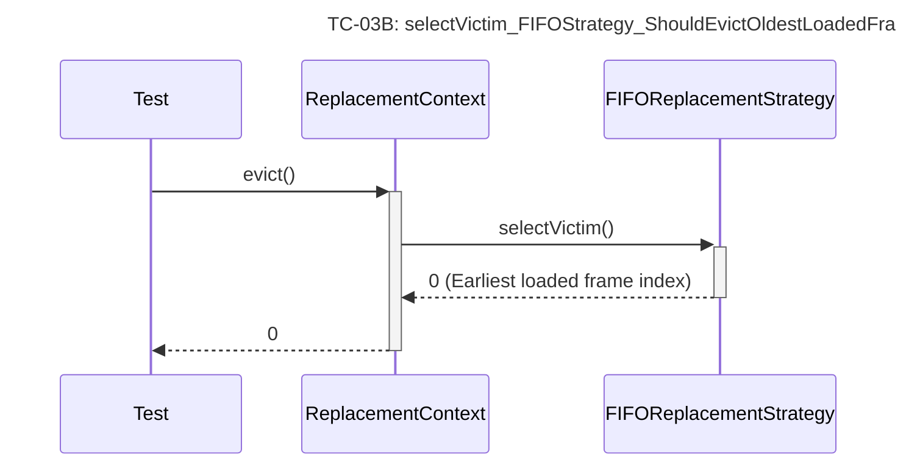
```mermaid
sequenceDiagram
    title TC-03B: selectVictim_FIFOStrategy_ShouldEvictOldestLoadedFrame
    participant Test
    participant ReplacementContext
    participant FIFOReplacementStrategy

    Test->>+ReplacementContext: evict()
    ReplacementContext->>+FIFOReplacementStrategy: selectVictim()
    FIFOReplacementStrategy-->>-ReplacementContext: 0 (Earliest loaded frame index)
    ReplacementContext-->>-Test: 0
```

#### TC-03C: `selectVictim_ShouldSkipPinnedFrames_WhenSelectingVictim`
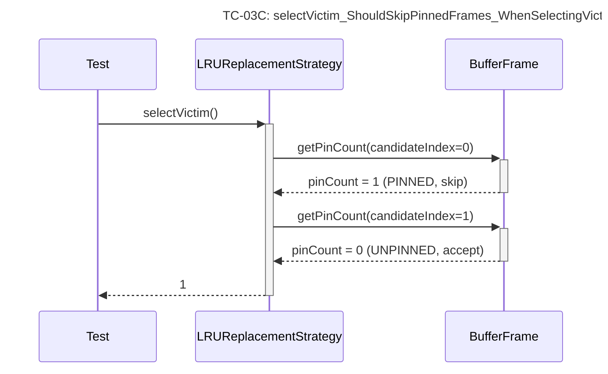
```mermaid
sequenceDiagram
    title TC-03C: selectVictim_ShouldSkipPinnedFrames_WhenSelectingVictim
    participant Test
    participant LRUReplacementStrategy
    participant BufferFrame

    Test->>+LRUReplacementStrategy: selectVictim()
    LRUReplacementStrategy->>+BufferFrame: getPinCount(candidateIndex=0)
    BufferFrame-->>-LRUReplacementStrategy: pinCount = 1 (PINNED, skip)
    LRUReplacementStrategy->>+BufferFrame: getPinCount(candidateIndex=1)
    BufferFrame-->>-LRUReplacementStrategy: pinCount = 0 (UNPINNED, accept)
    LRUReplacementStrategy-->>-Test: 1
```

#### TC-03D: `selectVictim_ShouldReturnNegativeOne_WhenNoUnpinnedFramesAvailable`
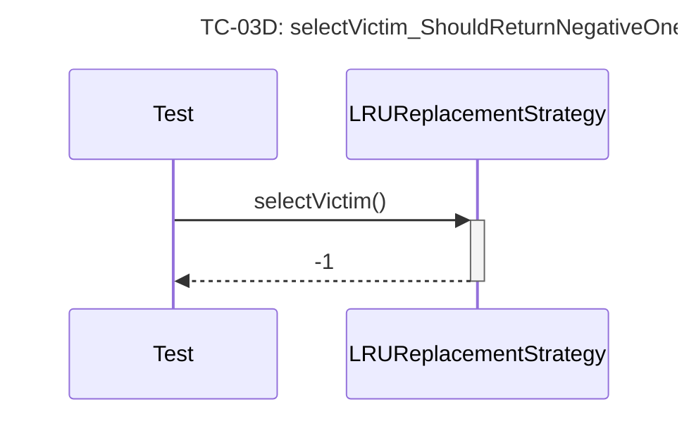
```mermaid
sequenceDiagram
    title TC-03D: selectVictim_ShouldReturnNegativeOne_WhenNoUnpinnedFramesAvailable
    participant Test
    participant LRUReplacementStrategy

    Test->>+LRUReplacementStrategy: selectVictim()
    LRUReplacementStrategy-->>-Test: -1
```

#### TC-03E: `setStrategy_ShouldDynamicallySwitchReplacementPolicyAtRuntime`
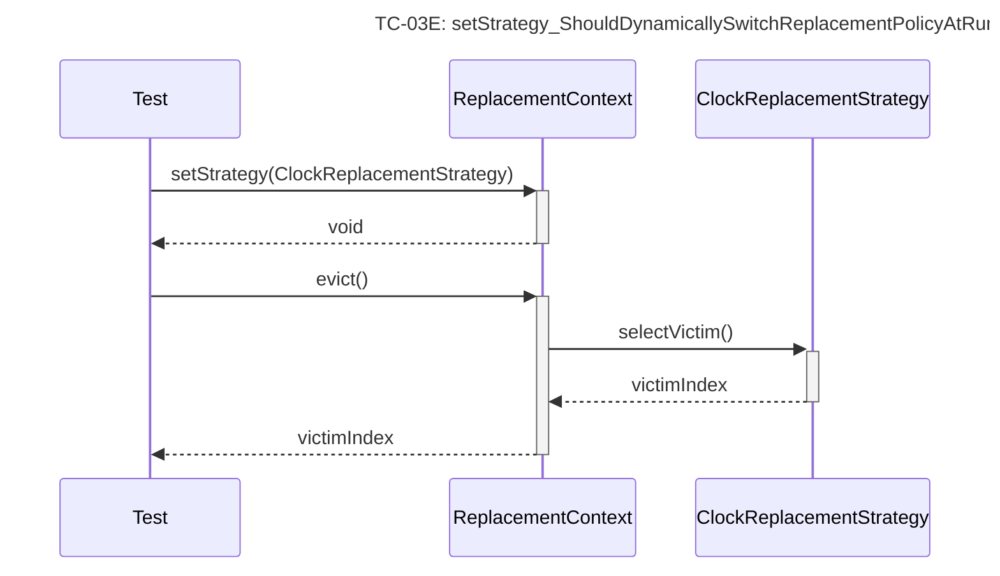
```mermaid
sequenceDiagram
    title TC-03E: setStrategy_ShouldDynamicallySwitchReplacementPolicyAtRuntime
    participant Test
    participant ReplacementContext
    participant ClockReplacementStrategy

    Test->>+ReplacementContext: setStrategy(ClockReplacementStrategy)
    ReplacementContext-->>-Test: void
    Test->>+ReplacementContext: evict()
    ReplacementContext->>+ClockReplacementStrategy: selectVictim()
    ClockReplacementStrategy-->>-ReplacementContext: victimIndex
    ReplacementContext-->>-Test: victimIndex
```

---

## 4. PageFactory Unit Tests (Factory Method Pattern)

### TC-04: `createPage`

#### Happy Path: `createPage_ShouldInstantiateDataPage_WhenPageTypeIsData`
```mermaid
sequenceDiagram
    title TC-04: createPage_ShouldInstantiateDataPage_WhenPageTypeIsData
    participant Test
    participant PageFactory
    participant DataPage

    Test->>+PageFactory: createPage(PageType.DATA)
    PageFactory->>+DataPage: new DataPage()
    DataPage-->>-PageFactory: DataPage instance
    PageFactory-->>-Test: DataPage instance
```

#### TC-04A: `createPage_ShouldInstantiateIndexPage_WhenPageTypeIsIndex`
```mermaid
sequenceDiagram
    title TC-04A: createPage_ShouldInstantiateIndexPage_WhenPageTypeIsIndex
    participant Test
    participant PageFactory
    participant IndexPage

    Test->>+PageFactory: createPage(PageType.INDEX)
    PageFactory->>+IndexPage: new IndexPage()
    IndexPage-->>-PageFactory: IndexPage instance
    PageFactory-->>-Test: IndexPage instance
```

#### TC-04B: `createPage_ShouldInstantiateCatalogPage_WhenPageTypeIsCatalog`
```mermaid
sequenceDiagram
    title TC-04B: createPage_ShouldInstantiateCatalogPage_WhenPageTypeIsCatalog
    participant Test
    participant PageFactory
    participant CatalogPage

    Test->>+PageFactory: createPage(PageType.CATALOG)
    PageFactory->>+CatalogPage: new CatalogPage()
    CatalogPage-->>-PageFactory: CatalogPage instance
    PageFactory-->>-Test: CatalogPage instance
```

#### TC-04C: `createPage_ShouldThrowException_WhenPageTypeIsUnknownOrInvalid`
```mermaid
sequenceDiagram
    title TC-04C: createPage_ShouldThrowException_WhenPageTypeIsUnknownOrInvalid
    participant Test
    participant PageFactory

    Test->>+PageFactory: createPage(UNKNOWN_TYPE)
    PageFactory-->>-Test: throw IllegalArgumentException ("Unsupported page type")
```

---

## 5. PageTemplate Unit Tests (Template Method Pattern)

### TC-05: `processPageIO`

#### Happy Path: `processPageIO_DataPage_ShouldExecuteStandardReadDeserializeSequence`
```mermaid
sequenceDiagram
    title TC-05: processPageIO_DataPage_ShouldExecuteStandardReadDeserializeSequence
    participant Test
    participant DataPage
    participant PageHeader
    participant SlotDirectory

    Test->>+DataPage: processPageIO(rawBytes)
    DataPage->>+DataPage: read()
    DataPage->>+DataPage: deserialize(rawBytes)
    DataPage->>+PageHeader: initializeFromBytes(rawBytes)
    PageHeader-->>-DataPage: void
    DataPage->>+SlotDirectory: buildFromBytes(rawBytes)
    SlotDirectory-->>-DataPage: void
    DataPage-->>-Test: void
```

#### TC-05A: `processPageIO_IndexPage_ShouldExecuteIndexSerializationSequence`
```mermaid
sequenceDiagram
    title TC-05A: processPageIO_IndexPage_ShouldExecuteIndexSerializationSequence
    participant Test
    participant IndexPage

    Test->>+IndexPage: processPageIO(rawBytes)
    IndexPage->>+IndexPage: deserialize(rawBytes)
    IndexPage-->>-Test: void
```

#### TC-05B: `processPageIO_CatalogPage_ShouldSerializeMetadataEntries`
```mermaid
sequenceDiagram
    title TC-05B: processPageIO_CatalogPage_ShouldSerializeMetadataEntries
    participant Test
    participant CatalogPage

    Test->>+CatalogPage: serialize()
    CatalogPage-->>-Test: byte[] rawBytes
```

#### TC-05C: `insertRecord_ShouldUpdateHeaderAndSlotDirectory_WhenSpaceAvailable`
```mermaid
sequenceDiagram
    title TC-05C: insertRecord_ShouldUpdateHeaderAndSlotDirectory_WhenSpaceAvailable
    participant Test
    participant DataPage
    participant SlotDirectory
    participant PageHeader

    Test->>+DataPage: insertRecord(Record)
    DataPage->>+SlotDirectory: allocateSlot()
    SlotDirectory-->>-DataPage: slotNo = 0
    DataPage->>+PageHeader: incrementSlotCount()
    PageHeader-->>-DataPage: void
    DataPage-->>-Test: true
```

#### TC-05D: `deleteRecord_ShouldMarkSlotAsFree_WhenValidRIDProvided`
```mermaid
sequenceDiagram
    title TC-05D: deleteRecord_ShouldMarkSlotAsFree_WhenValidRIDProvided
    participant Test
    participant DataPage
    participant SlotDirectory

    Test->>+DataPage: deleteRecord(RID(10, 2))
    DataPage->>+SlotDirectory: freeSlot(2)
    SlotDirectory-->>-DataPage: void
    DataPage-->>-Test: true
```

#### TC-05E: `insertRecord_ShouldReturnFalse_WhenPageFreeSpaceIsExceeded`
```mermaid
sequenceDiagram
    title TC-05E: insertRecord_ShouldReturnFalse_WhenPageFreeSpaceIsExceeded
    participant Test
    participant DataPage

    Test->>+DataPage: insertRecord(LargeRecord)
    DataPage->>DataPage: checkFreeSpace()
    DataPage-->>-Test: false
```

#### TC-05F: `updateRecord_ShouldModifyDataInPlace_WhenSlotNoIsValid`
```mermaid
sequenceDiagram
    title TC-05F: updateRecord_ShouldModifyDataInPlace_WhenSlotNoIsValid
    participant Test
    participant DataPage
    participant SlotDirectory

    Test->>+DataPage: updateRecord(RID(10, 1), NewRecord)
    DataPage->>+SlotDirectory: getSlotOffset(1)
    SlotDirectory-->>-DataPage: offset = 128
    DataPage->>DataPage: overwriteBytesAtOffset(128, NewRecord)
    DataPage-->>-Test: true
```

#### TC-05G: `compactPage_ShouldDefragmentFreeSpace_WhenMultipleRecordsDeleted`
```mermaid
sequenceDiagram
    title TC-05G: compactPage_ShouldDefragmentFreeSpace_WhenMultipleRecordsDeleted
    participant Test
    participant DataPage
    participant SlotDirectory

    Test->>+DataPage: compactPage()
    DataPage->>+SlotDirectory: getActiveSlotOffsets()
    SlotDirectory-->>-DataPage: activeOffsets[]
    DataPage->>DataPage: shiftBytesToContiguousBlock()
    DataPage-->>-Test: void
```

---

## 6. BufferFrameState Unit Tests (State Pattern)

### TC-06: `pin`

#### Happy Path: `pin_ShouldTransitionToPinnedStateAndIncrementPinCount`
```mermaid
sequenceDiagram
    title TC-06: pin_ShouldTransitionToPinnedStateAndIncrementPinCount
    participant Test
    participant BufferFrame

    Test->>+BufferFrame: pin()
    BufferFrame->>BufferFrame: pinCount++ (1)
    BufferFrame->>BufferFrame: setState(PINNED)
    BufferFrame-->>-Test: void
```

#### TC-06A: `unpin_ShouldDecrementPinCountAndTransitionToUnpinned_WhenCountReachesZero`
```mermaid
sequenceDiagram
    title TC-06A: unpin_ShouldDecrementPinCountAndTransitionToUnpinned_WhenCountReachesZero
    participant Test
    participant BufferFrame

    Test->>+BufferFrame: unpin()
    BufferFrame->>BufferFrame: pinCount-- (0)
    BufferFrame->>BufferFrame: setState(UNPINNED)
    BufferFrame-->>-Test: void
```

#### TC-06B: `markDirty_ShouldTransitionStateToDirty`
```mermaid
sequenceDiagram
    title TC-06B: markDirty_ShouldTransitionStateToDirty
    participant Test
    participant BufferFrame

    Test->>+BufferFrame: markDirty()
    BufferFrame->>BufferFrame: setState(DIRTY)
    BufferFrame-->>-Test: void
```

#### TC-06C: `setState_ShouldExplicitlyUpdateFrameStateEnum`
```mermaid
sequenceDiagram
    title TC-06C: setState_ShouldExplicitlyUpdateFrameStateEnum
    participant Test
    participant BufferFrame

    Test->>+BufferFrame: setState(CLEAN)
    BufferFrame-->>-Test: void
```

#### TC-06D: `unpin_ShouldThrowException_WhenPinCountIsAlreadyZero`
```mermaid
sequenceDiagram
    title TC-06D: unpin_ShouldThrowException_WhenPinCountIsAlreadyZero
    participant Test
    participant BufferFrame

    Test->>+BufferFrame: unpin()
    BufferFrame-->>-Test: throw IllegalStateException ("Pin count cannot be negative")
```

---

## 7. PageBuilder Unit Tests (Builder Pattern)

### TC-07: `build`

#### Happy Path: `build_ShouldConstructPageWithHeaderSlotsAndRecords_WhenFluentMethodsInvoked`
```mermaid
sequenceDiagram
    title TC-07: build_ShouldConstructPageWithHeaderSlotsAndRecords_WhenFluentMethodsInvoked
    participant Test
    participant PageBuilder
    participant DataPage

    Test->>+PageBuilder: setPageType(DATA)
    PageBuilder-->>-Test: PageBuilder
    Test->>+PageBuilder: buildHeader(50, 1002)
    PageBuilder-->>-Test: PageBuilder
    Test->>+PageBuilder: buildSlots(16)
    PageBuilder-->>-Test: PageBuilder
    Test->>+PageBuilder: addRecord(Record)
    PageBuilder-->>-Test: PageBuilder
    Test->>+PageBuilder: build()
    PageBuilder->>+DataPage: instantiate & assemble
    DataPage-->>-PageBuilder: DataPage instance
    PageBuilder-->>-Test: DataPage instance
```

#### TC-07A: `buildHeader_ShouldInitializePageIdAndLSNInHeader`
```mermaid
sequenceDiagram
    title TC-07A: buildHeader_ShouldInitializePageIdAndLSNInHeader
    participant Test
    participant PageBuilder
    participant PageHeader

    Test->>+PageBuilder: buildHeader(50, 1002)
    PageBuilder->>+PageHeader: new PageHeader(50, 1002)
    PageHeader-->>-PageBuilder: PageHeader instance
    PageBuilder-->>-Test: PageBuilder
```

#### TC-07B: `buildSlots_ShouldPreallocateSlotOffsets`
```mermaid
sequenceDiagram
    title TC-07B: buildSlots_ShouldPreallocateSlotOffsets
    participant Test
    participant PageBuilder
    participant SlotDirectory

    Test->>+PageBuilder: buildSlots(16)
    PageBuilder->>+SlotDirectory: new SlotDirectory(16)
    SlotDirectory-->>-PageBuilder: SlotDirectory instance
    PageBuilder-->>-Test: PageBuilder
```

#### TC-07C: `addRecord_ShouldAppendRecordToBuilderList`
```mermaid
sequenceDiagram
    title TC-07C: addRecord_ShouldAppendRecordToBuilderList
    participant Test
    participant PageBuilder

    Test->>+PageBuilder: addRecord(Record)
    PageBuilder->>PageBuilder: appendToRecordsList(Record)
    PageBuilder-->>-Test: PageBuilder
```

#### TC-07D: `build_ShouldThrowException_WhenPageTypeIsNotSet`
```mermaid
sequenceDiagram
    title TC-07D: build_ShouldThrowException_WhenPageTypeIsNotSet
    participant Test
    participant PageBuilder

    Test->>+PageBuilder: build()
    PageBuilder-->>-Test: throw IllegalStateException ("PageType must be set before building page")
```

---

## 8. PageIterator Unit Tests (Iterator Pattern)

### TC-08: `iterator`

#### Happy Path: `iterator_ShouldTraverseAllRecordsSequentially_WhenRecordsExist`
```mermaid
sequenceDiagram
    title TC-08: iterator_ShouldTraverseAllRecordsSequentially_WhenRecordsExist
    participant Test
    participant Page
    participant PageIterator

    Test->>+Page: iterator()
    Page->>+PageIterator: new PageIterator(records)
    PageIterator-->>-Page: PageIterator instance
    Page-->>-Test: PageIterator instance
    Test->>+PageIterator: hasNext()
    PageIterator-->>-Test: true
    Test->>+PageIterator: next()
    PageIterator-->>-Test: Record 1
```

#### TC-08A: `hasNext_ShouldReturnFalse_WhenPageIsEmptyOrFullyTraversed`
```mermaid
sequenceDiagram
    title TC-08A: hasNext_ShouldReturnFalse_WhenPageIsEmptyOrFullyTraversed
    participant Test
    participant PageIterator

    Test->>+PageIterator: hasNext()
    PageIterator-->>-Test: false
```

#### TC-08B: `next_ShouldThrowException_WhenNoMoreRecordsToTraverse`
```mermaid
sequenceDiagram
    title TC-08B: next_ShouldThrowException_WhenNoMoreRecordsToTraverse
    participant Test
    participant PageIterator

    Test->>+PageIterator: next()
    PageIterator-->>-Test: throw NoSuchElementException ("No more records in PageIterator")
```

#### TC-08C: `iterator_ShouldSkipDeletedTombstoneSlots_DuringTraversal`
```mermaid
sequenceDiagram
    title TC-08C: iterator_ShouldSkipDeletedTombstoneSlots_DuringTraversal
    participant Test
    participant PageIterator

    Test->>+PageIterator: next()
    PageIterator->>PageIterator: skipTombstoneSlot(-1)
    PageIterator-->>-Test: Record at slot 2
```

---

## 9. BTreeIndex Unit Tests (Composite & Iterator Pattern)

### TC-09: `search`

#### Happy Path: `search_ShouldReturnPayload_WhenKeyExistsInLeafNode`
```mermaid
sequenceDiagram
    title TC-09: search_ShouldReturnPayload_WhenKeyExistsInLeafNode
    participant Test
    participant LeafNode

    Test->>+LeafNode: search(42)
    LeafNode->>LeafNode: lookupInMap(42)
    LeafNode-->>-Test: RID(1, 5)
```

#### TC-09A: `findChild_ShouldRouteToCorrectChildNode_BasedOnKeyRange`
```mermaid
sequenceDiagram
    title TC-09A: findChild_ShouldRouteToCorrectChildNode_BasedOnKeyRange
    participant Test
    participant InternalNode
    participant BTreeNode

    Test->>+InternalNode: search(25)
    InternalNode->>+InternalNode: findChild(25)
    InternalNode-->>-InternalNode: childNode B
    InternalNode->>+BTreeNode: search(25)
    BTreeNode-->>-InternalNode: RID result
    InternalNode-->>-Test: RID result
```

#### TC-09B: `split_LeafNode_ShouldDivideDataEntriesEqually_WhenCapacityExceeded`
```mermaid
sequenceDiagram
    title TC-09B: split_LeafNode_ShouldDivideDataEntriesEqually_WhenCapacityExceeded
    participant Test
    participant LeafNode

    Test->>+LeafNode: split()
    LeafNode->>+LeafNode: new LeafNode()
    LeafNode-->>-LeafNode: siblingNode
    LeafNode->>LeafNode: transferUpperHalfEntries(siblingNode)
    LeafNode-->>-Test: siblingNode
```

#### TC-09C: `split_InternalNode_ShouldPromoteMiddleKeyToParent_WhenFull`
```mermaid
sequenceDiagram
    title TC-09C: split_InternalNode_ShouldPromoteMiddleKeyToParent_WhenFull
    participant Test
    participant InternalNode

    Test->>+InternalNode: split()
    InternalNode->>InternalNode: extractMiddleKey()
    InternalNode-->>-Test: siblingNode (with promoted middle key)
```

#### TC-09D: `seek_ShouldTraverseRootToLeafNode_ForGivenKey`
```mermaid
sequenceDiagram
    title TC-09D: seek_ShouldTraverseRootToLeafNode_ForGivenKey
    participant Test
    participant BTreeCursor
    participant InternalNode
    participant LeafNode

    Test->>+BTreeCursor: seek(75)
    BTreeCursor->>+InternalNode: findChild(75)
    InternalNode-->>-BTreeCursor: LeafNode instance
    BTreeCursor-->>-Test: LeafNode instance
```

#### TC-09E: `iterator_BTreeIterator_ShouldReturnEntriesInAscendingSortedOrder`
```mermaid
sequenceDiagram
    title TC-09E: iterator_BTreeIterator_ShouldReturnEntriesInAscendingSortedOrder
    participant Test
    participant BTreeIterator

    Test->>+BTreeIterator: next()
    BTreeIterator-->>-Test: Entry(10)
    Test->>+BTreeIterator: next()
    BTreeIterator-->>-Test: Entry(20)
```

#### TC-09F: `search_ShouldReturnNull_WhenKeyDoesNotExistInTree`
```mermaid
sequenceDiagram
    title TC-09F: search_ShouldReturnNull_WhenKeyDoesNotExistInTree
    participant Test
    participant LeafNode

    Test->>+LeafNode: search(999)
    LeafNode-->>-Test: null
```

#### TC-09G: `delete_BTreeNode_ShouldMergeOrBorrow_WhenNodeUnderflows`
```mermaid
sequenceDiagram
    title TC-09G: delete_BTreeNode_ShouldMergeOrBorrow_WhenNodeUnderflows
    participant Test
    participant LeafNode
    participant InternalNode

    Test->>+LeafNode: delete(key)
    LeafNode->>LeafNode: checkUnderflow()
    LeafNode->>+InternalNode: borrowFromOrMergeWithSibling()
    InternalNode-->>-LeafNode: rebalanceComplete
    LeafNode-->>-Test: true
```

---

## 10. DiskFileManager Unit Tests (Adapter Pattern)

### TC-10: `readPage`

#### Happy Path: `readPage_LocalDiskAdapter_ShouldReadRawBytesFromLocalFileSystem`
```mermaid
sequenceDiagram
    title TC-10: readPage_LocalDiskAdapter_ShouldReadRawBytesFromLocalFileSystem
    participant Test
    participant DiskFileManager
    participant LocalDiskAdapter
    participant PageDeserializer

    Test->>+DiskFileManager: readPage(100L)
    DiskFileManager->>+LocalDiskAdapter: read(100L)
    LocalDiskAdapter-->>-DiskFileManager: rawBytes[]
    DiskFileManager->>+PageDeserializer: deserialize(rawBytes)
    PageDeserializer-->>-DiskFileManager: Page object
    DiskFileManager-->>-Test: Page object
```

#### TC-10A: `writePage_MemoryStorageAdapter_ShouldWriteBytesToInMemoryMap`
```mermaid
sequenceDiagram
    title TC-10A: writePage_MemoryStorageAdapter_ShouldWriteBytesToInMemoryMap
    participant Test
    participant DiskFileManager
    participant MemoryStorageAdapter

    Test->>+DiskFileManager: writePage(Page 100L)
    DiskFileManager->>+MemoryStorageAdapter: write(Page 100L)
    MemoryStorageAdapter-->>-DiskFileManager: void
    DiskFileManager-->>-Test: void
```

#### TC-10B: `writePage_CloudStorageAdapter_ShouldUploadPageToCloudObjectStorage`
```mermaid
sequenceDiagram
    title TC-10B: writePage_CloudStorageAdapter_ShouldUploadPageToCloudObjectStorage
    participant Test
    participant DiskFileManager
    participant CloudStorageAdapter

    Test->>+DiskFileManager: writePage(Page 100L)
    DiskFileManager->>+CloudStorageAdapter: write(Page 100L)
    CloudStorageAdapter-->>-DiskFileManager: void
    DiskFileManager-->>-Test: void
```

#### TC-10C: `setStorageAdapter_ShouldSwitchActiveAdapterAtRuntime`
```mermaid
sequenceDiagram
    title TC-10C: setStorageAdapter_ShouldSwitchActiveAdapterAtRuntime
    participant Test
    participant DiskFileManager
    participant MemoryStorageAdapter

    Test->>+DiskFileManager: setStorageAdapter(MemoryStorageAdapter)
    DiskFileManager-->>-Test: void
    Test->>+DiskFileManager: readPage(100L)
    DiskFileManager->>+MemoryStorageAdapter: read(100L)
    MemoryStorageAdapter-->>-DiskFileManager: rawBytes[]
    DiskFileManager-->>-Test: Page object
```

#### TC-10D: `serializeAndDeserialize_ShouldMaintainDataIntegrity`
```mermaid
sequenceDiagram
    title TC-10D: serializeAndDeserialize_ShouldMaintainDataIntegrity
    participant Test
    participant PageSerializer
    participant PageDeserializer

    Test->>+PageSerializer: serialize(Page)
    PageSerializer-->>-Test: byte[]
    Test->>+PageDeserializer: deserialize(byte[])
    PageDeserializer-->>-Test: Restored Page object
```

#### TC-10E: `readPage_ShouldThrowException_WhenPageIdDoesNotExistOnDisk`
```mermaid
sequenceDiagram
    title TC-10E: readPage_ShouldThrowException_WhenPageIdDoesNotExistOnDisk
    participant Test
    participant DiskFileManager
    participant StorageAdapter

    Test->>+DiskFileManager: readPage(999999L)
    DiskFileManager->>+StorageAdapter: read(999999L)
    StorageAdapter-->>-DiskFileManager: throw PageNotFoundException
    DiskFileManager-->>-Test: throw PageNotFoundException ("Page ID 999999 not found on storage device")
```

#### TC-10F: `flush_DiskFileManager_ShouldSyncStorageAdapterState`
```mermaid
sequenceDiagram
    title TC-10F: flush_DiskFileManager_ShouldSyncStorageAdapterState
    participant Test
    participant DiskFileManager
    participant StorageAdapter

    Test->>+DiskFileManager: flush()
    DiskFileManager->>+StorageAdapter: flush()
    StorageAdapter-->>-DiskFileManager: void
    DiskFileManager-->>-Test: void
```
